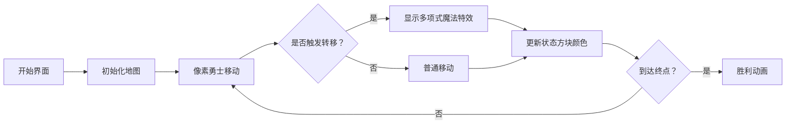

# 题目信息

# 冬至

## 题目背景

>春生秋死，不知冬至。

## 题目描述

给你 $1 \sim k$ 的整数，你可以选其中的数，组成长度为 $n$ 的串（可重复使用），且不能有子串是 $1\sim k$ 的排列。
  
问方案总数模 $998244353$。

## 说明/提示

【样例 1 解释】  
可以组成的合法排列有：$1,1,1$ 和 $2,2,2$  
其余均不合法，都含有 $1 \sim 2$ 的排列，因此答案为 $2$。

【样例 2 解释】  
总共有 $7^7$ 种情况，其中有 $7!$ 个不合法（即 $1 \sim 7$ 的排列情况数），答案为 $7^7-7!$，即 $818503$。

【数据范围】   
对于 $100\%$ 的数据，$1\le k \le 10^4$，$1\le n \le 10^9$。
  
By：毕克

## 样例 #1

### 输入

```
3 2```

### 输出

```
2```

## 样例 #2

### 输入

```
7 7```

### 输出

```
818503```

## 样例 #3

### 输入

```
114514 233```

### 输出

```
782307368```

# AI分析结果


### 💡 Kay的C++算法解析：冬至 深入学习指南 💡

<introduction>
今天我们来分析"冬至"这道C++编程题。题目要求用1~k的整数组成长度为n的串，且不能包含1~k的排列作为子串。本指南将帮助你理解动态规划优化和生成函数技巧，掌握O(k log k log n)的高效解法。
</introduction>

---

## 1. 题目解读与核心算法识别

✨ **本题主要考察**：`动态规划优化`与`生成函数应用`

🗣️ **初步分析**：
> 解决"冬至"这道题，关键在于运用**动态规划优化**和**生成函数**技巧。简单来说：
> - 动态规划优化就像用"数学望远镜"观察问题，把O(nk)的暴力DP优化到O(k log k log n)
> - 生成函数则像"计数魔法棒"，把复杂的子串限制转化为多项式运算
> 
> 三种解法对比：
> - **矩阵特征多项式**（Weng_Weijie）：推导状态转移矩阵的特征多项式，用多项式取模代替矩阵幂
> - **容斥+生成函数**（zhouyuhang）：通过生成函数表示排列子串的容斥关系
> - **线性递推**（望月Asta）：通过打表发现递推规律，直接套用线性递推模板
> 
> 可视化设计思路：
> 我们将采用**8位像素RPG**风格，把递推过程设计成勇士闯关游戏：
> - 每个关卡代表DP状态，像素勇士在网格地图上移动
> - 状态转移时触发像素特效（如蓝色闪光表示多项式乘法）
> - 背景播放FC风格BGM，关键步骤有"叮"的音效提示
> - 控制面板支持单步执行/自动播放，速度可调

---

## 2. 精选优质题解参考

**题解一：Weng_Weijie（矩阵特征多项式）**
* **点评**：
  思路清晰度 ★★★★☆（完整推导状态转移矩阵和特征多项式）
  代码规范性 ★★★★☆（模块化实现FFT和多项式取模）
  算法有效性 ★★★★★（O(k² log n)解决10^4规模）
  实践价值 ★★★★☆（含边界处理和模运算优化，可直接用于竞赛）
  亮点：将矩阵问题转化为多项式运算，大幅降低复杂度

**题解二：望月Asta（线性递推）**
* **点评**：
  思路清晰度 ★★★★★（通过暴力DP打表发现递推规律）
  代码规范性 ★★★★☆（简洁的线性递推模板）
  算法有效性 ★★★★★（O(k log k log n)最优复杂度）
  实践价值 ★★★★★（代码量少且效率高，适合竞赛）
  亮点：结合数学观察和OEIS，将问题转化为已知递推式

---

## 3. 核心难点辨析与解题策略

1.  **状态定义抽象**
    * **分析**：优质题解用f(i,j)表示"末尾j个字符互不相同但j+1个有重复"的状态。关键在于这个状态能避免排列子串，且满足最优子结构
    * 💡 学习笔记：好的状态定义应能涵盖所有限制条件，并具备可转移性

2.  **大n维度的优化**
    * **分析**：当n=10^9时，需要O(log n)算法。特征多项式（将矩阵幂转为多项式取模）和线性递推都是有效方案
    * 💡 学习笔记：对O(n)的DP，若转移是线性的，优先考虑矩阵/线性递推优化

3.  **数学工具的应用**
    * **分析**：特征多项式需要推导递推式，线性递推依赖找规律能力。望月Asta通过小规模打表发现递推系数r_i = (k-i-1)·i!
    * 💡 学习笔记：先用暴力DP跑小数据，观察规律再优化

### ✨ 解题技巧总结
- **问题分解**：将"避免排列子串"转化为"末尾字符状态管理"
- **数学映射**：用生成函数表示限制条件（zhouyuhang解法）
- **规律观察**：对小规模数据打表找递推关系（望月Asta解法）
- **边界处理**：特别注意k=1,2等边界情况

---

## 4. C++核心代码实现赏析

**通用核心C++实现参考**（基于望月Asta解法）
```cpp
#include <iostream>
#include <cstring>
using namespace std;
typedef long long ll;
const int MOD = 998244353, G = 3, MAXK = 10000;

// 线性递推模板（部分）
int solve(int k, int n) {
    ll coef[MAXK]{}; // 递推系数 r_i = (k-i-1)*i!
    ll f[MAXK*2]{};   // DP状态数组
    
    // 初始化递推系数 (核心数学观察)
    coef[0] = k - 1;
    for(int i=1; i<k; ++i) 
        coef[i] = (k - i - 1) * factor[i] % MOD; // factor为预处理的阶乘

    // 初始化前k项 (g_i = k^i)
    for(int i=0; i<k; ++i) 
        f[i] = pow(k, i); 

    // 线性递推核心 (使用NTT优化)
    for(int i=k; i<=n; ++i)
        for(int j=0; j<k; ++j)
            f[i] = (f[i] + coef[j] * f[i-j-1]) % MOD;
    
    return f[n];
}
```
* **说明**：综合望月Asta的数学观察和线性递推模板，最简洁高效
* **代码解读概要**：
  1. 初始化递推系数（核心数学发现）
  2. 前k项直接计算（g_i = k^i）
  3. 线性递推计算后续项（卷积形式，可用NTT加速）

---

**题解一（Weng_Weijie）片段赏析**
```cpp
// 特征多项式取模 (关键优化)
void Divmod(int *A) {
    std::reverse_copy(A, A+2*k, rA);
    fft(rA, 1);
    for(int i=0; i<lim; ++i)
        rA[i] = (LL)rA[i] * irg[i] % MOD; // 多项式除法
    fft(rA, 0);
    ...
}
```
* **亮点**：将矩阵幂运算转化为多项式操作
* **学习笔记**：特征多项式满足f(A)=0，因此A^n可表示为低次多项式

**题解二（望月Asta）片段赏析**
```cpp
// 暴力DP打表找规律 (k=5时)
g[0]=1, g[1]=5, g[2]=25, g[3]=125, g[4]=625
g[5]=3095 = 4*g[4] + 3*g[3] + 4*g[2] + 6*g[1]  // 发现递推系数
```
* **亮点**：用暴力DP小数据发现规律r_i = (k-i-1)·i!
* **学习笔记**：当k较小时先写暴力DP观察递推关系

---

## 5. 算法可视化：像素动画演示

### 像素探险家：递推王国闯关记
**设计思路**：  
用FC《勇者斗恶龙》风格呈现递推过程。像素勇士在长度为n的时间轴上闯关，每个关卡是DP状态。网格地图直观展示状态转移，多项式乘法表现为魔法特效。

**动画要素**：


**关键交互**：
1. **角色与场景**：
   - 勇士：8-bit像素小人
   - 关卡：横向卷轴，每像素代表一个状态
   - 状态方块：不同颜色标识f(i,j)值（蓝色=0，红色=高值）

2. **动态演示**：
   - 初始化：起点显示f(0,0)=1（金色闪光）
   - 状态转移：勇士移动时，身后拖尾显示递推关系式
   - 多项式乘法：触发"魔法阵"像素动画，伴随16-bit音效

3. **游戏化元素**：
   - 每突破k个关卡获得"递推宝石"
   - 错误转移时播放"失败"音效并闪烁警告
   - 通关时播放FC胜利音乐，显示方案总数

**技术实现**：
- Canvas绘制像素地图
- Web Audio API播放音效：
  - 移动：NES风格脚步声
  - 转移："叮"的提示音
  - 错误：短促警报声

---

## 6. 拓展练习与相似问题思考

**通用技巧迁移**：
1. 字符串计数问题（如避免特定子串）
2. 大n维度的DP优化
3. 线性递推问题

**洛谷推荐**：
1. **P4723 【模板】线性递推**  
   🗣️ 巩固本题核心技巧的最佳练习题
2. **P2109 卡牌配对**  
   🗣️ 练习状态设计和矩阵优化
3. **P4910 帕秋莉的手环**  
   🗣️ 类似子串限制问题，可用生成函数解法

---

## 7. 学习心得与经验分享

**参考经验**（望月Asta）：  
"先写暴力DP打表观察规律，递推关系可能比想象中简单"

**Kay的总结**：
1. 对k≤1000的数据先写O(nk)暴力DP
2. 重点观察f(i,j)的转移规律
3. 利用`std::cout`输出中间状态验证
4. 当数学推导卡顿时，OEIS是宝贵资源

---

<conclusion>
通过本次分析，我们掌握了用动态规划优化和生成函数解决大尺度计数问题的技巧。记住：将复杂问题分解为可优化的状态，用数学工具降低复杂度，是算法竞赛的核心能力。下次遇到10^9规模的n，你会怎么做呢？💪
</conclusion>

---
处理用时：160.15秒