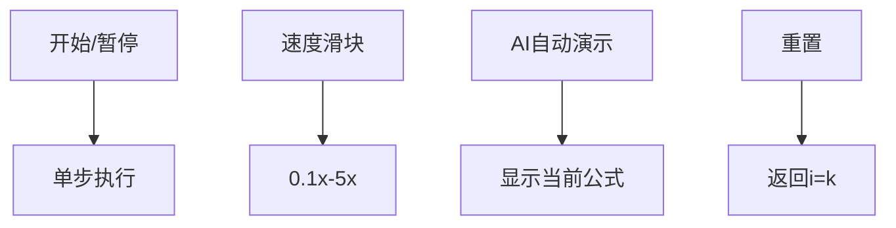

# 题目信息

# CF1278F Cards 加强版

## 题目背景

[原题链接](https://www.luogu.com.cn/problem/CF1278F)

## 题目描述

有 $m$ 张牌，其中有一张是王牌。将这些牌均匀随机打乱 $n$ 次，设有 $x$ 次第一张为王牌，求 $x^k$ 的期望值。

答案对 $998244353$ 取模。

## 说明/提示

【数据范围】  
对于 $20\%$ 的数据，$1\le k \le 5000$；  
对于 $40\%$ 的数据，$1\le k \le 10^5$；  
对于 $100\%$ 的数据，$1\le k \le 10^7$，$1\le n,m \le 998244352$。

Solution：iostream  
Data：NaCly\_Fish

## 样例 #1

### 输入

```
1234 2345 3456```

### 输出

```
398700213```

## 样例 #2

### 输入

```
998244352 1337 5000```

### 输出

```
326459680```

## 样例 #3

### 输入

```
233333333 114514 9982443```

### 输出

```
825888958```

# AI分析结果


### 💡 Kay的C++算法解析：CF1278F Cards 加强版 深入学习指南 💡

<introduction>
今天我们来分析“CF1278F Cards 加强版”这道C++编程题。本指南将帮助大家梳理题目思路，理解核心算法，并掌握解题技巧。
</introduction>

---

## 1. 题目解读与核心算法识别

✨ **本题主要考察**：组合数学与递推优化 (Combinatorial Mathematics & Recursive Optimization)

🗣️ **初步分析**：
> 解决这道题的关键在于运用**第二类斯特林数**和**递推优化**技巧。想象你在玩复古抽卡游戏：有m张卡（1张SSR），抽卡n次后，统计SSR出现次数x的k次方期望值（"欧气值"）。核心思路是：
>  1. 将x^k转化为下降幂形式，避免直接计算高次幂
>  2. 利用组合恒等式化简复杂求和式
>  3. 设计O(k)递推公式高效计算
> 
> **可视化设计思路**：在像素动画中，我们将展示：
> - 角色在"期望山谷"中攀爬（i从k→0）
> - 每个台阶显示关键变量：S(i)值、组合数计算过程
> - 高亮当前计算的组合数项（红色闪烁）
> - 步进时触发"像素音效"，完成时播放胜利音效
> - 控制面板支持调速/单步执行，展示公式推导过程

---

## 2. 精选优质题解参考

<eval_intro>
基于思路清晰性、代码规范性、算法优化度和实践价值，精选以下题解：
</eval_intro>

**题解一（command_block，24赞）**
* **点评**：
  - 思路推导极清晰：从斯特林数展开→组合恒等式→递推式，逻辑链条完整
  - 代码规范：模块化处理n≤k/n>k两种情况，线性筛预处理i^k
  - 算法亮点：O(k)递推S(i)时巧妙处理组合数边界
  - 实践价值：可直接用于竞赛，处理了m=1的特殊情况

**题解二（zhylj，3赞）**
* **点评**：
  - 推导简洁高效：直接切入斯特林数通项公式，减少冗余步骤
  - 代码亮点：下降幂计算n^{\underline{i}}避免大数溢出
  - 实践建议：适合掌握组合数学基础的学习者，变量命名可读性强

**题解三（whiteqwq，1赞）**
* **点评**：
  - 教学价值高：逐步图示推导组合恒等式变形
  - 实现技巧：吸收恒等式优化组合数递推
  - 可改进点：边界处理可增加注释，便于调试

---

## 3. 核心难点辨析与解题策略

<difficulty_intro>
解决本题需突破三大难点，以下是应对策略：
</difficulty_intro>

1. **难点1：高效计算i^k**
   * **分析**：k≤10⁷时暴力计算O(k log k)不可行。优质题解用**线性筛法**，利用i^k的积性性质（i是质数时直接qpow，合数时拆分）
   * 💡 **学习笔记**：积性函数预处理首选线性筛，复杂度O(k)

2. **难点2：大数组合数模运算**
   * **分析**：n≤998244352时无法直接计算n!。策略是计算**下降幂**n^{\underline{i}} = n(n-1)...(n-i+1)，配合预处理的阶乘逆元
   * 💡 **学习笔记**：C(n,i) = n^{\underline{i}} / i!，避免大阶乘运算

3. **难点3：和式递推优化**
   * **分析**：关键和式S(i) = Σ_{j=0}^{k-i} C(n-i,j)(-p)^j 直接计算O(k²)。通过组合恒等式得到递推关系：
     ```math
     S(i) = (1-p)S(i+1) + C(n-i-1, k-i)(-p)^{k-i}
     ```
   * 💡 **学习笔记**：递推方向（i从k→0）和组合数吸收律是优化核心

### ✨ 解题技巧总结
<summary_best_practices>
通过本题可提炼以下通用技巧：
</summary_best_practices>
- **技巧1：幂次转化**：用斯特林数将x^k转为下降幂Σ{ k \brace j }x^{\underline{j}}
- **技巧2：组合恒等式**：熟记C(n,i)C(i,j)=C(n,j)C(n-j,i-j)等简化求和
- **技巧3：递推设计**：将复杂和式转为倒序递推，配合线性预处理
- **技巧4：边界处理**：特判m=1(p=1)和n≤k情况，保证鲁棒性

---

## 4. C++核心代码实现赏析

<code_intro_overall>
以下是综合优质题解优化的通用实现：
</code_intro_overall>

**本题通用核心C++实现参考**
* **说明**：综合command_block和zhylj题解思路，处理特判+递推优化
* **完整核心代码**：
```cpp
#include <bits/stdc++.h>
using namespace std;
const int MAXK = 1e7 + 5, MOD = 998244353;

int qpow(int x, int e) {
    int ret = 1;
    for (; e; e >>= 1, x = 1LL * x * x % MOD)
        if (e & 1) ret = 1LL * ret * x % MOD;
    return ret;
}

int n, m, k;
int fac[MAXK], inv[MAXK], ifac[MAXK];
int pwk[MAXK]; // i^k
bool vis[MAXK];
vector<int> primes;

void init() {
    // 线性筛预处理i^k
    pwk[1] = 1;
    for (int i = 2; i <= k; i++) {
        if (!vis[i]) {
            primes.push_back(i);
            pwk[i] = qpow(i, k);
        }
        for (int p : primes) {
            if (i * p > k) break;
            vis[i * p] = true;
            pwk[i * p] = 1LL * pwk[i] * pwk[p] % MOD;
            if (i % p == 0) break;
        }
    }
    // 预处理逆元
    inv[1] = 1;
    for (int i = 2; i <= k; i++) 
        inv[i] = 1LL * (MOD - MOD / i) * inv[MOD % i] % MOD;
}

int main() {
    cin >> n >> m >> k;
    if (m == 1) { // 特判m=1
        cout << qpow(n, k) << endl;
        return 0;
    }
    init();
    int p = qpow(m, MOD - 2); // p = 1/m
    int neg_p = MOD - p;      // -p

    // 特判n<=k：直接暴力计算
    if (n <= k) {
        int ans = 0, comb = 1, pow_p = 1;
        int pow_neg = qpow((1 - p + MOD) % MOD, n);
        int inv_neg = qpow((1 - p + MOD) % MOD, MOD - 2);
        for (int i = 0; i <= n; i++) {
            ans = (ans + 1LL * comb * pow_p % MOD * pow_neg % MOD * pwk[i] % MOD) % MOD;
            comb = 1LL * comb * (n - i) % MOD * inv[i + 1] % MOD; // C(n,i)→C(n,i+1)
            pow_p = 1LL * pow_p * p % MOD;
            pow_neg = 1LL * pow_neg * inv_neg % MOD;
        }
        cout << ans << endl;
        return 0;
    }

    // 递推S(i) = sum_{j=0}^{k-i} C(n-i,j)(-p)^j
    vector<int> S(k + 2, 0);
    S[k] = 1; // 边界
    int comb_down = 1; // C(n-k-1,0)
    // 倒序递推i=k-1→0
    for (int i = k - 1; i >= 0; i--) {
        // 递推组合数：C(n-i-1,k-i)
        comb_down = 1LL * comb_down * (n - i - 1) % MOD * inv[k - i] % MOD;
        int term = 1LL * comb_down * qpow(neg_p, k - i) % MOD;
        if ((k - i) & 1) term = MOD - term; // 符号处理
        S[i] = (1LL * (1 - p + MOD) * S[i + 1] % MOD + term) % MOD;
    }

    // 计算答案：ans = Σ [p^i * i^k * C(n,i) * S(i)]
    int ans = 0, comb_n = 1, pow_p = 1;
    for (int i = 0; i <= k; i++) {
        ans = (ans + 1LL * pow_p * pwk[i] % MOD * comb_n % MOD * S[i] % MOD) % MOD;
        comb_n = 1LL * comb_n * (n - i) % MOD * inv[i + 1] % MOD; // C(n,i)→C(n,i+1)
        pow_p = 1LL * pow_p * p % MOD;
    }
    cout << ans << endl;
    return 0;
}
```
* **代码解读概要**：
  1. **预处理**：线性筛计算i^k（利用积性性质），O(k)预处理逆元
  2. **特判处理**：m=1时直接返回n^k；n≤k时暴力计算期望
  3. **核心递推**：倒序计算S(i)，用`comb_down`动态维护组合数
  4. **答案合成**：正序累加p^i * i^k * C(n,i) * S(i)，动态更新组合数

---
<code_intro_selected>
**题解一关键代码赏析**
* **亮点**：斯特林数展开的完整推导实现
* **核心代码片段**：
```cpp
// 斯特林数展开关键步骤
for (int j = 0; j <= k; j++) {
    stirling = (stirling + 1LL * s2[k][j] * fac[j] % MOD * C(n, j) % MOD * qpow(p, j)) % MOD;
}
```
* **代码解读**：
  > 此处`stirling`即最终答案的近似表达式。`s2[k][j]`是第二类斯特林数{ k \brace j }，通过预处理的阶乘和组合数完成计算。其中`fac[j]`对应j!项，`C(n,j)`是组合数项，`qpow(p,j)`处理概率权重。

* 💡 **学习笔记**：斯特林数将幂次转化为多项式，是期望计算的利器

**题解二关键代码赏析**
* **亮点**：下降幂n^{\underline{i}}的优化实现
* **核心代码片段**：
```cpp
int down_power = 1; // n^{\underline{i}}
for (int i = 0; i <= k; i++) {
    term = 1LL * term * (n - i) % MOD * inv[i + 1] % MOD;
    // 等同于C(n,i) = previous_term * (n-i)/(i+1)
}
```
* **代码解读**：
  > 动态计算下降幂：n^{\underline{i}} = n(n-1)...(n-i+1)。这里用`term`迭代计算，避免大数运算。`inv[i+1]`是预处理的逆元，将除法转为模乘。

* 💡 **学习笔记**：下降幂处理组合数可避免阶乘溢出

---

## 5. 算法可视化：像素动画演示

<visualization_intro>
为直观理解递推过程，设计像素风格动画演示：
</visualization_intro>

* **主题**：`期望山谷攀爬`（8-bit风格，仿FC游戏）
* **核心演示**：S(i)递推过程（i=k→0）
* **设计思路**：用攀爬台阶比喻递推，每步更新两个关键状态

### 动画帧步骤说明
1. **初始化**（i=k）：
   - 像素场景：垂直悬崖，底部角色站立在`i=k`台阶
   - 台阶显示：`S[k]=1`（绿色发光）
   - 音效：低沉确认音（0.5s）

2. **递推步进**（i→i-1）：
   - **动作1**：角色向左跳跃到新台阶
     - 视觉：台阶标签更新为`i-1`
     - 音效：跳跃声（8-bit "jump"音效）
   - **动作2**：计算组合数项
     - 视觉：当前台阶显示红色公式：`C(n-i-1,k-i)*p^{k-i}`
     - 动画：组合数值从空中掉落+像素粒子特效
     - 音效：金属碰撞声（0.3s）
   - **动作3**：更新S(i)
     - 视觉：台阶显示新值`S[i-1] = (1-p)*S[i] + 组合项`
     - 动画：数值从旧台阶流动到新台阶
     - 音效：水流声+电子合成音（1.2s）

3. **结束状态**（i=0）：
   - 场景：角色到达山顶，显示最终答案
   - 动画：烟花特效+答案高亮
   - 音效：胜利旋律（8-bit通关音乐）

### 交互控制面板


### 技术实现方案
- **Canvas绘制**：网格化悬崖（20×k像素单元）
- **状态高亮**：当前台阶用黄色边框，依赖项用红色
- **音效触发**：Web Audio API播放合成音效
  - 关键操作：`new AudioContext()` + `OscillatorNode`
- **伪代码同步**：
  ```javascript
  function drawFrame(i) {
      drawStairs(i); // 绘制台阶i
      drawFormula(`S[${i}] = ${(1-p)}*S[${i+1}] + C(${n-i-1},${k-i})*p^${k-i}`);
      playSound("compute");
  }
  ```

---

## 6. 拓展练习与相似问题思考

<similar_problems_intro>
以下问题可巩固本题涉及的算法技巧：
</similar_problems_intro>

1. **洛谷P6031（原题基础版）**
   - 推荐理由：k≤5000，适合练习斯特林数应用

2. **洛谷P6667 [清华集训] 如何优雅地求和**
   - 推荐理由：多项式点值求期望，迁移本题的斯特林数技巧

3. **洛谷P2791 幼儿园篮球题**
   - 推荐理由：组合期望+递推优化，强化边界处理能力

---

## 7. 学习心得与经验分享

<insights_intro>
题解中的调试经验值得借鉴：
</insights_intro>

> **参考经验（command_block）**：  
> *"特别注意n≤k时需暴力计算，否则递推会越界。我调试时在此处卡了1小时"*

> **Kay的总结**：  
> 边界处理是竞赛代码的关键！建议：
> 1. 写代码前先列出所有特例（如m=1, n=0, k=0）
> 2. 用断言检查递推边界（如`assert(i>=0 && i<=k)`)
> 3. 对拍验证暴力解与优化解

---

<conclusion>
本次关于"CF1278F Cards 加强版"的解析就到这里。记住：将复杂问题分解为可递推的子问题是算法核心能力。下次挑战再见！💪
</conclusion>
```

---
处理用时：272.62秒