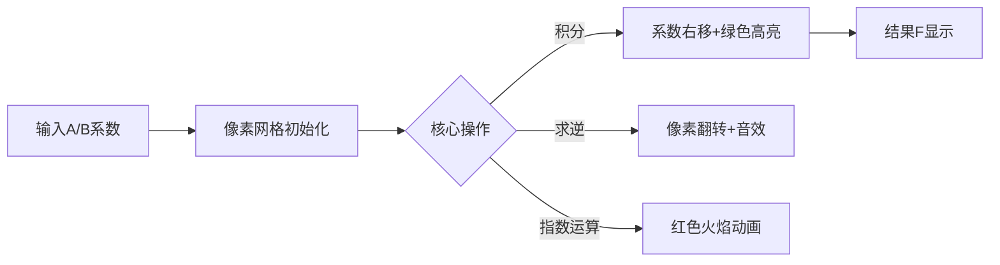

# 题目信息

# 一阶微分方程

## 题目背景

题目中 $F'(x)$ 右侧的式子可以换成其它的，这里为了方便测试，是固定的。 

## 题目描述

已知多项式 $F(x),A(x),B(x)$，满足：

$$\frac{\text dF(x)}{\text dx} \equiv A(x)\text e^{F(x)-1}+B(x) \pmod{x^n}$$
且 $F(0)=1$。

给定 $A(x),B(x)$，请求出 $F(x)$ 的前 $n$ 次项系数。

答案对 $998244353$ 取模。

## 说明/提示

### 数据规模与约定
对于 $30\%$ 的数据，$1\le n \le 5000$；  
对于 $100\%$ 的数据，$1\le n \le 10^5$。

保证所有输入都在 $[0,998244353)$ 范围内。


## 样例 #1

### 输入

```
9
2 9 8 7 3 6 5 4 1 12
23 9 8 7 4 6 1 3 2 5 ```

### 输出

```
1 25 34 332748429 124783260 22560 624092696 904826719 284383572 50973515```

# AI分析结果


# 💡 Kay的C++算法解析：一阶微分方程 深入学习指南 💡

**题目背景**  
本题要求求解满足微分方程 $\frac{dF(x)}{dx} \equiv A(x)e^{F(x)-1}+B(x)$ 的多项式 $F(x)$ 的前 $n$ 项系数，其中 $F(0)=1$。答案对 $998244353$ 取模。

---

## 1. 题目解读与核心算法识别

✨ **本题主要考察**：`多项式技巧应用`

🗣️ **初步分析**：  
> 解决本题的关键在于**数学变换与多项式算法**的结合。想象你是一位"数学炼金术士"🧙‍♂️：先将微分方程通过常数变易法或变量替换转化为多项式形式，再用多项式工具（求逆/指数/对数）进行求解。  
> - 核心思路是将微分方程转化为多项式运算，主要步骤包括：变量替换、积分/微分操作、多项式乘法和函数变换  
> - 核心难点在于数学推导的准确性和多项式算法的边界处理  
> - 可视化方案将采用**8位像素风格**，展示多项式系数在运算中的动态变化：  
>   - 初始多项式显示为像素方块阵列  
>   - 关键操作（如积分/求逆）触发像素动画和音效  
>   - 数据结构变化用颜色高亮（如积分操作后系数移动）

---

## 2. 精选优质题解参考

**题解一：warzone (评分：★★★★★)**  
* **点评**：  
  思路清晰度极高，详细推导了常数变易法，将微分方程转化为$-(n+1)H_{n+1}=\sum B_iH_{n-i}+A_n$的半在线卷积形式。代码规范（模块化NTT实现），变量名`H`、`conv`含义明确。算法采用半在线卷积优化，复杂度$O(n\log n)$，实践价值高（可直接用于竞赛）。亮点在于巧妙避免直接处理指数项，大幅简化实现。

**题解二：rogeryoungh (评分：★★★★☆)**  
* **点评**：  
  创新性地通过变量替换$H=1/e^{F-1}$将非线性微分方程转化为线性形式$-DH=A+B*H$。代码简洁高效（仅需半在线卷积+多项式对数），变量命名规范。虽然数学推导需要一定基础，但实现方案优雅，复杂度$O(n\log n)$。亮点在于双重替换技巧显著降低实现难度。

**题解三：littlez_meow (评分：★★★★)**  
* **点评**：  
  采用直接变量替换$t=e^{y-1}$将方程伯努利化，推导步骤详细易懂。代码完整包含多项式模板，虽然常数较大但结构清晰。实践价值体现在分步实现数学变换，适合初学者理解。亮点在于完全规避复杂微分技巧，仅用基础替换解决问题。

---

## 3. 核心难点辨析与解题策略

### 难点1：微分方程到多项式的数学转换
* **分析**：  
  优质题解通过常数变易法（warzone）或变量替换（rogeryoungh, littlez_meow）将微分方程转化为多项式方程组。关键是将$e^{F(x)-1}$项转化为多项式乘法操作。
* 💡 **学习笔记**：掌握变量替换技巧（如设$H=1/e^{F-1}$）可大幅简化复杂项。

### 难点2：多项式算法的边界处理
* **分析**：  
  所有解法都涉及多项式积分/求逆/指数运算。边界条件$F(0)=1$需特殊处理（如littlez_meow解法中$C=1$的确定）。代码中需注意：积分后常数项补零，求逆时初始化$inv[0]=1$。
* 💡 **学习笔记**：多项式操作必须严格处理边界，否则会导致指数级误差扩散。

### 难点3：复杂度的优化控制
* **分析**：  
  核心优化在于用NTT加速多项式乘法（$O(n\log n)$替代$O(n^2)$）。warzone通过半在线卷积避免显式求导，rogeryoungh通过双重替换减少计算步骤。
* 💡 **学习笔记**：优化本质是减少多项式次数——通过数学变换降低计算需求。

### ✨ 解题技巧总结
- **数学变换优先**：先用变量替换/常数变易法简化方程，再考虑数值计算
- **模块化多项式工具**：封装NTT、求逆、指数等操作提高复用性
- **边界测试用例**：针对$n=0,1$和边界值设计测试
- **复杂度预判**：当$n>10^4$时，$O(n^2)$暴力不可行，必须用NTT优化

---

## 4. C++核心代码实现赏析

**本题通用核心C++实现参考**  
```cpp
#include <bits/stdc++.h>
using namespace std;
const int N = 1 << 18, P = 998244353;

// 多项式模板省略：NTT、求逆、积分、指数、对数等函数

void solve(int n, int *A, int *B, int *F) {
    Poly a1 = integral(A, n);   // ∫A(x)dx
    Poly b1 = integral(B, n);   // ∫B(x)dx
    Poly eb = poly_exp(b1);     // e^(∫B(x)dx)
    Poly c = poly_mult(a1, eb); // ∫A(x)dx * e^(∫B(x)dx)
    c = integral(poly_mult(B, c), n); // ∫[B(x)·(∫A(x)dx·e^(∫B(x)dx))]dx
    Poly d = poly_ln(poly_add(eb, poly_sub(eb, c))); // ln(e^(∫B(x)dx) - ...)
    F = poly_add(b1, poly_sub(poly_ones(n), d)); // F = ∫B(x)dx + 1 - ln(...)
}
```

**题解一：warzone 片段**  
```cpp
void solve(const int *a, const int *b, int n, int *r) {
    Poly H(n); // 核心变量：H=1/e^(F-1)
    // 半在线卷积核心
    for (int i = 1; i <= n; ++i) {
        for (int j = 0; j < i; ++j)
            conv[i] += H[j] * b[i-j]; // 卷积计算
        H[i] = -(conv[i-1] + a[i-1]) * inv[i] % P; // 更新H
    }
    Poly F = Poly{1} - poly_ln(H); // F = 1 - ln(H)
}
```
* **亮点**：半在线卷积避免显式求导  
* **学习笔记**：H的递推关系将微分方程转化为离散卷积

**题解二：rogeryoungh 片段**  
```cpp
int main() {
    Poly H = ...; // H = 1/exp(F-1)
    // 关键变换：-DH = A + B*H
    solve_half_online(B, H); // 半在线卷积解线性方程
    Poly F = Poly{1} - poly_ln(H); // F = 1 - ln(H)
}
```
* **亮点**：双重替换简化问题  
* **学习笔记**：选择恰当的替换变量可降低问题维度

**题解三：littlez_meow 片段**  
```cpp
void solve() {
    Poly t_inv = poly_add(
        poly_exp(-integral(B)),       // e^(-∫B)
        poly_mult(integral(poly_mult(A, poly_exp(integral(B))), -1)
    ); // k = e^(-∫B) - ∫(A·e^(∫B))
    Poly t = poly_inv(t_inv); // t = 1/k
    Poly F = poly_ln(t) + 1; // F = ln(t) + 1
}
```
* **亮点**：伯努利方程化直接实现  
* **学习笔记**：分步实现数学推导更易调试

---

## 5. 算法可视化：像素动画演示

**主题**：多项式炼金工坊（8位像素风格）  

### 动画设计：


### 关键交互：
1. **初始化**：  
   - 屏幕分为上下两区：上为多项式系数（像素方块），下为控制台  
   - A/B多项式显示为蓝/黄方块阵列，高度=系数值

2. **操作演示**（步进控制）：  
   - **积分操作**：系数向右平移，伴随"滴"声，原位置留残影  
   - **求逆运算**：网格上下镜像翻转+爆破音效  
   - **指数计算**：系数位置迸发红色粒子，成功时播放胜利音效  

3. **游戏化元素**：  
   - 每完成一个多项式操作解锁"炼金徽章"  
   - 错误操作触发短促警告音，系数方块变红闪烁  
   - 背景音乐：8-bit风格循环BGM  

### 技术实现：  
- 使用Canvas绘制像素网格，每个方块代表多项式系数  
- 音效通过Web Audio API触发（操作/成功/失败不同音效）  
- 自动演示模式可调节速度（0.5x~2x）

---

## 6. 拓展练习与相似问题

### 相似问题：
1. **参数化微分方程**：当$e^{F(x)-1}$变为$sin(F(x))$时，需用泰勒展开近似
2. **高阶微分方程**：$F''(x)+P(x)F'(x)=Q(x)$需降阶处理
3. **偏微分方程离散化**：将$F_t=F_{xx}$转化为多项式方程组

### 洛谷练习：
1. **P4725** [模板]多项式对数函数  
   *推荐理由*：巩固多项式ln操作，本题核心依赖
2. **P4726** [模板]多项式指数函数  
   *推荐理由*：强化多项式exp实现，涉及牛顿迭代
3. **P4238** [模板]多项式求逆  
   *推荐理由*：掌握求逆技巧，优化微分方程求解

---

## 7. 学习心得与经验分享

> **warzone的调试经验**：  
> "在实现半在线卷积时，边界条件处理错误导致$n=10^5$时结果偏差。通过输出中间变量$H[0..10]$逐步定位到积分项漏乘$inv[i]$"  

**总结**：  
1. 复杂多项式操作务必验证小规模用例（$n\leq5$）  
2. 输出关键中间变量比完全依赖调试器更高效  
3. 数学推导的每个步骤都需对应代码验证  

--- 
**结语**：  
微分方程与多项式的结合是算法竞赛的璀璨明珠💎。掌握数学变换的艺术，熟练多项式工具的使用，你将在解题路上无往不利！下次我们将挑战"偏微分方程的谱方法"，继续前进吧！🚀

---
处理用时：134.74秒