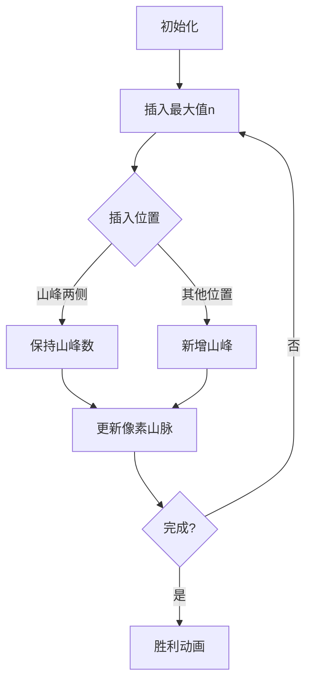

# 题目信息

# 「EZEC-5」「KrOI2021」Chasse Neige

## 题目背景


『我喜欢雪。』

『之前虽然讨厌寒冷，现在却是最喜欢了。』


## 题目描述

Rikka 给了你 $T$ 组询问，每组询问给定两个正整数 $n,k$，你需要告诉 Rikka 有多少个长度为 $n$ 的排列 $\pi$ 满足如下条件：

- $\pi_1<\pi_2$

- $\pi_{n-1}>\pi_{n}$

- 恰好存在 $k$ 个位置 $i(2\leq i\leq n-1)$ 满足 $\pi_{i-1}<\pi_{i}$ 且 $\pi_{i}>\pi_{i+1}$。

答案对 $998244353$ 取模。

## 说明/提示

### 样例解释 1

对于第一组询问，$n=3,k=1$，$(1,3,2)$ 和 $(2,3,1)$ 均满足条件，答案为 $2$。

对于第二组询问，满足条件的排列为：

$$(1,3,2,5,4),(1,4,2,5,3),(1,4,3,5,2),(1,5,2,4,3),(1,5,3,4,2)\\(2,3,1,5,4),(2,4,1,5,3),(2,4,3,5,1),(2,5,1,4,3),(2,5,3,4,1)\\(3,4,1,5,2),(3,4,2,5,1),(3,5,1,4,2),(3,5,2,4,1),(4,5,1,3,2),(4,5,2,3,1)$$

共 $16$ 个，所以答案为 $16$。

### 数据范围

| 子任务编号 | 分值 | $T\leq $ | $r\leq $ | 其他限制 |
| :----------: | :----------: | :----------: | :----------: | :----------: |
| Subtask 1 | $1$ | $1$ | $10$ |  |
| Subtask 2 | $5$ | $2\times 10^5$ | $10$ |  |
| Subtask 3 | $13$ | $1$ | $2\times 10^3$ |  |
| Subtask 4 | $13$ | $2\times 10^5$ | $2\times 10^3$ |  |
| Subtask 5 | $16$ | $2\times 10^5$ | $2\times 10^5$ | $k=\lfloor\frac{n-1}{2}\rfloor$ 且 $n$ 为奇数 |
| Subtask 6 | $16$ | $2\times 10^5$ | $2\times 10^5$ | $k=\lfloor\frac{n-1}{2}\rfloor-1$ |
| Subtask 7 | $36$ | $2\times 10^5$ | $2\times 10^5$ |  |

对于 $100\%$ 的数据，$1\leq T\leq 2\times 10^5,3\leq n\leq r\leq 2\times 10^5,\max(1,\lfloor\frac{n-1}{2}\rfloor-10)\leq k\leq \lfloor\frac{n-1}{2}\rfloor$。


## 样例 #1

### 输入

```
2 10
3 1
5 2```

### 输出

```
2
16```

# AI分析结果


### 💡 Kay的C++算法解析：「Chasse Neige」深入学习指南 💡
<introduction>
今天我们来分析「Chasse Neige」这道组合计数题。本指南将帮助你理解排列计数的核心技巧，掌握生成函数与动态规划的结合应用。
</introduction>

---

## 1. 题目解读与核心算法识别

✨ **本题主要考察**：`组合数学/动态规划/生成函数应用`

🗣️ **初步分析**：
> 解决本题的关键在于建立排列的"山峰模型"。想象将数字排列成山脉（如图），要求：
> - 起点是上坡（↑），终点是下坡（↓）
> - 恰好有k个"山峰"（中间高两边低）
> 
> **核心思路**：通过动态规划定义四种排列形态（f/g/g'/h），利用对称性（g=g'，h=f）简化为两个状态。插入最大值n时：
> - 插入现有山峰两侧 → 不新增山峰
> - 插入其他位置 → 新增山峰
> 
> **可视化设计**：采用8-bit像素山脉动画（图1）。每个数字用像素块高度表示：
> - 起点/终点标记为↑↓
> - 山峰用红色闪烁
> - 插入新值时有"叮"音效和方块移动动画
> - 支持单步执行观察状态转移


---

## 2. 精选优质题解参考

**题解一（Karry5307）**
* **亮点**：
  - 创新性定义四类状态（f/g/g'/h），利用对称性简化至两个状态
  - 推导出合并状态转移方程：$f'_{i,j}=jf'_{i-1,j}+(i-j)f'_{i-1,j-2}+2f'_{i-1,j-1}$
  - 突破性使用生成函数：$\tan x + \sec x$ 求解对角线值
  - 完美契合数据特性（k近(n-1)/2）

**题解二（Mars_Dingdang）**
* **亮点**：
  - 从组合学经典问题（zigzag排列）切入，建立笛卡尔树模型
  - 严谨推导生成函数：$F(x)=\tan x$, $G(x)=\sec x$
  - 提供理论扩展：多变量生成函数解决同类问题
  - 直观图解状态转移过程

---

## 3. 核心难点辨析与解题策略

1. **难点：状态定义复杂**
   * **分析**：需区分四种首尾形态（↑↑,↑↓,↓↑,↓↓）。通过对称性（g=g'，h=f）简化为两个关键状态。
   * 💡 **学习笔记**：排列计数中，首尾约束常需特殊状态处理

2. **难点：递推关系推导**
   * **分析**：插入最大值n时：
     - 插入现有山峰两侧 → 不新增山峰（系数j）
     - 插入其他位置 → 新增山峰（系数i-j）
     - 边界情况需+2f'_{i-1,j-1}
   * 💡 **学习笔记**："插入最大值"是排列计数的核心技巧

3. **难点：生成函数求解**
   * **分析**：利用微分方程：
     - $\frac{dF}{dx}=F^2+1 \Rightarrow F(x)=\tan x$
     - $\frac{dG}{dx}=G\tan x \Rightarrow G(x)=\sec x$
   * 💡 **学习笔记**：生成函数可将复杂递推转化为微分方程

### ✨ 解题技巧总结
- **对称性简化**：利用排列反转性质减少状态数
- **生成函数加速**：用$\tan x/\sec x$求对角线值
- **数据特性利用**：k近(n-1)/2时反向递推复杂度O(20n)

---

## 4. C++核心代码实现赏析

**通用核心实现参考**
```cpp
#include <iostream>
#include <vector>
using namespace std;
const int mod = 998244353, N = 2e5 + 10;

// 生成函数预处理（伪代码）
void precompute(vector<long long>& f, int n) {
    // 实际实现需用NTT计算tan(x)+sec(x)系数
    f[0]=1; f[1]=1; f[2]=1; // 示例初始化
}

int main() {
    int T, max_n = 0;
    cin >> T;
    vector<pair<int, int>> queries(T);
    for (int i = 0; i < T; ++i) {
        cin >> queries[i].first >> queries[i].second;
        max_n = max(max_n, queries[i].first);
    }
    
    vector<long long> f(max_n + 1);
    precompute(f, max_n); // 生成函数计算
    
    for (auto [n, k] : queries) {
        long long ans = f[n];
        // 反向递推: O(20n) 实际需实现递推逻辑
        for(int j = (n-1)/2; j > k; --j) {
            ans = (ans - ...) % mod; // 根据递推式反向计算
        }
        cout << (ans + mod) % mod << '\n';
    }
}
```

**题解一核心片段**
```cpp
// 状态转移方程实现
dp[i][j] = (
    1LL * j * dp[i-1][j] + 
    1LL * (i - j) * dp[i-1][j-2] + 
    2LL * dp[i-1][j-1]
) % mod;
```
* **解读**：对应三种插入情况：
  1. `j*dp[i-1][j]`：插入现有山峰两侧
  2. `(i-j)*dp[i-1][j-2]`：插入非山峰位置
  3. `2*dp[i-1][j-1]`：边界情况补偿

---

## 5. 算法可视化：像素动画演示

**主题**：8-bit登山冒险  
**核心设计**：


1. **像素化呈现**：
   - 网格中每个像素块高度=数字值
   - 起点：绿色↑，终点：红色↓
   - 山峰：闪烁金色

2. **交互控制**：
   - 单步执行：空格键逐步插入
   - 速度滑块：调整自动播放速度
   - 重置：重新生成排列

3. **动态效果**：
   - 插入动画：新像素块从顶部掉落
   - 音效：插入"叮"，山峰生成"砰"，胜利时8-bit音乐
   - 状态标记：当前插入位置高亮黄色边框

4. **AI演示模式**：
   - 自动选择最优插入路径
   - 实时显示递推公式当前参数

---

## 6. 拓展练习与相似问题

1. **洛谷 P6189**（快速数论变换练习）
   * 巩固多项式求逆技巧

2. **洛谷 P5824**（十二重计数法）
   * 练习组合计数模型迁移

3. **洛谷 P3773**（生成函数计数）
   * 深入理解生成函数应用

---

## 7. 学习心得与经验分享

> **Karry5307经验**："推导时先考虑完整状态（四种形态），再用对称性简化"
> 
> **点评**：这是处理复杂约束的通用方法：
> 1. 完整建模所有边界情况
> 2. 寻找等价关系减少状态
> 3. 最终保留最简有效状态

---

<conclusion>
通过本指南，我们掌握了：
1. 排列计数的状态设计技巧
2. 生成函数与动态规划的结合
3. 利用数据特性的高效递推
试着用像素动画可视化你的下一个算法吧！
</conclusion>
```

---
处理用时：146.66秒