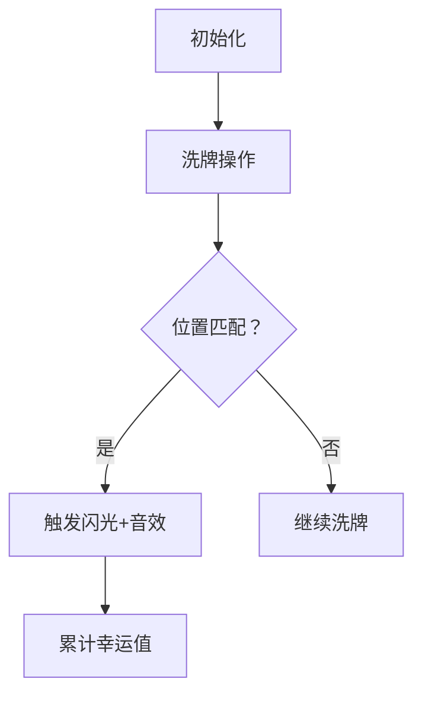

# 题目信息

# 彼岸 | To See the Next Part of the Dream

## 题目背景

「“看见梦境的下一个部分”…？」

“是啊… ‘尽管身体已是成年人，但内心却依旧是那个不切实际的小孩，依旧是那个相信自己有着无尽可能的小孩——即使是在认清了现实和理想的鸿沟后，还仍是如此。年少时那个成为摇滚巨星的梦，如今已显得分外不可及，只能在一次次前行中看见梦的下一个部分’… 不觉得作者和我很像吗？”

“曾经年少的自己对一切的未知都怀揣着好奇与欣喜，但如今仿佛只是在如同抓住救命稻草一般抓住自己背离现实的梦想，然后在生活的洋流中逐渐看见梦的下一个部分… 明知自己的失败，却仍在仿佛为了看见什么、达成什么一样向上登攀，这样一来，和作者所描述的‘active loser’也没什么两样吧…”

「所以，你所期望看见的、期望达成的，究竟是什么呢？」

“…”

“现在的我，已经不知道了。”

> 나의 어리고 멍청했던 날들은 사라져줬으면
>
> 如果那些年少无知的日子消失掉就好了
>
> 나의 소중한 인연들 이제는 추억속으로만
>
> 珍贵的感情 现在仅仅存在于在记忆中
>
> 만약 이 세상이 전부 누군가의 또다른 꿈이었다면
>
> 如果这个世界 只是别人的梦
>
> 언젠가 깨어나게 될때 나는 지금과는 달라져있을까
>
> 某天醒来时 我会变得不一样吗

## 题目描述

「那么，你相信宿命吗？」

“那种东西，顶多只是什么励志故事里的抒情工具吧。”

「是吗… 那么要玩玩塔罗牌吗？」

“谁会对那种事情感兴趣…”

「真是的，你要再一副对什么事情都漠不关心的态度我要生气了…！」

“好好好… 所以呢？塔罗牌呢？”

「这个嘛… 嘿嘿，自己想象咯～」

“什么毛病…”

「现在有 $n$ 叠塔罗牌放在桌上，每一叠都有 $2^n$ 张，从桌面向上分别是 $1$ 号、$2$ 号… $n$ 号。现在作为宿命的管理者的我们——要洗一遍这些塔罗牌！」

“怎么… 中二病开始传染了吗…”

「那么，洗牌的过程是，将牌均匀地分成两半，下面一半和上面一半分别放在左右手；接着，右手从底部放下一张牌，左手从底部放下一张牌，右手又从底部放下一张牌… 这样交错重复，于是一次洗牌就完成了！」

“例如 $n=2$ 时，假设原来的牌从下往上看是 $[1,2,3,4]$，洗一次牌后就会变成 $[3,1,4,2]$——是这样吗？”

「是的！然后对于这 $n$ 叠初始时都按顺序从下到上摆放的塔罗牌，我会不操作第一叠牌，然后洗一次第二叠牌，洗两次第三叠牌… 洗 $n-1$ 次第 $n$ 叠牌。接下来，我会把这 $n$ 叠牌都从下到上地发给 $2^n$ 个人——也就是说第一个人会拿到每叠牌的第一张，第二个人会拿到每叠牌的第二张… 每一个人都恰好会拿到 $n$ 张牌。」

「现在，定义一个人拿到和自己号码相同的牌的张数为这个人的幸运值。你能算出这 $n$ 个人幸运值的总和是多少吗？」

“嗯… 撇开你粗制滥造的题面不谈，这个题目还是很有趣的。”

「适可而止啊喂！」

“… 我想了想，好像还挺简单的。不妨让我们记 $n=k$ 的时候的幸运值总和为 $f(k)$。现在你需要对 $l\le k\le r$ 的 $f(k)$ 求和，你看怎么样？”

「… 不是很会了…」

### 简要题意

对于长度为 $2k$ 的序列 $a$，定义函数 $S_q(a)$，其中

$$
S_q(a)=
\begin{cases}
a,&q=0\\
[a_{k+1},a_1,a_{k+2},a_2,\dots,a_{2k},a_k],&q=1\\
S_{q-1}(S_1(a)),&\text{otherwise.}
\end{cases}
$$

现在给定正整数 $l,r$，求 $\sum_{k=l}^r f(k)$，其中

$$
f(n)=\sum_{q=0}^{n-1}\sum_{k=1}^{2^n}\left[S_q([1,2,3,\dots,2^n])_k=k\right]
$$

## 说明/提示

### 样例解释

以样例一中计算 $f(2)$ 为例。最初有 $2$ 叠牌，从下到上的牌都是 $[1,2,3,4]$。然后现在对第一叠牌不操作，第二叠牌洗一次，于是第二叠牌从下到上变成了 $[3,1,4,2]$。现在把两叠牌发给 $4$ 个人。第一个人拿到 $[1,3]$，第二个人拿到 $[2,1]$，第三个人拿到 $[3,4]$，第四个人拿到 $[4,2]$。发现每个人的幸运值都为 $1$（都恰好拿到了一张和自己号码相同的牌），于是幸运值总和就是 $4$，继而 $f(2)=4$。

### 数据范围

对于全部数据，有 $1\le l\le r\le 10^{10}$。

Subtask 1（10 pts）：保证 $l=r$ 且 $r\le 12$。

Subtask 2（35 pts）：保证 $l=r$。

Subtask 3（15 pts）：保证 $1\le l\le r\le 10^6$。

Subtask 4（40 pts）：无特殊限制。

## 样例 #1

### 输入

```
2 2```

### 输出

```
4```

## 样例 #2

### 输入

```
3 4```

### 输出

```
26```

## 样例 #3

### 输入

```
10 20```

### 输出

```
2096384```

# AI分析结果


# 💡 Kay的C++算法解析：彼岸 | To See the Next Part of the Dream 深入学习指南 💡

## 1. 题目解读与核心算法识别

✨ **本题主要考察**：`数论与组合数学`（莫比乌斯反演、杜教筛、置换群）

🗣️ **初步分析**：
> 这道题的核心在于理解洗牌操作的数学本质。想象塔罗牌的洗牌过程就像在玩一个复古的像素游戏：每张牌的位置变化遵循一个数学公式（$x \rightarrow 2x \mod (2^n+1)$），这就像游戏角色在像素迷宫中按固定规则移动。解题的关键是计算洗牌后"幸运值"（位置与编号匹配）的总和。

> - **核心难点**：直接计算$10^{10}$规模会超时，需将问题转化为数论公式
> - **解决思路**：通过置换群理论发现洗牌操作形成循环节，再用莫比乌斯反演和杜教筛优化计算
> - **可视化设计**：用像素动画展示牌的位置变化（如8-bit卡片移动特效），当牌号与位置匹配时触发"叮"的音效和高亮闪光，自动演示模式可调节速度观察洗牌过程

---

## 2. 精选优质题解参考

**题解一：Mivik（思路清晰性：★★★★☆，算法优化：★★★★★）**
* **点评**：该解法从置换群角度切入，精准推导出核心公式 $g(n)=\sum_{d|n}2^{n/d}\phi(d)$。亮点在于完整证明了$(2^n+1,2^k-1)$的数论性质，并设计了$O(n^{2/3})$的杜教筛优化。代码虽未提供，但数学推导严谨，对理解问题本质极具启发性。

**题解二：VinstaG173（代码规范性：★★★★☆，实践价值：★★★★★）**
* **点评**：给出完整C++实现，采用杜教筛+整除分块框架。亮点在于巧妙处理$\phi$函数前缀和的分段计算，虽然调试过程提到整数溢出问题（需注意`unsigned long long`使用），但最终代码简洁高效，可直接用于竞赛。

**题解三：whiteqwq（实现技巧：★★★★☆，学习价值：★★★★☆）**
* **点评**：提供无预处理的杜教筛实现，利用`map`缓存计算结果。亮点在于$h(n)=\phi$前缀和的递归表达式 $h(n)=p(n)-2p(\lfloor n/2\rfloor)+h(\lfloor n/2\rfloor)$，虽然空间效率略低，但更易理解。

---

## 3. 核心难点辨析与解题策略

1. **难点：置换群到数论的转化**
   * **分析**：洗牌操作本质是模$2^n+1$下的乘2置换，需发现$f(n)$实际是求置换幂的不动点数和
   * **策略**：通过$2^it ≡ t \pmod{2^n+1}$转化为同余方程，结合$\gcd(2^a-1,2^b-1)=2^{\gcd(a,b)}-1$定理简化
   * 💡 学习笔记：组合问题常可转化为数论问题求解

2. **难点：大范围求和优化**
   * **分析**：$n≤10^{10}$需避免暴力计算，核心公式$\sum_{d=1}^n 2^d\sum_{k≤n/d}\phi(k)$有重复子问题
   * **策略**：用杜教筛计算$\phi$前缀和，整除分块将计算量优化至$O(n^{2/3})$
   * 💡 学习笔记：杜教筛=记忆化+整除分块+小范围预处理

3. **难点：奇偶性处理**
   * **分析**：公式中奇因子约束($d$为奇数)导致无法直接套标准筛法
   * **策略**：推导递归式$S(n)=\phi$前缀和$-\sum S(\lfloor n/2^k\rfloor)$，复用杜教筛结果
   * 💡 学习笔记：位运算性质可优化奇偶条件判断

### ✨ 解题技巧总结
- **技巧1：问题等价转换**（洗牌→置换群→数论公式）
- **技巧2：分治优化**（杜教筛处理积性函数前缀和）
- **技巧3：边界压缩**（整除分块降低计算维度）
- **技巧4：递归复用**（奇偶约束下的前缀和分解）

---

## 4. C++核心代码实现赏析

**本题通用核心C++实现参考**
```cpp
#include <map>
using namespace std;
typedef unsigned long long ll;
const int maxn=5000005, mod=998244353;

int phi[maxn], sum[maxn]; // 预处理phi前缀和
map<ll, int> cache; // 杜教筛缓存

int get_phi_sum(ll n) {
  if(n <= maxn-5) return sum[n];
  if(cache.count(n)) return cache[n];
  int res = (n % mod) * ((n+1) % mod) % mod * 499122177 % mod; // n(n+1)/2
  for(ll l=2, r; l<=n; l=r+1) {
    r = n/(n/l);
    res = (res - (r-l+1)%mod * get_phi_sum(n/l)) % mod;
  }
  return cache[n] = (res+mod)%mod;
}

int solve(ll N) {
  ll l=1, r;
  int res=0, pre=0;
  while(l <= N) {
    r = N/(N/l);
    int now = (1ll<<(r%(mod-1))) % mod; // 2^r
    res = (res + 1ll*(now - pre) * get_phi_sum(N/l)) % mod;
    pre = now;
    l = r+1;
  }
  return (res + mod) % mod;
}
```

**代码解读概要**：
> 1. **预处理**：线性筛计算小范围$\phi$前缀和
> 2. **杜教筛**：`get_phi_sum`递归求解大范围$\phi$和
> 3. **整除分块**：`solve`中对$N/d$分块，用$2^d$加权求和
> 4. **模优化**：欧拉定理降幂处理$2^d \mod 998244353$

---

## 5. 算法可视化：像素动画演示

**动画演示主题**：《8-bit洗牌探秘》  
**核心演示内容**：动态展示洗牌过程中卡牌位置变换，高亮不动点匹配瞬间



1. **像素场景设计**：
   - 牌堆：8-bit风格卡片阵列，每张牌显示编号（16x16像素）
   - 控制面板：开始/暂停/步进按钮，速度滑块(1x-5x)

2. **关键动画帧**：
   - **洗牌特效**：牌分裂为两半（左/右手），交错合并时产生像素残影
   - **匹配高亮**：当$k$号牌到达第$k$位时，触发金色闪光和"叮"音效
   - **数据结构可视化**：右侧显示当前置换公式$2x \mod (2^n+1)$

3. **游戏化元素**：
   - **关卡进度**：每完成$n$次洗牌解锁新等级
   - **音效设计**：
     - 洗牌："嗖嗖"像素音效（8-bit波形合成）
     - 匹配：清脆"叮"声（方波500Hz）
     - 完成：8和弦胜利旋律

---

## 6. 拓展练习与相似问题思考

1. **洛谷 P4213**  
   *模板题：求$\phi$和$\mu$前缀和*  
   🗣️ 推荐理由：巩固杜教筛核心思想

2. **洛谷 P1447**  
   *能量采集：数论求和变形*  
   🗣️ 推荐理由：练习整除分块与数论转化技巧

3. **洛谷 P2158**  
   *仪仗队：欧拉函数应用*  
   🗣️ 推荐理由：理解$\phi$函数的实际意义

---

## 7. 学习心得与经验分享

> **VinstaG173的调试经验**："忘记处理整数溢出导致WA多次，最终用unsigned long long解决"  
> **Kay总结**：在数论问题中，当$n>10^9$时需特别注意：  
> 1. 乘法用`1ll*a*b`防溢出  
> 2. 模运算前先取模  
> 3. 杜教筛缓存用`map`或`unordered_map`

---

通过本次分析，我们深入理解了数论在组合问题中的应用精髓。记住：所有复杂的算法都是由基础组件构建的，就像8-bit游戏由简单像素组成一样。继续挑战吧，少年！🎮

---
处理用时：119.65秒