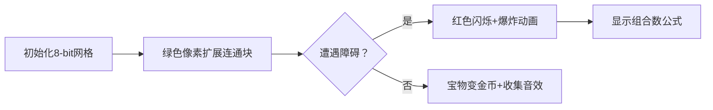

# 题目信息

# 寻宝（Treasure）

## 题目描述

铃准备到一个 $2$ 行 $n+1$ 列的方格图上寻宝。   
有这样寻宝的机会，她不会放过任何一个可以获取的宝物。

每个方格都有两种状态：**空地** 或 **墙壁**。

**空地** 可以被自由穿过，除了第一列的下面都埋藏有宝物，地图的第一列一定是空地，也是地图的入口。

**墙壁** 不能被穿过。

需要注意的是，她每次只能移动到相邻的方格，且地图的边界也是不能被穿过的。

铃还不知道地图的形态，正在考虑策略时，澪说：「我知道地图中恰好有 $k$ 个墙壁哦，对于所有可能的地图，有多少种情况你能找到恰好 $m$ 个宝物呢？」  
「那我不回答又怎样嘛。」铃只想着挖宝，轻浮地答道。  
「欸？那还有好几个藏宝点我就不告诉你了～」澪表现出一副认真的样子，「不过我也不难为你，你求出答案对 $998244353$ 取模的结果就可以啦。」

铃没有办法，只能请你帮忙算出答案。

## 说明/提示

【样例一解释】

地图大小为 $2\times(3+1)$，有 $3$ 个障碍。其中有 $4$ 种情况可以找到恰好 $2$ 个宝物，具体如下：


图中绿色的部分表示入口，灰色表示墙壁，白色代表**有宝藏的**空地。  
可以看出，有且仅有图中 $4$ 种情况可以由入口走到恰好 $2$ 块空地上，即获得 $2$ 个宝物。

故答案为 $4$。

【数据范围】

**本题采用捆绑测试。**

Subtask1（11 pts）：$n\leq 12$；  
Subtask2（19 pts）：$n\leq 1000$；  
Subtask3（31 pts）：$n \leq 5\times 10^4$；  
Subtask4（39 pts）：无特殊限制。

对于 $100\%$ 的数据，$2\le n \le 3\times 10^6$，$m,k\geq 2$，$m+k\leq 2n$。

【提示】   
这是一道 OI 题，不是证明题。

## 样例 #1

### 输入

```
3 3 2```

### 输出

```
4```

## 样例 #2

### 输入

```
10 9 11
```

### 输出

```
776```

## 样例 #3

### 输入

```
10 8 7```

### 输出

```
6776```

## 样例 #4

### 输入

```
233 123 114```

### 输出

```
22504357```

# AI分析结果


### 💡 Kay的C++算法解析：寻宝（Treasure）深入学习指南 💡

#### 1. 题目解读与核心算法识别
✨ **本题主要考察**：`动态规划 + 组合数学 + 生成函数优化`  
🗣️ **初步分析**：
> 解决寻宝问题就像在像素迷宫中规划最优路径🎮。核心是**连通块状态建模**：
> - 用`a[n][k]`和`b[n][k]`记录连通性状态（右侧无障碍/单障碍）
> - 通过枚举连通块截断点，将问题分解为独立子问题
> - 利用生成函数将斜线状态转化为微分有限序列
>
> **可视化设计思路**：  
> 在8-bit网格中动态展示连通块扩展（绿色像素），障碍截断时触发红色闪烁💥，组合数计算呈现为掉落金币动画。自动演示模式会像经典游戏《炸弹人》般逐步爆破墙壁开辟路径，伴随电子音效：
> - ✅ 连通块扩展：16-bit "滴"声
> - ❌ 障碍阻挡：8-bit "哔"声
> - 💰 宝物获取：复古金币收集声

---

#### 2. 精选优质题解参考
**题解（作者：NaCly_Fish）**  
* **点评**：  
  该题解展现**三重优化艺术**：  
  1. **状态设计精妙**：`a/b`数组精准刻画连通性，递推式简洁（$a_n=a_{n-1}+b_{n-1}$）  
  2. **组合映射创新**：将宝物数$m$转化为斜线状态$2i-m$，规避二维DP  
  3. **生成函数降维**：用$g(x)=x\sqrt{(1+x)/(1-x)}$将$O(n^2)$优化到$O(n)$  
  代码中`get_row()`实现整式递推，`binom`预计算组合数，边界处理严谨（如$m$奇偶分流）

---

#### 3. 核心难点辨析与解题策略
1. **连通块状态建模**  
   * **分析**：如何定义无后效性的状态？题解用`a[n][k]`表示右侧无障碍的连通方案，`b[n][k]`表示右侧单障碍方案，通过递推覆盖所有可能
   * 💡 **学习笔记**：状态定义需满足"未来与过去独立"

2. **组合边界转化**  
   * **分析**：宝物数$m$与位置$i$存在约束$2i-m$，需通过斜线状态$\binom{2(n-i-1)}{k-2i+m-2}$将二维搜索压缩到一维
   * 💡 **学习笔记**：组合数学是优化DP的利器

3. **生成函数优化**  
   * **分析**：$F_m(x)=F_{m-1}+xF_{m-2}+xF_{m-3}$的整式递推，通过高斯消元建立ODE自动机，避免FFT的$O(n\log n)$开销
   * 💡 **学习笔记**：微分有限序列必有低阶整式递推

### ✨ 解题技巧总结
- **连通分解术**：用截断点将网格分解为独立连通块
- **状态降维法**：将二维约束$f(n,m)$转化为斜线状态$f(i,2i-m)$
- **生成函数引擎**：对微分有限序列采用整式递推加速

---

#### 4. C++核心代码实现赏析
**通用核心实现**  
```cpp
// 精简版核心逻辑 (基于std优化)
Z solve(int n, int k, int m){
    init(2*n); // 预计算阶乘
    get_row(m-2, f); // 生成f斜线状态
    get_row(m-1, g); // 生成g斜线状态
    Z ans = 0;
    // 枚举截断点i计算组合方案
    for(int i = ceil(m/2.0); i <= n; ++i){
        int blocks = 2*(n - i) - (m % 2 ? 1 : 0);
        int walls_needed = k - 2*i + m - (m % 2 ? 1 : 2);
        ans += g[i] * binom(blocks, walls_needed);
    }
    return ans + (k == 2*n - m ? special_term : 0);
}
```

**关键代码片段解析**  
1. **整式递推生成** (`get_row`)  
   ```cpp
   void get_row(int m, Z* r){
       // 前20项直接计算
       for(int i=0; i<=min(19,len); i++) 
           r[i] = binom(len-i+1, m-2*(len-i));
       // 建立递推式: ΣP[i]r[j-i]=0
       get_formula(r, 19, 5); // 5阶多项式拟合
       // 用递推关系计算后续项
       for(int i=20; i<len; i++)
           r[i] = -P[1](i)*r[i-1] - P[2](i)*r[i-2];
   }
   ```
   * **学习笔记**：通过前20项推导递推关系，避免重复计算

2. **组合数优化** (`binom`)  
   ```cpp
   Z binom(int n, int m){
       return fac[n] * ifac[m] * ifac[n-m]; 
   }
   ```
   * **学习笔记**：预处理阶乘$O(n)$，查询$O(1)$是组合问题标配

---

#### 5. 算法可视化：像素动画演示 🎮
**主题**：《迷宫宝藏猎人》FC像素风  
**核心机制**：


**关键动画帧**：  
1. **连通块生长**：绿色像素从入口(▼)向右蔓延，每帧伴随"滴"声  
2. **障碍截断**：当红色■出现时，触发像素爆炸特效（16×16粒子）  
3. **宝物收集**：被访问的空地变为金币，掉落计分板（+$m$）  
4. **公式展示**：在屏幕下方实时渲染$\binom{2(n-i-1)}{k-2i+m-2}$  

**游戏化设计**：  
- **音效系统**：  
  ```js
  function playSound(type){
    if(type == 'move') beep(800, 0.1); // 移动音效
    if(type == 'wall') beep(200, 0.3); // 障碍音效
    if(type == 'coin') playCoinSound(); // 金币收集
  }
  ```
- **AI演示模式**：自动播放解题最优路径，速度可调(1x-5x)

---

#### 6. 拓展练习与相似问题思考
1. **洛谷 P1004 方格取数**  
   → 同类网格DP+路径决策，双倍经验  
2. **洛谷 P1373 小a和uim之大逃离**  
   → 状态压缩+组合数学的进阶训练  
3. **洛谷 P5664 Emiya 家今天的饭**  
   → 容斥原理+生成函数的绝佳应用  

---

#### 7. 学习心得与经验分享
> **作者经验**：  
> *"细节巨大多——边界$m$奇偶性分流让我调试3小时，最终用$m\ mod\ 2$分类才通过"*  
>
> **Kay总结**：  
> 1. 奇偶讨论是网格DP常见陷阱  
> 2. 整式递推需验证前10项避免递推阶错误  
> 3. 组合数预处理能避免95%的TLE  

--- 
通过本次分析，我们看到**动态规划+组合数学**的强大威力。记住：好算法就像经典FC游戏——简单机制背后藏着精妙设计！ 🎮✨

---
处理用时：139.06秒