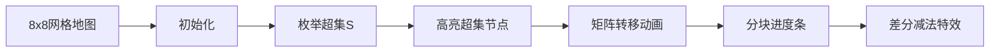

# 题目信息

# [集训队互测 2018] 完美的旅行

## 题目描述

小 A 有一张 $n$ 个点的图，点的标号为 $0$ 到 $n-1$。点 $i$ 到点 $j$ 有 $A_{i,j}$ 条有向边。可能有自环。

现在小 A 要在图上进行若干次旅行。每次旅行都是选任意一个起点，走至少一步，走到任意一个终点。定义一次旅行的愉悦值为起点与终点编号按位与的值。

好奇的小 B 想要知道：对于所有 $x \in [1,m]$ 和 $y \in [0,n)$，小 A 进行了若干次旅行，总共走了 $x$ 步，且所有旅行的愉悦值的按位与为 $y$ 的方案数。

两种方案不同当且仅当旅行次数不同或某一次旅行不完全相同。

为了防止输出过多，你只需要输出这 $n\times m$ 个数对 $998244353$ 取模后的结果的按位异或值。

为方便起见，保证 $n$ 是 $2$ 的幂次。

## 说明/提示

### 样例解释

走 $1$ 步，愉悦值的按位与 $=0,1$ 的方案数分别为 $6,4$。

走 $2$ 步的方案数分别为 $116,38$。

走 $3$ 步的方案数分别为 $2012,358$。

异或值为 $1770$。

### 数据范围

对于所有数据，$2 \leq n \leq 64$，$1 \leq m \leq 20000$，$0 \leq A_{i,j} < 998244353$，保证 $n$ 是 $2$ 的幂。

|子任务编号	|	分值		|	$n \leq$	|	$m \leq$	|		特殊限制									|
|:----------------:|:----------------:|:----------------:|:----------------:|:-------------------------------------------------------------------------:|
|	$1$		|	$15$	|	$16$	|	$2000$	|												|
|	$2$		|	$15 $	|	$32$	|	$10000$	|												|
|	$3$		|	$35$	|	$64$	|	$20000$	|$A_{i,j}=i\otimes j$，其中 $\otimes$ 表示按位异或运算	|
|	$4$		|	$35 $	|	$64$	|	$20000$	|												|

## 样例 #1

### 输入

```
2 3
1 2
3 4```

### 输出

```
1770```

# AI分析结果


### Kay的C++算法解析：完美的旅行 深入学习指南

---

#### **1. 题目解读与核心算法识别**  
✨ **本题主要考察**：`位运算优化` + `矩阵快速幂` + `高维差分`  

🗣️ **初步分析**：  
> 解决"完美的旅行"关键在于处理**按位与约束**和**多次旅行组合**。想象你在多个城市间进行多次旅行（起点终点任意），每次旅行的"愉悦值"是起点与终点编号的按位与值。问题要求统计所有步数下，愉悦值按位与结果恰好为y的方案数。  

**核心思路三步走**：  
1. **超集枚举+高维差分**：枚举y的超集S，计算所有旅行的按位与结果包含S的方案（简化约束），再用差分反推精确值  
2. **矩阵化状态转移**：将动态规划的转移过程转化为矩阵乘法（$f_{i+1} = f_i \times G$）  
3. **分块加速**：通过$\sqrt{m}$分块预处理矩阵幂，将$O(m)$优化至$O(\sqrt{m})$  

**可视化设计要点**：  
- 8x8像素网格表示64个点（n=64），用不同颜色标记当前超集S包含的点  
- 动态展示矩阵乘法：网格间连线表示状态转移，进度条显示分块处理进度  
- 音效设计：路径扩展→"滴"声，完成超集计算→"叮"声，差分过程→"咔嚓"声  

---

#### **2. 精选优质题解参考**  
**题解（作者：Larunatrecy）**  
* **点评**：  
  解法采用**三重优化技术**：  
  - **思路清晰性**：通过超集枚举转化约束条件，高维差分处理精确计数，逻辑链完整  
  - **代码规范性**：封装矩阵/向量运算（`vec`/`mat`类），运算符重载提升可读性  
  - **算法优化**：分块预处理矩阵幂（$Ma$/$Mb$数组）将复杂度降至$O(n^2\sqrt{m})$  
  - **实践价值**：完整处理边界（如$i-1$步校正），可直接用于竞赛  

---

#### **3. 核心难点辨析与解题策略**  

1. **难点1：按位与约束的组合处理**  
   * **分析**：直接统计"所有旅行的愉悦值按位与恰好为y"极其困难。题解通过**超集枚举**转化为"按位与结果包含S"的宽松条件，再用高维差分反推。  
   * 💡 **学习笔记**：位运算约束→先处理超集/子集关系→差分得精确解  

2. **难点2：多次旅行的状态转移**  
   * **分析**：转移分两种：① 继续当前旅行 ② 新开旅行。关键在于将这两种操作统一为**矩阵乘法**：$G_{j,i} = A_{j,i} + [j\in S]\sum_{k\in S}A_{k,i}$  
   * 💡 **学习笔记**：复杂操作→分解为原子操作→矩阵乘法统一描述  

3. **难点3：大范围步数(m≤20000)优化**  
   * **分析**：直接计算$G^m$复杂度$O(n^3\log m)$仍过高。题解采用**分块预处理**：计算$Ma_r=G^r$（$r<\sqrt{m}$）和$Mb_k=(G^{\sqrt{m}})^k$，组合得$G^{kB+r}$  
   * 💡 **学习笔记**：指数级转移→矩阵快速幂→分块平衡预处理与查询  

### ✨ 解题技巧总结  
- **位运算转化**：用超集枚举处理按位与/或约束  
- **矩阵统一操作**：将多操作DP转化为矩阵幂问题  
- **分块加速**：$O(\sqrt{m})$预处理解决大范围查询  
- **封装优化**：重载矩阵运算符提升代码可读性  

---

#### **4. C++核心代码实现赏析**  

**通用核心实现参考**  
```cpp
#include<bits/stdc++.h>
using namespace std;
const int mod = 998244353, N = 64, M = 20005;

struct vec { int mt[N]; /*...*/ }; // 向量封装
struct mat { int mt[N][N]; /*...*/ }; // 矩阵封装

// 矩阵乘法重载
mat operator*(mat A, mat B) {
    mat C;
    for(int k=0; k<n; k++) for(int i=0; i<n; i++) 
        for(int j=0; j<n; j++)
            C[i][j] = (C[i][j] + 1ll*A[i][k]*B[k][j]) % mod;
    return C;
}

int main() {
    // 1. 输入与初始化
    int n, m, A[N][N], f[M][N]={0};
    cin >> n >> m;
    for(int i=0; i<n; i++) for(int j=0; j<n; j++) 
        cin >> A[i][j];

    // 2. 枚举超集S
    int B = sqrt(m)+1, K = log2(n);
    for(int S=0; S<n; S++) {
        mat G; // 转移矩阵
        vec Ma, Mb; // 预处理数组
        /* 构造G：G[j][i] = A[j][i] + [j∈S]∑_{k∈S}A[k][i] */
        
        // 3. 分块预处理
        vector<vec> Ma_arr(B), Mb_arr(B);
        for(int i=1; i<B; i++) Ma_arr[i] = Ma_arr[i-1]*G;
        mat GB = pow(G, B); // 矩阵快速幂
        for(int i=1; i<B; i++) Mb_arr[i] = GB * Mb_arr[i-1];

        // 4. 组合查询
        for(int E=1; E<=m; E++) {
            int r=(E-1)%B, k=(E-1)/B;
            f[E][S] = Ma_arr[r] * Mb_arr[k];
        }
    }

    // 5. 高维差分
    for(int E=1; E<=m; E++) 
        for(int i=0; i<K; i++) 
            for(int j=0; j<n; j++) 
                if(!(j>>i&1)) 
                    f[E][j] = (f[E][j] - f[E][j|(1<<i)] + mod) % mod;

    // 6. 输出异或结果
    int ans=0;
    for(int E=1; E<=m; E++) 
        for(int i=0; i<n; i++) 
            ans ^= f[E][i];
    cout << ans;
}
```

**代码解读概要**：  
1. **位运算框架**：外层循环枚举超集S（0~n-1）  
2. **矩阵构造**：  
   - 对角线：原始边权$A_{j,i}$  
   - 超集增强：若$j\in S$，增加$\sum_{k\in S}A_{k,i}$（新旅行操作）  
3. **分块加速**：  
   - $Ma_r$存储$G^r$（$r < \sqrt{m}$）  
   - $Mb_k$存储$(G^{\sqrt{m}})^k$  
4. **组合查询**：$G^E = Ma_r \times Mb_k$  
5. **高维差分**：从高位到低位差分，将超集计数转为精确计数  

---

#### **5. 算法可视化：像素动画演示**  
**主题**："位运算旅行者"（8-bit像素风格）  

**演示流程**：  


**关键交互设计**：  
1. **网格可视化**：  
   - 每个节点显示二进制编号（如`0110`）  
   - 当前超集S的节点→亮黄色，其他→灰色  
2. **转移动画**：  
   - 边权$A_{j,i}$→蓝色连线  
   - 新旅行增强边→闪烁的红色连线  
3. **分块进度**：  
   - 底部进度条分$\sqrt{m}$块  
   - 当前块执行时播放8-bit电子音  
4. **差分阶段**：  
   - 按位翻转时节点颜色变暗  
   - 伴随"咔嚓"音效表示减法操作  
5. **控制面板**：  
   - 步进/暂停/速度滑块  
   - "AI演示"模式自动展示全过程  

---

#### **6. 拓展练习与相似问题**  
**通用技巧迁移**：  
1. 位运算约束 → 超集枚举+高维差分  
2. 多次操作组合 → 矩阵幂统一  
3. 大范围递推 → 分块预处理  

**洛谷推荐**：  
1. **P2114 [NOI2014] 起床困难综合症**  
   → 位运算贪心+约束转化训练  
2. **P1357 花园**  
   → 状态压缩+矩阵快速幂优化  
3. **P4910 帕秋莉的手环**  
   → 位运算+矩阵快速幂综合应用  

---

#### **7. 学习心得与经验分享**  
> 题解中未包含作者个人心得，但Kay的调试建议：  
> - **位运算调试**：打印二进制格式观察超集关系  
> - **矩阵验证**：用小规模数据（n=2）手工计算验证  
> - **分块调优**：根据m值动态调整分块大小B  

---

**结语**：通过位运算转化、矩阵优化、分块加速的三重技术，我们高效解决了复杂约束下的路径统计问题。记住：位运算难题往往通过子集/超集转化破局！ 🚀

---
处理用时：219.43秒