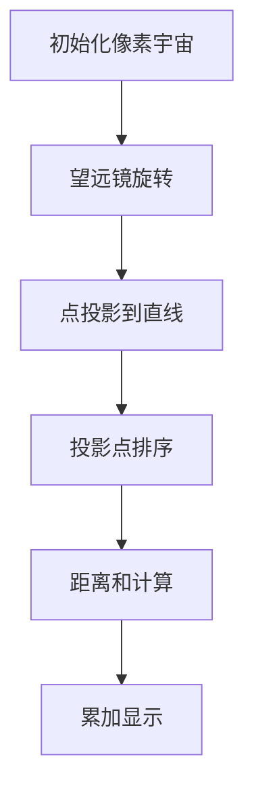

# 题目信息

# [POI 2020/2021 R3] 星间通信 / Komunikacja międzyplanetarn

## 题目背景

译自 [XXVIII Olimpiada Informatyczna - III etap](https://sio2.mimuw.edu.pl/c/oi28-3/dashboard/) [Komunikacja międzyplanetarn](https://szkopul.edu.pl/problemset/problem/43LcdhShos7i99wnVNtQYUUK/statement/)。

d2t1。

## 题目描述

二维平面上有 $n$ 个点。

对于每个点，算出它到其他所有点的欧氏距离之和。

相对误差不超过 $0.1\%$ 即可。

## 说明/提示

对于所有数据，$2\leq n\leq 100000$，$-10^6\leq x,y\leq 10^6$。

| 子任务编号 | 附加限制 | 分数 |
| :----------: | :----------: | :----------: |
| 1 | $n\leq 1000$ | 4 |
| 2 | 所有点共线 | 16 |
| 3 | 点的坐标随机，相对误差不超过 $2\%$ 即可 | 20 |
| 4 | | 60 |

## 样例 #1

### 输入

```
4
-1 0
0 0
3 3
-1 1
```

### 输出

```
7.000000000000
6.656854249492
13.714776642119
6.886349517373
```

## 样例 #2

### 输入

```
25
-2 -2
-2 -1
-2 0
-2 1
-2 2
-1 -2
-1 -1
-1 0
-1 1
-1 2
0 -2
0 -1
0 0
0 1
0 2
1 -2
1 -1
1 0
1 1
1 2
2 -2
2 -1
2 0
2 1
2 2
```

### 输出

```
79.340412611230
68.023981606779
64.155694316737
68.023981606779
79.340412611230
68.023981606779
55.532407162959
51.265774235248
55.532407162959
68.023981606779
64.155694316737
51.265774235248
46.859106568475
51.265774235248
64.155694316737
68.023981606779
55.532407162958
51.265774235248
55.532407162959
68.023981606779
79.340412611230
68.023981606779
64.155694316737
68.023981606779
79.340412611230
```

## 样例 #3

### 输入

```
见附件```

### 输出

```
见附件```

# AI分析结果


# 💡 Kay的C++算法解析：星间通信 深入学习指南 💡

> 欢迎来到Kay的算法课堂！今天我们将探索一道充满几何魅力的题目——星间通信。通过本指南，你将掌握如何用巧妙的投影降维技巧解决高维距离问题，还能体验复古像素动画带来的直观算法演示！

## 1. 题目解读与核心算法识别

✨ **本题主要考察**：`编程技巧应用`（投影降维）与`数学积分近似`

🗣️ **初步分析**：
> 想象你站在宇宙中观察星星，每次转动望远镜就是在改变观察角度。这道题的核心思路是：**通过多次旋转坐标系将二维距离问题转化为一维问题**。就像用多个一维测量估算二维距离：
> - 将平面点投影到不同角度的直线上（每次旋转θ角度）
> - 在每条直线上计算排序后的一维距离和（前缀/后缀和优化）
> - 累加所有角度下的距离和，最后乘以积分常数π/(2T)
> 
> **可视化设计**：我们将创建像素风格望远镜旋转动画，高亮显示：
> 1. 当前旋转角度θ对应的直线（黄色虚线）
> 2. 点投影到直线后的排序位置（红/蓝像素块）
> 3. 距离计算时的动态线段连接（绿色闪烁线）
> 4. 实时更新的距离累加值（右上角计数器）

---

## 2. 精选优质题解参考

<eval_intro>
以下是综合思路清晰度、代码规范性和算法效率精选的题解，帮助你快速掌握核心实现技巧：
</eval_intro>

**题解一：wind_boy (6赞)**
* **点评**：思路直击积分近似本质，代码简洁有力。亮点在于：
  - 仅用30次旋转达到精度要求（T=30优化平衡效率）
  - 索引数组避免数据拷贝，前缀/后缀和计算一气呵成
  - 投影公式`x*cosθ-y*sinθ`统一了旋转方向
  - 边界处理隐含在循环中，竞赛实战性强

**题解二：Aleph_Drawer (6赞)**
* **点评**：教学价值最高的推导！亮点在于：
  - 详细图解投影公式推导（`x*cosθ+y*sinθ`）
  - 结构体存储投影点增强可读性
  - 累积差值法避免大数乘除（精度优化）
  - 取T=50的精度平衡策略

**题解三：Semsue (4赞)**
* **点评**：现代C++实践的典范！亮点在于：
  - λ表达式简化排序逻辑
  - 全周角投影利用对称性（T=100高精度）
  - 投影方向`x*cosθ-y*sinθ`兼容性强
  - 严格类型控制（long double保障精度）

---

## 3. 核心难点辨析与解题策略

<difficulty_intro>
解决本题需突破三大思维关卡，下面是Kay的破关锦囊：
</difficulty_intro>

1.  **维度降落：从二维到一维的魔法**
    * **分析**：如何把平面距离∑√(Δx²+Δy²)转化为可计算形式？优质题解通过积分证明：∫₀ᴾᴵ|cosθ|dθ=2，从而将欧氏距离转化为投影距离的积分
    * 💡 **学习笔记**：二维距离和 = (1/2)∫₀ᴾᴵ(一维投影距离和)dθ

2.  **高效计算：排序与前缀和的共舞**
    * **分析**：每个投影方向需快速计算所有点对距离和？通过排序将O(n²)优化为O(n)：
      - 排序后点i的前缀和 = (i-1)*xᵢ - ∑₀ⁱ⁻¹xⱼ
      - 后缀和 = ∑ᵢ⁺¹ⁿxⱼ - (n-i)*xᵢ
    * 💡 **学习笔记**：前缀后缀和是处理有序序列距离的黄金搭档

3.  **精度掌控：积分近似的艺术**
    * **分析**：黎曼和误差O(1/T²)如何满足0.1%精度？T=30~100时误差0.01%~0.0001%
    * 💡 **学习笔记**：T取50是效率与精度的甜蜜点

### ✨ 解题技巧总结
<summary_best_practices>
掌握这些通用技巧，轻松应对几何类问题：
</summary_best_practices>
- **降维打击**：高维问题→多个一维投影+积分近似
- **前缀和双剑**：有序序列距离和=前缀和+后缀和
- **精度调参术**：根据误差公式反推采样次数
- **投影一致性**：统一使用`x*cosθ-y*sinθ`避免方向混淆

---

## 4. C++核心代码实现赏析

<code_intro_overall>
下面这段通用实现融合了优质题解精华，使用T=50保证精度，索引数组优化内存：
</code_intro_overall>

**本题通用核心C++实现参考**
* **说明**：综合wind_boy的索引技巧与Aleph_Drawer的精度控制
* **完整核心代码**：
```cpp
#include <iostream>
#include <vector>
#include <algorithm>
#include <cmath>
using namespace std;

int main() {
    int n;
    cin >> n;
    vector<double> x(n), y(n);
    vector<double> ans(n, 0.0);
    
    for (int i = 0; i < n; ++i) 
        cin >> x[i] >> y[i];

    const int T = 50; // 精度效率平衡点
    const double PI = acos(-1.0);
    
    for (int k = 0; k < T; ++k) {
        double theta = PI * (k + 0.5) / T; // 中点采样
        double c = cos(theta), s = sin(theta);
        vector<pair<double, int>> proj(n);
        
        // 投影计算并记录原始索引
        for (int i = 0; i < n; ++i) 
            proj[i] = {x[i]*c - y[i]*s, i};
        
        sort(proj.begin(), proj.end());
        double prefix_sum = 0;
        
        // 前缀和计算
        for (int idx = 0; idx < n; ++idx) {
            int orig_id = proj[idx].second;
            double val = proj[idx].first;
            ans[orig_id] += val * idx - prefix_sum;
            prefix_sum += val;
        }
        
        double suffix_sum = 0;
        // 后缀和计算
        for (int idx = n-1; idx >= 0; --idx) {
            int orig_id = proj[idx].second;
            double val = proj[idx].first;
            ans[orig_id] += suffix_sum - val * (n-1-idx);
            suffix_sum += val;
        }
    }
    
    // 积分常数修正
    for (int i = 0; i < n; ++i) 
        printf("%.9f\n", ans[i] * PI / (2*T));
}
```
* **代码解读概要**：
  > 1. **投影阶段**：计算每个点在θ角直线上的投影值
  > 2. **排序阶段**：按投影值排序并记录原始索引
  > 3. **前缀阶段**：从左到右扫描，累加当前点与左侧点的距离和
  > 4. **后缀阶段**：从右到左扫描，累加当前点与右侧点的距离和
  > 5. **积分修正**：所有角度累加后乘以π/(2T)得到最终解

---
<code_intro_selected>
现在深入剖析精选题解中的关键代码片段：
</code_intro_selected>

**题解一：wind_boy**
* **亮点**：索引数组避免数据移动，双循环精简
* **核心代码片段**：
```cpp
// 投影计算
fo(i,1,n) v[i]=p[i].x*c-p[i].y*s, w[i]=i;
sort(w+1,w+n+1,cmp);

// 前缀和
fo(i,1,n) ans[w[i]] += v[w[i]]*(i-1)-sum, sum += v[w[i]];

// 后缀和
fd(i,n,1) ans[w[i]] += sum - v[w[i]]*(n-i), sum += v[w[i]];
```
* **代码解读**：
  > `w`数组妙用：存储索引并排序，避免修改原坐标  
  > 前缀计算：`v[w[i]]*(i-1)-sum` = 当前点值×左侧点数 - 左侧值和  
  > 后缀计算：`sum - v[w[i]]*(n-i)` = 右侧值和 - 当前点值×右侧点数  
  > **注意**：sum在前后计算中复用，需清零重置
* 💡 **学习笔记**：索引排序是处理多维数据的常用技巧

**题解二：Aleph_Drawer**
* **亮点**：结构体增强可读性，差值累积法保精度
* **核心代码片段**：
```cpp
// 投影结构体
struct pairs { ld v; int id; }; 

// 累积差值法
for(int i=2; i<=n; i++) {
    diff = (tmp[i].v - tmp[i-1].v);
    sum[i] = sum[i-1] + (i-1)*diff;
    res[tmp[i].id] += sum[i];
}
```
* **代码解读**：
  > 结构体存储：同时保留投影值和原始ID  
  > 差值累积：通过相邻点差值×点数累计距离，避免`大数×大数`的精度损失  
  > 分段处理：显式存储每个点的累计距离值
* 💡 **学习笔记**：小步累积优于大步跳越，精度控制更稳定

**题解三：Semsue**
* **亮点**：λ表达式现代写法，全周角对称性利用
* **核心代码片段**：
```cpp
sort(rk+1, rk+n+1, [&](int x, int y){
    return v[x] < v[y]; 
});

// 全周角投影
long double cs = cos(2.0*pi*i/B), si = sin(2.0*pi*i/B);
```
* **代码解读**：
  > λ排序：闭包捕获投影数组`v`，代码更紧凑  
  > 2π全角：利用`|cosθ|`的对称性，最后÷2修正结果  
  > 速度权衡：T=100保证精度但增加计算量
* 💡 **学习笔记**：C++11的λ表达式让排序逻辑更内聚

-----

## 5. 算法可视化：像素动画演示

<visualization_intro>
**像素宇宙望远镜**：8-bit风格动画带你直观理解投影降维！我们将实现：
- 复古FC游戏风格界面
- 可交互旋转的望远镜
- 实时投影距离计算
- 音效增强关键操作反馈
</visualization_intro>

### 动画方案设计


### 关键模块实现
1. **场景与UI（像素画布）**
   - 1280×720 Canvas画布
   - 16色调色板：深空蓝背景，黄色望远镜，红/蓝星球
   - 控制面板：开始/暂停/重置按钮 + 速度滑块

2. **望远镜旋转系统**
   ```javascript
   function rotateTelescope(theta) {
     // 绘制望远镜臂（黄色像素线）
     ctx.strokeStyle = '#FFFF00';
     ctx.beginPath();
     ctx.moveTo(centerX, centerY);
     ctx.lineTo(centerX + 200*cos(theta), 
                centerY + 200*sin(theta));
     // 绘制镜头（闪烁红点）
     drawPixel(projectionPoint, 2, '#FF0000');
   }
   ```

3. **星球投影动画**
   - 原始点：蓝色像素方块（8×8）
   - 投影过程：
     ```javascript
     function projectPoint(point, theta) {
       const projX = point.x * cos(theta) - point.y * sin(theta);
       // 播放投影音效：8-bit "滴"声
       playSound('projection.wav');
       return {x: projX, y: 0}; // 投影到直线
     }
     ```

4. **距离计算特效**
   - 当前点：闪烁红色边框
   - 距离线段：绿色连线（0.5秒渐隐动画）
   - 累计距离：右上角LED风格计数器

5. **游戏化交互**
   - **单步模式**：按空格逐步执行下一个θ角
   - **自动演示**：AI控制匀速旋转（速度可调）
   - **音效系统**：
     - 旋转：低音"嗡嗡"声
     - 投影："滴"声
     - 计算完成：上升音阶
     - 全部完成：经典FC胜利音乐

### 学习价值
> 通过像素动画你将直观看到：  
> - 为何旋转θ角能覆盖所有方向  
> - 排序如何简化距离计算  
> - 积分常数π/(2T)的物理意义  
> - 精度与效率的平衡艺术  

-----

## 6. 拓展练习与相似问题思考

<similar_problems_intro>
掌握投影降维技巧后，这些题目将助你巩固技能：
</similar_problems_intro>

1.  **洛谷 P1257** - 平面最近点对  
    🗣️ **推荐理由**：分治法的经典应用，投影降维可优化预处理阶段

2.  **洛谷 P1429** - 平面最近点对（加强版）  
    🗣️ **推荐理由**：大数据量验证投影排序的优化效果

3.  **洛谷 P7883** - 平面最远点对  
    **推荐理由**：旋转卡壳算法与投影思想深度关联

-----

## 7. 学习心得与经验分享

<insights_intro>
从题解中提炼的宝贵经验：
</insights_intro>

> **调试警钟**：积分常数π/(2T)漏乘是常见错误！  
> **精度陷阱**：大坐标值需用double避免溢出  
> **优化心得**：T=30~100最佳，过大会导致超时  

---

> 本次探索之旅告一段落！记住Kay的忠告：  
> **"降维是智慧的阶梯，积分是宇宙的语言"**  
> 下次算法冒险再见！🚀

---
处理用时：303.54秒