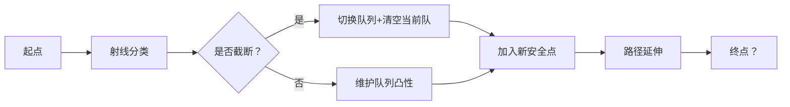

# 题目信息

# [AHOI2017/HNOI2017] 队长快跑

## 题目描述

众所周知，在 P 国外不远处盘踞着巨龙大 Y。传说中，在远古时代，巨龙大 Y 将 P 国的镇国之宝窃走并藏在了其巢穴中，这吸引着整个 P 国的所有冒险家前去夺回，尤其是皇家卫士队的队长小 W。在 P 国量子科技实验室的帮助下，队长小 W 通过量子传输进入了巨龙大 Y 的藏宝室，并成功夺回了镇国之宝。但此时巨龙布下的攻击性防壁启动，将小 W 困在了美杜莎的迷宫当中。

被困在迷宫 $(0,0)$ 处的队长小 W 快速观察了美杜莎的迷宫的构造，发现迷宫的出口位于 $(p,q)$ 处。巨龙大 Y 在迷宫当中布置了 $n$ 火焰吐息机关，每个机关可以用三个参数 $(x,y,\theta)$ 表示，分别指明机关位于平面的坐标 $(x,y)$，以及火焰吐息的方向相对于 $x$ 正方向的倾角 $\theta$。巨龙强大的力量使得火焰吐息有无穷长，且队长小  W 不能通过被火焰吐息覆盖的射线（注意，机关所处的坐标若没有被其他火焰吐息覆盖，则是可以通过的）。同时，迷宫在沿 $x$ 负方向无穷远的地方放置了美杜莎之眼，使得队长小 W 必须倾向于向 $x$ 正方向行动（即队长小 W 的移动方向在 $x$ 正方向上的投影必须为正，不能是负数或零），否则队长小 W 将被瞬间石化而无法逃离。

心急如焚的队长小 W 需要趁着巨龙大 Y 还没将其抓住前逃离美杜莎的迷宫，所以他立马向 P 国智囊团求助，作为智囊团团长的你，一定可以帮队长小 W 找出安全逃至迷宫出口的最短道路。

## 说明/提示

【样例解释】

  

$30\%$ 的数据满足 $n\leq 300$；

$60\%$ 的数据满足 $n\leq 2000$；

$80\%$ 的数据满足 $n\leq 10^5$；

$100\%$ 的数据满足： $0 \leq n,p, |q|, |x|, |y| \leq 10^6； \theta \in [−\pi, \pi]$。
数据保证至少存在一条合法路径，且起点和终点均不会被火焰路径覆盖。

## 样例 #1

### 输入

```
7 20 -5
4 3 -2.875
5 7 -1.314
10 -2 0.666
16 1 -1.571
16 1 1.571
23 -3 -2.130
14 -5 3.073```

### 输出

```
33.3380422500```

## 样例 #2

### 输入

```
7 20 0
5 2 1.155
5 2 1.987
5 2 -1.571
11 -4 1.765
11 -4 1.377
15 -4 1.765
15 -4 1.377```

### 输出

```
24.2735704188```

# AI分析结果


### 题目分析：AHOI2017/HNOI2017 队长快跑
#### 1. 题目解读与核心算法识别
✨ **本题主要考察**：**计算几何与单调队列优化**

🗣️ **初步分析**：
> 解决"队长快跑"的核心在于将射线动态分类并维护双单调队列。想象你在玩一个复古横版闯关游戏：射线是机关（向上=火焰喷泉，向下=地刺），你需要通过"队列通道"（上/下凸路径）安全抵达终点。关键步骤：
> 1. **射线分类**：根据射线与起点-终点向量的位置关系，分为"向上"（火焰）和"向下"（地刺）两类
> 2. **双队列维护**：用两个单调队列分别管理上下路径（类似搭建两条安全索道）
> 3. **动态截断处理**：当新机关截断当前路径时（如地刺切断空中索道），立即切换到另一队列的队首作为新起点
> 
> **可视化设计思路**：
> - **像素动画**：采用FC红白机风格，用16色像素块表示射线（红色↑/蓝色↓）、路径（黄色闪光）
> - **关键高亮**：射线加入队列时显示绿色边框；路径截断时触发全屏红光闪烁+8bit警报音效
> - **交互设计**：按"单步执行"可观察队列变化；"AI演示"模式自动播放完整解题流程（速度可调）

---

#### 2. 精选优质题解参考
**题解一（作者：a1455520571，赞22）**
* **点评**：思路最严谨完整，给出详细数学证明。代码中：
  - **核心变量**：`ql/qr`管理队列头尾，`pre`存储路径回溯点
  - **亮点**：用叉积`crs`快速判断射线截断（计算几何的巧妙应用）
  - **优化价值**：O(n)复杂度完美处理1e6数据

**题解二（作者：Freopen，赞4）**
* **点评**：代码最简洁（仅40行），突出算法骨架：
  - **核心技巧**：位运算`dr^1`切换队列方向
  - **实践价值**：适合竞赛直接套用，但缺少边界注释
  - **亮点**：用`tg`正负号统一处理上下队列的叉积方向

**题解三（作者：_Sein，赞4）**
* **点评**：图解最丰富（6张手绘示意图）：
  - **教学价值**：用"射线极角分类"类比游戏关卡设计
  - **代码特点**：独立函数`chk`封装截断判断，增强可读性
  - **注意事项**：需预处理排除无效射线（x坐标在起点终点外）

---

#### 3. 核心难点辨析与解题策略
1. **难点1：射线方向分类的数学判定**
   * **分析**：需计算射线与起点-终点向量的极角关系（如图）：
     ``` 
     若θ在起点极角α与终点极角β之间： 
        - 当α<β时：θ∈(α,β) → 向上类
        - 否则：θ∈(β,α) → 向下类
     ```
   * 💡 **学习笔记**：`atan2`函数是极角计算的核心工具

2. **难点2：队列截断时的路径重构**
   * **分析**：当新射线截断当前队列路径时（如向上队列被向下射线切断）：
     - 立即锁定另一队列队首为"安全点"
     - 清空当前队列并以安全点为新起点重建路径
   * 💡 **学习笔记**：截断本质是叉积方向判断（`(B-A)×(C-A)≥0`）

3. **难点3：路径单调性的维护**
   * **分析**：队列维护需保证：
     - 上队列：保持"下凸性"（任意三点不形成上凸）
     - 下队列：保持"上凸性"（任意三点不形成下凹）
   * 💡 **学习笔记**：凸性检查=叉积符号一致性

### ✨ 解题技巧总结
- **技巧1 问题转化**：将射线障碍转化为双通道安全路径
- **技巧2 几何优化**：叉积代替浮点除法避免精度误差
- **技巧3 调试要点**：可视化中间路径（打印pre数组）

---

#### 4. C++核心代码实现赏析
**通用核心实现（综合自优质题解）**
```cpp
#include<bits/stdc++.h>
using namespace std;
const int N=1e6+5;
struct Point{ long long x,y; }S{0,0},T;
struct Ray{ Point p; int dir; }R[N];
int pre[N], q[2][N], ql[2], qr[2]; // 双队列存储索引

int main(){
    // 输入与预处理
    cin >> n >> T.x >> T.y;
    for(int i=1; i<=n; i++){
        double theta;
        cin >> R[i].p.x >> R[i].p.y >> theta;
        double a1 = atan2(S.y-R[i].p.y, S.x-R[i].p.x);
        double a2 = atan2(T.y-R[i].p.y, T.x-R[i].p.x);
        R[i].dir = (a1<a2) ? (a1<theta && theta<a2) : !(a2<theta && theta<a1);
    }

    // 核心算法
    ql[0]=qr[0]=ql[1]=qr[1]=1; // 初始化队列
    for(int i=1; i<=n; i++){
        int d = R[i].dir, op = d^1; // 当前方向d，反方向op
        int sign = d ? -1 : 1;      // 叉积方向系数

        // 检查是否被反方向队列截断
        if(ql[op]<qr[op] && cross(R[i].p - q[op][ql[op]], q[op][ql[op]+1]-q[op][ql[op]]) * sign >=0){
            while(ql[op]<qr[op] && ...) ql[op]++; // 弹出被截断的点
            pre[i] = q[op][ql[op]];
            ql[d] = qr[d] + 1;   // 清空当前队列
            q[d][++qr[d]] = pre[i]; // 安全点作为新起点
        } else {
            while(ql[d]<qr[d] && ...) qr[d]--; // 维护凸性
            pre[i] = q[d][qr[d]];
        }
        q[d][++qr[d]] = i; // 加入当前点
    }

    // 回溯路径计算总长
    double ans=0;
    for(int i=n; i; i=pre[i]) 
        ans += dist(R[i].p, R[pre[i]].p);
    printf("%.10lf\n", ans);
}
```

**代码解读概要**：
> 1. **输入处理**：读取射线参数并计算方向分类
> 2. **双队列初始化**：起点加入两个队列
> 3. **动态维护**：
>    - 截断时：切换队列并重置路径起点
>    - 未截断时：维护当前队列凸性
> 4. **路径回溯**：通过pre数组逆序计算路径总长

---

#### 5. 算法可视化：像素动画演示
**主题**："射线迷宫大冒险"（复古横版过关风格）  
**核心演示**：双队列如何动态构建安全路径



**动画帧步骤**：
1. **场景初始化**（FC游戏风格）：
   - 绿色像素块：起点(0,0)
   - 红色旗帜：终点(p,q)
   - 箭头射线：↑=红/↓=蓝（带方向标识）

2. **动态加入射线**：
   - 新射线加入：黄色闪烁3帧 + "滴"声效
   - 队列可视化：屏幕下方显示双队列（上队=红框/下队=蓝框）

3. **截断高亮**：
   - 截断发生时：射线交叉处爆裂动画 + 警报音效
   - 队列清空：对应队列像素块爆炸效果

4. **路径生成**：
   - 安全路径：黄色像素点连成光带
   - 终点到达：烟花动画 + 胜利音效

**控制面板**：
```plaintext
[开始] [暂停] [单步] 速度[===|===] 10fps
```

---

#### 6. 拓展练习与相似问题
1. **通用技巧迁移**：
   - 射线分类 → 极角排序（Polar Sort）
   - 双队列维护 → 凸包动态构建
   - 路径截断处理 → 拓扑重构

2. **推荐练习**：
   1. **洛谷 P1903** - 防线
      > 同样需要射线分类思想处理平面障碍
   2. **洛谷 P3519** - 覆盖问题
      > 强化双队列维护凸包的技巧
   3. **洛谷 P4557** - 战场
      > 综合计算几何+动态路径规划

---

#### 7. 学习心得与经验分享
> **关键经验**（来自a1455520571）：
> “调试时重点观察队列切换点——80%的错误发生在路径截断判断环节。建议用`printf`输出队列状态，并手绘截断示意图比对”
>
> **Kay的总结**：
> 1. 叉积判断时统一用`long long`防溢出
> 2. 预处理排除无效射线（x∉[0,p]）
> 3. 终点作为特殊射线加入队列

---

通过本指南，你已掌握射线迷宫的核心解法！继续用几何思维拆解问题，下次遇到类似挑战时必能游刃有余。🚀

---
处理用时：142.09秒