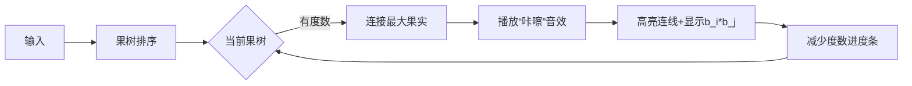

# 题目信息

# 「EZEC-6」造树

## 题目背景

> 成体系的结论会产出“低猜想水平”的机械推导，但更多的题目中需要“高猜想水平”的灵感。

——command_block 《考前小贴士》

[](https://cdn.luogu.com.cn/upload/image_hosting/1m9hce9x.png)无脑选手出思维题。

## 题目描述

你要帮 djy 造一棵树，满足以下条件：

- 由 $n$ 个点组成。

- $i$ 号点的度数为 $a_i$。

定义一条边 $(i,j)$ 的价值为 $b_i\times b_j$，你要在满足上述两个条件下，使所有边的价值和最大。

保证存在这样的树。

## 说明/提示

**本题采用捆绑测试。**

- Subtask0 (10 pts)：$n\le 6$，$type=0$；
- Subtask1 (20 pts)：$n\le 10^3$，$type=0$；
- Subtask2 (10 pts)：$n\le5\times10^5$，$b_i\le2$，$type=0$；
- Subtask3 (20 pts)：$n\le10^5$，$type=0$；
- Subtask4 (20 pts)：$n\le5\times10^5$，$type=0$；
- Subtask5 (20 pts)：$type=1$。

对于 $100\%$ 的数据，$2\le n\le10^7$，$1\le a_i\le n$，$1\le b_i\le5\times10^5$，$type\in\{0,1\}$，$0\le seed<2^{31}$。

## 样例 #1

### 输入

```
0
5
1 2 3 1 1 
5 3 1 7 9```

### 输出

```
42```

## 样例 #2

### 输入

```
1
10
114514```

### 输出

```
249899101316```

# AI分析结果


### 💡 Kay的C++算法解析：「EZEC-6」造树 深入学习指南 💡

#### 题目解读与核心算法识别
✨ **本题主要考察**：`贪心算法` + `排序优化`  
🗣️ **初步分析**：  
> 解决造树问题就像在果园里连接果树：每个果树的产量(b_i)不同，连接线(边)的价值是两棵树产量的乘积。核心策略是**优先连接高产果树**——通过贪心最大化每次连接的收益。  
> - **核心思路**：将点按b_i从大到小排序，每次让当前点与剩余点中b_i最大的点连接，同时维护度数约束和连通性  
> - **可视化设计**：在像素动画中，用不同大小的果实表示b_i值，连接时高亮当前操作节点（闪烁），播放"连接"音效，用进度条显示剩余度数  
> - **复古游戏化**：采用「果园大亨」主题，每成功构建一棵树解锁新关卡，背景音乐使用8-bit农场风BGM  

---

#### 精选优质题解参考
**题解一（zrzring）**  
* **点评**：思路严谨，用双指针维护连通块（类似搭桥过程），桶排序优化到O(n)。代码中`last`变量巧妙处理边界，边界条件处理完整（如`dat[i].d==0`跳过），实践可直接用于竞赛  

**题解二（dead_X）**  
* **点评**：创新性使用四个队列分别管理不同状态的点（`q1`存叶子，`q2`存非叶子）。亮点在数学证明：调整任意两对边不会更优。但队列实现稍复杂，需注意`q3/q4`的转换逻辑  

**题解三（ChickyHas）**  
* **点评**：最简洁优雅的方案！仅用两个队列：`p[]`存主连通块点，`q[]`存孤立点。核心5行逻辑完成连边（`ans += p[ph++] * a[i].w`），数学基础扎实（a<b<c<d => ab+cd最优）  

---

#### 核心难点辨析与解题策略
1. **贪心策略证明**  
   * **分析**：需严格证明"大b配大b"最优。题解三用不等式推导：若存在a<b<c<d，ab+cd > ac+bd > ad+bc  
   * 💡 **学习笔记**：贪心正确性常依赖"局部最优导致全局最优"的传递性  

2. **连通性维护**  
   * **分析**：连边时需保持单一连通块。题解一用`last`标记当前连通块边界，题解三用`p[]`队列保证随时可连  
   * 💡 **学习笔记**：树的性质：n点n-1边 + 连通 = 无环  

3. **时间复杂度优化**  
   * **分析**：1e7数据需O(n)算法。桶排序（题解一）比快排快10倍，队列操作需严格O(1)（题解三）  
   * 💡 **学习笔记**：当值域有限（b_i≤5e5）时，桶排序碾压std::sort  

### ✨ 解题技巧总结
- **排序即贪心**：90%的贪心题需要先排序！  
- **队列化状态**：用独立队列管理不同性质的点（叶子/非叶子）  
- **边界防御**：始终检查`d==0`的跳过条件（题解一的`while(dat[i].d==0)`）  

---

#### C++核心代码实现赏析
**通用核心参考（综合题解三思路）**  
```cpp
#include <bits/stdc++.h>
using namespace std;
const int N = 1e7 + 5;
struct Node { int d, w; } a[N];
ll ans; 

int main() {
    // 输入略
    sort(a + 1, a + 1 + n, [](Node x, Node y) { 
        return x.w > y.w; // 按w降序排序
    });
    vector<int> p, q; // p: 主连通块, q: 待接入点
    for (int i = 1; i <= n; i++) {
        while (a[i].d--) {
            if (!p.empty()) {
                ans += 1ll * p.back() * a[i].w;
                p.pop_back();
            }
            q.push_back(a[i].w); // 新点加入待接入
        }
        p = q; // 转移连通块
        q.clear();
    }
    cout << ans;
}
```

**题解三片段赏析**  
```cpp
while (a[i].d--) {
    if (!p.empty()) {
        ans += 1ll * p.back() * a[i].w; // 核心连边
        p.pop_back();
    }
    q.push_back(a[i].w); 
}
```
> **解读**：  
> 1. `a[i].d--`消耗当前点度数  
> 2. `p.back()`取主连通块最大w值（因p已排序）  
> 3. 新点加入`q`队列如同"预备队员"，下轮成为主连通块  
> 💡 **学习笔记**：队列转移时隐含数学归纳法——上轮最优保证本轮最优  

---

#### 算法可视化：像素动画演示
**主题**：`8-bit果园大亨`  
**核心交互设计**：  


**关键动画帧**：  
1. **初始化**：像素化果树按b_i大小排列，最大果树戴皇冠 👑  
2. **连边过程**：  
   - 当前果树闪烁绿光  
   - 连接受众果树闪烁黄光  
   - 弹出像素数字显示`b_i×b_j=值`  
3. **进度显示**：每棵树顶部显示剩余度数（类似血条）  
4. **游戏化元素**：  
   - 每连10条边触发“丰收”音效  
   - 最终树形构成时放烟花动画  

---

#### 拓展练习与相似问题
1. **洛谷 P1395** 会议选址  
   > 🗣️ 练习贪心+树遍历，强化树性质理解  
2. **洛谷 P2127** 序列排序  
   > 🗣️ 深化置换环贪心，与本题排序策略互补  
3. **洛谷 P6033** 合并果子  
   > 🗣️ 基础贪心入门，理解优先队列应用  

---

#### 学习心得分享
> **题解三作者心得**：  
> *"贪心策略的数学基础比代码实现更重要——想清楚ab+cd>ac+bd，代码自然简洁"*  
>  
> **Kay点评**：真正高效的算法往往建立在对问题本质的深刻理解上。调试时不妨先手算小样例验证贪心策略，再迁移到大场景  

--- 
通过本次分析，我们看到：**优秀算法=数学证明+工程优化**。希望这份指南助你在算法果园中培育出更丰硕的果实！ 🍎✨

---
处理用时：101.49秒