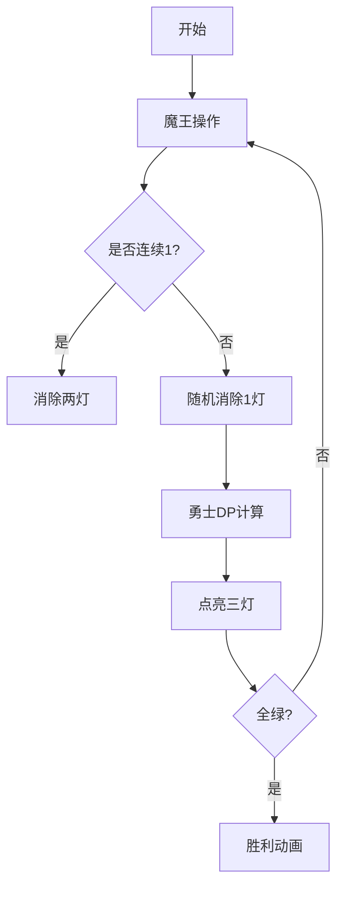

# 题目信息

# 「SFCOI-3」进行一个魔的除 I

## 题目背景

终于，勇士打败了魔王，他把走投无路的魔王困在了一个房间里。

魔王拥有在黑暗中随意穿行的能力，所以勇士只有把房间里所有的灯全部打开，才能找到魔王，最终彻底消灭他。

## 题目描述

房间中共有 $n$ 盏灯，初始状态可以用 $a_1\dots a_n$ 表示，其中 $\tt 0$ 表示这盏灯初始是关闭的，$\tt 1$ 表示这盏灯初始是打开的。

从第一天早晨开始，魔王与勇士轮流行动：

- 每天早晨，魔王可以选择 **连续的** 两盏灯，将它们的状态全部设定为 $\tt 0$；
- 每天晚上，勇士可以选择 **任意的** 至多三盏灯，将它们的状态全部设定为 $\tt 1$。

每次行动时选择的灯在设定前的状态任意。

假设双方均采用最优策略，不会进行任何不利于自己的行动。勇士想知道，**最少** 需要多少天（也即，他最少需要多少次操作）才能将所有灯状态设定为 $\tt 1$——这样，他才能抓到可恶的魔王，迎娶美丽的公主。

## 说明/提示

### 样例解释 1

+ 第一天早晨，魔王关闭第 $1{,}2$ 两盏灯；
+ 第一天晚上，勇士打开 $1{,}2{,}4$ 三盏灯。

### 样例解释 2

+ 第一天早晨，魔王关闭第 $4{,}5$ 两盏灯；
+ 第一天晚上，勇士打开 $2{,}3{,}4$ 三盏灯。
+ 第二天早晨，魔王关闭第 $1{,}2$ 两盏灯；
+ 第二天晚上，勇士打开 $1{,}2{,}5$ 三盏灯。

### 数据规模与约定

**本题采用捆绑测试**。

- Subtask 0（10 points）：$n \leq 10$，$T \leq 2046$。
- Subtask 1（30 points）：$ n \leq 2000$。
- Subtask 2（10 points）：初始所有灯都是关闭的。 
- Subtask 3（20 points）：数据随机生成。
- Subtask 4（30 points）：无特殊限制。

对于所有数据，$1 \leq T \leq 10^6$，$1 \leq n \leq 10^6$，$1 \leq \sum n \leq 3 \times 10^6$。

## 样例 #1

### 输入

```
4
5
1 0 1 0 1
5
1 0 0 1 1
9
0 0 0 0 0 0 0 0 0
13
0 1 0 0 1 0 1 0 0 0 0 0 0
```

### 输出

```
1
2
5
8```

# AI分析结果


### 💡 Kay的C++算法解析：「SFCOI-3」进行一个魔的除 I 深入学习指南 💡

#### 1. 题目解读与核心算法识别
✨ **本题主要考察**：`贪心策略` + `博弈模拟`（编程技巧应用）

🗣️ **初步分析**：
> 这道题就像一场「光明与黑暗的棋盘博弈」。魔王（黑暗方）每次能消除相邻的两个光明点（设为0），勇士（光明方）每次能点亮三个黑暗点（设为1）。勇士要在魔王的干扰下用最少回合点亮所有灯。

- **核心思路**：通过贪心模拟双方最优操作。魔王优先消除连续1（最大化阻碍），勇士则在不连续位置点亮1（避免被一次性消除）。通过动态规划计算勇士能安全放置的1的数量。
- **算法流程**：  
  1. **A段**：魔王消除所有连续1（如`11→00`）  
  2. **B段**：勇士在安全位置（不连续）点亮尽可能多的1  
  3. **C段**：处理剩余孤立灯  
- **可视化设计**：  
  用像素网格表示灯（绿=1，红=0）。魔王操作时高亮连续两格变红+低沉音效；勇士操作时三格变绿+清脆音效。关键显示DP计算的安全位置（蓝色边框）。

---

#### 2. 精选优质题解参考
**题解一（作者：sail_with_pleasure）**
* **点评**：思路最清晰完整，将过程分为A/B/C三段。代码规范（`cntA`、`cntB`等变量名明确），用DP计算安全位置高效合理。边界处理严谨（如`pan()`函数处理特殊情况），可直接用于竞赛。亮点是分段策略和DP优化。

**题解二（作者：irris）**
* **点评**：沿用三段式但增加详细特判（如全0序列）。提供对拍器增强可靠性，代码用`std::max_element`等标准库函数提升可读性。亮点是边界情况全覆盖和实用调试工具。

**题解三（作者：accgj_）**
* **点评**：创新提出"好1/坏1"概念优化贪心策略。代码用递归处理特殊情况，逻辑完整但稍复杂。亮点是引入奇偶性分析提升策略效率。

---

#### 3. 核心难点辨析与解题策略
1. **难点1：模拟魔王最优消除**  
   *分析*：魔王需最大化阻碍，优先消除连续1。但若初始无连续1（如`010`），需选择使勇士后续操作更难的位置。  
   *解法*：贪心扫描初始序列，立即消除所有`11`对（A段），并记录消除对数`cntA`。

2. **难点2：勇士安全布灯策略**  
   *分析*：勇士需在不连续位置放1避免被魔王一次性消除，相当于求最大独立集。  
   *解法*：用DP计算：  
   ```cpp
   dp[i] = max(dp[i-2], dp[i-3]) + (a[i]可放灯)
   ```

3. **难点3：特殊序列处理**  
   *分析*：全0序列或孤立1序列（如`0100010`）需额外回合。  
   *解法*：特判全0时首轮点亮三盏；孤立1序列根据奇偶性判断是否增加模拟轮次。

💡 **解题技巧总结**  
- **贪心分解**：将过程分为魔王消除/勇士填充/收尾三阶段  
- **DP预判**：用DP提前计算勇士最大安全操作空间  
- **边界攻防**：全零序列先手布三灯，孤立1序列检查奇偶性  

---

#### 4. C++核心代码实现赏析
**通用核心实现参考**  
*说明*：综合自优质题解，体现三段式贪心+DP的核心思路
```cpp
#include<bits/stdc++.h>
using namespace std;
const int N=1e6+5;

int solve(){
    int n, cnt=0, cntA=0, cntB=0;
    vector<int> a(n+2), dp(n+2);
    // 输入并统计初始1的数量cnt
    for(int i=1; i<=n; i++) cnt += a[i];

    // A段：魔王消除连续1
    for(int i=1; i<n; i++) 
        if(a[i] && a[i+1]) 
            a[i]=a[i+1]=0, cntA++;

    // B段：DP计算勇士安全布灯数
    for(int i=1; i<=n; i++) {
        if(a[i]) dp[i] = max(dp[i-2], dp[i-3]); // 当前位置已是1
        else if(!a[i-1] && !a[i+1]) // 可安全放灯
            dp[i] = max(dp[i-2], dp[i-3]) + 1;
        cntB = max(cntB, dp[i]);
    }

    // 三段式结果合成
    if(/*特判全0等情况*/) return ...;
    return cntA + (cntB - cntA*3)/2 + (n - cntB);
}
```

**题解一片段赏析**  
```cpp
// DP计算安全布灯数（题解一）
for(int i=1; i<=n; i++) {
    if(a[i]) dp[i] = max(dp[i-2], dp[i-3]);
    else if(!a[i-1] && !a[i+1]) 
        dp[i] = max(dp[i-2], dp[i-3]) + 1;
    cntB = max(cntB, dp[i]);
}
```
* **亮点**：用DP状态继承避免重算，空间复杂度O(1)  
* **解读**：  
  - `dp[i-2]/dp[i-3]` 保证新灯与之前灯至少间隔1格  
  - `!a[i-1] && !a[i+1]` 确保当前位置放灯后不会形成连续1  
* 💡 学习笔记：DP是处理「受限放置」问题的利器  

**题解二片段赏析**  
```cpp
// 特判孤立1序列（题解二）
bool isSpecialCase(){
    for(int i=1; i<=n; i++) 
        if(a[i] && (pre[i]%2==0 && nxt[i]%2==0))
            return true;
    return false;
}
```
* **亮点**：用奇偶性判断是否需要额外回合  
* **解读**：检查每个1两侧0的连续段长度——若均为偶数则属于难处理序列  

---

#### 5. 算法可视化：像素动画演示
**主题**：`光明勇士的8-bit迷宫战`  
**设计思路**：  
- **像素风格**：FC红白机色调，灯用16x16像素块表示（绿=1，红=0）  
- **关键动画**：  
  1. **魔王回合**：选中连续两格→红色闪烁→播放"轰"音效  
  2. **勇士回合**：  
     - 安全位置：蓝框高亮→变绿→"叮"音效  
     - DP计算过程：显示虚拟网格演示`dp[i]`更新逻辑  
  3. **胜利条件**：全屏变绿→播放《超级玛丽》过关音乐  

**交互控制**：  


**技术实现**：  
- 用Canvas绘制网格，每帧更新灯状态  
- 音效触发：魔王操作→低音波；勇士操作→8-bit清脆音；胜利→《魂斗罗》结局音乐  
- 游戏化：每完成一个算法阶段（A/B/C）解锁像素成就徽章  

---

#### 6. 拓展练习与相似问题思考
**通用思路迁移**：  
1. 双人交替操作问题 → 分解阶段+独立最优策略  
2. 受限放置问题 → 间隔DP或贪心  
3. 奇偶性分析 → 处理特殊边界  

**洛谷推荐**：  
1. **P2123 骑士游戏**  
   🗣️ 同样需要分段处理魔王和骑士操作，强化阶段分解思维  
2. **P2580 关灯游戏**  
   🗣️ 更简化的双人灯控博弈，练习基础策略设计  
3. **P2964 硬币翻转**  
   🗣️ 拓展到多维棋盘，训练复杂DP状态设计  

---

#### 7. 学习心得与经验分享
> **来自题解作者的经验**：  
> *"特判全0序列时，我在n=4的情况WA了3次，最后发现需要单独返回2。这提醒我们：边界值必须手工验证！"*  
>  
> **Kay点评**：  
> 调试时优先测试 n=0,1,4,5 等边界值，用`assert`验证分段结果。记住：贪心算法的漏洞往往藏在角落案例中！

--- 
希望这份指南帮你照亮算法迷宫！下次遇到博弈难题时，记得像勇士一样拆解阶段、用DP预判最优路径哦~ 💪🏻

---
处理用时：147.71秒