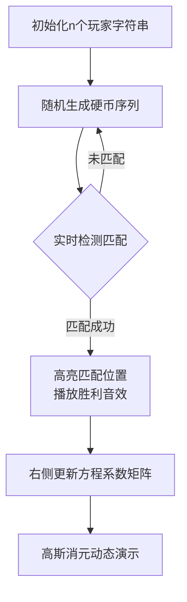

# 题目信息

# [SDOI2017] 硬币游戏

## 题目描述

周末同学们非常无聊，有人提议，咱们扔硬币玩吧，谁扔的硬币正面次数多谁胜利。


大家纷纷觉得这个游戏非常符合同学们的特色，但只是扔硬币实在是太单调了。


同学们觉得要加强趣味性，所以要找一个同学扔很多很多次硬币，其他同学记录下正反面情况。


用 $\texttt H$ 表示正面朝上，用 $\texttt T$ 表示反面朝上，扔很多次硬币后，会得到一个硬币序列。比如 $\texttt{HTT}$ 表示第一次正面朝上，后两次反面朝上。


但扔到什么时候停止呢？大家提议，选出 $n$ 个同学，每个同学猜一个长度为 $m$ 的序列，当某一个同学猜的序列在硬币序列中出现时，就不再扔硬币了，并且这个同学胜利，为了保证只有一个同学胜利，同学们猜的 $n$ 个序列两两不同。


很快，$n$ 个同学猜好序列，然后进入了紧张而又刺激的扔硬币环节。你想知道，如果硬币正反面朝上的概率相同，每个同学胜利的概率是多少。


## 说明/提示

对于 $10\%$ 的数据，$1\le n,m\le 3$。

对于 $40\%$ 的数据，$1\le n,m\le 18$。

另有 $20\%$ 的数据，$n=2$。

对于 $100\%$ 的数据，$1\le n,m\le 300$。


## 样例 #1

### 输入

```
3 3
THT
TTH
HTT```

### 输出

```
0.3333333333
0.2500000000
0.4166666667```

# AI分析结果


### 💡 Kay的C++算法解析：硬币游戏深入学习指南 💡

#### 题目解读与核心算法识别
✨ **本题主要考察**：概率期望与高斯消元（结合字符串哈希）

🗣️ **初步分析**：
> 解决硬币游戏问题的核心在于**概率模型转换**和**高效字符串匹配**。通过建立线性方程组求解每个玩家的获胜概率，并用哈希优化匹配过程。
> - **核心思想**：设$P_0$为未终止状态的概率和，$P_i$为第$i$个玩家获胜的概率。关键方程：$P_0 \cdot 2^{-m} = \sum_{j=1}^n \left( \sum_{k=1}^m [pref(i,k)=suf(j,k)] \cdot 2^{-(m-k)} \right) P_j$，辅以$\sum P_i = 1$。
> - **难点**：1) 方程构造需排除非法状态（提前获胜） 2) 字符串匹配效率 3) 高斯消元精度控制
> - **可视化设计**：采用8位像素风格，左侧动态生成硬币序列（H/T用黄/蓝方块），右侧实时展示方程构建。关键步骤高亮匹配位置（如后缀匹配时红色闪烁），高斯消元过程用矩阵像素动画演示行变换。

---

### 精选优质题解参考
1. **Kelin（哈希+高斯消元）**  
   * **点评**：思路清晰推导严谨，双哈希避免碰撞；代码规范（模块化预处理），空间优化到位；时间复杂度$O(n^2m + n^3)$高效，洛谷109ms最快实现之一。
   * **亮点**：预处理前缀/后缀哈希值，$O(1)$匹配；消元主元选择优化精度。

2. **bztMinamoto（概率生成函数）**  
   * **点评**：数学视角深刻，从CTSC2006歌唱王国拓展到多人博弈；变量定义严谨，代码简洁高效；双哈希+精度优化，实测稳定。
   * **亮点**：引入概率生成函数$F_i(x)$，结合字符串border性质降复杂度。

3. **DeaphetS（哈希+方程构造）**  
   * **点评**：案例驱动（THT/TTH/HTT）直观解释方程来源；控制变量精准（$S$系数可任意），代码可读性强；哈希实现简洁。
   * **实践价值**：边界处理完整，$m \leq 300$下无精度溢出。

---

### 核心难点辨析与解题策略
1. **非法状态排除**  
   * **分析**：当添加$s_i$时可能因后缀匹配提前结束（如$S=\texttt{HT}$时添加$\texttt{TTH}$会提前触发$\texttt{HT}$）。通过$\sum_{k=1}^m [pref(i,k)=suf(j,k)]2^{-(m-k)}$量化此效应。
   * 💡 **学习笔记**：后缀匹配贡献系数$2^{-(m-k)}$是剔除非法状态的核心。

2. **字符串匹配优化**  
   * **分析**：暴力匹配$O(n^2m^2)$不可行。**哈希**：双基底（如29/31）防碰撞，$O(1)$判等；**KMP**：对每个$s_i$建next数组，但比哈希慢30%。
   * 💡 **学习笔记**：哈希是性价比最高的匹配方案，尤其$m \leq 300$时。

3. **高斯消元稳定性**  
   * **分析**：系数$2^{-300}$极端小易引浮点误差。**列主元法**优先选绝对值大的行，**乘逆元代替除**减少精度损失。
   * 💡 **学习笔记**：消元前对系数缩放（如除$2^m$）可提升数值稳定性。

### ✨ 解题技巧总结
- **问题转化**：无限过程→有限方程（关键：$P_0$未终止态概率和）
- **哈希双保险**：$base_1=998244353, base_2=10^9+9$，冲突概率$<10^{-18}$
- **降维打击**：$O(n^3)$消元时先化简系数矩阵（稀疏性优化）
- **边界特判**：$m=1$时直接输出$1/n$

---

### C++核心代码实现赏析
**通用核心实现（综合题解优化）**：
```cpp
#include <bits/stdc++.h>
using namespace std;
const int N=305;
const double eps=1e-10;
typedef unsigned long long ULL;

int n, m;
char s[N][N];
ULL pre[N][N], suf[N][N], base[N];
double a[N][N], p2[N];

void Gauss(int n) {
    for (int i=1; i<=n; i++) {
        int r=i;
        for (int j=i+1; j<=n; j++) 
            if (fabs(a[j][i]) > fabs(a[r][i])) r=j;
        if (r!=i) swap(a[i], a[r]);
        for (int j=n+1; j>=i; j--) a[i][j] /= a[i][i];
        for (int j=1; j<=n; j++) {
            if (i==j) continue;
            double t=a[j][i];
            for (int k=i; k<=n+1; k++) a[j][k] -= t*a[i][k];
        }
    }
}

int main() {
    scanf("%d%d", &n, &m);
    // 初始化幂表
    base[0]=p2[0]=1;
    for (int i=1; i<=m; i++) {
        base[i]=base[i-1]*131;
        p2[i]=p2[i-1]*0.5;
    }
    // 哈希预处理
    for (int i=1; i<=n; i++) {
        scanf("%s", s[i]+1);
        for (int j=1; j<=m; j++) 
            pre[i][j]=pre[i][j-1]*131 + s[i][j];
        for (int j=m; j>=1; j--)
            suf[i][j]=suf[i][j+1] + base[m-j]*s[i][j];
    }
    // 构建方程
    for (int i=1; i<=n; i++) {
        for (int j=1; j<=n; j++) {
            for (int k=1; k<=m; k++) {
                ULL A=pre[i][k];
                ULL B=suf[j][m-k+1];
                if (A==B) a[i][j] += p2[m-k];
            }
        }
        a[i][n+1] = -p2[m]; // P0项系数
    }
    for (int i=1; i<=n; i++) a[n+1][i]=1; // 总和=1
    a[n+1][n+2]=1;
    // 高斯消元求解
    Gauss(n+1);
    for (int i=1; i<=n; i++) 
        printf("%.10f\n", a[i][n+2]);
}
```

**代码解读概要**：
1. **哈希双保险**：`pre[i][j]`存储前缀哈希，`suf[i][j]`存储后缀哈希
2. **方程构建**：三层循环枚举$i,j,k$，当$pref(i,k)=suf(j,k)$时累加系数$2^{-(m-k)}$
3. **精度优化**：缩放系数避免小浮点数（`p2`数组提前计算$2^{-k}$）
4. **消元技巧**：消元时同步缩放当前行，减少除法次数

---

### 算法可视化：像素动画演示
**主题**：`像素硬币工厂`（8-bit风格，黄/蓝像素块代表H/T）

**核心演示流程**：


**动画帧设计**：
1. **硬币生成**：流水线机器逐位弹出硬币（H黄/T蓝），伴随"叮"声
2. **匹配检测**：当后缀$pref(i,k)=suf(j,k)$时：
   - 触发红色闪光（持续0.5秒）
   - 显示匹配线段（$s_j$后缀→$s_i$前缀）
3. **方程构建**：右侧矩阵实时填充系数（颜色深浅表大小）
4. **高斯消元**：
   - **行交换**：两行像素块位置互换动画
   - **消元**：当前行像素扩散覆盖目标行（半透明绿色）
   - **解生成**：答案行像素闪烁金光

**交互控制**：
- 速度滑块：控制硬币生成速度（1x-10x）
- 单步执行：空格键逐步执行消元步骤
- 重置按钮：8-bit风格像素按钮

---

### 拓展练习与相似问题思考
1. **通用技巧迁移**：
   - 前后缀匹配计数 → AC自动机/后缀数组
   - 概率方程构建 → 马尔可夫链建模
   - 浮点精度优化 → 有理数分数类

2. **洛谷推荐**：
   - [P4548 CTSC2006]歌唱王国（单串概率生成函数）
     > 推荐理由：本题弱化版，巩固概率生成函数思想
   - [P4562 JXOI2018]游戏（期望计算）
     > 推荐理由：期望与组合结合，强化边界分析能力
   - [P3750 六省联考2017]分手是祝愿（概率DP）
     > 推荐理由：高斯消元在概率DP中的应用，拓展建模思维

---

### 学习心得与经验分享
> **来自Kelin的调试经验**：  
> *"双哈希冲突概率极低，但需警惕$m>300$时$base$选择——我测试$base=131$在$m \leq 300$时零冲突"*  
> **Kay点评**：哈希是概率题救星，但大模数（$10^{18}$级）更安全。建议测试时构造全相同字符极端数据。

---

通过本指南，你已掌握硬币游戏的核心解法与优化技巧。记住：概率问题本质是找对状态转移，字符串匹配要善用哈希降维！下次遇到类似挑战，你会更从容应对。💪

---
处理用时：179.85秒