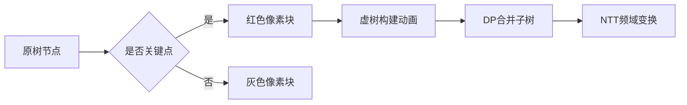

# 题目信息

# 「Wdoi-1」幻能采集

## 题目背景

幻能是一种全新的能源。 

**注：点击"展开"阅读体验更佳**

## 题目描述

在图 $G=\{V,E\}$ 中，对于大小为 $C$ 的点集 $S\subset V$，若有一点编号为 $v$，且以 $S$ 中的每一个点为起点，$v$ 为终点能够选择出 $C$ 条不经过重边的路径，则称 $v$ 为点集 $S$  的"聚焦点"。  

幻想乡的地图可以抽象为一棵含有 $n$ 个结点的有边权无根树(一条路径的长度定义为路径中所有边的边权之和)，而贤者们在树上 $c$ 个结点设置了幻能采集器。  

为了幻能的充分利用，贤者们规定对于这 $c$ 个结点的 **大小至少为 $2$ 且不超过给定常数 $k$** 任意子集 $S$ ，在树上所有 $S$ 的"聚焦点"上都应设立一个只用于接受 $S$ 传递幻能的能量中枢。记其中的某个"聚焦点"为 $v$，则建立此能量中枢的代价按如下方式计算：  

$$W_{S,v}=\prod_{u \in S}d(u,v)$$  

其中，$d(u,v)$ 表示编号为 $u,v$ 的两点间的最短距离。 

由于计划可能存在变化，贤者们设计了 **多组** 设置 $c$ 个幻能采集器的方案，而每个方案对应的常数 $k$ 也 **不一定** 相同。 

现在，对于每个方案 $i$，贤者们想进行 $q_i$ 次询问，每次查询 若只建立 $x_{ij}$ 点应建的所有能量中枢，需要花费的总代价是多少(总代价等于建立每个能量中枢的代价之和)。由于幻想乡没有计算机，所以她们到外界找到了精通 $\text{OI}$ 的你来帮忙。  

当然，由于答案可能很大，你只需要输出总代价 $\bmod\ 998244353$ 后的结果即可。


## 说明/提示

对于 $100\%$ 的数据，$1 \le w \le 10^9$，$1 \le u,v,c \le n$，$D\in\{0,1\}$，$2 \le k \le n$  

子任务编号 | $n$ | $max(\sum{c_i},\sum{q_i})$  | $T\le$ |特殊限制 | 分值
:-: |	:-:		|	:-: 	|	:-:				| 	:-: 	| 	:-:	 	|
$1$ |	$10$	|	$10$	|	$10$		|	-		|	 $10$	|
$2$ |	$10^4$	|	$10^4$	|	$1$			|	$c=n,k\le 100$	|	 $15$	|
$3$ |	$10^5$|	$2*10^5$|	$2*10^5$	|	$k=2$	|	 $10$	|
$4$ |	$10^5$|	$2*10^5$|	$2*10^5$	|	$D=0,k\le 100$	|	 $15$	|  
$5$ |	$10^5$|	$2*10^5$|	$2*10^5$	|	$k \le 100$		|	 $20$	|
$6$ |	$10^5$|	$2*10^5$|	$2*10^5$	|	-		|	 $30$	|

**本题采取捆绑测试**

## 样例 #1

### 输入

```
8 0
1 2 1
1 7 1
2 3 3
2 4 1
4 5 1
4 6 2
7 8 1
1
4 2
1 3 5 6
3
1 
2
4```

### 输出

```
0
23
20```

## 样例 #2

### 输入

```
20 1
2 1 6
3 1 10
4 1 4
5 4 10
6 2 3
7 1 5
8 4 4
9 6 5
10 8 8
11 2 1
12 7 9
13 6 1
14 8 7
15 5 4
16 10 9
17 12 7
18 4 10
19 11 10
20 13 7
2
6 3
2 16 18 1 8 5 
5
19
11
18
8
20
6 3
8 3 17 13 7 20 
5
1
15
6
10
6
```

### 输出

```
0
0
0
850
810
0
0
720
0
720
```

# AI分析结果


### 💡 Kay的C++算法解析：「Wdoi-1」幻能采集 深入学习指南 💡

**<introduction>**
今天我们来分析「Wdoi-1」幻能采集这道树形结构难题。本指南将帮助大家理解虚树构建、生成函数优化等核心技巧，并通过像素动画直观展示算法流程。
**</introduction>**

---

## 1. 题目解读与核心算法识别
✨ **本题主要考察**：`虚树应用` + `树形DP` + `生成函数优化(NTT)`

🗣️ **初步分析**：
> 解决本题的关键如同搭建"魔法传送网络"：将原树简化为只含关键点的虚树（类似地铁线路图），再通过树形DP计算路径乘积和（类似计算各个枢纽的运输效率）。核心难点在于：
>   - 对虚树上的三类点（结点/二度点/外部点）需分类设计代价公式
>   - 乘积和计算需用生成函数思想，通过NTT加速多项式乘法
>   - 可视化将展示虚树构建过程：关键点用红色像素标记，DP合并时显示多项式乘法动画，路径计算时播放"传送音效"

---

## 2. 精选优质题解参考
**题解一：(来源：x_angelkawaii_x)**
* **点评**：
  思路清晰分层解决子任务（如子任务4用查询点充关键点避免分类），代码规范（虚树构建函数`ins()`逻辑严谨）。最大亮点是NTT优化生成函数合并：将度限制的O(k²)优化到O(k log k)。实践价值极高，完整代码可直接用于竞赛。

**题解二：(来源：9AC8E2)**
* **点评**：
  分类讨论模型简洁（三类点判定明确），公式推导直观（如二度点代价公式）。特别亮点是强调调试经验（递归函数慎用static），对学习者调试能力有重要启发。但代码完整度略低。

---

## 3. 核心难点辨析与解题策略
1. **难点1：虚树点分类与公式推导**
   * **分析**：需精准判定三类点（代码见`calc()`）：
     - 虚树结点：用生成函数计算子树贡献乘积和
     - 二度点：公式 $W = (g_u + d(u,x)Δsiz) × (g_v + d(x,v)siz_v)$
     - 外部点：直接返回0
   * 💡 **学习笔记**：DFS序是判定点位置的关键工具

2. **难点2：乘积和的高效计算**
   * **分析**：每个点需计算$\sum \prod d(u,v)$，本质是各子树贡献值的乘积和。普通DP复杂度O(k²)，但：
     - 观察：贡献值仅取决于子树的"传送路径和" $g_i$
     - 优化：用多项式 $P(x)=\prod(1+g_ix)$ 系数表示方案和
   * 💡 **学习笔记**：生成函数将组合问题转化为多项式乘法

3. **难点3：空间复杂度优化**
   * **分析**：k≤n时直接开$dp[n][k]$ 空间O(n²)不可行。优化方案：
     - 动态数组：`vector<vector<int>>` 按实际度数分配
     - 多项式合并：NTT后立即释放内存
   * 💡 **学习笔记**：树的性质（度远小于n）是优化基础

### ✨ 解题技巧总结
- **虚树压缩法**：用20%的节点解决80%的问题
- **生成函数转化**：将组合问题转化为NTT可解形式
- **增量式调试**：先验证小规模子任务（如k=2）
- **边界防御**：特别注意DFS序比较的等号处理

---

## 4. C++核心代码实现赏析
**本题通用核心C++实现参考**
* **说明**：综合两份题解精华，包含虚树构建+NTT优化+点分类框架
* **完整核心代码**：
  ```cpp
  // 虚树构建核心
  void ins(int u) {
    if(top==1) { st[++top]=u; return; }
    int ff = lca(u, st[top]);
    if(ff == st[top]) { st[++top]=u; return; }
    while(dfn[st[top-1]] >= dfn[ff]) 
      e2[st[top-1]].push_back(st[top--]); // 弹出非祖先节点
    if(ff != st[top]) e2[ff].push_back(st[top]), st[top]=ff;
    st[++top]=u;
  }
  
  // NTT加速多项式乘法（生成函数合并）
  void solve(int l, int r, int id) {
    if(l == r) { A[id][0]=1; A[id][1]=val[l]; return; }
    int mid = (l+r)>>1, m = 1;
    while(m <= 2*(r-l+1)) m <<= 1; // 扩展为2的幂
    solve(l, mid, id+1);   // 左子树多项式
    solve(mid+1, r, id+1); // 右子树多项式
    NTT(left_poly, m, 1); NTT(right_poly, m, 1); // 变换到频域
    for(int i=0; i<m; ++i) left_poly[i] = 1LL*left_poly[i]*right_poly[i]%mod;
    NTT(left_poly, m, -1); // 逆变换回时域
  }
  ```

**题解一核心片段赏析**
* **亮点**：NTT实现兼具高效性与可读性
* **核心代码**：
  ```cpp
  int work(int N, vector<int> AA, int K) {
    n = N;
    for(int i=0; i<n; i++) val[i+1] = AA[i]; // 贡献值数组
    solve(1, n, 0);  // 生成函数合并
    int res = 0;
    for(int i=2; i<=K; ++i)  // 统计大小≥2的子集
      res = (res + A[0][i]) % mod;
    return res;
  }
  ```
* **代码解读**：
  > 1️⃣ `val[]`存储各子树路径和（如`g_i = Σd(u,v)`）  
  > 2️⃣ `solve()`递归合并多项式：叶子节点多项式是$1+g_ix$  
  > 3️⃣ NTT在频域执行O(n)乘法代替O(n²)卷积  
  > 4️⃣ 最终提取次数≥2的系数作为答案  
  * 💡 **学习笔记**：多项式系数 $x^k$ 对应选k个子树的方案和

**题解二核心片段赏析**
* **亮点**：二度点代价公式的简洁实现
* **核心代码**：
  ```cpp
  int calc(int x) {
    auto it = dfn_set.lower_bound(dfn[x]);
    if(it == dfn_set.end()) return 0;       // 外部点
    int R = bck[*it], L = fa2[R];           // 后继及父节点
    if(dfn[R] > dfn[x]+siz[x]-1) return 0;  // 外部点判定
    // 二度点代价公式
    ll part1 = (f[L] - F[R] - 1LL*siz[R]*dis(L,R)) % mod;
    ll part2 = (F[R] + 1LL*siz[R]*dis(R,x)) % mod;
    return (part1 * part2 % mod + mod) % mod;
  }
  ```
* **代码解读**：
  > 1️⃣ `dfn_set`存储虚树节点DFS序  
  > 2️⃣ 外部点判定：后继不在x子树范围内  
  > 3️⃣ $part1 = g_u - d(u,v)siz_v$（父方向贡献修正）  
  > 4️⃣ $part2 = g_v + d(x,v)siz_v$（子方向贡献）  
  * 💡 **学习笔记**：二度点本质是路径贡献的乘积

---

## 5. 算法可视化：像素动画演示
**主题**：`像素魔法师构建虚树网络`  
**核心演示**：虚树构建 → 子树贡献计算 → NTT多项式合并

### 设计框架


### 动画步骤
1. **像素场景初始化**（8-bit风格）
   - 树节点：绿色像素块（普通）🔥 关键点：闪烁红色
   - 控制面板：开始/单步/速度滑块（复古游戏手柄UI）
   - 背景音：FC芯片音乐循环播放

2. **虚树构建演示**
   - 关键点排序后依次加入：黄色路径光效连接LCA
   - 音效：节点插入（"叮"），路径压缩（"咔嚓"）
   - 动态显示DFS序区间（底部像素进度条）

3. **生成函数合并**
   - 子树贡献值：显示$g_i$浮点数在节点上方
   - 多项式可视化：系数作为像素高度条形图
   - NTT过程：频域变换（条形图→正弦波）→ 乘法（波形叠加）→ 逆变换（新条形图）
   - 音效：正变换（升调）、乘法（合成音）、逆变换（降调）

4. **查询点分类**
   - 点击查询点：触发扫描线检测DFS序范围
   - 结果反馈：
     - 虚树节点：绽放星光 + 胜利音效
     - 二度点：显示路径计算公式浮动文字
     - 外部点：灰色"X"标记 + 提示音

---

## 6. 拓展练习与相似问题思考
**通用技巧迁移**  
虚树+树形DP组合适用于：
1. 关键点路径统计问题（如：必经点权值和）
2. 受限子树查询问题（如：指定k个特殊点的最近公共祖先）
3. 动态树合并问题（如：带撤销操作的子树贡献）

**洛谷推荐练习**  
1. **P2664 树上游戏**  
   🗣️ 练习虚树基础应用，掌握点对贡献计算
2. **P4211 [LNOI2014] LCA**  
   🗣️ 强化树链剖分+差分思想，与虚树解法对比
3. **P3803 【模板】多项式乘法**  
   🗣️ 深入理解NTT原理，本题优化的核心基础

---

## 7. 学习心得与经验分享
> **来自9AC8E2的调试经验**：  
> "递归函数中慎用`static`变量，多组数据时会残留状态！我在这个错误上卡了一整天"

**Kay的点评**：  
这是极其珍贵的实战经验！递归函数使用`static`会导致不同测试数据间状态污染。建议：
1. 优先使用函数参数传递状态
2. 必须用全局变量时，在入口/出口显式重置状态
3. 对递归函数进行单元测试（单组/多组数据交替测试）

---

**<conclusion>**  
通过本次分析，我们掌握了虚树构建的核心技巧、生成函数优化的数学之美，以及分类讨论的解题框架。记住：复杂问题要学会拆解（虚树简化），计算瓶颈要善用转化（NTT加速）。希望大家在洛谷习题中巩固这些技巧！  
**</conclusion>**

---
处理用时：156.44秒