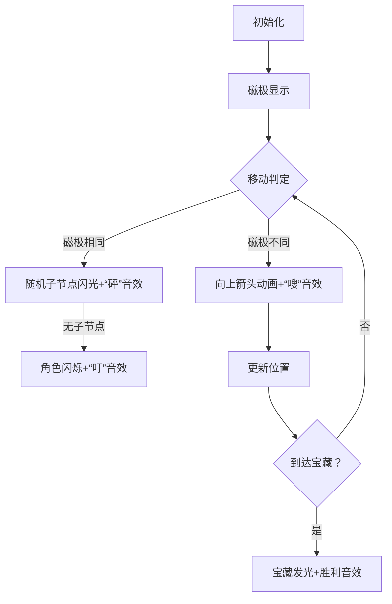

# 题目信息

# 磁控法则

## 题目背景

>那只不过是别人的不幸。

诺顿进入了一个结构复杂的洞穴。在之前的勘察中，他已经得知了这个洞穴里有他梦寐以求的宝藏。

然而这个洞穴是如此的黑暗与复杂，以至于他探索了许久都没有找到宝藏的所在地。但宝藏强大的吸引力仍驱使着他继续搜寻。然而很快他就意识到了不对劲，因为那股吸引力不仅作用在他脑海中，也作用在他身体上——宝藏的防御机关正释放巨大的磁力试图驱逐外来者。

「果然，这就是它自带的保护机制吗？」诺顿笑了笑，拿出了一小块散发着奇特光芒的金属。

「不过，我也是有准备的。」

## 题目描述

诺顿所在的洞穴可以看作是由 $n$ 个洞窟和 $n-1$ 条通道形成的树状结构，诺顿在石窟 $s$，宝藏在石窟 $t$。在宝藏所在的石窟里有一块拥有强大磁场的特殊的磁铁，诺顿身上也有一块小型的同样材质的磁铁。宝藏石窟里的磁铁**只有一个磁极**（N 或 S），并且**磁极不会发生变化**。诺顿身上的磁铁也**只有一个磁极**（N 或 S），但**每个时刻开始时会有 $p$ 的概率切换磁极**（N 变成 S，S 变成 N）。

每个时刻诺顿的移动方式由宝藏石窟磁铁的磁极和诺顿身上磁铁的磁极决定：

1. 两块磁铁磁极不同。此时两块磁铁会触发「吸引」效果。诺顿会因为磁铁间的吸引力移动到与 $s$ 相连的石窟中到 $t$ 距离 $-1$ 的石窟中（即**以 $t$ 为根时 $s$ 的父亲**）。

2. 两块磁铁磁极相同。此时两块磁铁会触发「弹射」效果。诺顿会因为磁铁间的排斥力**等概率**移动到与 $s$ 相连的石窟中到 $t$ 距离 $+1$ 的石窟（即**以 $t$ 为根时 $s$ 的任意一个儿子**）。如果没有满足的石窟，将触发「眩晕」效果，下个时刻诺顿将**不进行任何的移动，也不会进行任何的磁极切换**。

经过一段时间的勘察，诺顿已经知道了整个洞穴的结构以及磁极切换的概率 $p$。为了更好的寻找宝藏，他每次会向你提出询问，你需要回答他如果一开始诺顿在石窟 $x$，身上磁铁磁极为 $c_1$，宝藏在石窟 $y$，石窟内磁铁磁极为 $c_2$，期望在多少时刻后诺顿可以找到宝藏。

## 说明/提示

#### 样例一解释
每个时刻磁极切换概率为 $\dfrac{1}{2}$。

洞窟结构如下：  


对于询问 $1$，诺顿在第 $1$ 个时刻有 $\dfrac{1}{2}$ 的概率移动到 $1$，有 $\dfrac{1}{2}$ 的概率触发「眩晕」进入第 $3$ 个时刻。在第 $3$ 个时刻同样有 $\dfrac{1}{2}$ 的概率移动到 $1$，有 $\dfrac{1}{2}$ 的概率触发「眩晕」进入第 $5$ 个时刻……期望结果为 $1\times\dfrac{1}{2}+3\times\left(\dfrac{1}{2}\right)^2+5\times\left(\dfrac{1}{2}\right)^3+\ldots=3$。

------------
#### 数据范围

**本题采用捆绑测试**。

+ Subtask 1 ( $10\%$ )：$n,q\leq15$。
+ Subtask 2 ( $20\%$ )：$n\leq10^3$。
+ Subtask 3 ( $25\%$ )：对于所有询问，保证 $y=1$。
+ Subtask 4 ( $45\%$ )：无特殊限制。

对于所有数据，$2\leq n\leq5\times 10^5,1\leq q\leq5\times10^5,1\leq u,v,x,y\leq n,x\neq y,2\leq p\leq998244352$。

------------
**本题读入量较大，请使用较快的读入方式。**

## 样例 #1

### 输入

```
6 4 499122177
1 2
1 3
5 3
4 6
4 3
2 N 1 S
3 S 1 S
5 N 6 N
1 S 4 N```

### 输出

```
3
6
17
11```

## 样例 #2

### 输入

```
10 6 199648871
3 7
4 9
2 3
5 6
7 10
5 7
5 9
8 2
1 3
10 S 5 S
1 N 7 S
1 N 4 N
1 S 4 N
4 N 3 S
7 N 4 N```

### 输出

```
332748127
8
665496262
665496261
665496253
831870314```

# AI分析结果


### 💡 Kay的C++算法解析：磁控法则 深入学习指南 💡

#### 1. 题目解读与核心算法识别
✨ **本题主要考察**：树形动态规划、期望动态规划、换根DP  
🗣️ **初步分析**：
> 磁控法则的本质是**树形结构上的期望路径计算**问题。想象一棵倒挂的树（根在宝藏位置），诺顿像磁力小人，根据磁极状态在树上移动：磁极不同时被吸引向上（父节点），相同时被弹射向下（随机子节点）。核心挑战是**计算从起点到终点的期望移动步数**。  
> - **核心难点**：状态转移含自环（眩晕）、磁极随机切换，需设计状态表示当前位置和磁极关系。  
> - **解法核心**：以宝藏为根建立树结构，定义状态 `f[u][0/1]` 表示从节点 `u` 出发，磁极相同(`0`)/不同(`1`)时到根的期望步数，通过**换根DP**预处理全树状态。  
> - **可视化设计**：采用8位像素风格，诺顿为像素小人，磁极用N/S像素图标。移动时：  
>   - 吸引效果：向上箭头动画 + "嗖"音效  
>   - 弹射效果：随机子节点闪光 + "砰"音效  
>   - 眩晕：角色闪烁 + "叮"音效  
>   - 成功：宝藏发光 + 胜利音效  

---

#### 2. 精选优质题解参考
**题解一（作者：littleKtian）**  
* **点评**：  
  思路清晰直击本质——将问题抽象为树形期望DP，状态设计简洁（`f[u][0/1]`）。代码实现高效：  
  - **亮点1**：发现状态转移系数恒为1，化简为链上求和（`sf`数组）  
  - **亮点2**：用树链剖分求LCA加速路径查询  
  - **实践价值**：完整处理边界（叶子节点特殊转移），逆元预处理优化除法  

**题解二（作者：Felix72）**  
* **点评**：  
  提供另一种状态定义视角（`f[pos][0]`表吸引状态），强化理论推导：  
  - **亮点**：严格证明转移系数 `k=1`，深化理解  
  - **创新点**：尝试用倍增维护线性关系（虽最终简化）  
  - **代码规范**：模块化设计 `get()` 函数处理状态转移  

---

#### 3. 核心难点辨析与解题策略
1. **状态设计与自环处理**  
   * **分析**：眩晕导致状态自环（如 `f[i][0] = ... + (1-p)(f[i][0]+1)`）。解法：移项化简 `f[i][0] = f[fa][1] + C`，消除自环依赖。  
   * 💡 **学习笔记**：期望DP含自环时，移项是破局关键！  

2. **换根DP的线性传递**  
   * **分析**：每个节点状态可表示为 `f[u][op] = f[fa][1] + C`。通过两次DFS（自底向上+自顶向下）计算全树常数项，实现 `O(1)` 查询。  
   * 💡 **学习笔记**：换根DP的核心是找到父-子状态的线性关系。  

3. **路径查询的磁极处理**  
   * **分析**：查询时需组合两段路径：  
     - `x→LCA`：用 `sf[x][0] - sf[LCA][0]`（吸引状态和）  
     - `LCA→y`：用 `sf[y][1] - sf[LCA][1]`（弹射状态和）  
     根据初始磁极选择偏移量。  
   * 💡 **学习笔记**：树上路径问题常用LCA拆解为两段。  

### ✨ 解题技巧总结
- **技巧1（状态压缩）**：利用线性关系 `f[u][op]=f[fa][1]+C` 避免复杂转移  
- **技巧2（逆元预计算）**：预处理分母逆元，将除法转为乘法优化  
- **技巧3（边界分离）**：叶子节点单独处理，避免分支判断  
- **技巧4（双前缀和）**：维护 `sf[0]/sf[1]` 数组快速求路径和  

---

#### 4. C++核心代码实现赏析
**通用核心实现（基于题解一）**  
```cpp
// 关键结构：换根DP预处理 + 树链剖分LCA
void dfs1(int u, int fa) {
    if (is_leaf(u)) f[u][0] = (2 - p) * inv_p % mod;  // 叶子特殊处理
    else {
        for (int v : children) sum += f[v][0];        // 非叶子：求子和
        f[u][0] = (2 + sum * inv_deg) % mod;          // 弹射状态转移
        f[u][1] = (1 + p * sum * inv_deg) % mod * inv_1p % mod; 
    }
}
int query(int x, int y, int same) {
    int l = lca(x, y), ans = (sf[x][0] - sf[l][0] + sf[y][1] - sf[l][1]) % mod;
    if (same) ans = (ans + offset);  // 磁极相同时添加偏移量
    return ans;
}
```

**题解一核心片段赏析**  
```cpp
// 叶子节点状态初始化（移项化简结果）
if (s[w] == 0) {
    f[w][0] = (2 - p) * np % mod;  // f[i][0] = (2-p)/p
    f[w][1] = 3;                   // f[i][1] = 3
}
```
> **解读**：为什么叶子节点 `f[i][1]=3`？  
> 当诺顿在叶子节点且磁极相同时：  
> - 50%概率眩晕（停留原地）  
> - 50%概率"无效弹射"（无子节点）  
> 期望步数 = `1 + 0.5*0 + 0.5*(1 + E)` → 解得 `E=3`  

**题解二核心片段赏析**  
```cpp
// 状态转移系数证明（k恒为1）
if (is_leaf) f[i][1] = 1 * f[fa][1] + C;  // 基础情况
else {
    // 归纳：子节点k=1 → Σf[son][1]的系数为1
    f[i][1] = 1 * f[fa][1] + (1 + p*Σf[son])/(1-p)
}
```
> **解读**：系数的统一性使问题从 `O(n²)` 降至 `O(n)`，这是优化的关键突破！  

---

#### 5. 算法可视化：像素动画演示
**主题**：磁力探险者（复古像素地牢风格）  
**核心交互设计**：  


**关键实现细节**：  
1. **像素艺术**：树节点用16x16像素方块，路径用棕色像素线  
2. **状态面板**：实时显示：  
   - 当前位置：`(x,y)` 坐标  
   - 期望步数：`E=f[u][c]`  
3. **音效触发**：  
   - 吸引：8-bit "嗖"声（500Hz方波）  
   - 弹射：短噪声音效（白噪声）  
   - 眩晕：200Hz正弦波"叮"声  
4. **AI演示模式**：自动播放时可调速（0.5x~4x），过程回放功能  

---

#### 6. 拓展练习与相似问题
1. **洛谷 P1354**  
   🗣️ *推荐理由*：基础树形期望DP，巩固状态设计技巧  
2. **洛谷 P1850**  
   🗣️ *推荐理由*：结合状态机与期望DP，提升建模能力  
3. **洛谷 P6154**  
   🗣️ *推荐理由*：DAG上的期望路径，拓展非树形场景  

---

#### 7. 学习心得与经验分享
> **题解一作者经验**：  
> *"预处理逆元避免重复计算，这是优化除法模运算的关键"*  
> **Kay点评**：在模运算中，逆元预处理能将 `O(n log n)` 降至 `O(n)`，特别是换根DP需频繁除法时，这是竞赛必备技巧！

---

通过本次分析，我们深入理解了树形期望DP的核心思想：**状态设计决定复杂度，线性关系决定优化空间**。记住Kay的秘诀：面对复杂问题时，先寻找隐藏的线性结构！

---
处理用时：191.85秒