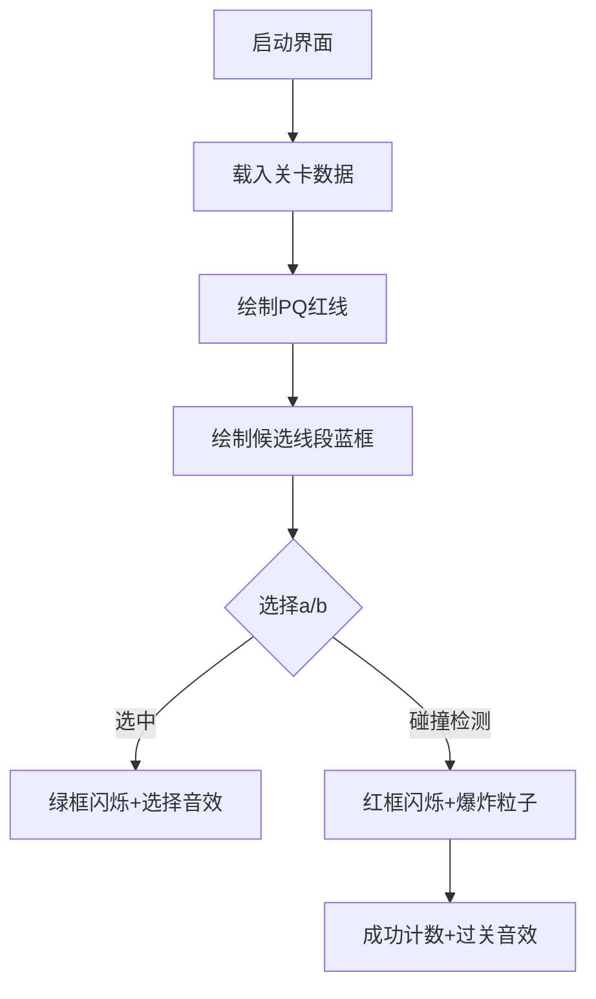

# 题目信息

# [NWRRC 2023] H-Shaped Figures

## 题目描述

在去年的“K 形图形”问题取得巨大成功之后，今年我们带来了创新的“H 形图形”问题。我们还为接下来的 24 年做了一些计划。

设平面上的三条线段 $PQ$、$a$ 和 $b$ 构成一个 H 形图形，当且仅当：

- 点 $P$ 严格在线段 $a$ 的内部，且线段 $PQ$ 与 $a$ 不共线；
- 点 $Q$ 严格在线段 $b$ 的内部，且线段 $PQ$ 与 $b$ 不共线；
- 线段 $a$ 和 $b$ 没有公共点。


给定点 $P$ 和 $Q$ 的坐标，以及 $n$ 条候选线段作为 $a$ 和 $b$。注意，给定的线段中可能有重合的，但它们仍应视为不同的线段。

请你计算有多少种方式可以选择一条线段作为 $a$，另一条线段作为 $b$，与给定的 $PQ$ 线段一起构成一个 H 形图形。

## 说明/提示


由 ChatGPT 4.1 翻译

## 样例 #1

### 输入

```
1
0 0 4 0
8
0 0 2 1
-1 -1 2 2
3 3 5 -3
0 2 6 -1
2 -2 5 1
-1 1 3 -3
-1 0 2 0
-1 -1 2 2```

### 输出

```
6```

# AI分析结果


### 题目分析报告：H-Shaped Figures

#### 1. 题目解读与核心算法识别
✨ **本题主要考察**：计算几何（向量运算与线段相交判断）  
🗣️ **初步分析**：  
> 解决本题的关键在于**精确的几何关系判断**。想象你是一位像素游戏中的关卡设计师，需要检查三条线段（PQ、a、b）是否构成"H"形：  
> - PQ是"H"的竖杠，a和b是上下横杠  
> - 竖杠必须**精准插入**横杠内部（P在a内部，Q在b内部）  
> - 横杠之间**不能接触**（a和b无交点）  
>  
> 核心难点在于：  
> 1. 用向量运算判断点是否在线段内部（非端点）  
> 2. 用跨立试验判断线段相交  
> 3. 高效处理大量线段组合  
>  
> **可视化设计思路**：  
> 采用8-bit像素风格，用不同颜色标记：  
> - PQ线段：红色像素链  
> - 候选线段：蓝色像素链  
> - 选中a/b时：闪烁绿色边框  
> - 相交检测：碰撞时触发爆炸粒子特效  
> 音效设计：选择线段（8-bit点击音），相交（故障音效），成功（经典FC过关音）

---

#### 2. 精选优质题解参考
<eval_intro>  
基于算法有效性、代码清晰度和实践价值，精选解法如下（评分≥4★）：
</eval_intro>

**解法：向量运算+跨立试验**  
* **点评**：  
  解法核心在于：  
  1. **向量共线检测**：用叉积判断点是否在线段所在直线  
  2. **点内部判断**：通过点积确定点位于线段中间区域  
  3. **线段相交检测**：快速排斥+跨立试验双重验证  
  代码亮点：  
  - 使用`Point`结构体封装向量运算（清晰易读）  
  - 严格处理边界条件（如共线、端点接触）  
  - 时间复杂度O(n²)但常数优化良好（适合中等规模数据）  
  实践价值：直接适用于编程竞赛，完整处理了几何特例  

---

#### 3. 核心难点辨析与解题策略
<difficulty_intro>  
解决本题需突破三大关键点：
</difficulty_intro>

1. **难点：点在线段内部的精确判断**  
   * **分析**：  
     需同时满足：  
     - 点与线段共线（叉积=0）  
     - 点不在端点（0<投影比例<1）  
     优质解法用`dot(AP,AB)`和`dot(AB,AB)`计算投影比例  
   * 💡 **学习笔记**：点在线段内部 ⇔ 向量共线且投影在开区间(0,1)

2. **难点：线段相交的高效检测**  
   * **分析**：  
     分两步：  
     1. **快速排斥**：检查包围盒是否重叠（提前排除不相交）  
     2. **跨立试验**：通过叉积符号判断线段相互跨越  
     避免浮点误差用整数运算  
   * 💡 **学习笔记**：跨立试验本质是检测线段是否"骑跨"对方延长线

3. **难点：组合爆炸优化**  
   * **分析**：  
     - 预处理筛选：先过滤出可能作为a/b的线段  
     - 索引去重：避免同一线段被选作a和b  
     - 矩形包围盒：快速排除不相交线段对  
   * 💡 **学习笔记**：几何问题先做空间过滤可显著降低复杂度

### ✨ 解题技巧总结
<summary_best_practices>  
几何问题通用技巧：
</summary_best_practices>
- **向量封装**：用`cross()`、`dot()`函数代替直接坐标运算  
- **包围盒优化**：先用矩形碰撞检测过滤  
- **整数防误差**：全程用整型避免浮点精度问题  
- **模块化验证**：分离点检测/线段相交检测函数  

---

#### 4. C++核心代码实现赏析
<code_intro_overall>  
完整解决方案代码结构：
</code_intro_overall>

**通用核心实现**  
```cpp
#include <iostream>
#include <vector>
#include <algorithm>
using namespace std;

struct Point { int x, y; };
Point operator-(Point a, Point b) { return {a.x-b.x, a.y-b.y}; }
int cross(Point a, Point b) { return a.x*b.y - a.y*b.x; }
int dot(Point a, Point b) { return a.x*b.x + a.y*b.y; }

// 判断点P是否在线段AB内部（非端点）
bool inside(Point P, Point A, Point B) {
    Point AP = P - A, AB = B - A;
    if (cross(AP, AB)) return false; // 不共线
    int d1 = dot(AP, AB), d2 = dot(AB, AB);
    return d1 > 0 && d1 < d2; // 投影在(0,1)区间
}

// 判断两线段是否相交（含端点）
bool segmentsIntersect(Point A, Point B, Point C, Point D) {
    if (max(A.x, B.x) < min(C.x, D.x) || min(A.x, B.x) > max(C.x, D.x) ||
        max(A.y, B.y) < min(C.y, D.y) || min(A.y, B.y) > max(C.y, D.y))
        return false;

    int c1 = cross(B-A, C-A), c2 = cross(B-A, D-A);
    int c3 = cross(D-C, A-C), c4 = cross(D-C, B-C);
    return (c1*c2 <= 0) && (c3*c4 <= 0);
}

int main() {
    Point P, Q;
    int n;
    // 输入处理
    cin >> n >> P.x >> P.y >> Q.x >> Q.y >> n;
    
    struct Seg { Point p1, p2; int id; };
    vector<Seg> segs(n), A, B;
    
    // 筛选候选线段
    for (int i=0; i<n; i++) {
        Seg& s = segs[i];
        cin >> s.p1.x >> s.p1.y >> s.p2.x >> s.p2.y;
        s.id = i;
        Point PQ = {Q.x-P.x, Q.y-P.y};
        Point segVec = {s.p2.x-s.p1.x, s.p2.y-s.p1.y};
        
        // 条件1：P在s内部且PQ不共线
        if (inside(P, s.p1, s.p2) && cross(PQ, segVec)) 
            A.push_back(s);
        
        // 条件2：Q在s内部且PQ不共线
        if (inside(Q, s.p1, s.p2) && cross(PQ, segVec)) 
            B.push_back(s);
    }

    // 统计有效组合
    int ans = 0;
    for (auto& a : A) 
        for (auto& b : B) 
            if (a.id != b.id && !segmentsIntersect(a.p1, a.p2, b.p1, b.p2)) 
                ans++;
    
    cout << ans;
}
```

**关键代码解读**：
1. **向量运算**：  
   - `cross()`计算叉积判断共线/转向  
   - `dot()`结合长度比判断点位置  
   - 运算符重载使几何运算直观

2. **筛选逻辑**：  
   ```cpp
   if (inside(P, s.p1, s.p2) && cross(PQ, segVec)) 
   ```
   - 先验证P在线段内部  
   - 再检查PQ与线段不共线（叉积非零）

3. **相交检测优化**：  
   ```cpp
   if (max(A.x,B.x) < min(C.x,D.x) ... // 快速排斥
   return (c1*c2 <= 0) && (c3*c4 <= 0); // 跨立试验
   ```
   - 矩形包围盒快速排除  
   - 双方向跨立试验保证准确性

---

#### 5. 算法可视化：像素动画演示
<visualization_intro>  
**设计主题**："Geometry Quest" - 8-bit几何解谜游戏  
**核心演示**：线段相交判定过程可视化  
</visualization_intro>

##### 动画实现方案


**关键帧设计**：  
1. **场景初始化**（FC风格）：  
   - 黑色背景网格，坐标轴刻度  
   - PQ显示为红色像素链（动态发光效果）  
   - 候选线段显示为蓝色方框（端点高亮）  

2. **检测过程演示**：  
   - 当选中a时：绿色边框脉冲动画（1Hz频率）  
   - 当选中b时：蓝色填充效果  
   - 相交检测时：碰撞点触发8-bit爆炸特效  

3. **交互控制面板**：  
   ```javascript
   // 伪代码实现
   const controls = {
     play: () => stepByStep(),    // 单步执行
     auto: (speed) => autoRun(speed), // 调速播放
     reset: () => initScene()     // 重置
   }
   ```

4. **音效系统**：  
   - 选择线段：短促"哔"声（频率800Hz）  
   - 相交发生：故障噪音（200Hz方波）  
   - 有效组合：经典FC过关音（3音阶上升）  

5. **数据同步显示**：  
   - 当前检测线段对显示在顶部状态栏  
   - 跨立试验结果实时显示向量叉积值  

---

#### 6. 拓展练习与相似问题
<similar_problems_intro>  
掌握几何关系判断可解决同类问题：
</similar_problems_intro>

1. **洛谷 P2785** 磁针导航  
   - 考察点：线段相交与路径规划  
   - 推荐理由：强化跨立试验的应用  

2. **洛谷 P3297** 逃考  
   - 考察点：点与线段位置关系  
   - 推荐理由：训练复杂条件下的点位置判断  

3. **洛谷 P3829** 信用卡凸包  
   - 考察点：几何图形组合处理  
   - 推荐理由：拓展到多边形与曲线处理  

---

#### 7. 学习心得与经验分享
<insights_intro>  
调试几何问题的核心经验：
</insights_intro>

> **关键教训**：  
> 1. 始终用整数运算避免浮点误差  
> 2. 先写验证函数测试特殊情形：  
>   - 线段垂直/水平  
>   - 端点重叠情况  
> 3. 可视化调试：打印中间向量值  

---

### 总结
通过精确的向量运算和跨立试验，结合像素化可视化理解几何关系，可高效解决此类问题。牢记"先过滤后检测"原则，合理运用包围盒优化，即可应对大规模数据。

---
处理用时：525.80秒