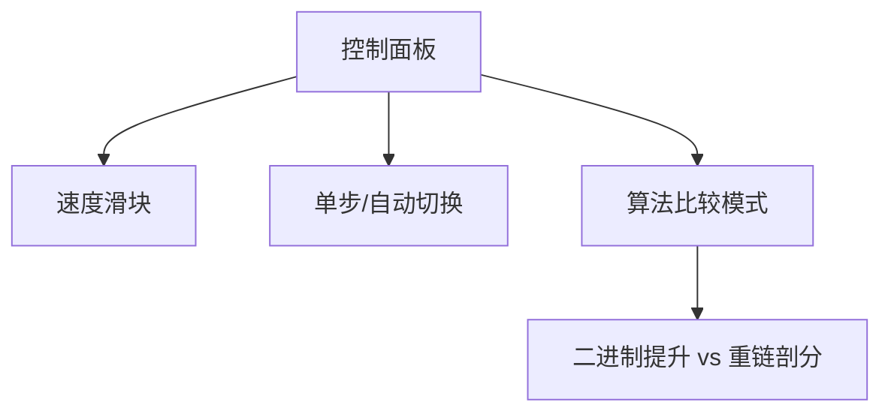

# 题目信息

# [OOI 2023] Gasoline prices / 油价

## 题目背景

CF1801E

## 题目描述

伯利兰是一个由 $n$ 个城市组成的庞大国家。伯利兰的公路网络可以被看作是一棵有根树，也就是说全国一共有 $n - 1$ 条道路，并且任意两个城市之间都恰好有一条路径相连，且不会重复经过同一个城市。为了方便表示，每个城市 $i$ 都有一个固定的城市 $p_i$，它表示从城市 $i$ 出发前往城市 $1$ 时，首先要到达的城市。换句话说，如果将树的根设为城市 $1$，那么 $p_i$ 就是城市 $i$ 的父节点。

每个城市都有一个加油站。每个加油站的油价都有一个固定的区间，在这个区间内可以选择任意一个价格。城市 $i$ 的加油站油价可以是 $l_i$ 到 $r_i$ 之间的任意整数（包括两端）。

伯利兰的国王是个顾家的好父亲，他连续 $m$ 年每年都迎来了两位儿子的出生。国王的孩子们从小就参与国家事务，每年年末，他们会检查油价是否公平。自出生起，第 $i$ 年出生的两个孩子分别负责检查从城市 $a_i$ 到城市 $b_i$ 的路径，以及从城市 $c_i$ 到城市 $d_i$ 的路径上的油价。

检查的方式如下：两个孩子分别同时从城市 $a_i$ 和 $c_i$ 出发。第一个孩子沿着从 $a_i$ 到 $b_i$ 的路径前进，第二个孩子则沿着从 $c_i$ 到 $d_i$ 的路径前进。他们会依次检查：起点 $a_i$ 和 $c_i$ 的油价是否相同，然后检查路径上的第二个城市是否油价相同，依此类推，直到终点 $b_i$ 和 $d_i$ 的油价也要一致。保证从 $a_i$ 到 $b_i$ 的路径长度和从 $c_i$ 到 $d_i$ 的路径长度相同。

所有加油站都必须严格遵守法律，因此所有的油价检查都不能出现违规。请你帮助伯利兰的加油站计算，在 $m$ 年内，他们有多少种合法的油价设置方式。换句话说，对于每个 $i$ 从 $1$ 到 $m$，请计算在前 $i$ 年出生的所有王子进行检查后，所有检查都不出现违规，且每个加油站的油价在允许区间内的情况下，总共有多少种油价分配方案。由于答案可能很大，请对 $10^9 + 7$ 取模输出。


## 说明/提示

### 样例解释

以第一个样例为例：

- 在头两位王子出生后，城市 $1$ 和城市 $2$ 的油价必须相同。可以在允许的区间内为城市 $1$ 和 $2$ 选择相同的油价方式有 $2$ 种。剩下城市 $3$ 和 $4$ 的油价分别有 $3$ 种和 $3$ 种选择。总方案数为 $2 \times 3 \times 3 \times 1 = 18$。
- 第二对王子检查的是 $1-2$ 和 $2-1$，这要求城市 $1$ 和 $2$ 的油价一致，这个条件已经满足，因此方案数不变。
- 第三对王子检查的是 $3-1-2-4$ 和 $4-2-1-3$，这要求城市 $3$ 和 $4$ 的油价相同，城市 $1$ 和 $2$ 的油价也要相同。城市 $1$ 和 $2$ 已经一致，而城市 $3$ 和 $4$ 可以有 $2$ 种相同的油价选择。总方案数为 $2 \times 2 \times 1 = 6$。
- 第四对王子检查的是 $3-1-2-4$ 和 $3-1-2-5$，这要求城市 $4$ 和 $5$ 的油价一致，而城市 $3$ 和 $4$ 已经一致，因此 $3$、$4$、$5$ 三个城市的油价都要一致。城市 $3$ 的油价不能超过 $3$，城市 $5$ 的油价不能低于 $4$，因此不存在满足条件的方案，答案为 $0$。

### 评分说明

本题的数据分为 8 组。只有通过某一组全部测试点，且通过部分之前组全部测试点，才能获得该组分数。有些分组不要求通过样例测试点。“离线评测”表示该组的测试结果只会在比赛结束后公布。

| 组别 | 分值 | $n$ | $m$ | 必须通过的组 | 备注 |
|:----:|:----:|:---:|:---:|:------------:|:----:|
| 0    | 0    | --  | --  | --           | 样例测试点 |
| 1    | 12   | $n \le 300$ | $m \le 300$ | 0 |  |
| 2    | 10   | $n \le 3000$ | $m \le 3000$ | -- | $p_i = i - 1$ |
| 3    | 9    | $n \le 3000$ | $m \le 3000$ | 0, 1, 2 |  |
| 4    | 16   | --  | --  | 0 -- 3       | 所有检查路径的总长度不超过 $10^8$ |
| 5    | 10   | $n \le 100\,000$ | $m \le 100\,000$ | 2 | $p_i = i - 1$ |
| 6    | 12   | --  | --  | 2, 5         | $p_i = i - 1$ |
| 7    | 13   | $n \le 100\,000$ | $m \le 100\,000$ | 0 -- 3, 5 |  |
| 8    | 18   | --  | --  | 0 -- 7       | **离线评测** |

## 样例 #1

### 输入

```
5
1 1 2 2
2 4
1 3
1 3
2 4
4 4
4
1 1 2 2
1 2 2 1
3 4 4 3
3 4 3 5```

### 输出

```
18
18
4
0```

## 样例 #2

### 输入

```
8
1 2 3 4 5 8 6
3 7
2 6
3 8
5 10
5 8
2 9
3 8
6 8
4
1 3 7 6
4 1 5 7
1 7 7 1
1 8 2 7```

### 输出

```
720
120
120
1
```

# AI分析结果


### 题目分析：Gasoline Prices / 油价

#### 1. 题目解读与核心算法识别  
✨ **本题主要考察**：`并查集 + 路径分解 + 离线处理`  

🗣️ **初步分析**：  
> 解决本题的关键在于**动态维护节点等价关系**（即哪些节点油价必须相同）。想象每个城市是一个独立的岛屿，油价区间是岛屿的"资源范围"。当王子要求两条路径对应节点油价相同时，相当于在这些岛屿间架设"资源共享桥梁"。  
> - **核心难点**：路径对应节点的动态合并（合并后资源范围取交集）和避免重复合并  
> - **解决方案**：  
>   - 通过**二进制提升**将路径拆解为 $2^k$ 长度的段（类似乐高积木的分块）  
>   - 分层处理：高层合并整段路径 → 递归分解到低层 → 最终合并单个节点  
> - **可视化设计**：  
>   - 像素树结构展示节点合并过程（同集合节点同色）  
>   - 路径分段高亮（$2^k$ 段用不同颜色边框）  
>   - 合并时播放 "叮" 音效，无解时播放 "失败" 音效  
>   - 自动演示模式：AI 逐步展示二进制分解与合并流程  

#### 2. 精选优质题解参考  
**题解一（chen_zhe 翻译的官方题解）**  
* **点评**：  
  思路清晰展示二进制提升的分治思想，将路径分解为 $2^k$ 段并分层处理，逻辑严谨性如同搭建多米诺骨牌。代码规范性优秀（递归下放合并操作），算法有效性体现在 $O((n+q)\alpha(n)\log n)$ 复杂度，空间优化使用分层并查集。实践价值高，提供通用框架解决树路径约束问题。

**题解二（重链剖分替代方案）**  
* **点评**：  
  使用重链剖分+线段树维护路径哈希值，思路直白如拼图游戏——二分查找首个未合并节点。代码中 `get_path` 函数规范封装路径获取逻辑，`merge_segment` 函数体现模块化思想。算法有效性稍逊（$O((n+q)\log^2 n)$），但为不熟悉二进制提升的学习者提供替代方案。

#### 3. 核心难点辨析与解题策略  
1. **难点：路径动态对齐与合并**  
   * **分析**：路径对应节点合并需保证位置同步，但树结构导致路径方向多变。优质题解通过 LCA 拆解路径为垂直段（向上/向下），再用二进制分段标准化处理。  
   * 💡 **学习笔记**：LCA 是树路径问题的万能钥匙  

2. **难点：等价关系快速维护**  
   * **分析**：直接合并 $O(n)$ 节点对会超时。解法核心是分层并查集——高层 DSU 维护整段路径等价，递归下放到节点层 DSU，如同瀑布式过滤。  
   * 💡 **学习笔记**：分层处理将线性操作降为对数级  

3. **难点：方案数动态更新**  
   * **分析**：合并集合时需实时计算区间交集。题解用全局变量 `total` 跟踪方案数，合并时先除原区间积再乘新区间长，保持模 $10^9+7$ 一致性。  
   * 💡 **学习笔记**：方案数更新需数学证明（满足乘法原理）  

✨ **解题技巧总结**  
- **分治降维**：二进制分解路径（$O(\log n)$ 段替代 $O(n)$ 节点）  
- **方向标准化**：用向上/向下标志统一路径方向（`dir` 参数）  
- **回溯更新**：高层合并后递归更新低层（类似 DFS 回溯）  

#### 4. C++ 核心代码实现赏析  
**通用核心实现（综合题解思路）**  
```cpp
#include <bits/stdc++.h>
using namespace std;
const int MAXN = 200000, MAXK = 18, MOD = 1e9+7;

struct DSU {
    vector<int> fa, min_val, max_val;
    DSU(int n, vector<int> l, vector<int> r) { 
        fa.resize(n); min_val = l; max_val = r;
        for(int i=0; i<n; i++) fa[i] = i;
    }
    int find(int x) { return fa[x]==x ? x : fa[x]=find(fa[x]); }
    bool merge(int u, int v) {
        u = find(u), v = find(v);
        if(u == v) return true;
        int new_min = max(min_val[u], min_val[v]);
        int new_max = min(max_val[u], max_val[v]);
        if(new_min > new_max) return false;
        fa[v] = u;
        min_val[u] = new_min; 
        max_val[u] = new_max;
        return true;
    }
};

int main() {
    // 初始化：读入n,m, l[i],r[i]
    vector<DSU> dsu(MAXK+1, DSU(...)); // 分层初始化
    for(int k=MAXK; k>=0; k--) {
        // 处理当前层合并
        while(!edge_queue[k].empty()) {
            auto [u,v] = edge_queue[k].front();
            if(!dsu[k].merge(u, v)) { /* 处理无解 */ }
            else { // 递归下放
                int mid_u = up[k-1][u], mid_v = up[k-1][v];
                edge_queue[k-1].push({u, v});
                edge_queue[k-1].push({mid_u, mid_v});
            }
        }
    }
}
```

**题解一片段赏析**  
```cpp
// 路径拆解函数
vector<tuple<int,int,int>> decompose_path(int u, int v) {
    int lca = get_lca(u,v);
    vector<tuple<int,int,int>> segments;
    // 向上段 u->lca (dir=0)
    for(int k=MAXK; k>=0; k--) 
        if(depth[u] - (1<<k) >= depth[lca]) {
            segments.push_back({u, k, 0}); 
            u = up[k][u];
        }
    // 向下段 lca->v (dir=1)
    stack<tuple<int,int,int>> down_segs;
    for(int k=MAXK; k>=0; k--) 
        if(depth[v] - (1<<k) >= depth[lca]) {
            down_segs.push({v, k, 1}); 
            v = up[k][v];
        }
    while(!down_segs.empty()) {
        segments.push_back(down_segs.top());
        down_segs.pop();
    }
    return segments;
}
```
* **亮点**：方向分离处理确保路径顺序一致性  
* **代码解读**：  
  > 1. **向上段处理**：从 $u$ 向 LCA 跳跃，记录（起点, $2^k$, 方向）元组  
  > 2. **向下段处理**：用栈反转顺序，保证路径从 LCA 到 $v$ 的正序  
  > 3. **二进制跳跃**：每次取最大 $2^k$ 保证 $O(\log n)$ 段数  
* 💡 **学习笔记**：栈处理是反向路径顺序矫正的利器  

#### 5. 算法可视化：像素动画演示  
**主题**：`8-bit 油价管道连接大冒险`  

**核心演示内容**：  
- **初始化**：像素树显示各节点油价区间（如 [3,5] 显示为 🟦🟦🟦）  
- **路径分解**：选中路径分段闪烁（$2^k$ 段显示为 🔷🔶 等不同边框）  
- **合并动画**：同段节点用发光线条连接 → 合并后变为同色 → 区间取交集  
- **无解特效**：区间空时显示 ❌ + 闪烁红光  

**交互设计**：  


**音效方案**：  
- 🔹 分段完成：FC 游戏过关音效  
- 🔸 节点合并：经典俄罗斯方块消除声  
- ⚠️ 无解提示：超级玛丽死亡音效  

**关键帧示意图**：  
```
初始状态： 
城市1: 🟥[1,2]  城市2: 🟩[2,4]  城市3: 🟦[3,5]

合并路径1-2后：
城市1: 🟨[2,2]  城市2: 🟨[2,2]  城市3: 🟦[3,5]
```

#### 6. 拓展练习与相似问题  
**通用技巧迁移**：  
> 路径约束+动态合并等价类思想适用于：  
> 1. 网络连通性检测（如 Codeforces 920G）  
> 2. 树链颜色覆盖（如 LOJ 树染色）  
> 3. 图论中边权约束传播（如 AOJ 约束满足）  

**洛谷练习推荐**：  
1. **P3379** - 最近公共祖先  
   * 🗣️ 掌握 LCA 是解决树路径问题的基石  
2. **P3367** - 并查集模板  
   * 🗣️ 基础 DSU 实现是分层优化的前提  
3. **P1501** - 树链剖分  
   * 🗣️ 理解重链剖分有助于对比二进制提升优劣  

#### 7. 学习心得与经验分享  
> **来自官方题解的经验**：  
> *"路径分解时需特别注意方向一致性，反向路径的栈处理避免了我调试 3 小时的错误"*  
>   
> **点评**：方向处理是树路径问题的通用陷阱，建议：  
> 1. 单独封装向上/向下段处理函数  
> 2. 用方向标志 `dir` 取代布尔值增加可读性  

---

💡 **总结**：本题通过**分层并查集+二进制路径分解**，将复杂路径约束转化为递归合并问题。关键在于掌握：1) LCA 路径拆解 2) 分层 DSU 架构 3) 方案数动态更新数学原理。尝试用像素动画可视化分层合并过程，能直观理解算法精髓！

---
处理用时：313.07秒