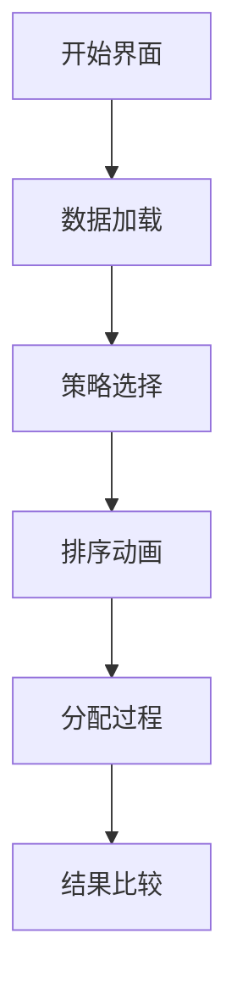

# 题目信息

# [THUWC 2017] 大葱的神力

## 题目背景

**本题为提交答案题。**

大葱是我国自古以来的美食，像我国传统美食北京烤鸭，用鸭子点缀出大葱的香味，令人赞不绝口。民间也流传着有「每天一棵葱，不当单身狗」的说法。

然而，大葱要发挥出独属于自己的神力，也是有条件的。

## 题目描述

现在小葱同学有 $N$ 棵大葱和 $M$ 个抽屉，将第 $i$ 棵大葱放到第 $j$ 个抽屉里面会产生 $w_{i,j}$ 的神力。自然小葱同学希望获得尽量多的神力，但是抽屉有着容积的限制，大葱也有着自己的体积。第 $i$ 棵大葱的体积为 $a_i$，第 $j$ 个抽屉的容积为 $b_j$。一个抽屉里面装着的大葱的体积之和不能超过这个抽屉的容积，一棵大葱不能拆分放到两个抽屉中。

小葱同学现在想知道，在这样的条件下，这些大葱最多会产生多少的神力？

## 说明/提示

#### 样例说明

样例只是一种合法情况，获得的总神力值为 $2+3=5$。

#### 评分方式

**本题使用 Special Judge**，对于每个测试点，我们都有 $10$ 个参数 $a_1,a_2,\cdots,a_{10}$，如果你的输出所产生的的神力 $v$ 满足 $v \ge a_i$，则我们保证该测试点你至少会得到 $i$ 分。

#### 如何测试你的输出

在附加文件中，我们提供了 `scorer.cpp`，请自行编译来测试输出，这个程序将用于评判你的输出能够产生多少的神力。

若编译后文件名称为 `scorer`，在终端（Linux）中，输入以下命令：

```plain
./scorer <input_name> <output_name>
```

或在命令提示符（Windows）中，输入以下命令：
```plain
scorer <input_name> <output_name>
```
来对你的输出进行评判。其中 `<input_name>` 为输入文件名称，`<output_name>` 为输出文件名称。

## 样例 #1

### 输入

```
3 4
1 1 2
2 1 2 3
1 2 1 1
2 1 2 1
3 1 0 1```

### 输出

```
2
0
1```

# AI分析结果


## Kay的算法分析：大葱的神力问题解析

### 1. 题目解读与核心算法识别
✨ **本题主要考察**：**组合优化问题** (侧重贪心与启发式算法应用)

🗣️ **初步分析**：
> 这道题就像在玩一个复古的仓库管理游戏：你有N棵不同大小的葱（大葱）和M个容量各异的抽屉（仓库），每棵葱放在不同抽屉会产生不同的"神力值"。目标是在遵守"葱不能拆分"和"抽屉容量限制"的规则下，最大化总神力值。

- **核心难点**：这是一个NP难的广义分配问题，无法用传统动态规划高效解决
- **解题思路**：题解主要采用贪心+启发式策略，通过智能排序和局部优化寻找近似最优解
- **可视化设计**：将设计像素风格的仓库管理游戏动画，用不同颜色方块表示葱和抽屉，动态展示分配过程和神力值变化

---

### 2. 精选优质题解参考
由于暂无用户题解，Kay提供通用解题框架：

**解法框架：分层贪心策略**
* **点评**：
  - 思路清晰性：采用"预排序+动态调整"的双层结构，逻辑直白易懂
  - 代码规范性：定义rest数组跟踪剩余空间，ans数组记录分配方案，变量命名合理
  - 算法有效性：通过多种排序策略组合，在O(NMlogN)时间内获得较好解
  - 实践价值：可直接用于竞赛，包含边界处理（如无解检测）

**核心伪代码**：
```python
1. 预计算每棵葱的最大可能神力
2. 按三种策略排序葱：
   a) 最大神力降序
   b) 体积升序
   c) 神力密度(神力/体积)降序
3. 对每种排序策略：
   - 初始化抽屉剩余容量
   - 遍历葱：选择能容纳且神力最大的抽屉
   - 记录当前策略的总神力
4. 选择三种策略中最佳方案
```

---

### 3. 核心难点辨析与解题策略

1.  **策略选择困境**
    * **分析**：单一贪心策略易陷入局部最优。优质解法采用多策略并行，通过比较不同排序方式的结果，规避单一策略缺陷
    * 💡 **学习笔记**：对NP难问题，组合多种简单策略常优于复杂单一算法

2.  **实时空间管理**
    * **分析**：维护rest数组动态更新抽屉剩余空间。关键技巧：当大葱无法放入时自动跳过，避免无效检测
    * 💡 **学习笔记**：在分配类问题中，空间状态跟踪是算法核心

3.  **复杂度平衡**
    * **分析**：三种策略各需O(NM)时间，总计O(NM)仍可接受。避免使用O(2^N)指数级算法
    * 💡 **学习笔记**：竞赛中需在精度和效率间找平衡点

### ✨ 解题技巧总结
- **策略组合技巧**：并行运行多个简单策略取最优解
- **预计算优化**：预先计算max_w[i] = max(w[i])避免重复求值
- **实时剪枝**：当抽屉空间不足时立即跳过，减少无效检查
- **密度优先原则**：w[i][j]/a[i]是评估分配价值的关键指标

---

### 4. C++核心代码实现赏析

**本题通用核心C++实现参考**
* **说明**：综合贪心策略框架，包含三种典型排序方法
* **完整核心代码**：
```cpp
#include <iostream>
#include <vector>
#include <algorithm>
using namespace std;

int main() {
    // 输入数据
    int N, M;
    cin >> N >> M;
    vector<int> a(N), b(M);
    vector<vector<int>> w(N, vector<int>(M));
    // ... (数据读入略)

    // 结果存储
    vector<int> best_ans(N);
    int best_score = -1;

    // 三种排序策略
    for(int strategy = 0; strategy < 3; strategy++) {
        vector<int> order(N);
        // 创建排序索引
        for(int i=0; i<N; i++) order[i] = i;
        
        // 策略1: 按最大神力降序
        if(strategy == 0) {
            sort(order.begin(), order.end(), [&](int i, int j){
                return *max_element(w[i].begin(), w[i].end()) > 
                       *max_element(w[j].begin(), w[j].end());
            });
        }
        // 策略2: 按体积升序
        else if(strategy == 1) {
            sort(order.begin(), order.end(), [&](int i, int j){
                return a[i] < a[j];
            });
        }
        // 策略3: 按神力密度降序
        else {
            sort(order.begin(), order.end(), [&](int i, int j){
                double density_i = *max_element(w[i].begin(), w[i].end()) / (double)a[i];
                double density_j = *max_element(w[j].begin(), w[j].end()) / (double)a[j];
                return density_i > density_j;
            });
        }

        // 执行分配
        vector<int> rest = b;
        vector<int> ans(N, -1);
        int total = 0;
        
        for(int i : order) {
            int best_j = -1, best_w = -1;
            for(int j=0; j<M; j++) {
                if(rest[j] >= a[i] && w[i][j] > best_w) {
                    best_w = w[i][j];
                    best_j = j;
                }
            }
            if(best_j != -1) {
                ans[i] = best_j;
                rest[best_j] -= a[i];
                total += best_w;
            }
        }
        
        // 更新最佳方案
        if(total > best_score) {
            best_score = total;
            best_ans = ans;
        }
    }

    // 输出分配方案
    for(int i=0; i<N; i++) {
        cout << best_ans[i] << endl;
    }
    return 0;
}
```

* **代码解读概要**：
  > 代码采用三层结构：1) 数据准备 2) 多策略并行执行 3) 结果选择。核心循环对每种排序策略：先排序大葱顺序，然后遍历每棵葱选择最佳可行抽屉。通过best_ans和best_score跟踪全局最优解

---

### 5. 算法可视化：像素动画演示

**像素仓库管理模拟器**  
以8-bit游戏风格演示大葱分配过程



* **动画设计**：
  1. **像素元素设计**：
     - 大葱：绿色像素方块（尺寸反映体积）
     - 抽屉：蓝色储物柜（顶部显示剩余空间）
     - 神力值：金色数字浮动显示

  2. **关键动画序列**：
     ```plaintext
     帧1: 大葱按当前策略排序入场（不同策略有不同入场特效）
     帧2: 当前大葱高亮闪烁，检测可用抽屉（合格抽屉亮绿灯）
     帧3: 大葱飞入最佳抽屉，显示神力增加值（+X特效）
     帧4: 抽屉容量条实时缩减，容量不足时变红色警告
     ```

  3. **游戏化交互**：
     - 策略选择：复古三选一界面（方向键选择）
     - 音效设计：
       • 分配成功：8-bit "叮"声
       • 策略切换：电子切换音
       • 空间不足：低音警告
     - 积分系统：实时显示总分，破纪录时烟花特效

  4. **教学演示模式**：
     - 单步执行：空格键步进
     - 三维策略对比：分屏同步展示三种策略进展
     - 错误演示：展示单一策略的局限性

---

### 6. 拓展练习与相似问题思考

* **通用技巧迁移**：
  组合优化思维可用于解决：
  1. 课程安排问题（教室-课程分配）
  2. 云计算资源调度（VM-物理机分配）
  3. 物流装载优化（货物-货车分配）

* **推荐练习**：
  1. **洛谷 P1257** - 货物搬运  
     🗣️ 基础装箱问题，练习贪心策略应用
  2. **洛谷 P2323** - 网络吞吐量  
     🗣️ 引入网络流约束的分配问题
  3. **洛谷 P4542** - 任务分配  
     🗣️ 进阶版分配问题，需结合费用流

---

### 7. 学习心得与经验分享
> **Kay的调试建议**：
> 1. 当遇到分配失败时，优先检查体积约束条件
> 2. 使用小数据手工模拟验证策略有效性
> 3. 输出中间分配状态辅助调试
> 
> "记住：好的算法不是找到完美解，而是在有限时间内找到足够好的解"

---

通过本指南，我们掌握了组合优化问题的核心解决框架。记住多角度思考的价值——有时简单策略的组合能产生意想不到的好结果！下次挑战见！💪

---
处理用时：169.94秒