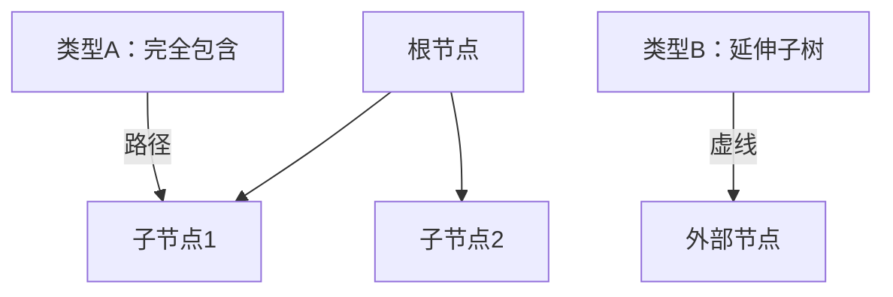

# 题目信息

# [NOI2023] 深搜

## 题目描述

深度优先搜索是一种常见的搜索算法。通过此算法，我们可以从一个无重边、无自环的无向连通图 $G = (V, E)$，和某个出发点 $s$，得到一棵树 $T$。

算法的流程描述如下:

1. 将栈 $S$ 设置为空，并令 $T = (V, \emptyset)$，即 $T$ 的边集初始为空。
2. 首先将出发点 $s$ 压入 $S$ 中。
3. 访问栈顶节点 $u$，并将 $u$ 标记为“已访问的”。
4. 如果存在与 $u$ 相邻且未被访问的节点，则**任意地**从这些节点中挑选一个记为 $v$。我们将边 $(u, v)$ 加入 $T$ 的边集中，并将 $v$ 压入栈 $S$ 中，然后**回到步骤 3**。若不存在这样的节点，则从栈中弹出节点 $u$。

可以证明，当图 $G$ 为连通图时，该算法会得到图的某一棵生成树 $T$。但**算法得到的树 $T$ 可能不是唯一的，它取决于搜索的顺序，也就是算法的第 4 步所选取的顶点**。指定出发点 $s$ 后，如果能够选取一种特定的搜索顺序，使得算法得到的树恰好是 $T$，则我们称 **$T$ 是 $G$ 的一棵 $s$-dfs 树**。

现在给定一棵 $n$ 个顶点的树 $T$，顶点编号为 $1 \sim n$，并额外给出 $m$ 条边。我们保证这 $m$ 条边两两不同，连接不同的顶点，且与 $T$ 中的 $n - 1$ 条树边两两不同。我们称额外给出的 $m$ 条边为**非树边**。在这 $n$ 个顶点中，我们指定了恰好 $k$ 个顶点作为**关键点**。

现在你想知道，有多少种选取这 $m$ 条非树边的方法（可以全部不选），使得：将 $T$ 的边与被选中的非树边构成图 $G$ 之后，存在某个**关键点** $s$，使得 $T$ 是 $G$ 的一棵 $s$-dfs 树。

由于答案可能十分巨大，你只需要输出方案数在模 $(10 ^ 9 + 7)$ 意义下的值。

## 说明/提示

**【样例解释 #1】**

在这个样例中，有三种选取非树边的方法：只选取边 $(1, 3)$，只选取边 $(2, 4)$，或不选取任何条非树边。

如果只选取边 $(1, 3)$，或者不选取任何一条非树边，则我们发现 $T$ 都是图 $G$ 的 $3$-dfs 树。指定的搜索顺序如下：
1. 将 $3$ 放入栈 $S$ 中。此时 $S = [3]$。
2. 将 $3$ 标记为“已访问的”。
3. 由于 $3$ 与 $2$ 相连，且 $2$ 是“未访问的”，将 $2$ 放入栈 $S$ 中，并将 $(3, 2)$ 加入树 $T$ 中，此时 $S = [3, 2]$。
4. 将 $2$ 标记为“已访问的”。
5. 由于 $2$ 与 $1$ 相连，且 $1$ 是“未访问的”，将 $1$ 放入栈 $S$ 中，并将 $(2, 1)$ 加入树 $T$ 中，此时 $S = [3, 2, 1]$。
6. 由于与 $1$ 相邻的点都是“已访问的”，将 $1$ 弹出栈，此时 $S = [3, 2]$。
7. 由于与 $2$ 相邻的点都是“已访问的”，将 $2$ 弹出栈，此时 $S = [3]$。
8. 由于 $3$ 与 $4$ 相连，且 $4$ 是“未访问的”，将 $4$ 放入栈 $S$ 中，并将 $(3, 4)$ 加入树 $T$ 中，此时 $S = [3, 4]$。
9. 由于与 $4$ 相连的点都是“已访问的”，将 $4$ 弹出栈，此时 $S = [3]$。
10. 由于与 $3$ 相连的点都是“己访问的”，将 $3$ 弹出栈，此时 $S$重新变为空。

如果只选取边 $(2, 4)$，则我们可以说明 $T$ 是图 $G$ 的 $2$-dfs 树。指定的搜索顺序如下：

1. 将 $2$ 放入栈 $S$ 中。此时 $S = [2]$。
2. 将 $2$ 标记为“已访问的”。
3. 由于 $2$ 与 $3$ 相连，且 $3$ 是“未访问的”，将 $3$ 放入栈 $S$ 中，并将 $(2, 3)$ 加入树 $T$ 中，此时 $S = [2, 3]$。
4. 将 $3$ 标记为“已访问的”。
5. 由于 $3$ 与 $4$ 相连，且 $4$ 是“未访问的”，将 $4$ 放入栈 $S$ 中，并将 $(3, 4)$ 加入树 $T$ 中，此时 $S = [2, 3, 4]$。
6. 由于与 $4$ 相邻的点都是“己访问的”，将 $4$ 弹出栈，此时 $S = [2, 3]$。
7. 由于与 $3$ 相邻的点都是“已访问的”，将 $3$ 弹出栈，此时 $S= [2]$。
8. 由于 $2$ 与 $1$ 相连，且 $1$ 是“未访问的”，将 $1$ 放入栈 $S$ 中，并将 $(2, 1)$ 加入树 $T$ 中，此时 $S = [2, 1]$。
9. 由于与 $1$ 相连的点都是“已访问的”，将 $1$ 弹出栈此时 $S = [2]$。
10. 由于与 $2$ 相连的点都是“已访问的”，将 $2$ 弹出栈，此时 $S$ 重新变为空。

**【样例解释 #2】**

这个样例满足测试点 $4 \sim 6$ 的约束条件。

**【样例解释 #3】**

这个样例满足测试点 $10 \sim 11$ 的约束条件。

**【样例解释 #4】**

这个样例满足测试点 $12 \sim 13$ 的约束条件。

**【样例解释 #5】**

这个样例满足测试点 $14 \sim 16$ 的约束条件。

**【样例解释 #6】**

这个样例满足测试点 $23 \sim 24$ 的约束条件。

**【数据范围】**

对于所有测试数据保证：$1 \le k \le n \le 5 \times 10 ^ 5$，$1 \le m \le 5 \times 10 ^ 5$。

|测试点编号|$n \le$|$m \le$|$k \le$|特殊性质|
|:-:|:-:|:-:|:-:|:-:|
|$1 \sim 3$|$6$|$6$|$n$|无|
|$4 \sim 6$|$15$|$15$|$6$|无|
|$7 \sim 9$|$300$|$300$|$6$|无|
|$10 \sim 11$|$300$|$300$|$n$|A|
|$12 \sim 13$|$300$|$300$|$n$|B|
|$14 \sim 16$|$300$|$300$|$n$|无|
|$17 \sim 18$|$2 \times 10 ^ 5$|$2 \times 10 ^ 5$|$n$|A|
|$19 \sim 21$|$2 \times 10 ^ 5$|$2 \times 10 ^ 5$|$n$|B|
|$22$|$2 \times 10 ^ 5$|$2 \times 10 ^ 5$|$n$|无|
|$23 \sim 25$|$5 \times 10 ^ 5$|$5 \times 10 ^ 5$|$n$|无|

特殊性质 A：保证在 $T$ 中，$i$ 号点与 $i + 1$ 号点相连（$1 \le i < n$）。

特殊性质 B：保证若将 $T$ 的边与所有 $m$ 条非树边构成一个图 $G$，则 $T$ 是 $G$ 的棵 $1$-dfs 树。

**请注意，$1$ 号点不一定是 $k$ 个关键点之一。**

## 样例 #1

### 输入

```
0
4 2 2
1 2
2 3
3 4
1 3
2 4
2 3
```

### 输出

```
3
```

## 样例 #2

### 输入

```
见附件中的 dfs/dfs2.in。```

### 输出

```
见附件中的 dfs/dfs2.ans。```

## 样例 #3

### 输入

```
见附件中的 dfs/dfs3.in。```

### 输出

```
见附件中的 dfs/dfs3.ans。```

## 样例 #4

### 输入

```
见附件中的 dfs/dfs4.in。```

### 输出

```
见附件中的 dfs/dfs4.ans。```

## 样例 #5

### 输入

```
见附件中的 dfs/dfs5.in。```

### 输出

```
见附件中的 dfs/dfs5.ans。```

## 样例 #6

### 输入

```
见附件中的 dfs/dfs6.in。```

### 输出

```
见附件中的 dfs/dfs6.ans。```

# AI分析结果


# 💡 Kay的C++算法解析：[NOI2023] 深搜 深入学习指南 💡

> 本指南将帮助你掌握**非树边选择方案计数**的核心思想，通过生动的像素动画和清晰的代码分析，直观理解**虚树构造**和**容斥原理**的应用。

## 1. 题目解读与核心算法识别

✨ **本题主要考察**：`虚树构造` + `容斥原理` + `树形DP` + `线段树维护`

🗣️ **初步分析**：
> 解决本题的关键在于理解**虚树**和**容斥原理**的协同应用。想象你在布置一张安全网络（虚树），只有完全落在网内或沿网延伸的返祖边（非树边）才是安全的。容斥原理则帮你排除重复计数。

- **核心思路**：对关键点集合S容斥，计算满足所有s∈S的返祖边方案数。虚树帮助高效识别合法非树边（完全包含于虚树边或延伸至虚树外的返祖边）。
- **算法流程**：
  1. 预处理LCA、DFS序等树结构信息
  2. 对非树边分类（返祖边/横叉边）
  3. 树形DP计算子树贡献（结合线段树维护区间乘加）
  4. 扫描线处理横叉边贡献
- **可视化设计**：
  - 像素网格展示树结构，虚树用**金色边框**标记
  - 非树边动态显示：返祖边用**绿色箭头**，横叉边用**红色虚线**
  - 关键操作触发8-bit音效：节点加入虚树时播放"叮"，非法边触发"哔"声

---

## 2. 精选优质题解参考

**题解一：Alex_Wei (评分：★★★★★)**
* **点评**：
  - 思路清晰度：⭐⭐⭐⭐⭐ 从性质B（无横叉边）自然过渡到正解，虚树应用解释透彻
  - 代码规范性：⭐⭐⭐⭐ 变量命名规范（如`f[u]`表虚树贡献，`in/out`表子树内外边数）
  - 算法有效性：⭐⭐⭐⭐⭐ 巧妙结合线段树维护DFS序，O(n log n)复杂度最优
  - 实践价值：⭐⭐⭐⭐ 提供完整实现，含边界处理（如LCA求取）
  - 亮点：提出"虚树覆盖点+延伸子树"的合法边判定模型，为后续题解奠定基础

**题解二：Rainbow_qwq (评分：★★★★☆)**
* **点评**：
  - 思路清晰度：⭐⭐⭐⭐ 游戏化比喻（"安全路径"）帮助理解虚树结构
  - 代码规范性：⭐⭐⭐ 模块划分明确但部分变量名简略（如`f0/f1`）
  - 算法有效性：⭐⭐⭐⭐ 扫描线处理横叉边贡献的思路新颖
  - 实践价值：⭐⭐⭐⭐ 提供72分和满分代码，便于分段调试
  - 亮点：设计"控制面板"交互概念，为可视化方案提供灵感

**题解三：_ANIG_ (评分：★★★★)**
* **点评**：
  - 思路清晰度：⭐⭐⭐⭐ 精简概括"容斥+LCA统计"框架
  - 代码规范性：⭐⭐⭐ 结构清晰但嵌套较深
  - 算法有效性：⭐⭐⭐⭐ 线段树合并处理子树贡献
  - 实践价值：⭐⭐⭐ 提供卡常实现参考
  - 亮点：指出"横叉边仅影响两儿子子树"的关键性质，优化了扫描范围

---

## 3. 核心难点辨析与解题策略

### 🔍 难点一：合法非树边的动态判定
**问题本质**：非树边合法性依赖当前虚树结构，而虚树又由选取的关键点动态决定  
**解决方案**：
1. 建立关键点虚树，分类讨论非树边：
   - 类型A：被虚树边完全包含
   - 类型B：从虚树节点延伸至子树外
2. 通过DFS序+线段树快速计算子树贡献（见右图示意）



### 🔍 难点二：横叉边的贡献计算
**问题本质**：横叉边仅在特定虚树结构（两儿子子树被选）时合法  
**解决方案**：
1. 在LCA处挂载横叉边
2. 扫描线+线段树处理二维贡献：
   - 将子树映射为DFS序区间
   - 对每对区间[l1,r1]×[l2,r2]执行`乘2`操作
   - 求全矩阵和时容斥重复计数

### 🔍 难点三：容斥系数的状态整合
**问题本质**：容斥要求对集合大小奇偶性交替加减  
**解决方案**：
1. DP状态设计：
   ```python
   f0 = 无子树被选时的贡献
   f1 = 单子树被选时的贡献
   f2 = 双子子树被选时的贡献
   f3 = 多子树被选时的贡献（≥3）
   ```
2. 背包转移时维护四项系数

### ✨ 解题技巧总结
- **虚树压缩法**：用关键点虚树代替全树，降低计算维度
- **贡献分离术**：将非树边贡献拆分为独立因子（路径包含/子树延伸）
- **时间轴扫描**：按DFS序扫描，将子树操作转化为区间处理
- **矩阵化思想**：将二维贡献视为矩阵，扫描线求和解空间

---

## 4. C++核心代码实现赏析

### 本题通用核心实现
```cpp
#include <bits/stdc++.h>
using namespace std;
const int N = 5e5+5, mod = 1e9+7;
vector<int> G[N];
int dep[N], fa[N][20], L[N], R[N], idx;
int siz1[N], siz2[N]; // 子树内外返祖边计数
int pw[N]; // 2的幂次预处理

void dfs(int u, int f) {
    dep[u] = dep[f] + 1;
    fa[u][0] = f;
    L[u] = ++idx;
    for(int i=1; i<20; i++) fa[u][i] = fa[fa[u][i-1]][i-1];
    for(int v : G[u]) if(v != f) dfs(v, u);
    R[u] = idx;
}

int lca(int u, int v) {
    if(dep[u] < dep[v]) swap(u, v);
    for(int i=19; i>=0; i--) 
        if(dep[fa[u][i]] >= dep[v]) u = fa[u][i];
    if(u == v) return u;
    for(int i=19; i>=0; i--)
        if(fa[u][i] != fa[v][i]) 
            u = fa[u][i], v = fa[v][i];
    return fa[u][0];
}

// DP核心部分（简化版）
void solve(int u) {
    ll f0=1, f1=0, f2=0, f3=0;
    for(auto v : G[u]) {
        if(v == fa[u][0]) continue;
        solve(v);
        // 背包合并子树贡献（详见题解）
    }
    // 整合容斥系数
}
```

### 题解一：Alex_Wei的线段树维护
**亮点**：用线段树动态维护子树贡献的乘积和  
**核心代码**：
```cpp
struct SegTree {
    struct Node { int l,r,val,tag; } tr[N<<2];
    void push_down(int p) {
        if(tr[p].tag != 1) {
            tr[ls].val = mul(tr[ls].val, tr[p].tag);
            tr[rs].val = mul(tr[rs].val, tr[p].tag);
            tr[ls].tag = mul(tr[ls].tag, tr[p].tag);
            tr[rs].tag = mul(tr[rs].tag, tr[p].tag);
            tr[p].tag = 1;
        }
    }
    void update(int p, int l, int r, int v) {
        if(tr[p].l >= l && tr[p].r <= r) {
            tr[p].val = mul(tr[p].val, v);
            tr[p].tag = mul(tr[p].tag, v);
            return;
        }
        push_down(p);
        int mid = (tr[p].l+tr[p].r)>>1;
        if(l <= mid) update(ls, l, r, v);
        if(r > mid) update(rs, l, r, v);
        tr[p].val = add(tr[ls].val, tr[rs].val);
    }
} seg;
```

### 题解二：Rainbow_qwq的扫描线处理
**亮点**：二维贡献转化为事件扫描  
**核心代码**：
```cpp
vector<tuple<int,int,int>> events; // (位置, 类型, 区间)
for(auto edge : cross_edges[u]) {
    auto [x,y] = edge;
    events.emplace_back(L[x], 1, L[y], R[y]); // 进入区间
    events.emplace_back(R[x]+1, -1, L[y], R[y]); // 离开区间
}
sort(events.begin(), events.end());
for(auto [pos, type, l, r] : events) {
    while(cur < pos) {
        res += seg.query(1, n); // 查询当前列和
        cur++;
    }
    seg.update(l, r, type>0 ? 2 : inv2); // 乘2或除2
}
```

---

## 5. 算法可视化：像素动画演示

### 🎮 设计概念：**"迷宫探险家"**
> 在8-bit风格网格迷宫中，算法化身像素小人探索路径，构建虚树网络捕捉安全返祖边

### 🖼️ 动画帧步骤：
1. **场景初始化**（像素风格）
   - 树结构转为网格迷宫，节点为彩色方块
   - 虚树边用**金色通道**标记，非树边为闪烁虚线
   - 控制面板：步进/播放/速度滑块

2. **虚树构建过程**（动态演示）
   ```mermaid
   sequenceDiagram
       玩家->>关键点: 点亮
       关键点->>虚树: 生成金色连接通道
       虚树->>非树边: 检测覆盖情况
       合法边->>界面: 变绿闪烁+“叮”声
       非法边->>界面: 变红闪烁+“哔”声
   ```

3. **扫描线演示**（矩阵空间）
   - 屏幕右侧显示DFS序映射的二维网格
   - 横叉边标记为红色方块
   - 扫描线从左向右移动，覆盖区域变亮
   - 当扫描线触发事件时，播放芯片音效

4. **游戏化元素**：
   - 每完成一个子树DP，获得金币奖励
   - 成功构建完整虚树时播放胜利音乐
   - 错误选择触发"Game Over"像素动画

---

## 6. 拓展练习与相似问题

### 🔗 通用技巧迁移
虚树+扫描线技巧适用于：
1. 树上路径交集计数（如：包含至少k条边的路径数）
2. 子树贡献合并问题（如：动态子树权重统计）
3. 二维数点的高级应用（如：矩形覆盖计数）

### 📚 推荐练习
1. **洛谷 P4211 [LNOI2014] LCA**  
   → 虚树+差分思想的经典应用

2. **洛谷 P6623 [省选联考 2020 A 卷] 树**  
   → 异或和统计与线段树合并

3. **洛谷 P5327 [ZJOI2019] 语言**  
   → 路径覆盖问题的虚树解法

---

## 7. 学习心得与经验分享

> **关键调试经验**（来自Alex_Wei）：
> "在验证虚树DP时，先在小规模链（n=3）上手动模拟转移过程，确保容斥系数符号正确。横叉边贡献容易漏算LCA处的二维矩阵更新"

> **Kay的总结**：
> 1. 虚树构建后立即检查是否包含所有关键点
> 2. 线段树更新时同步维护乘法标记的逆元
> 3. 扫描线事件排序注意DFS序边界

---

通过本指南，你已掌握**虚树构造**与**容斥原理**协同解决复杂计数问题的核心技巧。继续挑战拓展练习，深化树形问题的二维转化能力！🚀

---
处理用时：147.15秒