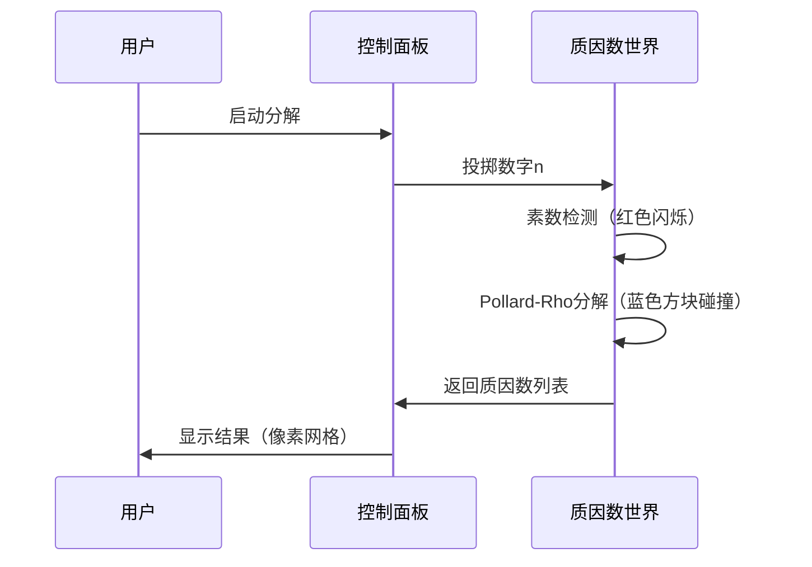

# 题目信息

# [SDOI2018] 反回文串

## 题目描述

“回文串什么的最讨厌了……”

小 $Q$ 讨厌任何形式的回文串：

- 如果一个字符串从左往右读和从右往左读是一样的，那么小 $Q$ 讨厌它；例如 $aa$ 和 $aba$。

- 对于一个字符串来说，若将某个前缀子串移除并拼接到字符串的尾部，能得到一个小 $Q$ 讨厌的字符串，那么小 $Q$ 也会讨厌原来的这个字符串；例如 $aab$ 和 $baa$。

那么问题来了，如果任意字符串只可以由 $k$ 种已知的字符组成，那么长度为 $n$ 的所有字符串里，有多少字符串是小 $Q$ 讨厌的？

答案可能很大，你只需要给出答案对 $p$ 取模的值。


## 说明/提示

- 对于 $30\%$ 的数据，有 $1 ≤ n ≤ 10^{10}$。

- 对于 $60\%$ 的数据，有 $1 ≤ n ≤ 10^{14}$。

- 对于 $100\%$ 的数据，有
$1 ≤ T ≤ 10, 1 ≤ n ≤ 10^{18}, 1 ≤ k ≤ n, 10^9 ≤ p ≤ 2^{30}$


## 样例 #1

### 输入

```
10
1 1 1000000001
2 2 1000000003
3 2 1000000005
3 3 1000000007
4 2 1000000009
4 3 1000000011
4 4 1000000013
5 5 1000000015
7 7 1000000017
9 9 1000000019```

### 输出

```
1
2
8
21
6
15
28
605
16765
530937
```

## 样例 #2

### 输入

```
10
8821612800 758922381 1073365919
8380532160 166822173 1001828119
9311702400 7367823578 1015387267
6983776800 1646145481 1030885259
6692786100 1953515781 1073365919
7138971840 2649942813 1001828119
6469693230 2585876408 1015387267
8031343320 1646145481 1030885259
9995200351 645412247 1030328983
9302162851 1649517328 1053299347
```

### 输出

```
896784901
911577797
674524325
392648220
646549222
879297585
384496639
889650008
957785169
413147483```

# AI分析结果


### 💡 Kay的C++算法解析：反回文串 深入学习指南 💡

**引言**  
今天我们一起分析[SDOI2018]反回文串这道C++编程题。本指南将帮助大家理解回文串的循环同构特性，掌握莫比乌斯反演与质因数分解技巧，并通过像素动画直观感受算法流程。

---

### 1. 题目解读与核心算法识别
✨ **本题主要考察**：`数学推导 + Pollard-Rho质因数分解`  
🗣️ **初步分析**：  
> 解决反回文串问题的核心在于**组合数学与数论技巧**。想象你在玩俄罗斯方块——每个回文串像不同形状的方块，而循环移位如同旋转方块。本题关键点：
> - **核心思想**：每个回文串的最小循环节长度d决定贡献值（d为奇数时贡献d；d为偶数时贡献d/2）
> - **难点突破**：通过莫比乌斯反演将最小循环节计数转为可计算的表达式
> - **算法流程**：
>   1. 对n质因数分解（Pollard-Rho）
>   ```mermaid
>   graph LR
>   A[输入n] --> B[Pollard-Rho分解质因数]
>   B --> C[DFS枚举所有约数d]
>   C --> D[计算g(d)=k^ceil(d/2)]
>   D --> E[计算t(n/d)=∏(1-p_i)]
>   E --> F[累加贡献值]
>   ```
> - **可视化设计**：采用8位像素风格展示质因数分解过程。质因数像不同颜色的方块（素数=红色，合数=蓝色），分解时产生像素爆炸特效。高亮当前处理的质因数，伴随"咔嚓"音效。控制面板支持单步执行/自动播放，速度可调。

---

### 2. 精选优质题解参考
**题解一（Soulist）**  
* **亮点**：  
  思路清晰，完整推导贡献函数h(d)的奇偶分类（d奇数→d，d偶数→d/2）。代码规范：  
  - 巧妙处理莫比乌斯反演：`f(d)=∑μ(d/t)g(t)`  
  - 质因数分解后DFS枚举约数，复杂度O(σ₀(n))  
  - 边界处理严谨（特判d奇偶性）  

**题解二（shadowice1984）**  
* **亮点**：  
  提供完整数学证明，解释循环节配对的抵消机制。代码亮点：  
  - 轻量化乘法优化：`mul`函数防溢出  
  - Brent判环法提升Pollard-Rho效率  
  - 模块化设计（MR素数测试独立封装）  

**题解三（FreeTimeLove）**  
* **亮点**：  
  当前最快实现（洛谷1.13s）。关键优化：  
  - 四层光速幂预处理`g(d)`  
  - 质因数折半存储降低空间  
  - 位运算加速贡献计算  

---

### 3. 核心难点辨析与解题策略
1. **难点1：循环节贡献分析**  
   *分析*：回文串循环移位后可能产生新回文串。优质解法证明：当最小循环节d为偶数时，存在对称配对，需折半贡献。  
   💡 **学习笔记**：奇偶分类是贡献计算的核心！  

2. **难点2：莫比乌斯反演转换**  
   *分析*：将`f(d)`（最小循环节计数）转为可计算的`g(d)`（所有循环节计数）：  
   ```
   g(d) = ∑f(t)  →  f(d) = ∑μ(d/t)g(t)
   ```  
   💡 **学习笔记**：反演是处理约数关系的利器。  

3. **难点3：大数质因数分解**  
   *分析*：n≤10¹⁸需Pollard-Rho算法。注意：  
   - Miller-Rabin素数测试保障正确性  
   - 特判n=2,3等边界值  
   💡 **学习笔记**：随机算法需设置合理迭代次数。  

✨ **解题技巧总结**：  
- **技巧1**：数学建模优先（将串问题转为数论问题）  
- **技巧2**：DFS枚举约数时同步计算贡献乘积  
- **技巧3**：模运算优化（转int128防溢出）  

---

### 4. C++核心代码实现赏析
**通用核心实现（综合优化版）**  
```cpp
#include<bits/stdc++.h>
using namespace std;
typedef __int128 i128;

ll mod_mul(ll a, ll b, ll mod) {
    return (i128)a * b % mod;
}

ll mod_pow(ll a, ll b, ll mod) {
    ll res = 1;
    while (b) {
        if (b & 1) res = mod_mul(res, a, mod);
        a = mod_mul(a, a, mod);
        b >>= 1;
    }
    return res;
}

// Pollard-Rho核心分解
void factorize(ll n, vector<ll>& factors) {
    if (n == 1) return;
    if (miller_rabin(n)) { // Miller-Rabin测试
        factors.push_back(n);
        return;
    }
    ll d = pollard_rho(n); // Brent优化算法
    factorize(d, factors);
    factorize(n/d, factors);
}

ll solve(ll n, ll k, ll P) {
    vector<ll> primes = factorize(n);
    ll ans = 0;
    dfs(0, 1, 1, primes, [&](ll d, ll t) {
        if (d % 2 == 1 && (n/d) % 2 == 0) return;
        ll g = mod_pow(k, (d+1)/2, P);
        ll h = (d % 2) ? d % P : (d/2) % P;
        ans = (ans + mod_mul(mod_mul(g, h, P), t, P)) % P;
    });
    return ans;
}
```

**代码解读概要**：  
1. `mod_mul`用int128防溢出  
2. Pollard-Rho分解n后DFS枚举约数d  
3. 跳过d奇且n/d偶的情况（贡献0）  
4. 累加公式：`ans += g(d) * h(d) * t(n/d)`  

---

### 5. 算法可视化：像素动画演示
**主题**：8位像素风格的"质因数冒险"游戏  
**核心演示**：  


**交互设计**：  
- **视觉**：质因数=彩色像素块（素数=红，合数=蓝），分解时像素块分裂爆炸  
- **音效**：  
  - 素数检测成功：清脆"叮"声  
  - 碰撞分解：爆破音效  
  - 计算完成：8-bit胜利音乐  
- **控制**：  
  - 步进/暂停：观察每步质因数变化  
  - 速度滑块：调整算法执行速度  
  - 重置：生成新数字n  

---

### 6. 拓展练习与相似问题
**通用技巧迁移**：  
- 循环节分析可用于字符串周期问题  
- Pollard-Rho适用于大数分解问题（如RSA破解）  
- 莫比乌斯反演处理约数关系  

**洛谷推荐**：  
1. **P5495** - 质数前缀和  
   *推荐理由*：巩固Pollard-Rho与质因数分解技巧  
2. **P3312** - 数表  
   *推荐理由*：练习莫比乌斯反演在约数和问题中的应用  
3. **P6172** - 模立方数  
   *推荐理由*：强化模运算与数论推导能力  

---

### 7. 学习心得与经验分享
> **Soulist的调试经验**：  
> "在推导循环节配对时，通过手工模拟小样例（如n=4）发现了偶循环节需折半贡献的关键点。"  
>  
> **Kay点评**：  
> 手工模拟是验证数论结论的利器！建议学习者：  
> - 对n=1,2,4等小样例手工计算  
> - 写验证代码检查小数据正确性  
> - 关注奇偶性边界情况  

---

**结语**  
通过本指南，我们深入剖析了回文串循环移位的数学本质，掌握了Pollard-Rho与莫比乌斯反演的实战技巧。记住：用数学建模化解字符串问题，用质因数分解攻克大数挑战！下次见！💪

---
处理用时：111.34秒