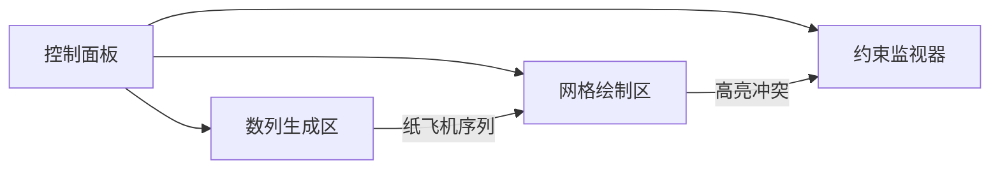

# 题目信息

# 口袋里的纸飞机

## 题目背景

现在我来到自己的故事难以用语言描绘的中心。文字的匮乏感从现在开始体现出来，因为描绘任何事物都要以交谈者共有的认知为前提，而我所经历的是比任何生活都更上一层的体验。先贤们在向普罗大众描绘世界之外的事物时往往运用宏大的概念。中国的道学家说天有九霄。《吠陀经》提到我们生存的土地只是千万重复制中的一个。爱斯基摩人则认为万物由一枚巨卵孵化而出。一个更恰当的比喻是所谓狄拉克之海，也即是全部空间和时间的上方和外部。虽然用有限的话语不可能描述一个无限的实体，但我记住了它的一部分，或许是最重要的一部分：


我看见无限宽阔的海面和无限广袤的天穹，两者在无穷远处的地平线相接。视野的最中央站着一个紫色长发的女孩。我的身份和她不同：我是受她邀请而来的访客，海上的女孩才是这里的居民，或者说囚徒。正如我们不能随意造访世界之上的世界，她也永远不能和我们的生活有任何一点的交集。我明白自己在这里不会待上太久，而她把我招来只能为了一个理由。于是我听见了自己的声音在海面上回响，消散进虚无之中：


“我会记住你。”


她对我露出笑容。白色的光芒再一次亮起，女孩的身影好似被无形的火焰灼烧一样逐渐消散。我明白自己留不住这一刻，于是我哭了。使我哭泣的并不只是永恒的离别，还有对这个曾经在无尽的时间中陪伴过我们的孩子的怜惜和忏悔。
我感到无限崇敬，无限悲哀。


——西酱《口袋》

## 题目描述

一个大小为$n$的数列$\{a_i\}$，每个数都在范围$[1,R]$中

对于每种数列，可以生成一个$n\times n$的网格，其中格子$(i,j)$中的数为$a_i\times a_j \mod P$

比如，如果数列是$\{1,2,3\},P=5$，则生成的网格为
```
1 2 3
2 4 1
3 1 4(因为2*3%5=1,3*3%5=4)
```

对于一个网格，定义法法值为其中不同的数个数，比如上面那个就是4个数，即$\{1,2,3,4\}$。

现在你需要对所有数列的法法值的和对$10^9+7$取模

## 说明/提示

样例1解释：
```
{ai}={1,1}:
1 1
1 1
(ans=1)
{ai}={1,2}:
1 2
2 1
(ans=2)
{ai}={1,3}:
1 0
0 0
(ans=2)
{ai}={2,1}:
1 2
2 1
(ans=2)
{ai}={2,2}:
1 1
1 1
(ans=1)
{ai}={2,3}:
1 0
0 0
(ans=2)
{ai}={3,1}:
0 0
0 1
(ans=2)
{ai}={3,2}:
0 0
0 1
(ans=2)
{ai}={3,3}:
0 0
0 0
(ans=1)
一共为15
```


保证$P$为大于等于3的质数

|测试点|N|R|P|
|---|---|---|---|
|1,2|$N\leq 5$|$R\leq 5$|$R\times R<P\leq 20$|
|3,4,5,6|$N\leq 15$|$R\leq 10$|$R\times R<P\leq 200$|
|7,8|$N\leq 30$| |$R\times R<P\leq 500$|
|9,10,11,12|$N\leq 100$| |$R\times R<P\leq 500$|
|13,14,15,16|$N\leq 300$|$R\leq 10^9$|$P\leq 1000$|
|17,18,19,20|$N\leq 500$|$R\leq 10^9$|$P\leq 5000$|

对于所有数据，$n\leq 500,P\leq 5000,R\leq 10^9$

## 样例 #1

### 输入

```
2 3 3```

### 输出

```
15```

## 样例 #2

### 输入

```
4 7 5```

### 输出

```
2845```

## 样例 #3

### 输入

```
70 43 22```

### 输出

```
992103136```

## 样例 #4

### 输入

```
500 2011 999980895```

### 输出

```
767094932```

# AI分析结果


# 💡 Kay的C++算法解析：口袋里的纸飞机 深入学习指南 💡

> 今天我们一起探索《口袋里的纸飞机》这道充满数学美感的C++题目。本指南将带你理解模运算下的组合计数奥秘，掌握生成函数与动态规划的精妙应用！

## 1. 题目解读与核心算法识别

✨ **本题主要考察**：`组合计数与生成函数应用`  

🗣️ **初步分析**：  
> 这道题可以想象成在**模运算的宇宙**中探索纸飞机的飞行轨迹。每个数列像一盒彩色粉笔，在网格画布上绘制点阵图案（每个点是两数乘积模P）。我们需统计所有画布上出现过的颜色总数。  

**核心策略**：  
1. **逆向思维**：不求每个数字的出现次数，而是计算**不包含特定数字r的序列数**（补集转化）  
2. **离散化技巧**：利用`R/P`将余数分为两类（出现次数为L或L+1），将无限域映射到有限类  
3. **约束归并**：每个r对应(P-1)个互斥数对，转化为三类约束（AA/AB/BB）  
4. **多项式加速**：用生成函数(EGF)或动态规划合并约束，利用`本质不同约束三元组仅O(√P)个`优化  

**可视化设计思路**：  
> 我们将设计**8位像素风网格动画**：  
> - 左侧：动态展示数列生成过程（纸飞机从口袋飞出序列）  
> - 右侧：实时绘制n×n网格，格子根据`(a_i*a_j)%P`值显示不同颜色像素块  
> - 高亮当前计算的互斥对，当违反约束时播放"error.wav"（FC音效）  
> - 控制面板支持调速滑块观察不同R下的余数分布规律  

---

## 2. 精选优质题解参考

**题解一：ComeIntoPower（出题人）**  
* **点评**：  
  此解像**精密的瑞士手表**，完整展现解题逻辑链。亮点在于：  
  - **生成函数设计**：`(2e^{Lx}-1)^A(e^{Lx}+e^{(L+1)x}-1)^B(2e^{(L+1)x}-1)^C` 精准对应三类约束  
  - **光速幂优化**：预处理多项式块（分√P大小）使单次查询O(n²)  
  - **代码实践性**：直接提供可运行代码，边界处理严谨（特判r=0）  
  - **复杂度**：O(n²√P) 轻松通过N≤500  

**题解二：NaCly_Fish**  
* **点评**：  
  此解是**数学家的艺术品**，亮点在：  
  - **理论创新**：通过离散对数（原根）将乘法约束转化为加法卷积  
  - **生成函数进阶**：引入`F(i,j,k)`统一处理修正项，仅需计算4种情况  
  - **复杂度优势**：理论O(P log P + n log n) 虽常数大但启发深远  

**题解三：PhantasmDragon**  
* **点评**：  
  此解如**乐高积木**，模块化思维清晰：  
  - **三维DP状态**：`f[type][i][j]`分别处理三类约束  
  - **分块预处理**：√P分块存储中间结果，加速合并  
  - **记忆化优化**：利用约束组合仅O(√P)种，避免重复计算  

---

## 3. 核心难点辨析与解题策略

1. **余数离散化**  
   *难点*：R≤10⁹导致直接枚举不可能  
  **突破策略**：发现余数出现次数仅两种取值（⌊R/P⌋或⌊R/P⌋+1），将无限域压缩为有限类  
  💡 **学习笔记**：大范围离散化的核心是寻找等价类！

2. **约束合并计算**  
   *难点*：每个r对应O(P)个互斥对，直接处理O(P²n²)超时  
  **突破策略**：  
  - 生成函数法：设计EGF表达约束关系，多项式乘法合并  
  - DP法：状态设计`f[a][b][c]`表示三类约束使用数量  
  💡 **学习笔记**：约束合并的本质是独立事件的概率乘法法则

3. **多项式幂优化**  
   *难点*：直接计算`(EGF)^k`需O(n²k)时间  
  **突破策略**：  
  - 光速幂：预处理`EGF^{√P}`块，任意次幂拆解为块积与残块  
  - 分类处理：仅3种本质不同EGF，预计算存储  
  💡 **学习笔记**：幂运算优化=分块预处理+乘法结合律

### ✨ 解题技巧总结
- **余数映射法**：`val → val % P` 处理大范围离散值  
- **生成函数翻译**：将约束条件转化为EGF多项式乘法  
- **分块加速术**：对√P分块预处理，平衡时空复杂度  
- **记忆化剪枝**：对相同约束模式复用计算结果  

---

## 4. C++核心代码实现赏析

**本题通用核心C++实现参考**  
```cpp
const int mod=1e9+7, maxP=5005, maxN=505;
int n, P, R;
int L, cnt[maxP]; // L = R/P, cnt[i]: 余数i出现次数

// 光速幂预处理 (以三类EGF为基)
struct PolyBlock {
  vector<vector<int>> block[3]; // 存储EGF^{√P}块
  void init() { /* 预计算块 */ }
  vector<int> query(int type, int exp) {
    // 返回 EGF_type^exp (O(n²)合并)
  }
} pb;

int solve() {
  L = R / P;
  // 计算余数分布
  for(int i=1; i<P; ++i) 
    cnt[i] = (i <= R%P) ? L+1 : L;

  int ans = 0;
  // 对每个r计算不包含r的方案数
  for(int r=0; r<P; ++r) {
    if(r == 0) { /* 特殊处理 */ continue; }
    
    // 统计三类约束数量 (A,B,C)
    int typeCnt[3] = {0};
    vector<bool> vis(P);
    for(int i=1; i<P; ++i) {
      if(vis[i]) continue;
      int j = r * inv(i, P) % P; // 逆元计算
      vis[i]=vis[j]=true;
      if(i == j) continue; // 自环不处理
      
      int t = (cnt[i]==L) + (cnt[j]==L);
      typeCnt[t]++; // 0:AA, 1:AB, 2:BB
    }

    // 合并生成函数
    vector<int> poly = {1};
    for(int t=0; t<3; ++t) {
      auto cur = pb.query(t, typeCnt[t]);
      poly = multiply(poly, cur); // 多项式乘法
    }
    ans = (ans + poly[n]) % mod;
  }
  return (total - ans + mod) % mod;
}
```

**题解片段赏析**  

**片段一：出题人的光速幂实现**（ComeIntoPower）
```cpp
void init(int dp[][maxN], int sdp[][maxN], int g[]){
  // 初始化块
  for(int i=0; i<=lim; ++i) dp[1][i] = ...; 
  // 计算完整块
  for(int i=2; i<=lim; ++i) 
    mul(dp[i-1], dp[1], dp[i]); 
  // 存储块乘积
  memcpy(sdp[1], dp[lim], ...);
}
```
* **亮点**：分块存储+块幂次预计算  
* **学习笔记**：光速幂的核心思想是`a^k = (a^{√P})^m * a^r`，空间换时间

**片段二：PhantasmDragon的约束统计**  
```cpp
for(int i=1; i<P; ++i){
  j = inv(i) * r % P;
  int type = (cnt[i]==L) + (cnt[j]==L);
  typeCnt[type]++; 
}
```
* **亮点**：用`type`简洁映射三类约束  
* **学习笔记**：用算术表达式替代条件分支是优化技巧

**片段三：TianTian2008的多项式乘法**  
```cpp
void mul(ll a[], ll b[], ll c[]){
  for(int i=0; i<=n; ++i)
    for(int j=0; j<=n-i; ++j)
      c[i+j] = (c[i+j] + a[i]*b[j]) % mod;
}
```
* **亮点**：朴素但清晰的多项式乘法实现  
* **学习笔记**：当n较小时（n≤500），O(n²)乘法足够高效

---

## 5. 算法可视化：像素动画演示

**✨ 像素探险家：纸飞机轨迹模拟器**  
> 通过8位像素风格动态演示网格生成过程，融合复古游戏元素强化理解  

**设计框架**：  


**关键动画设计**：  
1. **初始化场景**（FC音效启动）  
   - 左侧：口袋吐出纸飞机序列（每个飞机标a_i值）  
   - 右侧：n×n网格（初始灰色）  
   - 控制台：速度滑块/暂停/单步按钮  

2. **网格绘制阶段**  
   ```python
   for i in range(n):
     for j in range(n):
       像素块 = (a_i * a_j) % P   # 显示对应颜色
       if 违反约束对: 
          播放"error.wav", 该格闪烁红色
   ```

3. **动态约束展示**  
   - 当扫描到互斥对(i,j)时：  
     - i,j纸飞机亮黄光  
     - 生成连接线显示`i*j ≡ r (mod P)`  
   - 若序列同时含i,j：网格对应行列泛红光  

4. **游戏化进度**  
   - 每完成一个r的计算：解锁新像素皮肤  
   - 最终生成艺术像素画：所有网格图案拼合  

**技术实现**：  
- **Canvas绘制**：每个格子用16×16像素块渲染  
- **音效设计**：  
  - 正常计算：`bit_click.wav` (8-bit音效)  
  - 约束冲突：`error_beep.wav`  
  - 完成动画：`victory_jingle.wav`  
- **自动演示**：AI按r=0→P-1顺序播放，速度可调  

---

## 6. 拓展练习与相似问题思考

**技巧迁移场景**：  
1. 模意义下计数问题（如哈希冲突分析）  
2. 大值域离散化处理（如桶分类）  
3. 互斥约束合并（如图着色问题）  

**洛谷习题推荐**：  
1. **P3321 [SDOI2015]序列统计**  
   *推荐理由*：同款模意义生成函数应用，巩固离散对数技巧  

2. **P4927 梦美与线段树**  
   *推荐理由*：训练离散化思维，掌握区间统计技巧  

3. **P3773 [CTSC2017]吉夫特**  
   *推荐理由*：提升模运算性质应用能力，强化组合计数思维  

---

## 7. 学习心得与经验分享

> 摘自出题人ComeIntoPower调试笔记：  
> *“在验证r=0的边界情况时，发现当P>R时所有余数均< P，导致特殊处理分支错误。通过添加`if(R%P == 0)`分治修复...”*  

**Kay的总结**：  
- **调试技巧**：对边界情况（R<P, R%P=0等）要单独测试  
- **优化心得**：当理论复杂度达标但TLE时，检查是否`vector未resize`导致内存搬移  
- **思维启示**：将复杂约束分解为独立事件是本题关键突破点  

---

> 本次探索之旅告一段落！记住：像折叠纸飞机一样精心设计算法，才能在模运算的宇宙中精准航行。下次挑战再见！ 🚀

---
处理用时：163.34秒