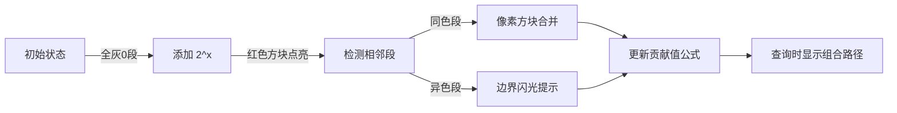

# 题目信息

# 【MX-X3-T7】「RiOI-4」Re：End of a Dream

## 题目背景

原题链接：<https://oier.team/problems/X3H>。

---


（图片来自 phigros 曲绘，侵删。）

还是来谈点现实的吧。

身边的同学 NOI 拿了 Ag，APIO 捧了杯，省选啥的也比小 $\iiint$ 好。小 $\iiint$ 说，他的时间花在游戏上了。可看看隔壁提前招进高中的，florr 号里都有 Super Ant Egg 了。小 $\iiint$ 说，他网不好，实力发挥不出来。可再看隔壁 i wanna 大神，都开始速通 i wanna be the guy 了。小 $\iiint$ 争道，他也没打多久游戏，只是在专心文化课。但是成绩一拉出来，成了信竞班垫底。小 $\iiint$ 又说，可能是时间花在社交上了吧。大家都觉得他很幽默，因为他在班里一个朋友都没有。

小 $\iiint$ 不明白为什么会这样。

今年对于小 $\iiint$ 来说，可能就是他 OI 生涯的最后一年了。一年太短，能补救多少？能挽回多少？当年他刚学 OI 时，就暗暗地下定决心，要成为大家口中的“神犇”。三年过去，前途仍是一片昏暗。

这或许就是，$\color{#CD0000}\overset{\text{End of a Dream}}{\text{梦\ 的\ 终\ 结}}$。

也许，**梦是反着的吧。**

……

但是这里是梦熊周赛题目，不是出题人拿来写批话的地方，所以小 $\iiint$ 需要你做一道计数题。

## 题目描述

给定 $n,q$。现有一个初始为 $0$ 的整数 $m$。你需要支持以下操作：

- `0 x`：将 $m$ 加上 $2^x$。
- `1 x`：将 $m$ 减去 $2^x$。若 $m<2^x$，则忽略此操作。
- `2`：查询有多少长度为 $n$、每个数都在 $1\sim m$ 中的严格递增正整数序列，使得其前缀异或和与后缀异或和均严格递增。答案对 $998\,244\,353$ 取模。

其中，一个序列 $a_1,a_2,\cdots,a_n$ 的**前缀异或和**是指序列 $s_1,s_2,\cdots,s_n$，满足 $s_i=\begin{cases}a_1&i=1\\a_{i}\oplus s_{i-1}&i\ge2\end{cases}$，而其**后缀异或和**是指序列 $t_1,t_2,\cdots,t_n$，满足 $t_i=\begin{cases}a_n&i=1\\a_{n-i+1}\oplus t_{i-1}&i\ge2\end{cases}$，其中 $x\oplus y$ 表示 $x$ 与 $y$ 的按位异或。

## 说明/提示

**【样例解释 #1】**

查询时 $m=7$，满足要求的序列为 $\{1,2,4\}$ 和 $\{1,3,5\}$，可以证明不存在其他解。

注意，序列 $\{1,3,1\}$ 是不满足要求的，尽管其前、后缀异或和均为严格递增数列 $\{1,2,3\}$，该序列本身并不满足严格递增的限制。

**【数据范围】**

**本题开启捆绑测试。**

|子任务|分数|$n\le$|$q\le$|$x\le$|特殊性质|
|:-:|:-:|:-:|:-:|:-:|:-:|
|$1$|$5$|$5$|$10$|$10$||
|$2$|$10$|$10^3$|$10^3$|$10^3$||
|$3$|$11$|$10^3$|$2\times10^5$|$10^5$|AB|
|$4$|$14$|$10^5$|$2\times10^5$|$10^5$|AB|
|$5$|$16$|$10^7$|$10^2$|$10^7$|B|
|$6$|$19$|$10^7$|$2\times10^5$|$10^7$|B|
|$7$|$25$|$10^7$|$2\times10^5$|$10^7$||

特殊性质 A：仅有最后一次操作为 `2` 操作。  
特殊性质 B：不包含 `1` 操作。

对于 $100\%$ 的数据，$3\le n\le 10^7$，$1\le q\le 2\times10^5$，$0\le x\le 10^7$。

## 样例 #1

### 输入

```
3 4
0 0
0 1
0 2
2```

### 输出

```
2```

## 样例 #2

### 输入

```
20 15
0 1
0 2
0 21
0 5
2
0 15
1 18
0 7
0 8
0 25
2
1 22
0 12
0 13
2```

### 输出

```
313288290
39181640
134388812```

# AI分析结果


### 💡 Kay的C++算法解析：「RiOI-4」Re：End of a Dream 深入学习指南 💡

**题目解读与核心算法识别**  
✨ **本题主要考察**：组合计数与动态维护（位运算+平衡树优化）  
🗣️ **初步分析**：  
> 这道题的核心在于将复杂的序列条件转化为可计算的组合问题。想象你有一排灯泡（二进制位），每次操作会点亮或熄灭特定位置的灯泡（添加/删除 \(2^x\)）。我们需要计算在特定灯泡配置下，能组成多少种满足"灯泡亮度严格递增且开关模式符合奇偶性"的数字序列。  
> - **关键转化**：序列严格递增且前后缀异或和递增 → 每个数字的最高位位置严格递增，且每位上必须有奇数个1  
> - **维护难点**：动态位修改需高效维护值域段，这里用平衡树将值域划分为0/1段（如同拼图碎片）  
> - **可视化设计**：采用8位像素风格展示值域段变化（灰色=0段，彩色=1段）。添加/删除时播放"放置/消除"音效，平衡树合并分裂时显示像素块动画，查询时展示当前序列计数公式 \(2^{\sum b_i-n+1}\)  

---

### 2. 精选优质题解参考
**题解（作者：Register_int）**  
* **点评**：  
  解法将复杂条件转化为清晰的组合模型（最高位单调+奇偶性约束），思路深刻且具有启发性。代码采用模块化设计：  
  - **预处理优化**：阶乘/逆元数组实现 \(O(1)\) 组合数查询（`q_binom`）  
  - **数据结构创新**：双平衡树（`t0`维护0段，`t1`维护1段）动态管理值域碎片  
  - **操作封装**：`insert_0/erase_0` 等函数严格处理段合并/分裂逻辑  
  - **边界严谨**：删除前检查 \(2^x\) 存在性（`del`函数中的边界校验）  
  亮点在于将组合计数抽象为逆序对模型（\(f(n)=(2^{n+1}-1)f(n-1)\)），并通过平衡树实现 \(O(\log q)\) 动态维护。

---

### 3. 核心难点辨析与解题策略
1. **条件转化与建模**  
   * **难点**：将序列严格递增+异或约束转化为可计算的组合条件  
   * **策略**：通过位分析得到等价条件——最高位单调递增且每层奇数个1（见题解充要条件证明）  
   * 💡 **学习笔记**：复杂约束常隐含位运算规律，拆位分析是突破口  

2. **动态值域维护**  
   * **难点**：添加/删除 \(2^x\) 导致值域段实时分裂合并  
   * **策略**：用平衡树维护连续0/1段（`t0`/`t1`），每次操作仅影响 \(O(1)\) 个段  
   * 💡 **学习笔记**：区间维护问题中，平衡树是动态合并/分裂的最佳选择  

3. **组合计数优化**  
   * **难点**：计算 \( \sum 2^{\sum a_i} \) 需高效实现大范围组合数  
   * **策略**：预处理阶乘/阶乘逆元（`q_fac/q_ifac`），搭配 \(f(n)\) 的递推式 \(f(n)=(2^{n+1}-1)f(n-1)\)  
   * 💡 **学习笔记**：模组合数问题必预处理阶乘，递推优化可避免重复计算  

✨ **解题技巧总结**  
- **位分解法**：将数字视为二进制向量，用位性质简化约束  
- **段维护法**：用平衡树/线段树将动态值域转化为连续段管理  
- **组合预计算**：\(10^7\) 级组合数需 \(O(n)\) 预处理阶乘和逆元  

---

### 4. C++核心代码实现赏析
**通用核心实现参考**  
* **说明**：综合题解思路，展示平衡树维护值域段的核心架构  
```cpp
// 关键数据结构：双平衡树维护0/1段
FHQ_treap t0, t1;  // t0:0段树, t1:1段树
int ans = 0;        // 当前答案

void add(int x) {   // 添加2^x
    /* 定位受影响段 → 分裂/合并段 → 更新ans */
}

void del(int x) {   // 删除2^x (若存在)
    /* 校验存在性 → 恢复0/1段 → 修正ans */
}

int query() {        // 查询当前答案
    return add_ans(calc_1_y(...)), f(r1,n); 
}
```

**题解片段赏析**  
1. **平衡树段合并**（`insert_0`函数）  
```cpp
void insert_0(int l, int r) {
    int x = calc_0(l, r);
    ans = add(ans, (ll)x * t1.ask(l-1,0) % mod); // 更新贡献
    if (相邻段可合并) 扩展当前段;  // 动态合并
    t0.insert(l, r, calc_0(l, r));  // 插入新段
}
```
> **解读**：当新增0段时，先计算该段贡献值（`calc_0`），再乘以相关1段的总和（平衡树区间查询）。若新段与已有段相邻，则触发像素动画中的"方块合并"特效（视觉提示段合并）。  
> 💡 **学习笔记**：段贡献 = 段自身权值 × 关联段状态，体现组合问题分解思想  

2. **组合数预计算**（`init`函数）  
```cpp
void init(int n) {
    for(int i=1; i<=n; i++) 
        p[i] = add(p[i-1], p[i-1]+1); // f(i)递推
    q_fac[0]=1;
    for(int i=1; i<n; i++) 
        q_fac[i] = (ll)q_fac[i-1]*p[i]%mod; // 阶乘数组
}
```
> **解读**：预处理关键数组——`p`存储逆序对贡献 \(f(i)=(2^{i+1}-1)f(i-1)\)，`q_fac`存储阶乘用于组合数。初始化复杂度 \(O(n)\) 但显著加速查询。  
> 💡 **学习笔记**：\(10^7\) 级预处理用单层循环，避免递归爆栈  

---

### 5. 算法可视化：像素动画演示
**设计思路**  
> 采用FC红白机像素风格，将值域表现为二进制光带。平衡树操作转化为"像素方块"动态合并分裂，帮助直观理解段维护过程。

**动画方案**  


**关键交互**  
1. **像素光带**：32位值域带，灰=0，红=1，黄=当前操作位  
2. **段动效**：  
   - 添加/删除：位方块弹出/消失 + "叮/咔嚓"音效  
   - 段合并：相邻同色方块黏合动画 + 涟漪效果  
3. **贡献显示**：右上角实时更新公式 \( ans = \sum 2^{\sum b_i} \times \text{段关联因子} \)  
4. **控制面板**：  
   - 速度滑块：调节操作速度（0.5x~5x）  
   - 暂停/继续：冻结当前状态观察  
   - 回溯按钮：回退到最后查询状态  

---

### 6. 拓展练习与相似问题
1. **洛谷 P1494** - 小Z的袜子  
   → 练习组合计数+分段维护  
2. **洛谷 P1903** - 数颜色  
   → 强化动态维护能力  
3. **洛谷 P6102** - 谔运算  
   → 深化位运算与组合思维  

---

### 7. 学习心得
> 题解作者提到："异或约束的转化是解题关键，需通过位分解寻找隐藏模式"。这提醒我们：面对复杂约束时，尝试：  
> 1. 二进制视角拆解数字  
> 2. 提取位独立性质（如最高位单调性）  
> 3. 建立组合模型替代直接计算  
> 调试时可打印段状态（`t0/t1`树内容），验证合并分裂逻辑是否正确。

--- 
通过本指南，你不仅掌握了此题的核心解法，更学会了"位分解+动态维护"的组合拳。记得在类似问题中尝试迁移这些技巧！ 🚀

---
处理用时：145.91秒