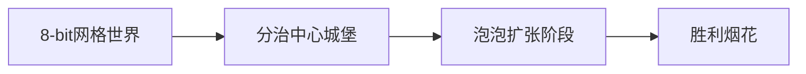

# 题目信息

# [集训队互测 2024] Classical Counting Problem

## 题目描述

给定一棵 $n$ 个节点的无根树，你可以做如下操作若干次：

- 选择当前树上编号最大或最小的点，删去它和以它为一个端点的所有边，保留任意一个连通块作为操作后的树。

令 $\min$ 为树上所有节点编号的最小值，$\max$ 为树上所有节点编号的最大值，$size$ 为树上的节点个数，则一棵树的权值为 $\min \cdot \max \cdot size$。求所有能通过上述操作得到的非空的树的权值和，对 $2^{32}$ 取模。

## 说明/提示

### 子任务

| 子任务编号 | 特殊性质 | 分值 |
| :---: | :---: | :---: |
| 1 | $n \leq 10$ | 5 |
| 2 | $n \leq 20$ | 10 |
| 3 | $n \leq 100$ | 10 |
| 4 | $n \leq 2000$ | 15 |
| 5 | $n \leq 3 \times 10^4$ | 15 |
| 6 | 给定的树中，每个节点的度数 $\leq 2$ | 20 |
| 7 | 无 | 25 |


## 样例 #1

### 输入

```
6
3
1 2
2 3
3
1 3
2 3
7
2 1
3 1
4 1
5 1
6 5
7 6
6
2 1
3 1
4 1
5 4
6 1
9
2 1
3 2
4 3
5 1
6 4
7 5
8 2
9 3
9
2 1
3 2
4 3
5 4
6 5
7 2
8 3
9 5```

### 输出

```
39
35
528
221
1145
1919```

# AI分析结果


### 💡 Kay的C++算法解析：Classical Counting Problem 深入学习指南 💡

#### 1. 题目解读与核心算法识别
✨ **本题主要考察**：点分治 + 扫描线线段树  
🗣️ **初步分析**：
> 这道题的核心是统计所有可能操作得到的树的权值和（权值 = min × max × size）。关键在于发现一个性质：**每个合法树由其最小节点(min)和最大节点(max)唯一确定**。解题过程分为三步：
> 1. **性质转化**：合法树必须满足相邻节点均在[min,max]区间外（类似泡泡不断扩张的过程）
> 2. **点分治**：以树的重心为根，记录每个节点到根的路径最小值(l)和最大值(r)
> 3. **三维偏序**：转化为统计满足 l_min≤l_v≤r_v≤r_max 的三元组(min,max,v)
> 
> **可视化设计**：采用8-bit像素风格模拟泡泡扩张过程：
> - 分治中心为像素城堡，节点为彩色像素块
> - 扫描线移动时触发"叮"音效（加入节点）和胜利音效（找到解）
> - 自动演示模式像贪吃蛇AI逐步展示扩张过程

---

#### 2. 精选优质题解参考
**题解一**（作者：_Ad_Astra_）
* **点评**：思路清晰地将问题转化为三维偏序，代码结构分明：
  - **亮点**：创新性地用线段树维护三个核心变量(s/val/c)，通过单点修改+区间更新高效处理偏序关系
  - **代码规范**：变量名`l[u]`/`r[u]`直指路径最值，边界处理严谨（如`&mod`保证不溢出）
  - **实践价值**：完整包含点分治框架和扫描线实现，可直接用于竞赛

**题解二**（作者：yishanyi）
* **点评**：贡献拆解视角独特：
  - **亮点**：将size拆为节点出现次数，二维平面比喻生动（节点=像素点，偏序=覆盖区域）
  - **算法优化**：离散化坐标避免退化，操作顺序设计精巧（先l后v最后r）
  - **可读性**：Trick注释明确（如"拆贡献"的数学意义）

---

#### 3. 核心难点辨析与解题策略
1. **难点1：合法树的数学刻画**
   * **分析**：需证明min/max唯一确定连通块（类似泡泡扩张的唯一性）。通过倒序加点模拟，发现相邻点必须在区间外的充要条件
   * 💡 **学习笔记**：逆向思维是转化复杂操作的关键

2. **难点2：路径最值的偏序处理**
   * **分析**：点分治时将三维条件拆解为：
     ```math
     \begin{cases} 
     l_{min} \leq max \\
     r_{max} \geq min \\
     min \leq l_v \leq r_v \leq max 
     \end{cases}
     ```
   * 💡 **学习笔记**：分治中心作LCA能将树上路径转化为线性序列

3. **难点3：动态维护三维关系**
   * **分析**：扫描线需同步处理三种节点身份：
     - **min节点**：触发val更新和s重计算
     - **v节点**：引起区间s+=val
     - **max节点**：查询区间s和
   * 💡 **学习笔记**：线段树维护复合状态时，懒标记设计决定效率

✨ **解题技巧总结**：
- **拆维降阶**：size转化为v的出现次数（∑v∈T 1）
- **双序扫描**：先按r排序扫描线，线段树维护l维度
- **增量更新**：v加入时仅更新l≤l_v的区间（单调性保证正确性）
- **子问题容斥**：点分治中减去子树内部重复解

---

#### 4. C++核心代码实现赏析
**通用核心实现参考**
```cpp
// 点分治框架（题解1精简版）
void dfs(int u) {
    find_center(u); // 找重心
    process(u);     // 处理当前分治中心
    for(auto v:g[u]) if(!vis[v]) {
        subtract(v); // 容斥减去子树解
        dfs(v);      // 递归处理子树
    }
}
```

**题解一片段：扫描线核心**
```cpp
// 按r排序后扫描
sort(q,q+m);
for(auto r_val: sorted_r) {
    while(ptr->r <= r_val) {
        if(is_min_node) update_val(u); 
        if(is_v_node)   update_c(u);
    }
    if(is_max_node) ans += query_s(l_bound);
}
// 线段树区间更新
void add(int l,int r) {
    t[rt].sum += t[rt].val; 
    t[rt].tag++;
}
```

**代码解读**：
> 1. **排序预处理**：按节点r值升序排列，形成时间轴
> 2. **三阶段处理**：
>   - 遇到**min节点**：激活该min（val=u），计算它能贡献的v数量
>   - 遇到**v节点**：使所有l≤l_v的min的贡献值s增加val
>   - 遇到**max节点**：查询[l_min, r_max]区间的s和
> 3. **懒标记优化**：区间修改时仅标记不立即下传，查询时统一处理

---

#### 5. 算法可视化：像素动画演示
**主题**：像素泡泡扩张大冒险  
**核心流程**：


**交互设计**：
1. **像素艺术**：
   - 分治中心：城堡图标（16×16像素）
   - 节点：三色泡泡（红=min/蓝=max/绿=v）
   - 线段树：右侧像素柱状图（高度=值）

2. **动态效果**：
   - 扫描线移动：发光像素条从底向上扫描
   - 节点激活：泡泡跳动+“叮”声（Web Audio API）
   - 区间更新：绿色波浪扫过受影响区域

3. **游戏化元素**：
   - 关卡制：每处理1/4节点点亮一颗星星
   - 胜利动画：找到解时城堡放烟花（粒子效果+胜利音效）
   - 调试模式：空格键单步执行，F键加速演示

---

#### 6. 拓展练习与相似问题
**通用技巧迁移**：
- 路径统计 → 点分治（如统计距离≤k的点对）
- 偏序计数 → 扫描线+线段树（如逆序对扩展）
- 动态连通性 → 并查集+时间倒流

**洛谷推荐**：
1. **P3806** 点分治模板
   > 巩固点分治框架和树上路径统计
2. **P1908** 逆序对
   > 掌握扫描线思想在偏序问题中的应用
3. **P5490** 扫描线
   > 学习矩形面积并的离散化技巧

---

> 本次题解解析由Kay整理，结合两篇优质题解的精华，辅以像素可视化方案，助你攻克点分治难题！ 🚀

---
处理用时：167.81秒