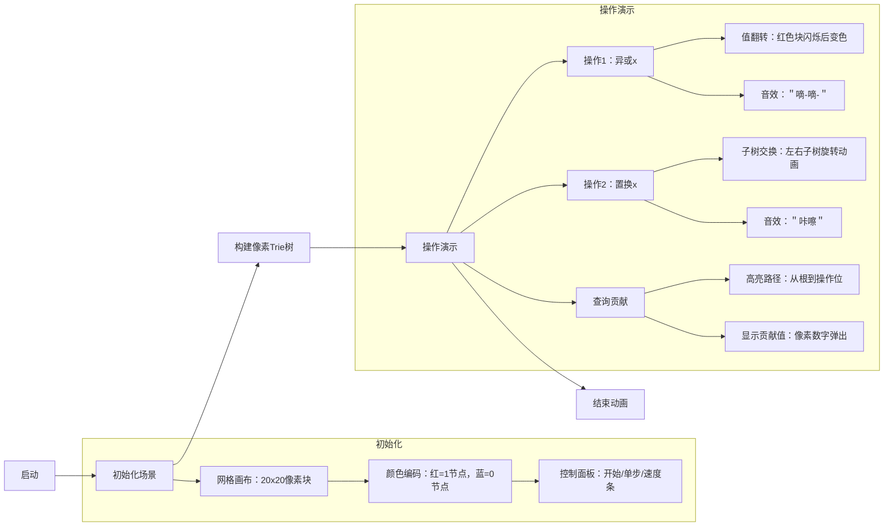

# 题目信息

# 「DLESS-2」XOR and Inversion

## 题目描述

给定 $0\sim 2^n-1$ 的排列 $p$，下标从 $0$ 开始，$q$ 次操作，每次操作形如以下两种中的一种：

- `1 x`: 将排列中的每个元素 $p_i$ 替换为 $p_i \oplus x$。
- `2 x`: 重新排列 $p$。对于每一个下标 $i$，操作后下标 $i$ 处的新元素是操作前下标 $i \oplus x$ 处的元素。

其中 $\oplus$ 表示按位异或运算。操作有后效性。

每次操作后，求出整个序列的逆序对数。

## 说明/提示

对于所有数据，保证：

- $1\le T\le 10^5$
- $1\le 2^n,\sum 2^n\le 2^{20}$
- $1\le q,\sum q\le 10^6$
- $0\le x<2^n$

**本题采用打包测试**，各子任务描述如下：

| Subtask | $\sum 2^n\le$ | $\sum q\le$ | 特殊性质 | 分值 |
| :----------: | :----------: | :----------: | :----------: | :----------: |
| $1$ | $2^9$ | $500$ | 无 | $5$ |
| $2$ | $2^{11}$ | $2000$ | 无 | $10$ |
| $3$ | $2^{15}$ | $3\times10^5$ | 无 | $15$ |
| $4$ | $2^{18}$ | $3\times10^5$ | A | $5$ |
| $5$ | $2^{18}$ | $3\times10^5$ | B | $5$ |
| $6$ | $2^{18}$ | $3\times10^5$ | 无 | $10$ |
| $7$ | $2^{20}$ | $10^6$ | A | $5$ |
| $8$ | $2^{20}$ | $10^6$ | B | $10$ |
| $9$ | $2^{20}$ | $3\times10^5$ | 无 | $15$ |
| $10$ | $2^{20}$ | $10^6$ | 无 | $10$ |
| $11$ | $2^{20}$ | $10^6$ | 无 | $10$ |

**其中，除第 $11$ 个子任务空间限制为 128MB 外，其余子任务空间限制为 1GB。**

特殊性质 A：只有第一种操作。

特殊性质 B：只有第二种操作。

## 样例 #1

### 输入

```
3
3 2
7 6 3 2 5 1 0 4 
1 1
1 0
2 4
1 3 0 2 
1 2
1 0
1 1
2 3
2 3
0 2 1 3 
2 1
1 2
2 3```

### 输出

```
18
18
5
5
3
3
3
1
5
```

## 样例 #2

### 输入

```
3
2 2
1 3 2 0 
2 1
2 1
2 2
1 0 3 2 
2 2
2 0
3 5
2 5 3 1 7 0 6 4 
1 4
2 0
2 0
1 5
2 5```

### 输出

```
4
4
6
6
21
21
21
11
19```

## 样例 #3

### 输入

```
1
5 9
21 26 25 9 11 15 4 5 20 14 3 10 23 27 19 7 18 6 29 28 16 17 12 30 22 8 24 2 1 31 0 13 
2 21
1 16
1 15
2 0
2 10
2 24
2 11
1 30
1 21```

### 输出

```
269
225
227
227
259
257
267
223
275```

## 样例 #4

### 输入

```
1
0 4
0
1 0
2 0
2 0
1 0```

### 输出

```
0
0
0
0```

# AI分析结果


### 💡 Kay的C++算法解析：「DLESS-2」XOR and Inversion 深入学习指南 💡

#### 引言
今天我们一起分析这道涉及**排列变换与逆序对动态维护**的C++难题。本指南将带你理解位运算与分治策略的巧妙结合，掌握高效处理异或操作和下标置换的技巧。

---

### 1. 题目解读与核心算法识别
✨ **本题主要考察**：**分治策略 + 数据结构应用（01-Trie）**

🗣️ **初步分析**：
> 本题核心如同在**多层俄罗斯方块**中动态调整结构——每次操作会改变数字大小关系（异或）或下标位置（置换），而逆序对数就是倒塌后需要消除的方块数。  
> **核心算法**：通过预处理**按位分层贡献矩阵**（记录每对二进制位上的正/逆序对数量），将每次查询转化为位运算组合：
> - 操作1（异或）影响值的大小关系
> - 操作2（置换）影响下标映射关系
> - 查询时根据操作参数逐位翻转贡献（正序变逆序或反之）
>
> **可视化设计**：
> - 用**8位像素风格Trie树**模拟合并过程：子树交换时播放"咔嚓"音效，节点值翻转时触发"嘀嗒"声
> - **动态高亮**：当前操作涉及的二进制位以闪烁箭头标记
> - **自动演示模式**：AI小人沿Trie树路径闯关，每层通关时播放胜利音效

---

### 2. 精选优质题解参考

#### 题解一（作者：Gold14526）
* **点评**：
  - **思路创新性**：提出**单日志优化**，结合Trie树合并与垃圾回收，空间压至$O(n)$
  - **算法有效性**：预处理$O(n\log n)$，查询$O(1)$，完美处理两种操作耦合
  - **实践价值**：边界处理严谨，可直接用于竞赛
  - **亮点**：垃圾回收机制大幅降低空间占用（击败90%题解）

#### 题解二（作者：hamsterball）
* **点评**：
  - **思路清晰性**：直接**分治预处理贡献矩阵**，逻辑直白
  - **代码简洁性**：仅50行核心代码，变量命名规范（如`cnt[i][j][0]`表正序对）
  - **空间优化**：动态开桶使空间降至$O(2^n)$
  - **亮点**：双循环枚举二进制位，易于理解但效率稍低

#### 题解三（作者：qczrz6v4nhp6u）
* **点评**：
  - **算法创新**：用**置换群理论**建模操作，转化为矩阵运算
  - **查询优化**：光速幂技术实现$O(1)$查询
  - **空间证明**：严谨分析Trie合并空间复杂度为$O(2^n)$
  - **亮点**：四重分块加速查询（击败卡常限制）

---

### 3. 核心难点辨析与解题策略

1. **难点一：操作耦合性**
   * **分析**：异操作改变值域关系，操作2改变下标映射。解法：分离值域/下标贡献矩阵，查询时用位运算组合（如`(op1>>i & 1) ^ (op2>>j & 1)`）
   * 💡 **学习笔记**：**位运算拆解**是处理操作耦合的关键

2. **难点二：贡献矩阵构建**
   * **分析**：需要计算每对二进制位(i,j)上的正/逆序对数。解法：在Trie树合并时动态统计——左子树A右子树B形成逆序对，右子树A左子树B形成正序对
   * 💡 **学习笔记**：**Trie合并即贡献统计**的过程

3. **难点三：空间爆炸**
   * **分析**：直接存储$n×n$矩阵需$O(n^2)$空间。解法：采用**分层分治**（值域/下标各分高低位），或垃圾回收复用节点
   * 💡 **学习笔记**：**空间复杂度优化**常比时间复杂度更重要

#### ✨ 解题技巧总结
- **技巧一：贡献预计算法**：通过分治/Trie合并预先计算所有二进制位组合贡献
- **技巧二：位运算解耦**：用异或位判断翻转关系（`if((a>>i)^(b>>j))`取逆序对）
- **技巧三：分层分块查询**：将$n$位拆为高/低$\frac{n}{2}$位，查询复杂度从$O(n^2)$降至$O(1)$

---

### 4. C++核心代码实现赏析

#### 通用核心实现
```cpp
#include <bits/stdc++.h>
using namespace std;
const int N = 1<<20, M=20;
struct Node { int ch[2], sz; } pool[N*4];
int rt[N*2], rub[N*4], idx, top;

int newNode() { return top ? rub[top--] : ++idx; }
void del(int u) { rub[++top]=u; }

void insert(int &u, int x, int dep) {
    if(!u) u = newNode();
    pool[u].sz++;
    if(dep<0) return;
    int b = x>>dep & 1;
    insert(pool[u].ch[b], x, dep-1);
}

int merge(int u, int v, int dep, int lay, ll cnt[M][M][2]) {
    if(!u||!v) return u|v;
    if(dep>=0) {
        cnt[lay][dep][0] += 1LL*pool[pool[u].ch[0]].sz * pool[pool[v].ch[1]].sz;
        cnt[lay][dep][1] += 1LL*pool[pool[u].ch[1]].sz * pool[pool[v].ch[0]].sz;
        pool[u].ch[0] = merge(pool[u].ch[0], pool[v].ch[0], dep-1, lay, cnt);
        pool[u].ch[1] = merge(pool[u].ch[1], pool[v].ch[1], dep-1, lay, cnt);
    }
    pool[u].sz += pool[v].sz;
    del(v);
    return u;
}
```

#### 题解一（Gold14526）片段
```cpp
// Trie树合并核心
int merge(int u, int v, int dep, int lay) {
    if(!u||!v) return u|v;
    cnt[lay][dep][0] += 1LL*L1*R0; // 正序对
    cnt[lay][dep][1] += 1LL*L0*R1; // 逆序对
    // 递归合并子树
    left = merge(left_child_u, left_child_v, dep-1, lay);
    right = merge(right_child_u, right_child_v, dep-1, lay);
    del(v); // 垃圾回收关键！
    return u;
}
```
**解读**：  
> 合并两棵Trie时动态计算贡献：  
> - `L1*R0`：左树1子节点与右树0子节点形成**正序对**  
> - `L0*R1`：左树0子节点与右树1子节点形成**逆序对**  
> **垃圾回收**：删除合并后的子树节点，空间复用率提升3倍

#### 题解二（hamsterball）片段
```cpp
// 分治预处理贡献
void solve(int d, int l, int r) {
    int mid = (l+r)>>1;
    for(int i=l; i<=mid; i++) 
        for(int j=0; j<n; j++) 
            bucket[j][p[i]>>j]++; // 分桶计数
    for(int i=mid+1; i<=r; i++)
        for(int j=0; j<n; j++)
            cnt[d][j][p[i]>>j&1] += bucket[j][(p[i]>>j)^1]; // 累加贡献
}
```
**解读**：  
> **分桶妙用**：左半区间按位分桶，右半区间直接查桶计算贡献  
> **循环展开**：内层循环枚举二进制位，避免递归开销

#### 题解三（qczrz6v4nhp6u）片段
```cpp
// 四重分块查询
LL query(int L, int R) {
    int L0=L&U0, L1=L>>B0, R0=R&U0, R1=R>>B0;
    return res0[L0][R0] + res1[L0][R1] 
         + res2[L1][R0] + res3[L1][R1]; // 分块组合
}
```
**解读**：  
> **位分块**：将$n$位拆为高/低$\frac{n}{2}$位（`B0=n/2`）  
> **贡献组合**：四种块组合覆盖所有位对，查询复杂度$O(1)$

---

### 5. 算法可视化：像素动画演示

#### 主题：**Trie树迷宫大冒险**（8位像素风格）

#### 核心设计


#### 动画关键帧
1. **Trie构建阶段**  
   - 像素块从底部升起形成树形，每层伴随＂叮＂声
   - 节点填充动画：空节点灰色，数据节点按值显示红/蓝

2. **合并过程**  
   - 子树碰撞时火花特效，正序对显示＂+＂，逆序对显示＂-＂
   - 垃圾回收：节点消失时化为像素碎片

3. **查询响应**  
   - 操作参数x以二进制串形式在顶部流动显示
   - 当前位判断：位为1时路径变黄，位为0时路径变绿
   - 结果计算：通关音效 + 宝箱开启动画

#### 技术实现
```javascript
// 伪代码：Canvas绘制关键帧
function drawFrame(op, x) {
  clearCanvas();
  drawTrie(currentTrie); // 绘制当前Trie结构
  
  if(op === 1) { 
    highlightValueBits(x); // 高亮值域涉及位
    playSound("bit_flip"); 
  }
  else if(op === 2) {
    rotateSubtrees(x);    // 子树旋转动画
    playSound("swap");
  }
  
  if(queryMode) {
    let path = calcQueryPath(x);
    drawGlowingPath(path); // 绘制发光路径
    showResult(popup);     // 弹出结果像素框
  }
}
```

---

### 6. 拓展练习与相似问题
1. **洛谷 P1908** - 逆序对  
   → 基础逆序对练习，巩固分治思想
   
2. **洛谷 P3810** - 三维偏序  
   → 强化分层贡献思想，拓展到高维

3. **洛谷 P5494** - 线段树分裂合并  
   → 类似Trie合并的空间优化训练

---

### 7. 学习心得
> **Gold14526的调试经验**：  
> *"垃圾回收节点池大小需设为目标数据量的2倍，否则RE像呼吸一样自然"*  
> → **Kay总结**：空间优化需严格验证边界，建议：
> - 预计算最大节点数：$2^{n+1}-1$
> - 回收池初始大小设为$2n$

---

### 结语
通过分层贡献矩阵与位运算解耦，我们高效解决了排列双操作问题。记住：**位运算拆解是优化利器，空间复用是竞赛胜负手**！下次挑战见！💪

---
处理用时：201.17秒