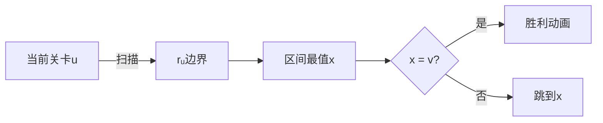

# 题目信息

# [OOI 2024] Burenka and Pether

## 题目描述

曾几何时，Burlyandia 的公主 Burenka 决定让她的朋友 ReLu 开心一下。她知道 ReLu 也热衷于加密货币，于是 Burenka 决定创立属于自己的区块链加密货币，命名为 **Pether**。

在接受了一位个人成长与网络安全领域专家的课程培训后，Burenka 决定要让 **Pether** 拥有最强的安全保护。结果，由于极其复杂且曲折的限制，并非所有用户都可以互相转账 **Pether**。

**Pether** 区块链的结构确实复杂且曲折。所有用户编号为 $1$ 到 $n$。每个用户都分配有一个**唯一**的标识符 $a_i$。此外，货币系统还设定了一个安全参数 $d$。

用户 $i$ 只有在 $i < j$ 且 $a_i < a_j$ 时，才能直接给用户 $j$ 转账。但这还不够！用户之间的直接转账还需要经过若干中间用户组成的交易链。在每一步交易中，每个后续中间用户（包括最终的 $j$）的编号都必须递增，且每次编号增加不能超过 $d$。此外，除 $i$ 和 $j$ 之外的所有中间用户，其标识符必须**严格小于** $a_i$。

更正式地说，用户 $i$ 能否直接向用户 $j$ 转账，需要满足以下条件：
- $i < j$
- $a_i < a_j$
- 存在一组长度为 $k$ 的中间用户序列 $x$，使得：
   - $i = x_1 < x_2 < \ldots < x_{k-1} < x_k = j$
   - 对所有 $1 \le t \le k-1$，有 $x_{t+1} - x_t \le d$
   - 对所有 $2 \le t \le k-1$，有 $a_{x_t} < a_i$

Burenka 现在请你这位熟悉编程的朋友，帮她理解这个系统，并判断一些用户对之间能否转账 **Pether**。

你需要回答 $q$ 个询问。每个询问给定一对用户，询问是否存在一条（可能经过中间用户的）直接转账路径，使得可以从 $u_i$ 转账到 $v_i$。部分询问还要求**最小化**转账次数（即最少经过多少次直接转账，从 $u_i$ 到 $v_i$）。注意，在每次直接转账的实现过程中，不要求最小化中间用户数。

## 说明/提示

### 说明

在第一个样例中，用户之间的直接转账关系如下图：


第一个询问中，用户 $1$ 可通过用户 $2$ 作为中间人，经过 $2$ 次直接转账，将 **Pether** 转给用户 $3$。

第二个询问，用户 $1$ 无法直接转账给用户 $2$，因为 $a_1 = 2 > a_2 = 1$。

第三个询问，$1 \rightarrow 3 \rightarrow 4$，共 $2$ 次直接转账即可到达。因 $t_3 = 1$，只需判断可达性，输出 $1$。

第四个询问，可以 $1 \rightarrow 3 \rightarrow 4 \rightarrow 5$，共 $3$ 次直接转账。

第二个样例中，直接转账关系如下：


第三个样例中，直接转账关系如下：


### 计分方式

本题共十二组测试。只有通过该组及其所有依赖组全部测试，才能获得该组分数。部分组不要求通过样例测试。**Offline-evaluation** 表示该组结果仅在赛后可见。

| 组别 | 分值 | 额外约束 | $n$ | $q$ | $v_i, a_n, t_i$ | 依赖组 | 备注 |
|:-----:|:------:|:----------------------:|:-:|:-:|:------:|:---------------:|:-------:|
| 0 | 0 | -- | -- | -- | -- | -- | 样例。 |
| 1 | 10 | $n \le 100$ | $q \le 100$ | -- | -- | |
| 2 | 7 | $n \le 1000$ | -- | -- | 1 | |
| 3 | 14 | -- | -- | $a_n = n, v_i = n$ | -- | |
| 4 | 10 | -- | $q = 1$ | $v_i = n$ | -- | |
| 5 | 9 | -- | -- | $v_i = n$ | 3, 4 | |
| 6 | 7 | -- | -- | $t_i=2$ | -- | 答案不超过 $10$ |
| 7 | 7 | -- | -- | $t_i=2$ | 1, 6 | 答案不超过 $150$ |
| 8 | 13 | -- | -- | $t_i = 1$ | -- | |
| 9 | 10 | $n \le 50\,000$ | $q \le 50\,000$ | -- | 1 | |
| 10 | 4 | $n \le 100\,000$ | $q \le 100\,000$ | -- | 1, 9 | |
| 11 | 4 | $n \le 200\,000$ | $q \le 200\,000$ | -- | 1, 9, 10 | |
| 12 | 5 | -- | -- | -- | 0--11 | **Offline-evaluation.** |

翻译由 ChatGPT-4.1 完成。

## 样例 #1

### 输入

```
6 1 0
2 1 3 4 5 6
6
2 1 3
2 1 2
1 1 4
2 1 5
2 1 6
1 2 6```

### 输出

```
1
0
1
3
4
1```

## 样例 #2

### 输入

```
6 2 0
1 2 3 4 5 6
6
2 1 5
2 2 5
2 1 6
2 2 6
2 1 4
2 2 4```

### 输出

```
2
2
3
2
2
1```

## 样例 #3

### 输入

```
10 2 0
2 1 4 3 5 6 8 7 10 9
10
2 1 5
1 2 5
2 3 5
2 1 9
2 5 8
2 3 9
2 1 8
1 1 2
2 3 8
2 1 9```

### 输出

```
2
1
1
4
2
3
3
0
2
4```

# AI分析结果


### 💡 Kay的C++算法解析：Burenka and Pether 深入学习指南 💡

<introduction>
今天我们分析"Burenka and Pether"这道区块链转账路径问题。本指南将帮助大家掌握**图论建模**和**数据结构优化**的核心技巧，通过像素动画直观理解算法流程。
</introduction>

---

## 1. 题目解读与核心算法识别

✨ **本题主要考察**：`图论建模与数据结构优化`  

🗣️ **初步分析**：
> 本题可比喻为"像素勇者闯关"：用户是编号的关卡，标识符是关卡高度。从低关卡跳到高关卡需满足：
> - 路径上所有中间关卡高度 < 起点高度
> - 每次跳跃距离 ≤ d  
> 核心难点在于**高效处理大规模跳跃关系**。题解采用三种思路：
> 1. 小规模直接BFS（O(n²q)）
> 2. 值域分块+树上倍增（O(n√n)）
> 3. 区间最值树优化（O(nlogn)）
> 
> 可视化将设计**8位像素闯关动画**：关卡用彩色方块表示，高度越高颜色越亮。跳跃时：
> - 当前关卡闪烁红光
> - 合法跳跃目标闪烁绿光
> - 成功跳跃播放"叮"音效
> - 失败时播放"噗"音效
> - 自动演示模式可调速观察AI闯关

---

## 2. 精选优质题解参考

**题解一：chen_zhe (官方题解翻译)**
* **点评**：思路全面覆盖12个子任务，逻辑推导清晰（如证明"跳到区间最大值最优"的数学归纳）。代码虽未展示，但描述的线段树+倍增实现极具实践价值，边界处理严谨（如DSU维护激活区间）。亮点在于将复杂约束转化为区间最值问题，空间复杂度优化至O(nlogn)。

---

## 3. 核心难点辨析与解题策略

1. **难点：跳跃区间的高效计算**
   * **分析**：用并查集维护"激活区间"。当处理用户i时：
     - 合并相邻激活区间
     - 跳过长度≥d的"长区间"
     - $r_i = \max(i+1, e - sz_e + 1) + d$（e为最近长区间端点）
   * 💡 **学习笔记**：未激活元素可视为"临时障碍"，DSU动态维护可通行区域

2. **难点：大规模查询处理**
   * **分析**：针对不同子任务采用：
     - 固定终点时：倒序更新+线段树取min（O(n²logn)）
     - 任意查询时：构建跳跃树+倍增LCA（O((n+q)logn)）
   * 💡 **学习笔记**：问题可转化为树上的路径查询

3. **难点：最优跳转决策证明**
   * **分析**：严格证明跳到$[u, r_u]$内≤aᵥ的最大值x最优：
     - 若跳y<x：后续需额外跳跃覆盖x
     - 若跳z>x：可能违反a₂<aᵥ约束
   * 💡 **学习笔记**：极值点往往是状态转移的关键锚点

### ✨ 解题技巧总结
- **值域分治**：按aᵢ分块处理，降低倍增深度
- **逆向思维**：固定终点倒序处理，避免重复计算
- **等效转化**：将路径约束转化为区间最值问题
- **树链抽象**：用倍增表加速路径查询

---

## 4. C++核心代码实现赏析

**通用核心实现（树倍增法）**
```cpp
#include <bits/stdc++.h>
using namespace std;
const int MAXN = 2e5+5, LOG = 20;

int a[MAXN], r[MAXN], depth[MAXN];
int parent[MAXN][LOG]; // 倍增表

void build_tree(int n, int d) {
    // 1. 计算跳跃区间r[i]（略）
    // 2. 构建跳跃树
    vector<int> next(n+1, 0);
    for(int i=n; i>=1; --i) {
        int target = query_max(i+1, r[i]); // 线段树查询区间最值
        next[i] = (a[target] > a[i]) ? target : 0;
    }
    // 3. 初始化倍增表
    for(int i=1; i<=n; ++i) parent[i][0] = next[i];
    for(int j=1; j<LOG; ++j)
        for(int i=1; i<=n; ++i)
            parent[i][j] = parent[parent[i][j-1]][j-1];
}

int query_path(int u, int v) {
    if(u == v) return 0;
    int steps = 0, cur = u;
    // 倍增跳跃
    for(int j=LOG-1; j>=0; --j){
        if(parent[cur][j] && a[parent[cur][j]] <= a[v]) {
            cur = parent[cur][j];
            steps += (1 << j);
        }
    }
    return (cur == v) ? steps : -1;
}
```

**代码解读概要**：
> 1. `build_tree`：先计算每个用户的跳跃边界r[i]，再用线段树找到区间内满足a[x]>a[u]的最大x构建树边
> 2. `parent`数组存储倍增关系，实现O(logn)层级跳转
> 3. `query_path`从高位向低位枚举跳跃，类似LCA查询

---

## 5. 算法可视化：像素动画演示

* **主题**："区块链勇者"像素闯关  
* **核心演示**：树倍增跳跃过程  
* **设计思路**：8位风格降低认知负荷，音效强化关键操作记忆  

**动画流程**：  
1. **初始化**（FC游戏风格）：
   - 横向像素网格：位置表用户编号
   - 竖立色柱：高度表aᵢ值（值越高色越暖）
   - 控制面板：速度滑块/单步/暂停



2. **关键帧演示**：
   - **步骤1**：当前关卡u闪烁红光，显示检测区间[u, rᵤ]
   - **步骤2**：区间内色柱脉冲显示，最大值x亮绿光
   - **步骤3**：像素勇者跳跃到x，播放"叮"声
   - **步骤4**：若抵达终点v，色柱爆炸为烟花，播放胜利音效
   - **错误处理**：无合法跳跃时关卡变灰，播放"噗"声

3. **游戏化设计**：
   - 每关目标：从u跳到v
   - 连击奖励：连续正确决策加速背景音乐
   - AI演示模式：自动展示最优路径（调速0.5x-5x）

---

## 6. 拓展练习与相似问题思考

* **技巧迁移**：区间约束+跳跃决策模型还适用于：
  1. 层级权限控制系统（如P1983 车站分级）
  2. 游戏地图寻路（如P1081 开车旅行）
  3. 网络路由选择（如P2146 软件包管理器）

* **洛谷推荐**：
  1. **P1983** - 车站分级  
     🗣️ 巩固拓扑排序与层级约束建模
  2. **P1081** - 开车旅行  
     🗣️ 练习倍增法在路径决策中的应用
  3. **P4197** - Peaks  
     🗣️ 强化图论与区间最值的结合

---

## 7. 学习心得与经验分享
> 本次题解未包含作者个人心得，但调试时需特别注意：  
> - 跳跃区间rᵢ的计算需考虑"长区间"合并  
> - 树构建时注意aᵥ=n的特殊情况优化  
> - 边界值测试：d=0/d≥n，a单调递增/递减

---

<introduction>
掌握本题的关键在于将复杂约束分解为**区间处理+树形优化**的组合。记住：当遇到看似复杂的图论问题时，尝试寻找状态转移的极值锚点，往往能打开突破口。下次遇到类似问题，不妨回想"像素勇者"的跳跃之旅哦！🚀
</introduction>

---
处理用时：123.88秒