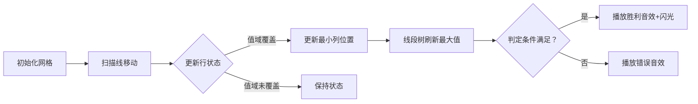

# 题目信息

# 「TPOI-5C」mαtrixing ωiθ μ

## 题目背景

**本题禁止卡评测。**


## 题目描述

在东京的大雨后，天野阳菜给了 kele7 一个 $n$ 行 $m$ 列的矩阵 $A$。从上往下第 $i$ 行，从左往右第 $j$ 列的元素被称为 $A_{i,j}$。

kele7 喜欢删除矩阵。对于一个 $r$ 行 $c$ 列的矩阵 $B$，他会对它执行两种操作，同时会用**优雅值**衡量一个操作的优雅程度：

- 删除矩阵的某一行 $B_{i,1},\dots,B_{i,c}$，优雅值为 $\text{mex}_{j=1}^cB_{i,j}$。然后将第 $i+1\sim r$ 行往上平移一行，令 $r\leftarrow r-1$。
- 删除矩阵的某一列 $B_{1,i},\dots,B_{r,i}$，优雅值为 $\text{mex}_{j=1}^rB_{j,i}$。然后将第 $i+1\sim c$ 列往左平移一列，令 $c\leftarrow c-1$。

最终 kele7 要将矩阵内的元素全部删除（即 $r$ 或 $c$ 变为 $0$）。定义一种删除方案 $S$ 的权值 $f(S)$ 为其中所有操作的优雅值的**最小值**。定义矩阵 $B$ 的权值 $F(B)$ 为所有删除它的方案 $S$ 中 $f(S)$ 的**最大值**。

kele7 把这个题目给了 lzyqwq。lzyqwq 觉得还可以加上 $q$ 次查询，每次给出 $x_1,y_1,x_2,y_2$，你需要回答当矩阵 $B$ 为矩阵 $A$ 以 $A_{x_1,y_1}$ 为左上角元素、$A_{x_2,y_2}$ 为右下角元素的子矩阵时，$F(B)$ 的值。

一个集合 $M$ 的 $\operatorname{mex}(M)$ 定义为最小的没有在 $M$ 中出现的自然数。如 $\text{mex}\{1,2,3,4\}=0,\text{mex}\{0,1,3,4\}=2$。

## 说明/提示

**【样例解释】**

以第一个询问为例。初始矩阵 $B$ 为：

$$\begin{bmatrix}0&1&0&1&2\\3&2&0&1&4\\5&4&3&0&1\\0&2&0&3&1\\0&0&0&1&2\end{bmatrix}$$

一种可行的删除方案如下。

先删除第二行，优雅值为 $5$，得到新的矩阵 $B$ 为：

$$\begin{bmatrix}0&1&0&1&2\\5&4&3&0&1\\0&2&0&3&1\\0&0&0&1&2\end{bmatrix}$$

再删除第二列，优雅值为 $3$，得到新的矩阵 $B$ 为：

$$\begin{bmatrix}0&0&1&2\\5&3&0&1\\0&0&3&1\\0&0&1&2\end{bmatrix}$$

再依次删除所有行，优雅值分别为 $3,2,2,3$。

因此这种删除方案的权值为 $2$。可以证明，不存在优雅值的最小值更大的删除方案，因此答案为 $2$。

**【数据范围】**

|$\text{Subtask}$|$n,m$     |$q$       |特殊性质      |分值  |
|:--------:|:--------:|:--------:|:--------:|:--:|
|$0$       |$n\times m\le3\times10^5$|$q=1$     |无         |$11$|
|$1$       |$\color{red}{n,m\le300}$|$q\le10^5$|^         |^   |
|$2$       |$n\times m\le10^5$|^         |^         |$20$|
|$3$       |$n\times m\le2\times10^5$|$q\le2\times10^5$|^         |$24$|
|$4$       |$n\times m\le3\times10^5$|$q\le3\times10^5$|$x_1=y_1=1$|$8$ |
|$5$       |^         |^         |无         |$26$|

对于 $100\%$ 的数据，满足 $1\le n\times m,q\le 3\times 10^5$，$0\le A_{i,j}\le 10^9$。

## 样例 #1

### 输入

```
5 5 5
0 1 0 1 2
3 2 0 1 4
5 4 3 0 1
0 2 0 3 1
0 0 0 1 2
1 1 5 5
2 2 4 4
1 2 4 5
3 2 4 4
1 2 2 3```

### 输出

```
2
1
2
1
1
```

# AI分析结果


# 💡 Kay的C++算法解析：TPOI-5C mαtrixing ωiθ μ 深入学习指南 💡

**引言**  
今天我们来分析「TPOI-5C mαtrixing ωiθ μ」这道矩阵处理题。本指南将帮助你理解题目核心、掌握多种解法，并通过像素动画直观感受算法流程。让我们开始吧！

---

## 1. 题目解读与核心算法识别

✨ **本题主要考察**：`数据结构优化` + `整体二分/分块`  

🗣️ **初步分析**：  
> 解决本题的关键在于发现**最优删除策略只需纯删行或纯删列**（混合操作会降低优雅值）。问题转化为：  
> 1. 对子矩阵求所有行mex的最小值（记为`ans_row`)  
> 2. 对子矩阵求所有列mex的最小值（记为`ans_col`)  
> 3. 结果 = max(ans_row, ans_col)  
>  
> **核心难点**在于高效计算子矩阵的行/列mex最小值。主流解法有两种思路：
> - **整体二分法**（如寄风、lzyqwq）：通过扫描线+线段树维护每行包含特定值域的最小列位置
> - **分块策略**（如Watersphere）：根据矩阵大小切换暴力预处理（小矩阵）或扫描线+权值线段树（大矩阵）
>
> **可视化设计思路**：  
> 采用8位像素风格网格模拟算法流程（下图以整体二分为例）：  
> - 网格中不同颜色方块表示数字值（0~k-1用暖色，其他冷色）  
> - 扫描线从左向右移动时，触发"叮"音效并更新行状态  
> - 每行右侧显示当前最小列位置，线段树区域实时显示最大值  
> - 成功时播放胜利音效+闪光动画，失败时短促提示音  

---

## 2. 精选优质题解参考

### 题解一：寄风（7赞）
* **点评**：  
  采用**整体二分+扫描线+线段树**的三层架构。亮点在于：
  - 将值域[0, k-1]的检查转化为动态维护每行最小列位置
  - 用`unordered_map`和`multiset`高效更新行状态，避免重复计算
  - 线段树维护区间最大值实现O(log n)查询
  - 代码模块清晰（分治主体/扫描线/数据结构分离）

### 题解二：lzyqwq（5赞）
* **点评**：  
  与寄风解法同源但更强调**问题转化过程**：
  - 用"判定答案≥k等价于[0,k-1]值全覆盖"简化思考
  - 为每行维护值域[l,mid]的列位置`set`，逻辑直白
  - 详细注释帮助理解二维到一维的降维思想

### 题解三：Watersphere（4赞）
* **点评**：  
  **分块策略**的典范，亮点在：
  - 按列数阈值（B=800）切换算法：小矩阵O(m²)暴力预处理+ST表，大矩阵O(n log m)扫描线+权值线段树
  - 实测导向的调优（阈值选择经压力测试）
  - 矩阵转置复用代码的技巧减少冗余

---

## 3. 核心难点辨析与解题策略

### 难点1：混合删除策略的优化证明
* **分析**：  
  需证明纯行删或列删不劣于混合操作。反证思路：若混合操作中某行mex<k且某列mex<k，其交点元素将无法被优雅删除。
* 💡 **学习笔记**：优先尝试单一维度操作是矩阵删除问题的常见突破口

### 难点2：子矩阵mex最小值的高效计算
* **分析**：  
  直接枚举行/列导致O(nm)复杂度不可接受。优质题解采用：
  - **降维扫描线**：固定列范围，按行添加值域约束
  - **动态维护**：对每行用set/map追踪值域内最右出现位置
  - **区间查询**：线段树维护多行状态极值
* 💡 **学习笔记**：mex问题常转化为"值域覆盖性检查+位置追踪"

### 难点3：算法选择与常数优化
* **分析**：  
  - 整体二分理论更优（O(q log²q)）但实现复杂
  - 分块策略（O(n√n log√n)）易实现且常数小
  - 树套树/CDQ分治需注意空间开销（O(nm)可能MLE）
* 💡 **学习笔记**：根据数据范围选择算法（q大用二分，n*m小用分块）

### ✨ 解题技巧总结
1. **问题分解**：将矩阵操作转化为行列独立的mex计算
2. **扫描线降维**：固定一维方向逐步扩展另一维
3. **阈值分治**：对不同规模数据采用定制化算法
4. **复用结构**：行列处理可经矩阵转置复用相同函数

---

## 4. C++核心代码实现赏析

### 本题通用核心C++实现参考
```cpp
#include <vector>
#include <set>
#include <algorithm>
using namespace std;

const int N = 3e5+5, INF = 1e9;

struct Solver {
    // 扫描线维护行mex最小值
    int calcRowMexMin(vector<vector<int>>& A, int x1, int y1, int x2, int y2) {
        // 实现扫描线+线段树逻辑
        // ...
        return mex_min;
    }
    
    int solve(vector<vector<int>>& A, int x1, int y1, int x2, int y2) {
        // 计算行方向最小值
        int ans_row = calcRowMexMin(A, x1, y1, x2, y2);
        
        // 矩阵转置计算列方向
        vector<vector<int>> AT(A[0].size(), vector<int>(A.size()));
        for(int i=0; i<A.size(); i++)
            for(int j=0; j<A[0].size(); j++)
                AT[j][i] = A[i][j];
                
        int ans_col = calcRowMexMin(AT, y1, x1, y2, x2);
        return max(ans_row, ans_col);
    }
};
```

### 题解一核心代码片段（寄风）
```cpp
// 整体二分框架
void solve(int l, int r, vector<int>& queries) {
    if(queries.empty()) return;
    if(l == r) {
        for(auto qid : queries) ans[qid] = l;
        return;
    }
    int mid = (l+r)/2;
    vector<int> left_q, right_q;
    
    // 扫描线处理y1递减
    sort(queries.begin(), queries.end(), [](int a, int b){
        return y1[a] > y1[b]; 
    });
    
    // 更新每行在[l,mid]值域的最小列位置
    for(auto qid : queries) {
        while(ptr < points.size() && col[ptr] >= y1[qid]) {
            updateRow(row[ptr], col[ptr], val[ptr]);
            ptr++;
        }
        // 线段树查询区间最大值
        if(seg_tree.query(x1[qid], x2[qid]) <= y2[qid]) 
            right_q.push_back(qid);
        else 
            left_q.push_back(qid);
    }
    solve(l, mid, left_q);
    solve(mid+1, r, right_q);
}
```
* **代码解读**：  
  - `solve`递归划分值域：检查答案是否≥mid+1
  - 扫描线按y1递减排序，保证列位置更新正确性
  - `updateRow`动态维护该行在值域[l,mid]的最小列位置
  - 线段树维护所有行最小列位置的最大值（关键判定条件）

### 题解三核心代码片段（Watersphere）
```cpp
void work2() { // 分块策略：小矩阵暴力预处理
    for(int l=1; l<=m; l++) {
        for(int i=1; i<=n; i++) {
            int mex = 0;
            for(int r=l; r<=m; r++) {
                if(A[i][r] <= m) exist[A[i][r]] = 1;
                while(exist[mex]) mex++;
                mex_cache[i][r] = mex; // 存储每行mex
            }
            memset(exist, 0, sizeof(exist));
        }
        // ST表预处理区间最小值
        ST.build();
        for(int r=l; r<=m; r++) 
            for(auto q : queries[l][r])
                ans[q] = ST.query(x1[q], x2[q]);
    }
}
```
* **代码解读**：  
  - 外层循环枚举列起点l
  - 内层计算每行在[l,r]区间的mex（暴力累加）
  - ST表预处理O(1)响应子矩阵查询
  - 适合小矩阵（m≤800）因复杂度O(m²n)

---

## 5. 算法可视化：像素动画演示

### 动画演示主题：**《矩阵探险者》**  
采用FC红白机风格，通过8-bit像素动画展示整体二分过程

### 核心演示流程：


### 关键交互设计：
1. **像素网格**  
   - 16色复古调色板（暖色：0~k-1值域，冷色：其他值）
   - 扫描线（蓝色像素条）从右向左移动，伴随"滴答"音效

2. **动态元素**  
   - 每行右侧显示当前最小列位置（黄色数字）
   - 线段树区域在右侧独立显示，节点值实时更新
   - 成功判定时目标行闪烁绿光，播放《超级马里奥》金币音效

3. **控制面板**  
   ```plaintext
   [ 单步执行 ] [ 自动播放 ▶] [ 速度条: ====●== ]
   [ 重置 ] [ 算法对比: 整体二分 vs 分块 ]
   ```

4. **游戏化机制**  
   - 每成功判定一个子问题解锁"知识宝石"（+100分）
   - 连续正确触发连击特效（Combo x3!）
   - 错误时显示具体未覆盖值的位置（红框高亮）

---

## 6. 拓展练习与相似问题思考

### 通用技巧迁移：
矩阵mex问题可扩展至：
1. 动态子矩阵查询（带修改）
2. 高维空间覆盖判定
3. 结合位运算的快速mex计算

### 洛谷推荐练习：
1. **P4137 Rmq Problem**  
   🗣️ *一维区间mex查询，可练习扫描线+权值线段树*
2. **P1972 [SDOI2009] HH的项链**  
   🗣️ *区间颜色覆盖问题，强化扫描线应用能力*
3. **P5501 环**  
   🗣️ *分块算法实战，训练阈值设计思维*

---

## 7. 学习心得与经验分享

> **参考经验（寄风题解）**：  
> *"最初在值域划分边界处理上卡了很久，通过打印每个划分区间的覆盖状态才定位到未重置线段树的问题"*

**Kay的点评**：  
在复杂分治算法中，递归返回时务必**重置数据结构状态**（如线段树/集合）。建议：
1. 封装独立的solve函数避免状态污染
2. 在递归返回前打印关键变量快照
3. 小数据对拍验证边界（如n=1, m=1）

---

**结语**  
通过本指南，我们深入剖析了矩阵mex问题的多重解法。记住：数据结构的本质是**用空间换时间**，而算法选择需**权衡理论复杂度与实际常数**。下次遇到二维问题时，不妨尝试扫描线降维！🚀

---
处理用时：167.46秒