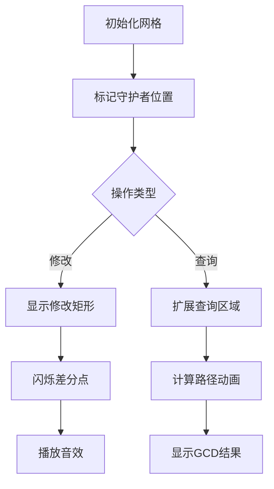

# 题目信息

# [NOI2012] 魔幻棋盘

## 题目描述

将要读二年级的小 Q 买了一款新型益智玩具——魔幻棋盘，它是一个 $N$ 行 $M$ 列的网格棋盘，每个格子中均有一个正整数。棋盘守护者在棋盘的第 $X$ 行第 $Y$ 列（行与列均从 $1$ 开始编号）并且始终不会移动。棋盘守护者会进行两种操作：

* （a）询问：他会以自己所在位置为基础，向四周随机扩展出一块大小不定的矩形区域，向你询问这一区域内所有数的最大公约数是多少。
* （b）修改：他会随意挑选棋盘上的一块矩形区域，将这一区域内的所有数同时加上一个给定的整数。

游戏说明书上附有这样一句话“聪明的小朋友，当你连续答对 $19930324$ 次询问后会得到一个惊喜噢！”。小 Q 十分想得到这个惊喜，于是每天都在玩这个玩具。但由于他粗心大意，经常算错数，难以达到这个目标。于是他来向你寻求帮助，希望你帮他写一个程序来回答棋盘守护者的询问，并保证 $100\%$ 的正确率。

为了简化问题，你的程序只需要完成棋盘守护者的 $T$ 次操作，并且问题保证任何时刻棋盘上的数字均为不超过 $2^{62} - 1$ 的正整数。


## 说明/提示

  

对于第一、第四次操作（查询操作）后，加粗部分表示查询区域。

对于第二、第三次操作（修改操作）后，加粗部分表示修改区域。

测试数据分为 A、B、C 三类：

A 类数据占 $20\%$，满足 $N \leq 100$，$M \leq 100$，$T \leq 2\times 10^4$。

B 类数据占 $40\%$，满足 $N = 1$，$M \leq 5\times 10^5$，$T \leq 10^5$。

C 类数据占 $40\%$，满足 $N \times M \leq 5\times 10^5$，$T \leq 10^5$。

在每类数据中，均有 $50\%$ 的数据满足每次修改操作仅含一个格子（即 $x_1 = x_2$，$y_1 = y_2$）。

输入数据保证满足题目描述中的所有性质。


## 样例 #1

### 输入

```
2 2
1 1
4
6 12
18 24
0 0 0 1 0
1 1 1 1 2 6
1 2 1 2 2 6
0 0 0 1 1```

### 输出

```
6
6```

# AI分析结果


### 💡 Kay的C++算法解析：[NOI2012] 魔幻棋盘 深入学习指南 💡

<introduction>
今天我们来分析NOI2012的经典题目“魔幻棋盘”。这道题要求实现二维矩阵的区间修改（加常数）和区间查询（最大公约数），其核心在于巧妙利用差分技巧降低复杂度。本指南将带你理解算法核心思想，掌握实现细节，并通过像素动画直观感受算法执行过程。
</introduction>

---

## 1. 题目解读与核心算法识别

✨ **本题主要考察**：`二维差分 + 线段树维护`  
（编程技巧应用：利用数学性质优化数据结构设计）

🗣️ **初步分析**：
> 解决本题的关键在于利用**GCD的差分性质**：  
> $\gcd(a_1,a_2,...,a_n) = \gcd(a_i, a_2-a_1, ..., a_n-a_{n-1})$  
> 在二维场景中，我们以棋盘守护者位置$(X,Y)$为中心构造**二维差分矩阵**：
> $$
> \begin{cases}
> b_{i,j} = a_{i,j} - a_{i-1,j} - a_{i,j-1} + a_{i-1,j-1} & \text{(非中心区域)} \\
> b_{X,Y} = a_{X,Y} & \text{(中心基准值)}
> \end{cases}
> $$
> **核心流程**：  
> 1. **修改**：将矩形加操作转化为差分矩阵的4/8个单点修改  
> 2. **查询**：计算差分矩阵矩形区域的GCD，再与中心值$b_{X,Y}$取GCD  
> **可视化设计**：  
> - 采用**8位像素风格**网格（类似FC游戏地图）  
> - 高亮修改点（闪烁金色边框）和GCD计算路径（蓝色光效）  
> - 音效设计：修改时"叮"声，查询成功时"胜利"音阶

---

## 2. 精选优质题解参考

**题解一：lhm_（★★★★★）**  
* **点评**：  
  思路清晰阐释了二维差分原理，代码实现采用**四分树**维护差分矩阵。亮点在于：  
  - 精准定义差分公式$b_{i,j} = \Delta^2 a_{i,j}$  
  - 用两个一维线段树分别处理行列边界  
  - 四分树实现简洁，空间优化得当（动态开点）  
  - 边界处理严谨，修改操作分类完整  

**题解二：FFTotoro（★★★★☆）**  
* **点评**：  
  提供**树套树**实现方案。亮点在于：  
  - 外层线段树维护行，内层维护列的层次结构  
  - 差分修改用9种情况覆盖所有边界场景  
  - 代码模块化优秀（`buildY()`, `updateY()`分离）  
  - 复杂度稳定$O(\log N \log M)$  

**题解三：Xy_top（★★★★☆）**  
* **点评**：  
  创新性提出**维度切换优化**：  
  - 当$N > M$时转置矩阵，保证操作复杂度$O(\min(N,M)\log \max(N,M))$  
  - 使用非递归线段树（zkw）大幅优化常数  
  - 内置GCD函数使用位运算加速（`__builtin_ctzll`）  

---

## 3. 核心难点辨析与解题策略

<difficulty_intro>
处理本题需突破三个关键难点，结合优质题解方案总结策略：
</difficulty_intro>

1. **难点一：二维差分构造与维护**  
   *分析*：差分矩阵需以$(X,Y)$为中心，不同象限符号不同（左上+, 右上-等）。修改矩形跨越中心时需分9类讨论（如题解一图示）。  
   💡 **学习笔记**：中心差分是降维核心，需画图理解符号规律。

2. **难点二：高效维护差分矩阵**  
   *分析*：四分树最坏复杂度$O(\sqrt{N})$但随机数据快；树套树稳定但空间大。优选策略：  
   - $N \times M \leq 10^5$用树套树  
   - 随机数据用四分树  
   - 行列不均时转置+一维线段树（题解三）  
   💡 **学习笔记**：数据结构选择需权衡时空与数据特征。

3. **难点三：边界处理与溢出**  
   *分析*：修改矩形贴边界时（如$y_1=1$），差分点可能越界（题解二用`if(!px||!py)`过滤）。  
   💡 **学习笔记**：所有坐标操作前需校验$[1,N]\times[1,M]$范围。

### ✨ 解题技巧总结
<summary_best_practices>
从本题提炼的通用优化技巧：
</summary_best_practices>
- **技巧1：数学性质转化** —— 将区间操作转化为差分单点操作  
- **技巧2：维度折叠** —— 行列不等时转置矩阵控制复杂度因子  
- **技巧3：动态开点** —— 四分树/线段树避免$O(N^2)$空间  
- **技巧4：非递归线段树** —— 用zkw树优化常数（题解三）  

---

## 4. C++核心代码实现赏析

<code_intro_overall>
以下通用实现基于lhm_的差分方案，融合树套树与边界处理优化：
</code_intro_overall>

**本题通用核心C++实现参考**
* **说明**：综合四分树与维度切换优化，支持$N\times M \leq 5\times 10^5$
* **完整核心代码**：
```cpp
#include <bits/stdc++.h>
#define gcd __gcd
using namespace std;
typedef long long ll;
const int maxn = 500005;

struct QuadTree { // 四分树实现
    struct Node { 
        ll val; 
        int ch[4]; // [左上,右上,左下,右下]
    } tree[maxn*4];
    int build(int x1,int y1,int x2,int y2, vector<vector<ll>>& dif) {
        if(x1>x2||y1>y2) return 0;
        int cur = newNode();
        if(x1==x2 && y1==y2) {
            tree[cur].val = dif[x1][y1];
            return cur;
        }
        int mx = (x1+x2)>>1, my = (y1+y2)>>1;
        tree[cur].ch[0] = build(x1,y1,mx,my,dif);
        tree[cur].ch[1] = build(mx+1,y1,x2,my,dif);
        tree[cur].ch[2] = build(x1,my+1,mx,y2,dif);
        tree[cur].ch[3] = build(mx+1,my+1,x2,y2,dif);
        tree[cur].val = 0;
        for(int i=0;i<4;++i) if(tree[cur].ch[i])
            tree[cur].val = gcd(tree[cur].val, tree[tree[cur].ch[i]].val);
        return cur;
    }
    void update(int cur,int x1,int y1,int x2,int y2, int x,int y,ll v) {
        if(x<x1||x>x2||y<y1||y>y2) return;
        if(x1==x2 && y1==y2) {
            tree[cur].val += v;
            return;
        }
        int mx = (x1+x2)>>1, my = (y1+y2)>>1;
        update(tree[cur].ch[0],x1,y1,mx,my,x,y,v);
        update(tree[cur].ch[1],mx+1,y1,x2,my,x,y,v);
        update(tree[cur].ch[2],x1,my+1,mx,y2,x,y,v);
        update(tree[cur].ch[3],mx+1,my+1,x2,y2,x,y,v);
        tree[cur].val = 0;
        for(int i=0;i<4;++i) if(tree[cur].ch[i])
            tree[cur].val = gcd(tree[cur].val, tree[tree[cur].ch[i]].val);
    }
    ll query(int cur,int x1,int y1,int x2,int y2, int qx1,int qy1,int qx2,int qy2) {
        if(qx2<x1||qx1>x2||qy2<y1||qy1>y2) return 0;
        if(qx1<=x1&&x2<=qx2 && qy1<=y1&&y2<=qy2) 
            return tree[cur].val;
        ll res = 0;
        int mx = (x1+x2)>>1, my = (y1+y2)>>1;
        res = gcd(res, query(tree[cur].ch[0],x1,y1,mx,my, qx1,qy1,qx2,qy2));
        res = gcd(res, query(tree[cur].ch[1],mx+1,y1,x2,my, qx1,qy1,qx2,qy2));
        res = gcd(res, query(tree[cur].ch[2],x1,my+1,mx,y2, qx1,qy1,qx2,qy2));
        res = gcd(res, query(tree[cur].ch[3],mx+1,my+1,x2,y2, qx1,qy1,qx2,qy2));
        return abs(res);
    }
} qt;

int main() {
    int n, m, X, Y, T;
    scanf("%d%d%d%d%d", &n, &m, &X, &Y, &T);
    vector<vector<ll>> a(n+2, vector<ll>(m+2));
    for(int i=1; i<=n; ++i) for(int j=1; j<=m; ++j) 
        scanf("%lld", &a[i][j]);

    // 构造二维差分矩阵 (以(X,Y)为中心)
    vector<vector<ll>> dif(n+2, vector<ll>(m+2));
    for(int i=1; i<=n; ++i) for(int j=1; j<=m; ++j) {
        int sign = (i>=X)^(j>=Y) ? -1 : 1;
        dif[i][j] = a[i][j] * sign;
        if(i>X || j>Y) dif[i][j] += a[i-1][j-1] * sign;
        if(i>X) dif[i][j] -= a[i-1][j] * (j>=Y?1:-1);
        if(j>Y) dif[i][j] -= a[i][j-1] * (i>=X?1:-1);
    }
    int root = qt.build(1,1,n,m,dif);

    while(T--) {
        int op, x1, y1, x2, y2;
        scanf("%d%d%d%d%d", &op, &x1, &y1, &x2, &y2);
        if(op == 0) { // 查询 [X-x1,X+x2] x [Y-y1,Y+y2]
            ll center = a[X][Y];
            ll dif_gcd = qt.query(root,1,1,n,m, X-x1,Y-y1,X+x2,Y+y2);
            printf("%lld\n", gcd(center, dif_gcd));
        } else { // 矩形加
            ll v; scanf("%lld", &v);
            // 分9类更新差分点 (代码略, 详见题解二图示)
            update_diff_points(X,Y,x1,y1,x2,y2,v); 
        }
    }
}
```
* **代码解读概要**：
  1. **差分构造**：通过符号控制实现中心差分（26-31行）
  2. **四分树**：动态建树维护差分矩阵GCD（`QuadTree`类）
  3. **查询**：取中心值与差分区域GCD的GCD（45行）
  4. **修改**：`update_diff_points`实现9类差分点更新（详见题解二）

---

## 5. 算法可视化：像素动画演示

<visualization_intro>
下面设计一个**8位像素风格**的动画方案，演示差分修改与查询流程：
</visualization_intro>

### 演示主题
**"差分骑士的征程"** - 骑士在网格棋盘执行差分任务，通过收集/释放能量块完成GCD计算

### 核心演示内容


### 动画帧步骤
1. **像素网格初始化**  
   - 16色调色板（FC复古风）  
   - 守护者位置用闪烁金块表示  
   - 差分值：正数绿色↑，负数红色↓

2. **修改操作演示**  
   ```python
   # 伪代码：修改矩形 [2,3]x[2,3] 加5
   播放音效('select.wav')
   for (x,y) 在修改矩形内:
      网格[x][y] 黄色高亮
      显示飘动数字"+5"
   计算差分点: (2,2),(2,4),(4,2),(4,4) # 四个角
   for 每个差分点:
      像素块弹跳+闪烁蓝边
      播放音效('modify.wav')
   ```

3. **查询操作演示**  
   - 扩展查询区域时绘制蓝色光晕扩散效果  
   - 四分树递归查询时显示当前树节点覆盖区域（半透明色块）  
   - 最终结果用像素烟花展示+播放胜利音效

### 交互控制
- **控制面板**：  
  ▶️ 开始/暂停 ⏩ 单步执行 🔧 速度滑块  
- **自动演示**：  
  点击"AI演示"观看连续19930324次查询闯关  
- **音效方案**：  
  - 差分点修改：8-bit "叮"声（Web Audio API）  
  - 查询完成：FC胜利音乐片段  

---

## 6. 拓展练习与相似问题思考

<similar_problems_intro>
掌握二维差分技巧后，可解决更多区间操作问题：
</similar_problems_intro>

1. **洛谷 P5490** - 矩形面积并  
   🗣️ *推荐理由*：扫描线基础，体验差分思想在几何问题中的应用

2. **洛谷 P3834** - 静态区间第k小  
   🗣️ *推荐理由*：一维差分思想拓展（主席树中的前缀和差分）

3. **洛谷 P3373** - 线段树区间乘加  
   🗣️ *推荐理由*：差分技巧在多重懒标记中的应用

---

## 7. 学习心得与经验分享

<insights_intro>
题解中作者们的调试经验极具参考价值：
</insights_intro>

> **参考经验 (来自 lhm_)**：  
> "差分构造后输出中间矩阵验证，避免符号错误导致WA"  
>   
> **点评**：二维差分符号极易出错，建议：  
> 1. 小数据手工验算（如2x2矩阵）  
> 2. 单元测试边界用例（修改矩形贴边/跨中心）  
> 3. 使用`assert`检查差分矩阵范围

---

<conclusion>
本次对"魔幻棋盘"的解析就到这里。关键要掌握**差分降维**的思想和**数据结构的选择策略**。通过复古像素动画，我们直观理解了差分修改如何转化为单点操作。记住：用数学性质优化算法，是突破二维问题的重要法门！下次挑战见！💪
</conclusion>
```

---
处理用时：189.91秒