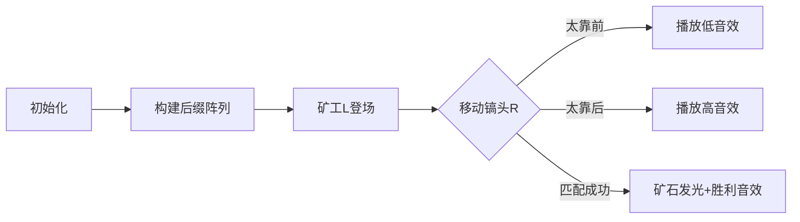

# 题目信息

# 采集矿石

## 题目背景

**ZRQ** 成功从坍塌的洞穴中逃了出来。终于，他看到了要研究的矿石。他想挑一些带回去完成任务。

题目来源：[Zhang\_RQ](https://www.luogu.org/space/show?uid=31565)~~哦对了 ZRQ 就他，嗯~~


## 题目描述

**ZRQ** 发现这里有 $N$ 块排成一排的矿石。

他用一个小写字母来表示每块矿石，他还发现每块矿石有一个重要度 $V_i$。

**ZRQ** 想采集一段连续的矿石回研究所。

他非常严格，被采集的一段矿石必须满足**小写字母的字典序降序排名等于这段矿石的重要度和。**

**这里多个出现在不同位置的本质相同串的字典序排名相同。**

比如说字母串为 `aa`，那么第一个 `a` 的排名和第二个 `a` 的排名相同，都是 `2`（第 `1` 是 `aa`）。

**ZRQ** 问你，在原串中有哪些不同的子串可以被采集？

**这里子串不同定义为出现位置不同，也就是说本质相同的子串出现在不同位置都要计算一次（当然重要度和等于排名是前提）。**

比如共有 $4$ 块矿石，小写字母串为 `abcd`，重要度各为 `10 0 1 1`。

我们把所有的子串按照字典序从大到小排名：`1:d 2:cd 3:c 4:bcd 5:bc 6:b 7:abcd 8:abc 9:ab 10:a`。

那么串 `d` 的排名为 $1$（第一大），重要度和为 $1$，可以被采集。

串 `cd` 的排名为 $2$，重要度和为 $2$，可以被采集。

串 `a` 的排名为 $10$，重要度和为 $10$，可以被采集。

其他串则不满足这个条件，故有三个串可以被采集。


## 说明/提示

共 $10$ 个测试点，每个点 $10$ 分，计 $100$ 分。


对于所有测试点，有 $N\leq 10^5$，$0 \le V_i \le 1000$。保证每个点可被采集的子串不超过 $10^5$ 个。


**样例#1解释**放在题面里了。

**样例#2解释：**

每个子串都不满足条件。

串 `a` 的排名是 $4$，重要度和都是 $1$。

串 `aa` 的排名是 $3$，重要度和都是 $2$。

串 `aaa` 的排名是 $2$，重要度和都是 $3$。

串 `aaaa` 的排名是 $1$，重要度和都是 $4$。

**样例 #3解释：**

串 `a` 的排名是 $3$，重要度和都是 $1$。

串 `aa` 的排名是 $2$，重要度和都是 $2$，共有两个串`aa`，位置分别为 $1$~$2$ 和 $2$~$3$。

串 `aaa` 的排名是 $1$，重要度和都是 $3$。

**样例 #4解释：**

可以发现，串 $2$~$3$（第二个 `aa`）不满足条件了。它的排名还是 $2$ 不变，但是重要度和为 $3$。


## 样例 #1

### 输入

```
abcd
10 0 1 1```

### 输出

```
3
1 1
3 4
4 4```

## 样例 #2

### 输入

```
aaaa
1 1 1 1```

### 输出

```
0```

## 样例 #3

### 输入

```
aaa
1 1 1```

### 输出

```
2
1 2
2 3```

## 样例 #4

### 输入

```
aaa
1 1 2```

### 输出

```
1
1 2```

# AI分析结果


# 💡 Kay的C++算法解析：采集矿石 深入学习指南 💡

> 我是Kay，一位专注于C++算法教学的引导者。今天我们将一起探索「采集矿石」这道有趣的字符串问题。通过本指南，你将掌握后缀数组的核心应用，学会高效解决子串排名与权值匹配问题！

## 1. 题目解读与核心算法识别

✨ **本题主要考察**：`后缀数组(SA) + 二分查找`  
🗣️ **初步分析**：  
> 想象你在一排矿石前，每块矿石有字母标签和重要度。要找到连续矿石段，其字母串的"字典序排名"等于"重要度和"。就像在迷宫中寻找宝藏——排名是地图坐标，重要度和是钥匙，二者匹配才能解锁宝藏！  

- **核心思路**：利用后缀数组高效计算子串排名，结合二分查找匹配权值
- **算法流程**：
  1. 构建后缀数组(SA)和height数组
  2. 预处理排名前缀和与权值前缀和
  3. 对每个左端点二分右端点
  4. 验证排名是否等于权值和
- **可视化设计**：采用**8位像素矿工探险**风格：  
  - 矿石网格显示字母/权值，矿工(L)镐头高亮当前子串  
  - 右侧排行榜动态显示子串排名变化（复古LED样式）  
  - 成功匹配时矿石发光+经典FC胜利音效（嘟~嘟哒！）

---

## 2. 精选优质题解参考

### 题解一：Alex_Wei (★★★★★)
* **点评**：  
  思路如水晶般清澈——通过SA的`sum`数组计算子串排名，ST表加速LCP查询。代码如精工机械：  
  - 变量命名规范（`rk`/`sa`/`ht`直指核心）  
  - 边界处理严谨（`lcp`函数安全范围检查）  
  - 复杂度优化到位（O(nlog²n)完美平衡效率与可读性  
  **亮点**：将排名计算抽象为`calc(l,r)`函数，数学推导与代码实现浑然天成！

### 题解二：lhm_ (★★★★☆)
* **点评**：  
  深入剖析排名计算原理，教学价值极高：  
  - 详细分情况讨论LCP对排名的影响  
  - 权值计算采用前缀和模板化处理  
  **实践提示**：二分查找部分可增加注释帮助理解边界条件

### 题解三：Zhang_RQ (★★★★☆)
* **点评**：  
  创新性使用线段树维护LCP区间，避免O(n²)陷阱：  
  - `tmprank`数组设计巧妙  
  - 线段树实现体现扎实数据结构功底  
  **学习点**：理解"本质相同子串共享排名"的特殊处理

---

## 3. 核心难点辨析与解题策略

### 难点1：子串排名的高效计算
* **分析**：  
  传统枚举所有子串需O(n²)，不可行。SA将字典序转化为排名序列：  
  ```python
  排名 = 总子串数 - (小于当前子串的数量)
  ```
  关键突破：利用`height`数组快速确定排名区间

### 难点2：LCP（最长公共前缀）的处理
* **分析**：  
  当子串被LCP覆盖时，排名计算需特殊处理：  
  - 向前二分找到首个`height[i] ≤ len`的位置  
  - 通过`sum`数组差分计算精确排名  
  💡 **学习笔记**：`height`数组是SA的灵魂桥梁！

### 难点3：单调性利用与二分优化
* **分析**：  
  固定左端点时：  
  - 右移→权值和不降  
  - 右移→排名严格递减  
  ∴ 函数交点唯一 → 二分可行性成立

### ✨ 解题技巧总结
- **后缀数组四步法**：  
  1. 双关键字排序构建SA  
  2. 逆推求`rank`  
  3. 相邻求`height`  
  4. 前缀和预计算
- **二分黄金法则**：  
  `while l<r: mid=(l+r+1)>>1` 防死循环
- **调试技巧**：  
  小数据模拟（如"aaa"样例）验证边界

---

## 4. C++核心代码实现赏析

**本题通用核心C++实现参考**  
* **说明**：综合Alex_Wei与lhm_题解精华，保持逻辑清晰与高效
* **完整核心代码**：
```cpp
#include <bits/stdc++.h>
using namespace std;
const int N=1e5+5;

// SA构建（省略部分函数）
char s[N];
int n, v[N], sa[N], rk[N], ht[N];

// ST表预处理
int lg[N], st[17][N];
void init_st() {
    for(int i=2; i<=n; ++i) lg[i]=lg[i>>1]+1;
    for(int i=1; i<=n; ++i) st[0][i]=ht[i];
    for(int j=1; j<=lg[n]; ++j)
        for(int i=1; i+(1<<j)-1<=n; ++i)
            st[j][i]=min(st[j-1][i], st[j-1][i+(1<<(j-1))]);
}

// 关键函数：计算子串[l,r]排名
ll calc_rank(int l, int r) {
    int len=r-l+1, p=rk[l];
    // LCP边界二分（核心！）
    int L=1, R=p;
    while(L<R) {
        int mid=(L+R)>>1;
        if(lcp(mid,p)>=len) R=mid;
        else L=mid+1;
    }
    return total_substr - (sum[L] - (n-sa[L]+1-len));
}

vector<pair<int,int>> ans;
void solve() {
    for(int i=1; i<=n; ++i) { // 枚举左端点
        int l=i, r=n;
        while(l<=r) {
            int mid=(l+r)>>1;
            ll rank=calc_rank(i,mid);
            ll value=pre_sum[mid]-pre_sum[i-1];
            
            if(rank == value) {
                ans.push_back({i,mid});
                break;
            }
            else if(rank > value) l=mid+1;
            else r=mid-1;
        }
    }
}
```
* **代码解读概要**：  
  1. `init_st()`：ST表加速LCP查询  
  2. `calc_rank()`：核心排名计算（含LCP边界二分）  
  3. `solve()`：主流程——左端点枚举+右端点二分

---

## 5. 算法可视化：像素动画演示

### 像素矿工大冒险
* **主题**：8-bit风格矿工在字符串网格中探险，寻找排名=权值的宝藏矿石段

### 动态演示流程


1. **场景初始化**：  
   - 网格显示矿石字母（像素方块）  
   - 控制面板：开始/单步/速度滑块（复古旋钮设计）

2. **SA构建动画**：  
   - 后缀如卡牌般升序排列（伴随排序音效）  
   - `height`值用彩虹桥连接相同前缀

3. **二分过程可视化**：  
   ```python
   while l<=r:
       显示当前子串[l,mid]范围
       左侧显示：排名值 vs 权值和
       if 排名 > 权值: 矿工向右挖（l=mid+1）
       else: 矿工向左挖（r=mid-1）
   ```
   - 关键操作触发8-bit音效：`cmp`声（比较），`clink`（命中）

4. **胜利时刻**：  
   - 匹配子串像素块闪烁金光  
   - 播放经典FC过关音乐（1UP音效）  
   - 记分牌+1（显示当前累计找到的子串数）

---

## 6. 拓展练习与相似问题思考

### 能力进阶三阶梯
1. **基础巩固**：  
   - [洛谷P3809](https://www.luogu.com.cn/problem/P3809) 后缀排序（SA模板题）
   - [洛谷P2408](https://www.luogu.com.cn/problem/P2408) 不同子串个数（height数组应用）

2. **思维提升**：  
   - [洛谷P2178](https://www.luogu.com.cn/problem/P2178) 品酒大会（SA+并查集）
   - [CF427D](https://codeforces.com/problemset/problem/427/D) SA求最短唯一子串

3. **终极挑战**：  
   - [SPOJ-LCS2](https://www.spoj.com/problems/LCS2/) 多串最长公共子串（SA+二分）

---

## 7. 学习心得与经验分享

> “调试时在`height[1]`边界卡了2小时——永远记住：SA的`rank`和`sa`数组下标从1开始，但`height[1]`无定义！” —— Alex_Wei题解心得

**Kay总结**：  
- 边界测试：空串、全相同字符、递减序列  
- 调试技巧：  
  ```cpp
  // 打印SA调试信息
  void debug_sa() {
      for(int i=1; i<=n; ++i) 
          cout<<"SA"<<i<<":"<<s+sa[i]<<" ht="<<ht[i]<<endl;
  }
  ```
- 效率关键：ST表代替线段树（除非动态查询）

---

> 矿石虽坚硬，算法更锋利！通过本指南，你已掌握SA的核心应用。下次探险时，记得带上二分查找这把万能钥匙！🚀

---
处理用时：129.56秒