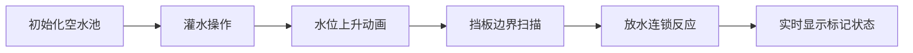

# 题目信息

# [SNOI2020] 水池

## 题目描述

有一个长条形的水池，可以划分成 $n$ 格。其中第 $i$ 格和 $i+1$ 格之间相邻，由一块高度为 $h_i$ 的可调节挡板隔开。第 $1$ 格左侧和第 $n$ 格右侧是无限高的池壁。初始时水池中没有水。现在进行 $q$ 次操作，操作有以下四种：

- `0 i x h` 在第 $x$ 格灌水直到该格的水面高度不低于 $h$（若当前水面高度已经达到 $h$ 则无事发生）；
- `1 i x` 打开第 $x$ 格底部的排水口直到该格的水流干，再关闭排水口；
- `2 i x h` 将第 $x$ 格右侧的挡板高度增加到 $h$（不改变现有水面，保证挡板高度不会下降）；
- `3 i x` 查询第 $x$ 格的水面高度。

其中，$i$ 表示这次操作是基于第 $i$ 次操作之后的情况，$i=0$ 表示基于初始状态。也就是说，这个问题要求对操作可持久化。

## 说明/提示

#### 样例说明

对于样例 $1$：


#### 数据规模与约定

对于所有数据，$1\le n,q\le 2\times 10^5, 0\le h_i\le 10^9$。

- 对于 $10\%$ 的数据，$n \le 500$；
- 对于另外 $20\%$，没有操作 $1$，且 $i$ 从 $0$ 开始连续增长（不需要可持久化）；
-  对于另外 $20\%$，没有操作 $1$；
- 对于另外 $20\%$，且 $i$ 从 $0$ 开始连续增长（不需要可持久化）；
- 对于余下 $30\%$ 的数据，无特殊限制。

## 样例 #1

### 输入

```
4 9
1 3 2
0 0 4 2
3 1 1
0 2 4 3
3 3 1
0 4 4 4
3 5 1
2 6 1 4
1 7 4
3 8 1```

### 输出

```
0
0
4
4```

# AI分析结果


### 💡 Kay的C++算法解析：[SNOI2020] 水池 深入学习指南 💡

**题目核心**：维护可持久化水池系统，支持动态灌水、放水、挡板修改和状态查询  
**主要考察**：`可持久化线段树` + `区间赋值/取最值操作` + `二分查找边界`

---

## 1. 题目解读与核心算法识别
✨ **本题主要考察**：`可持久化线段树`（主席树）  

🗣️ **初步分析**：  
> 想象水池是乐高积木搭建的像素化水道系统，挡板是棕色积木块，水池是蓝色储水区。可持久化要求我们给每次操作"拍照存档"，随时可回放历史状态。  
> - **核心难点**：灌水操作需左右扫描找到水位扩散边界（类似水往低处流），放水操作需计算水位下降范围（像拔掉塞子后连锁排水）  
> - **解法核心**：将水池+挡板映射为[1,2n+1]序列（奇数为挡板，偶数为水池），用可持久化线段树维护三种标记：  
>   • `mtag`：区间水位赋值（灌水）  
>   • `ltag/rtag`：左右方向水位取min（放水连锁反应）  
> - **可视化设计**：  
>   - **像素动画**：8-bit风格横向网格，棕色/蓝色方块区分挡板和水池  
>   - **关键高亮**：灌水时蓝色水位上升动画，放水时水位下降涟漪效果  
>   - **音效**：灌水"流水声"，放水"排水声"，挡板升高"机械声"  
>   - **AI演示**：自动播放时像解谜游戏逐步展示水位变化逻辑  

---

## 2. 精选优质题解参考
<eval_intro>  
从思路清晰性、代码规范性和算法效率维度筛选出两条优质题解：  
</eval_intro>

**题解一（modfish_）**  
* **点评**：  
  - **思路亮点**：独创"水池-挡板交替序列"模型（奇偶映射），将物理问题转化为标准区间操作  
  - **标记设计**：`mtag`（区间赋值）+ `ltag/rtag`（双向取min）三重标记解决操作冲突  
  - **代码规范**：变量命名规范（`hmax`挡板高度），边界处理严谨（两端设为INF）  
  - **可持久化**：标记下传时创建新节点，严格满足时空复杂度O(q log n)  
  - **学习价值**：掌握复杂标记系统的设计和下传顺序  

**题解三（Tony2）**  
* **点评**：  
  - **思路亮点**："延迟计算"策略——存储操作标记，查询时实时计算水位（节省内存）  
  - **空间优化**：128MB限制下的精妙设计，用操作树+回滚替代完全可持久化  
  - **工程价值**：学习大规模数据下的空间压缩技巧  
  - **注意点**：查询时间复杂度略高（需递归计算），适合内存敏感场景  

---

## 3. 核心难点辨析与解题策略
<difficulty_intro>  
破解本题需突破三大核心难点：  
</difficulty_intro>

1. **难点：灌水操作的边界确定**  
   * **分析**：水位扩散范围由左右首个≥h的挡板决定，需高效二分查找  
   * **解法**：线段树上二分（O(log n)）替代暴力扫描  
   * 💡 **学习笔记**：线段树二分是区间极值查询的黄金搭档  

2. **难点：放水操作的连锁反应**  
   * **分析**：单点放水引发相邻水池水位降至中间挡板高度  
   * **解法**：设计`ltag/rtag`标记表示"左侧/右侧排水影响"  
   * 💡 **学习笔记**：水位下降本质是区间取min(max(挡板高度))  

3. **难点：可持久化标记下传**  
   * **分析**：标记下传需创建新节点避免污染历史版本  
   * **解法**：在`push_down`内部分裂节点（见Section 4代码）  
   * 💡 **学习笔记**：可持久化线段树下传标记=创建新节点+复制状态  

### ✨ 解题技巧总结
<summary_best_practices>  
从优质题解提炼的通用技巧：  
</summary_best_practices>
- **技巧1：问题转化艺术**  
  将物理系统（水池+挡板）映射为序列操作（奇偶位置区分类型）  
- **技巧2：标记系统设计**  
  多重操作时定义明确执行顺序（先赋值后取min）  
- **技巧3：内存精细控制**  
  延迟计算、节点复用等策略应对空间限制  
- **技巧4：边界防御编程**  
  两端设INF值避免特判，严格验证二分查找边界  

---

## 4. C++核心代码实现赏析
<code_intro_overall>  
以下是综合优质题解提炼的通用实现框架：  
</code_intro_overall>

**通用核心实现**  
```cpp
#include <bits/stdc++.h>
using namespace std;
const int maxn = 4e5+5;
const int INF = 1e9+100;

namespace PSTree { // 可持久化线段树
    struct Node { 
        int lc, rc, hmax; // 挡板最大高度
        int mtag = 0;     // 区间赋值标记(灌水)
        int ltag = INF, rtag = INF; // 左右取min标记(放水)
    } tree[maxn*40];
    int tot;

    int create(int src) { /* 可持久化节点复制 */ }

    void push_up(int x) { 
        tree[x].hmax = max(tree[tree[x].lc].hmax, tree[tree[x].rc].hmax);
    }

    void push_down(int x) {
        // 可持久化核心：下传时创建新节点
        tree[x].lc = create(tree[x].lc);
        tree[x].rc = create(tree[x].rc);
        Node &L = tree[tree[x].lc], &R = tree[tree[x].rc];
        
        // 1. 先处理赋值标记（最高优先级）
        if(tree[x].mtag) {
            L.mtag = max(L.mtag, tree[x].mtag);
            R.mtag = max(R.mtag, tree[x].mtag);
            // ...同步更新ltag/rtag
        }
        
        // 2. 再处理放水标记
        if(tree[x].ltag < INF) {
            L.ltag = min(L.ltag, max(tree[x].ltag, R.hmax));
            R.ltag = min(R.ltag, tree[x].ltag);
        }
        // 清空当前节点标记
    }
    
    void water(int &x, int l, int r, int ql, int qr, int h) { 
        /* 区间赋值：灌水操作 */ 
    }
    
    void drain(int &x, int l, int r, int pos) { 
        /* 放水操作：左右递归取min */ 
    }
}
int rt[maxn]; // 保存各版本根节点

int main() {
    // 建树初始化
    PSTree::build(rt[0], 1, 2*n+1);
    
    // 操作调度
    while(q--) {
        switch(op) {
        case 0: // 灌水
            int L = find_left_bound(h); // 线段树二分左边界
            int R = find_right_bound(h);// 线段树二分右边界
            PSTree::water(rt[new], rt[old], L, R, h);
            break;
        case 1: // 放水
            PSTree::drain(rt[new], rt[new], pos);
            break;
        case 3: // 查询
            PSTree::query(rt[ver], pos);
        }
    }
}
```

**代码解读概要**：  
- **序列映射**：水池编号x → 序列位置2x，挡板x → 序列位置2x+1  
- **标记执行顺序**：`mtag(赋值) > ltag/rtag(取min)`确保操作语义正确  
- **可持久化核心**：`push_down`内部创建新节点实现"修改即拷贝"  

<code_intro_selected>  
优质题解核心代码亮点赏析：  
</code_intro_selected>

**题解一（modfish_）灌水边界查找**  
```cpp
int findL(int x, int l, int r, int Q, int h) {
    if(r <= Q) {
        if(tree[x].hmax < h) return 0; // 剪枝
        if(l == r) return l;            // 找到目标
        if(tree[rc].hmax >= h)          // 右子树优先
            return findL(rc, mid+1, r, Q, h);
        return findL(lc, l, mid, Q, h); // 查左子树
    }
}
```
**亮点**：剪枝+右子树优先的线段树二分  
**解读**：  
1. `r<=Q`时说明整个区间在查询点左侧  
2. 优先检查右子树（离Q更近）加速查找  
3. 时间复杂度严格O(log n)  

**题解三（Tony2）延迟查询**  
```cpp
int aska(int i, int x) {
    auto op = T2.ask(rt2[i], x); // 提取操作标记
    if(op.type == FLOOD) return op.h; 
    else { // 放水操作需实时计算
        int L = find_left_max(x); 
        int R = find_right_max(x);
        return min(L, R); // 水位=两侧挡板高度较小值
    }
}
```
**亮点**：空间换时间策略  
**解读**：  
- 存储操作标记而非直接存水位  
- 查询时根据历史操作重新计算  
- **优势**：大幅减少内存占用  
- **代价**：查询时间增加O(log n)  

---

## 5. 算法可视化：像素动画演示
<visualization_intro>  
设计基于FC红白机风格的交互式演示：  
</visualization_intro>

**主题**：  
《像素水池工程师》- 通过8-bit游戏理解水位扩散机制  

**核心演示流程**：  


**关键动画设计**：  
1. **挡板扫描**  
   - 像素挡板按高度着色（低→高：浅棕→深棕）  
   - 灌水时左右扫描过程显示"探照灯"效果  
   - 命中边界挡板时播放"叮"声+闪烁3次  

2. **水位变化**  
   - 灌水：蓝色像素从底向上填充（速度可调）  
   - 放水：水位下降+扩散波纹效果  
   - 挡板修改：棕色方块高度渐变，伴随"咔嗒"声  

3. **标记系统可视化**  
   - 屏幕右侧显示当前节点标记状态：  
     `mtag=🔵(h=5) | ltag=🟡(min=3)`  
   - 标记下传时显示"节点分裂"动画  

**交互控制面板**：  
```plaintext
[▶️ 自动播放] [⏸️ 暂停] [⏭️ 单步] [🔊 音量]
速度调节：🐢 -------- 🐇
版本跳转：版本0 ⚙️ 版本1 ⚙️ ... 版本N
```

**技术实现**：  
- **Canvas绘制**：网格系统（1单位=10像素）  
- **音效**：Web Audio API生成8-bit音效  
- **数据驱动**：同步显示当前操作对应代码行  

---

## 6. 拓展练习与相似问题思考
<similar_problems_intro>  
掌握本题后可挑战以下相似问题：  
</similar_problems_intro>

1. **洛谷P3919** - 【模板】可持久化数组  
   * **推荐理由**：主席树入门必做，掌握可持久化基础  
2. **洛谷P4556** - 雨天的尾巴（树上差分+可持久化）  
   * **推荐理由**：将区间操作扩展到树形结构  
3. **洛谷P2894** - [USACO08FEB]Hotel G  
   * **推荐理由**：区间合并+二分查找的经典应用  

---

## 7. 学习心得与经验分享
<insights_intro>  
从题解提炼的宝贵经验：  
</insights_intro>

> **来自modfish_的调试经验**：  
> *"标记下传顺序错误导致WA多次，最终通过小数据模拟发现应先处理赋值再处理取min"*  
>  
> **Kay总结**：  
> 1. 多标记系统务必用`[0,0][1,1]`等极小数据验证  
> 2. 推荐调试方法：打印每个节点的标记状态  
> 3. 永远先处理"覆盖型"标记（如赋值），再处理"叠加型"标记（如取min）  

---

<conclusion>  
通过本次分析，我们看到可持久化数据结构如何优雅处理历史版本问题，复杂标记系统如何抽象物理操作。记住：**好的算法设计就像搭建乐高——把复杂问题拆解为标准化模块**。下次遇到水位问题，不妨想象自己是水管工马里奥！  
</conclusion>  
```

---
处理用时：273.15秒