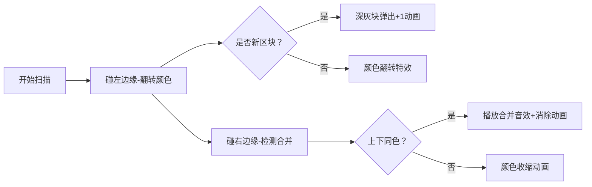

# 题目信息

# [USACO22FEB]  Paint by Rectangles P

## 题目背景

翻译来自 @wlzhouzhuan。

## 题目描述

在她之前的作品受到好评后，Bessie 得到了一份设计绘画套装的工作。她通过在平面中选择 $N\ (1\le N\le 10^5)$ 个平行于坐标轴的矩形来设计该画作，没有两条边是共线的。这些矩形的边界定义了绘画着色区域的边界。

作为一名先锋艺术家，Bessie 觉得这幅画应该像一头荷斯坦奶牛。更具体地，由矩形构成的每个区域都被着色为黑色或白色，没有两个相邻区域具有相同的颜色，并且所有矩形之外的区域都被着色为白色。

选完矩形后，Bessie 想根据参数 $T$ 让你输出：

- 若 $T=1$，则输出区域总数；
- 若 $T=2$，则依次输出白色区域数量和黑色区域数量。

**注意：本题的时间限制为 4s，是默认的 2 倍。**

## 说明/提示

**【样例解释 #1】**

有 $2$ 个白色区域和 $2$ 个黑色区域，共有 $4$ 个区域。所有矩形的边界连通，因此该输入满足 subtask 3。


**【样例解释 #2】**

右上方的矩形不与其余的矩形连通，因此该输入不满足 subtask 4。


**【数据范围】**

- subtask 1：数据 $3\sim 4$ 满足 $N\le 10^3$；
- subtask 2：数据 $5\sim 7$ 满足不存在两个矩形相交；
- subtask 3：数据 $8\sim 10$ 满足 $T=1$，且所有矩形的边界连通；
- subtask 4：数据 $11\sim 13$ 满足 $T=2$，且所有矩形的边界连通；
- subtask 5：数据 $14\sim 18$ 满足 $T=1$；
- subtask 6：数据 $19\sim 23$ 满足 $T=2$。

## 样例 #1

### 输入

```
2 1
1 1 3 3
2 2 4 4 ```

### 输出

```
4```

## 样例 #2

### 输入

```
5 2
1 5 3 6
5 4 7 9
4 1 8 3
9 8 10 10
2 2 6 7```

### 输出

```
4 5```

# AI分析结果


### 💡 Kay的C++算法解析：Paint by Rectangles 深入学习指南 💡

**引言**  
今天我们一起分析USACO铂金组题目《Paint by Rectangles》。这道题考察平面矩形交并后的黑白染色问题。本指南将帮助你掌握扫描线算法的核心应用，并理解连通块处理的巧妙技巧。

---

### 1. 题目解读与核心算法识别  
✨ **本题主要考察**：`扫描线算法` + `数据结构综合应用`  

🗣️ **初步分析**  
> 想象用一把激光尺从左向右扫描平面（类似超市扫码器）。当尺子碰到矩形边缘时，会触发两种关键操作：  
> 1. **加边（左边缘）**：如同掀开地毯，翻转扫描线上对应区间的颜色（黑白互换）  
> 2. **删边（右边缘）**：如同盖上地毯，合并相邻同色区域  
>   
> **核心难点**在于动态维护：  
> - 当前扫描线的颜色分段状态  
> - 矩形之间的连通关系（判断区域是否合并）  
>   
> **像素动画设计思路**：  
> 采用8位像素风格（类似经典游戏《推箱子》）：  
> - 扫描线作为移动光标，竖边显示为红色墙壁  
> - 颜色段用像素块表示（白色=浅灰，黑色=深灰）  
> - 关键操作触发音效：  
>   • 翻转颜色时播放"哔"声  
>   • 区域合并时播放"叮"胜利音效  
> - 控制面板支持调速滑块，可观察AI自动演示（像贪吃蛇自动寻路）

---

### 2. 精选优质题解参考  
**题解一（作者：cff_0102）**  
* **点评**：采用两次扫描线配合线段树+并查集。亮点在于对右边缘合并的精妙处理：通过连通性判断决定是否减少区域计数。代码中`st.merge()`函数实现区间标记传递，`rec`并查集维护连通块，边界处理严谨。虽实现较复杂，但连通性判断逻辑完备，是竞赛级标准解法。  

**题解三（作者：XuYueming）**  
* **点评**：用树状数组替代线段树，大幅简化块数计算。核心创新在于背景色处理：当识别到新连通块时，根据所处背景色（白/黑）预先增加计数。代码中`bit.query()`统计横边数量推导颜色，逻辑清晰易实现。虽连通性处理稍弱，但空间效率更高，适合初学者理解扫描线本质。  

---

### 3. 核心难点辨析与解题策略  
1. **难点1：动态维护颜色分段**  
   * **分析**：扫描线移动时需快速获取区间内颜色段数量和首尾颜色。优质解法用树状数组（题解三）统计横边数量，通过奇偶性推导颜色。  
   * 💡 **学习笔记**：颜色状态 ≡ 横边数量 mod 2  

2. **难点2：连通块合并判断**  
   * **分析**：当右边缘导致上下区域合并时，需区分是否同属一个连通块。题解一用线段树区间标记+并查集，在首次扫描时通过`st.merge()`合并相交矩形。  
   * 💡 **学习笔记**：相交矩形 ⇔ 扫描线区间重叠  

3. **难点3：背景色初始处理**  
   * **分析**：独立连通块的外部颜色需预先计数。题解三通过`if(!vis[rec.find(l[i].rect)])`识别新连通块，根据位置增加对应颜色计数。  
   * 💡 **学习笔记**：新连通块贡献 +1  

**✨ 解题技巧总结**  
- **扫描线框架统一化**：将竖边按x坐标排序，分加边/删边处理  
- **奇偶性妙用**：用位运算(color = cnt & 1)替代布尔判断  
- **连通性预处理**：首次扫描建立并查集，避免运行时复杂判断  
- **边界测试法**：验证单矩形/完全嵌套等特殊情形  

---

### 4. C++核心代码实现赏析  
**通用核心实现参考**  
```cpp
#include <bits/stdc++.h>
using namespace std;
const int N = 2e5+5;

struct BIT { // 树状数组简化实现
    int tr[N];
    void add(int x, int v) { for(;x<N;x+=x&-x) tr[x]+=v; }
    int query(int x) { int r=0; for(;x;x-=x&-x) r+=tr[x]; return r; }
} bit;

int main() {
    int n, t; cin >> n >> t;
    vector<tuple<int,int,int,int>> edges; // (x, y1, y2, 类型)
    for(int i=0; i<n; i++) {
        int x1,y1,x2,y2; cin>>x1>>y1>>x2>>y2;
        edges.push_back({x1, y1, y2, 1});  // 左边缘
        edges.push_back({x2, y1, y2, -1}); // 右边缘
    }
    sort(edges.begin(), edges.end());

    long long wcnt = 1, bcnt = 0; // 初始背景白色
    for(auto [x, y1, y2, type] : edges) {
        int cnt = bit.query(y2-1) - bit.query(y1); // 区间内横边数
        int color = bit.query(y1) & 1; // 最下方颜色

        if(type == 1) { // 加边
            if(color) bcnt += (cnt+2)/2, wcnt += (cnt+1)/2; 
            else wcnt += (cnt+2)/2, bcnt += (cnt+1)/2;
            bit.add(y1, 1); bit.add(y2, 1); // 更新横边
        } 
        else { // 删边
            bit.add(y1, -1); bit.add(y2, -1);
            // 背景色修正逻辑在此省略，详见题解三
        }
    }
    // 连通块修正逻辑在此省略
    cout << (t==1 ? wcnt+bcnt : to_string(wcnt)+" "+to_string(bcnt));
}
```

**题解三亮点代码解析**  
```cpp
// 删边时的背景色修正
if(u == d) { // 特殊情况：区域合并
    if(color) bcnt--; 
    else wcnt--;
}
```
> **关键解读**：  
> 当扫描线区间上下边界颜色相同(`u==d`)，说明该矩形边缘使两个分离区域合并。此时需将原计数减1，避免重复计算。  
> **学习笔记**：区域合并 ⇔ 扫描区间塌缩为单点  

---

### 5. 算法可视化：像素动画演示  
**主题**：*8位像素风格扫描线冒险*  

**核心设计**：  


**实现细节**：  
1. **像素网格**：用Canvas绘制，坐标轴每单位=16像素  
2. **动态元素**：  
   - 扫描线：红色竖条（宽度4像素），从左至右移动  
   - 颜色块：白色（#F0F0F0）、黑色（#303030）  
3. **音效触发**：  
   ```javascript
   // 伪代码示例
   function playSound(type) {
     if(type === "flip") beep(440, 50);  // 翻转音
     if(type === "merge") beep(880, 100); // 合并音 
   }
   ```
4. **AI演示模式**：  
   - 自动调速：每帧移动1像素（可调速）  
   - 关键步骤暂停：在区域合并时暂停0.5秒，显示提示文字  

---

### 6. 拓展练习与相似问题  
**技巧迁移场景**：  
1. 岛屿问题（统计连通区域）  
2. 日历重叠问题（时间段合并）  
3. 三维投影求交（降维扫描）  

**推荐练习**：  
1. **洛谷 P5490** - 矩形面积并  
   * 推荐理由：扫描线基础应用，巩固区间维护技巧  
2. **洛谷 P1904** - 天际线问题  
   * 推荐理由：矩形相交变形，培养空间抽象能力  
3. **洛谷 P3887** - [JLOI2008]COW COOLER  
   * 推荐理由：三维投影扫描，进阶训练  

---

### 7. 学习心得与经验分享  
> **来自题解三作者的经验**：  
> *"独立连通块的背景色处理让我调试了3小时——务必验证单矩形和完全嵌套的极端情况！"*  
>  
> **Kay点评**：背景色初始化是易错点，建议：  
> 1. 画图模拟扫描过程  
> 2. 输出中间状态（如每步的wcnt/bcnt）  
> 3. 用assert验证极端情况  

---

**结语**  
通过扫描线这把"激光尺"，我们揭开了矩形交并的重重迷雾。记住：将二维问题降维处理，用数据结构维护动态状态，是解决复杂几何问题的金钥匙。下次遇到类似挑战，愿你如8位游戏英雄般精准通关！💪

---
处理用时：125.52秒