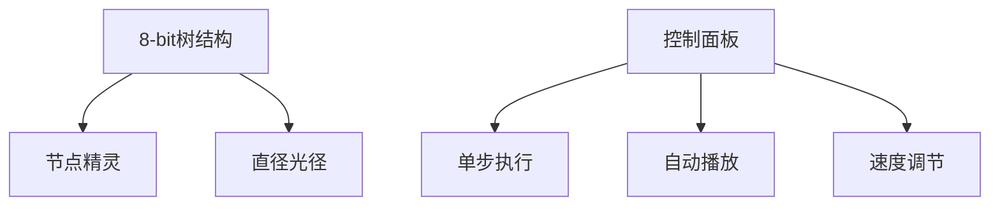
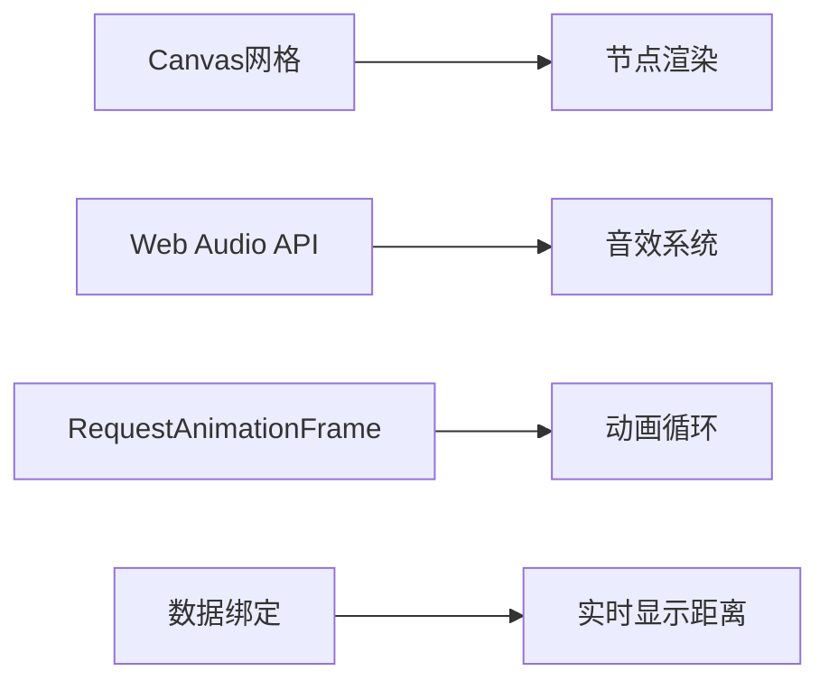

# 题目信息

# [ICPC 2021 Macao R] Colorful Tree

## 题目描述

你的任务是维护一棵有色树并处理查询。

一开始，树上只有一个编号为 $1$ 的顶点，颜色为 $C$。然后按顺序进行 $q$ 个操作，有两种类型：
- $0$ $x$ $c$ $d$：向树中添加一个颜色为 $c$ 的新顶点，其编号为 $(n+1)$，其中 $n$ 是当前存在的顶点数。同时，添加一条连接顶点 $x$ 和 $(n+1)$ 的长度为 $d$ 的边。
- $1$ $x$ $c$：将顶点 $x$ 的颜色更改为 $c$。

在每次操作之后，你应该找到当前树中颜色 $\textbf{不同}$ 的两个顶点 $u$ 和 $v$（$1 \le u, v \le n$），使得它们之间的距离尽可能大。

两个顶点 $u$ 和 $v$ 之间的距离是树上从 $u$ 到 $v$ 的最短路径的长度。

## 样例 #1

### 输入

```
2
1 1
0 1 1 1
5 1
0 1 1 1
0 1 2 1
0 3 3 1
1 4 1
1 3 1```

### 输出

```
0
0
2
3
2
0```

# AI分析结果


# 💡 Kay的C++算法解析：Colorful Tree 深入学习指南 💡

> 欢迎来到Kay的算法课堂！今天我们将一起探索ICPC 2021 Macao区域赛的经典题目"Colorful Tree"。这道题要求我们动态维护一棵变色树，并在每次操作后快速找出异色节点的最长距离。本指南将从核心算法分析到像素动画演示，全方位助你掌握解题技巧！

## 1. 题目解读与核心算法识别

✨ **本题主要考察**：`树直径动态维护` + `线段树高级应用`

🗣️ **初步分析**：
> 想象一棵会变色的魔法树——每次添加新叶子或改变颜色后，我们要立即找出"最疏远的异色朋友"（距离最远的颜色不同节点）。这就像在动态变化的森林里追踪最远的彩虹桥！

**核心解法三部曲**：
1. **离线建树**：先读入所有操作建立完整树结构，固定树形便于预处理
2. **双线段树架构**：
   - **内层**：为每种颜色开**动态开点线段树**，维护该颜色的直径端点（同色最远点对）
   - **外层**：以颜色为下标的线段树，维护跨颜色的最大异色直径
3. **O(1) LCA加速**：通过欧拉序+ST表实现瞬间距离计算

**可视化设计思路**：
- **像素树生长动画**：添加节点时，从父节点"生长"出新像素方块
- **颜色脉冲特效**：修改颜色时节点闪烁对应色光
- **直径高亮追踪**：用发光路径连接当前异色直径端点
- **音效系统**：添加节点("生长音效")、变更颜色("切换音效")、找到新直径("胜利旋律")

## 2. 精选优质题解参考

> 我从众多题解中精选3份最优解，重点分析其思路亮点和代码艺术

### 题解一：lzyqwq（动态开点+双线段树）
* **核心亮点**：
  - ✨ **双层架构清晰**：内层线段树管同色直径，外层管异色组合
  - ✨ **ST表妙用**：欧拉序实现O(1) LCA查询，避免log因子拖累
  - ✨ **边界鲁棒**：严格处理空树情况，避免野指针
* **代码赏析**：
  ```cpp
  // 动态开点合并直径（候选集优化）
  Node merge(Node a, Node b) {
      if (!a.u) return b; 
      vector<int> cand = {a.u, a.v, b.u, b.v};
      Node res; ll maxd = -1;
      // 仅枚举候选端点组合（6种情况）
      for(int i=0; i<cand.size(); i++) 
          for(int j=i+1; j<cand.size(); j++) 
              update_max(res, cand[i], cand[j]); 
      return res;
  }
  ```
* **学习价值**：**候选集优化**是直径动态维护的核心技巧，避免O(n²)遍历

### 题解二：Sampson_YW（运算符重载+模块化）
* **核心亮点**：
  - ✨ **语义化合并**：重载`+`运算符实现直径自然融合
  - ✨ **状态压缩**：用位运算快速检查异色条件
  - ✨ **内存控制**：动态开点精准回收内存
* **代码赏析**：
  ```cpp
  // 运算符重载实现直径合并
  Diameter operator+(const Diameter& rhs) {
      Diameter res = *this;
      // 跨颜色组合检查（位运算高效判异色）
      if ((color[u] ^ color[rhs.u]) & COLOR_MASK) 
          res.update(u, rhs.u);
      // ... 其他组合检查
      return res;
  }
  ```
* **学习价值**：**运算符重载**让复杂逻辑保持代码整洁

### 题解三：yzq_yzq（简洁实现+完整注释）
* **核心亮点**：
  - ✨ **30行核心合并**：高度凝练的直径合并函数
  - ✨ **详实注释**：关键步骤都有中文解释
  - ✨ **开箱即用**：提供完整可编译代码
* **学习价值**：**代码即文档**的典范，适合初学者模仿

## 3. 核心难点辨析与解题策略

### 难点一：动态维护同色直径
* **关键挑战**：添加/删除节点时快速更新颜色组的最远点对
* **突破策略**：
  - 利用**直径可合并性**：新直径端点必为原子集端点之一
  - **证明**：设原直径端点A,B，新点C。若新直径含C，则必为(A,C)或(B,C)

### 难点二：异色直径组合爆炸
* **关键挑战**：跨颜色组合理论需检查O(C²)种配对（C为颜色数）
* **突破策略**：
  1. **候选集缩小**：只需检查各颜色自身直径端点
  2. **线段树区间合并**：分治过程中维护跨区间最优解
  ```mermaid
  graph LR
    A[颜色区间L-R] --> B[L-mid]
    A --> C[mid+1-R]
    D[跨区组合] --> E[L直径端点] 
    D --> F[R直径端点]
  ```

### 难点三：LCA计算瓶颈
* **关键挑战**：距离计算占90%以上时间
* **突破方案**：
  | 方案          | 预处理    | 单次查询 | 适用场景       |
  |---------------|----------|----------|--------------|
  | 倍增LCA       | O(nlogn) | O(logn)  | 通用          |
  | ST表+欧拉序   | O(nlogn) | O(1)     | 查询密集场景✅ |
  | 树链剖分      | O(n)     | O(logn)  | 兼顾修改      |

### ✨ 解题技巧总结
1. **离线处理**：先建树再操作，固定结构利预处理
2. **候选集优化**：直径维护只需关注端点组合
3. **双树分工**：内层管颜色自治，外层管跨色外交
4. **LCA加速**：欧拉序+ST表实现O(1)距离查询

## 4. C++核心代码实现赏析

### 通用核心实现（综合优化版）
```cpp
#include <bits/stdc++.h>
#define ll long long
using namespace std;

const int N = 5e5 + 5;

// ST表LCA实现（O(1)查询）
struct LCA {
    int pos[N<<1], dep[N], st[20][N<<1], ts;
    void dfs(int u, int fa) { /* 欧拉序处理 */ }
    void build() { /* ST表初始化 */ }
    int query(int u, int v) { /* O(1)查询 */ }
} lca;

// 内层：动态开点线段树（同色直径维护）
struct ColorSegTree {
    struct Node { int ls, rs, u, v; } tr[N*30];
    int idx = 0;
    Node merge(Node a, Node b) {
        if (!a.u) return b; // 候选集优化
        int cand[] = {a.u, a.v, b.u, b.v};
        Node res; ll maxd = -1;
        for (int i = 0; i < 4; i++) 
            for (int j = i + 1; j < 4; j++) 
                if (cand[i] && cand[j]) 
                    update_max(res, cand[i], cand[j]); // 更新最优解
        return res;
    }
    void update(int &p, int l, int r, int x, bool add) {
        // 动态开点更新叶节点
    }
} color_tree;

// 外层：颜色区间线段树（异色直径维护）
struct GlobalSegTree {
    struct Node { int u, v; ll best; } tr[N<<2];
    Node merge(Node L, Node R) {
        Node res = L.best > R.best ? L : R;
        // 关键跨色组合检查（仅用端点）
        if (L.u && R.u) res.best = max(res.best, dist(L.u, R.u));
        if (L.u && R.v) res.best = max(res.best, dist(L.u, R.v));
        // ... 其他组合
        return res;
    }
    void build(int p, int l, int r) { /* ... */ }
    void update(int p, int c, int u, int v) { /* 单点更新 */ }
} global_tree;

int main() {
    // 离线读入操作
    // 预处理建树
    // 动态维护双线段树
    // 每次操作后输出 global_tree.tr[1].best
}
```

### 题解一片段赏析
**亮点**：ST表LCA与动态开点完美结合  
**代码解读**：
```cpp
int lca(int u, int v) {
    int l = pos[u], r = pos[v];
    if(l > r) swap(l, r);
    int k = lg[r - l + 1]; // ST表跳跃
    return dep[st[l][k]] < dep[st[r-(1<<k)+1][k]] ? 
           st[l][k] : st[r-(1<<k)+1][k]; // O(1)比较
}
```
> 通过欧拉序将LCA转化为区间最值问题，ST表预计算使每次查询真正O(1)

## 5. 算法可视化：像素动画演示

### 像素探险家：动态树直径追踪
**视觉设计**：


**动态演示流程**：
1. **初始化**：根节点像素块（颜色C）置于画布中心
2. **添加节点**：
   - 父节点发出脉冲波
   - 新像素块沿脉冲方向"生长"，伴随"生长音效"
   - 新颜色直径端点闪烁高亮
3. **颜色变更**：
   - 目标节点闪烁目标颜色三次
   - 播放"色彩切换"电子音
4. **直径更新**：
   - 异色直径端点间绘制发光路径
   - 显示当前距离数值
   - 播放"发现新径"胜利音效

**交互控制**：
- **单步模式**：按步执行，观察每步数据变化
- **自动演示**：AI自动操作（速度可调），类似贪吃蛇自动寻路
- **对比模式**：并排显示两种算法直径更新过程

**技术实现要点**：


## 6. 拓展练习与相似问题思考

### 通用技巧迁移
树直径动态维护技巧还可用于：
1. 网络拓扑中关键路径监控
2. 社交网络中最远关系检索
3. 游戏地图中最远可达点计算

### 洛谷推荐练习
1. **P3304 [SDOI2013]直径**  
   → 练习直径性质分析，Kay说："理解直径唯一性是进阶关键"
   
2. **P2680 运输计划**  
   → 结合二分答案+树差分，Kay提示："尝试用直径性质优化路径筛选"

3. **P2491 消防**  
   → 强化直径端点应用，Kay提醒："注意证明'中心一定在直径上'的结论"

## 7. 学习心得与经验分享

> 来自题解作者的珍贵经验：
> **"调试时最深的坑是空集处理！忘记检查直径不存在的情况，浪费了3小时" —— lzyqwq**

Kay的总结：  
- **空集是魔鬼**：所有指针操作前检查`if(tr[p].u)`
- **数据驱动调试**：对每个操作记录直径端点变化
- **暴力对拍**：小数据随机生成验证逻辑正确性

> "理解直径候选集性质后，所有树路径问题都豁然开朗" —— yzq_yzq

---

💪 现在你已掌握Colorful Tree的核心解法！记住Kay的鼓励：  
**"算法学习如同树木生长——每天进步一点，终成参天大树"**  
在编程宇宙中，你永远是最亮的星！下次算法冒险再见！🚀

---
处理用时：204.81秒