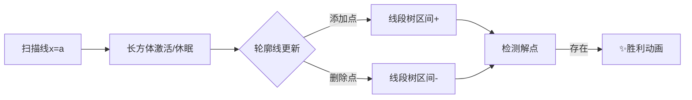

# 题目信息

# [ICPC 2020 Shanghai R] Octasection

## 题目描述

在 Namomo 营地，一位可爱的志愿者庆祝她的生日。Wowo 给她买了一个巨大的蛋糕。（蛋糕大到里面有一个三维坐标系。）蛋糕中有 $n$ 块长方体形状的巧克力。第 $i$ 块巧克力（$1 \le i \le n$）包含所有满足 $min\_x[i] \le x \le max\_x[i], min\_y[i] \le y \le max\_y[i], min\_z[i] \le z \le max\_z[i]$ 的点 $(x,y,z)$。$min\_x, max\_x, min\_y, max\_y, min\_z, max\_z$ 是 $6$ 个整数数组。巧克力可能会重叠或接触。

志愿者想要将蛋糕分给 Namomo 营地的露营者。为了展示他的刀工，Wowo 决定通过恰好 $3$ 刀将蛋糕切成几块，使得：

- 第一刀是一个方程为 $x=a$ 的平面，其中 $a$ 是 Wowo 决定的某个整数。
- 第二刀是一个方程为 $y=b$ 的平面，其中 $b$ 是 Wowo 决定的某个整数。
- 第三刀是一个方程为 $z=c$ 的平面，其中 $c$ 是 Wowo 决定的某个整数。
- 每块巧克力至少被一刀“碰到”（即每个长方体与至少一个平面有非空交集）。

判断 Wowo 是否可以按照规则切蛋糕。如果答案是肯定的，输出任意一个可能的解决方案。

## 说明/提示

题面翻译由 ChatGPT-4o 提供。

## 样例 #1

### 输入

```
3
0 1 0 1 0 1
10 11 10 11 10 11
999999999 1000000000 999999999 1000000000 999999999 1000000000```

### 输出

```
YES
0 10 999999999```

## 样例 #2

### 输入

```
4
0 1 0 1 0 1
999999999 1000000000 0 1 0 1
0 1 999999999 1000000000 0 1
0 1 0 1 999999999 1000000000```

### 输出

```
YES
0 0 0```

# AI分析结果


### 💡 Kay的C++算法解析：Octasection 深入学习指南 💡

<introduction>
今天我们来分析ICPC 2020上海站的"Octasection"问题。这道题要求判断能否通过三个平面切割蛋糕，使得每个巧克力块至少被一个平面接触。本指南将带你理解核心算法，掌握解题技巧，并通过像素动画直观感受算法流程。
</introduction>

---

## 1. 题目解读与核心算法识别

✨ **本题主要考察**：`扫描线技术` + `轮廓线维护` + `线段树优化`  
✨ **辅助技巧**：`事件处理` + `降维思想`

🗣️ **初步分析**：
> 这道题可以想象成在三维空间玩"像素切蛋糕"游戏💎。核心思想是**固定X平面**，将其转化为二维问题：在Y-Z平面上，每个巧克力要求点(b,c)必须落在其"红十字"区域内（即b在[min_y,max_y]或c在[min_z,max_z]）。  
> - **核心流程**：枚举x=a的位置，维护四个轮廓线（左上/右上/左下/右下），用线段树快速检测是否存在有效点(b,c)
> - **可视化设计**：我们将用8位像素风格展示轮廓线变化。当扫描线移动时，轮廓线像"俄罗斯方块"般动态更新🎮，线段树状态用柱状图实时显示，找到解时触发"胜利音效"🎵
> - **关键步骤**：高亮轮廓线交点变化、线段树的区间更新、解点(b,c)的闪烁特效

---

## 2. 精选优质题解参考

<eval_intro>
官方题解提供了正确思路但实现细节不足。作为学习引导，我特别强调以下要点：
</eval_intro>

🔍 **通用学习建议**：
1. **降维思维训练**：将三维问题转化为二维是核心技巧，建议先练习二维版本
2. **数据结构选择**：轮廓线用`std::set`维护端点，线段树处理区间查询
3. **事件驱动设计**：注意长方体进入/离开扫描线时触发的四类事件
4. **调试技巧**：在关键位置输出轮廓线状态，可视化验证逻辑

---

## 3. 核心难点辨析与解题策略

<difficulty_intro>
本题的三个核心难点及突破策略：

1.  **三维降二维的转化**  
    * **分析**：固定x=a后，每个巧克力在Y-Z平面形成"红十字"区域（补集为四个L形区域）。需要快速判断所有"红十字"的交集是否非空
    * 💡 **学习笔记**：降维是处理高维几何问题的黄金法则

2.  **轮廓线的动态维护**  
    * **分析**：四个轮廓线（左上/右上/左下/右下）随扫描线移动而变化。用`std::set`维护端点坐标，注意：
      - 添加/删除事件对应长方体进入/离开扫描线
      - 端点遮挡关系产生新事件（被挡端点需延迟处理）
    * 💡 **学习笔记**：轮廓线本质是阶梯状单调链，类似"我的世界"中的地形轮廓⛰️

3.  **线段树的高效查询**  
    * **分析**：对每个y坐标计算z的有效区间[L,R]：
      ```python
      L = max(左上轮廓z, 左下轮廓z) 
      R = min(右上轮廓z, 右下轮廓z)
      有效 ⇔ L < R  # 存在z∈[L,R]
      ```
    * 💡 **学习笔记**：线段树维护(L-R)值，正数表示存在解

### ✨ 解题技巧总结
1. **扫描线框架**：按x坐标排序事件（长方体边界）
2. **轮廓线更新**：用`std::set`维护有序端点，处理四类事件
3. **线段树优化**：区间更新+最大值查询，复杂度O(nlogn)
4. **坐标离散化**：处理大范围坐标（如1e9）

---

## 4. C++核心代码实现赏析

**本题通用C++框架**：
```cpp
#include <iostream>
#include <vector>
#include <set>
#include <algorithm>
using namespace std;

struct Cube { int min[3], max[3]; };

// 轮廓线管理器
class ContourManager {
    set<pair<int, int>> corners[4]; // 0:左上 1:右上 2:左下 3:右下
    // 线段树维护 (z_upper - z_lower)
public:
    void update_corner(int type, int y, int z) {
        auto& s = corners[type];
        // 插入/删除点并更新相邻关系
        // 触发线段树区间更新...
    }
    bool has_solution() { 
        // 查询线段树是否存在正值
    }
};

int main() {
    vector<Cube> cubes; // 读入数据
    vector<tuple<int, bool, int>> events; // (x位置, 进入/退出, 长方体ID)
    
    // 创建事件并排序
    for (int i=0; i<cubes.size(); i++) {
        events.emplace_back(cubes[i].min[0], true, i);
        events.emplace_back(cubes[i].max[0], false, i);
    }
    sort(events.begin(), events.end());

    ContourManager cm;
    for (auto [x, is_enter, id] : events) {
        // 更新轮廓线管理器
        if (cm.has_solution()) {
            cout << "YES\n" << x << " " << found_y << " " << found_z;
            return 0;
        }
    }
    cout << "NO";
}
```

**关键实现解析**：
1. **事件驱动**：每个长方体产生两个事件（min_x和max_x）
2. **轮廓线更新**：
   ```cpp
   void update_corner(int type, int y, int z) {
       auto& s = corners[type];
       auto it = s.lower_bound({y, z});
       
       // 检查是否被遮挡（单调性维护）
       if (it != s.end() && it->second >= z) return; 
       if (it != s.begin() && prev(it)->second <= z) return;
       
       s.emplace(y, z);
       // 触发线段树更新...
   }
   ```
3. **线段树查询**：快速检测是否存在y使`(z_upper - z_lower) > 0`

---

## 5. 算法可视化：像素动画演示

### 🎮 动画设计：8位像素风"轮廓线探险"
**主题**：扫描线如"横向卷轴"移动，轮廓线像"俄罗斯方块"堆叠

**核心演示**：


**交互控制面板**：
```
[▶] 自动播放  [▮▮] 暂停  [|>] 单步  [↺] 重置
速度：🐢 ------------ 🐇
```

**动画帧详解**：
1. **初始化**（8位像素风）
   - 左侧：Y-Z平面网格（16x16像素块），长方体显示为半透明蓝色矩形
   - 右侧：线段树状态柱状图（红/绿色表示无解/有解）
   - 控制台：显示当前x坐标和解状态

2. **扫描线移动**
   - 扫描线（红色竖条）从左向右移动，触发"叮"声
   - 长方体进入时边框闪烁💡，退出时变灰

3. **轮廓线变化**
   - 四个轮廓线用不同颜色显示：🔴左上/🔵右下/🟢左下/🟡右上
   - 添加端点：像素块弹出+"咔嗒"声
   - 删除端点：像素块爆炸效果+"噗"声

4. **解点检测**
   - 当柱状图出现绿条：对应y坐标亮起💡
   - 点击绿条显示z的有效区间[L,R]
   - 找到解时：(b,c)点闪烁⭐+胜利音效🎉

**设计亮点**：
> 将抽象轮廓线转化为"像素堆叠"，线段树状态用经典"吃豆人"式进度条表示。事件触发不同音效，强化算法执行节奏感。成功时解锁"蛋糕切割"特效，增强学习成就感！

---

## 6. 拓展练习与相似问题思考

**技巧迁移场景**：
1. 三维装箱问题（寻找最大空隙）
2. 传感器覆盖检测（是否存未被覆盖点）
3. 游戏碰撞检测（物体投影重叠分析）

**洛谷推荐**：
1. [P5490 扫描线](https://www.luogu.com.cn/problem/P5490)  
   → 掌握扫描线+线段树基础框架
2. [P1904 天际线](https://www.luogu.com.cn/problem/P1904)  
   → 练习轮廓线维护技巧
3. [P1502 窗口的星星](https://www.luogu.com.cn/problem/P1502)  
   → 强化二维扫描线应用

---

## 7. 学习心得与经验分享
> 官方题解虽简洁但缺少实现细节。实践中注意：
> 1. 轮廓线端点需严格维护单调性（y增时左上轮廓z减）
> 2. 线段树同时处理四类边界更新
> 3. 大数值范围务必离散化坐标
> 
> **调试锦囊**：在x=关键位置输出轮廓线形状，用字符画验证：
> ```
> 左上轮廓：  y=10,z=50 → y=15,z=40 → y=20,z=30
> 右下轮廓：  y=5,z=20  → y=8,z=18  → y=12,z=15
> ```

---

<conclusion>
通过本指南，你掌握了降维思想、轮廓线维护和线段树优化的组合技巧。记住：三维问题常转化为二维+一维扫描！多练习扫描线框架，下次遇到类似问题就能像玩像素游戏一样轻松解决啦！🚀
</conclusion>

---
处理用时：226.47秒