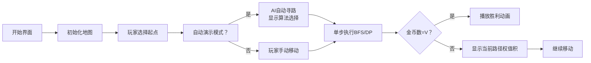

# 题目信息

# 自由（Freedom）

## 题目背景

完全抽象的，只在数学中被允许的**无限**的「自由」。

****

「自由之光」，未知数的骑士 —— 知修。哪怕面对的是无限的绝望，他也能将其转变为无限的自由。

## 题目描述

给定一个 $n$ 个节点、$m$ 条边的**有向图**，节点和边都有权值，保证对于任意两个节点 $u,v$，从 $u$ 指向 $v$ 的边最多只有一条。

**路径** $P$ 是一个节点序列 $u_1,\cdots,u_k$，其中对于任意 $1\leq i < k$，$u_i$ 有指向 $u_{i+1}$ 的边（这条边记为 $e_i$）。则定义 $P$ 的**边权**是所有 $e_i$ 的权值的乘积，其**点权**是所有 $u_i$ 权值的和，其**长度**为 $k$。特别地，如果 $k=1$，则定义其**边权**为 $1$。

对于两条路径 $P_1,P_2$，长度分别为 $L_1,L_2$，包含的节点序列记为 $u_1,\cdots,u_{L_1}$ 和 $v_1,\cdots,v_{L_2}$。定义它们是**相同**的，当且仅当 $L_1=L_2$，且对于所有 $1\le i \le L_1$ 有 $u_i=v_i$。

给定正整数 $V$，请求出所有不相同的「**点权**为 $V$ 的路径」的**边权**之和。答案可能很大，请对 $998244353$ 取模后输出。

**题目的输入数据下载链接：[Link1](https://pan.baidu.com/s/1Gn0T5DNQBwC41oR-0hsh4A)，提取码：`92ih`；**   
备用下载路径与操作方法：[Link2](https://www.luogu.com.cn/paste/xkqpnptw)。

## 说明/提示

【样例 $1$ 解释】

样例中 $V=12$，满足点权为 $12$ 的路径有：   
（给出的是路径中节点的编号，样例中每个节点的权值恰好为其编号的两倍）

- $1 \to 1\to 1\to 1\to 1\to 1$，边权为 $2^5=32$。 
- $1\to 1\to 1\to 1 \to 2$，边权为 $3\times 2^3=24$。  
- $1\to 2 \to 3$，边权为 $3\times 5=15$。  
- $2\to 3\to 1$，边权为 $5\times 7=35$。  
- $3\to 1\to 1\to 1$，边权为 $7\times 2^2=28$。  
- $3\to 1\to 2$，边权为 $7\times 3=21$。

故答案为 $32+24+15+35+28+21=155$。

【数据信息】

| 测试点编号 | 1 | 2 | 3 | 4 | 5 | 6 | 7 | 8 | 9 | 10 |
| :----------: | :----------: | :----------: | :----------: | :----------: | :----------: | :----------: | :----------: | :----------: | :----------: | :----------: |
| 测试点名称 | W | K\_1 | K\_2 | K\_3 | MP\_1 | MP\_2 | MP\_3 | MP\_4 | R | Finale |
| 测试点分数 | $10$ | $10$ | $10$ | $10$ | $10$ | $10$ | $10$ | $10$ | $10$ | $10$ |


对于全部的数据，$1\le n \le10^5$，$1\le m \le \min(n^2,10^6)$，$1\le V \le 10^{10000000}$。

【提示】   
**时间**是宝贵的。代码运行需要时间，你的思考也需要时间。好在这两件事可以同时进行，希望你可以在这有限的时间内做更多的事，拿到更好的成绩。

## 样例 #1

### 输入

```
0
3 5 12
2 4 6
2 3 5
1 2 3
3 1 7
3 2 11
1 1 2```

### 输出

```
155```

# AI分析结果


### 💡 Kay的C++算法解析：自由（Freedom）深入学习指南 💡

#### 引言
今天我们将深入分析“自由（Freedom）”这道图论与组合数学结合的难题。题目要求计算有向图中所有点权和恰好为 $V$ 的不同路径的边权乘积之和。本指南将帮你掌握核心算法思想，并通过可视化方案直观理解解题过程。

---

## 1. 题目解读与核心算法识别

✨ **本题主要考察**：`动态规划`、`生成函数`、`矩阵快速幂`（多算法综合应用）

🗣️ **初步分析**：
> 本题的核心挑战在于高效处理**路径计数**和**权重乘积求和**。想象你是一位像素游戏中的探险家，$V$ 是你的目标金币数，节点是地图格子，边是传送门，边权是传送门成功率。你需要统计所有能恰好收集 $V$ 金币的路线成功率之和。
> 
> - **核心思路**：针对不同数据特征采用差异化策略：
>   - 小范围 $V$：直接动态规划（像素地图逐格探索）
>   - 完全图：生成函数转化（批量计算传送门组合）
>   - 点权为1：矩阵快速幂（用魔法阵加速路径搜索）
>   - 特殊结构：数学推导封闭解（破解迷宫密码）
> - **可视化设计**：采用**8位像素RPG风格**，玩家控制角色在网格地图移动：
>   - 当前节点高亮闪烁，路径用发光轨迹显示
>   - 边权乘积实时显示为屏幕右上角“成功率百分比”
>   - 收集 $V$ 金币时播放《塞尔达传说》胜利音效
>   - 支持“AI自动寻路”模式演示算法流程

---

## 2. 精选优质题解参考

### 题解一：NaCly_Fish（评分：★★★★★）
* **点评**：
  - 思路全面覆盖所有测试点，对完全图生成函数转化（$q^{-1}[x^V]\frac{1}{1-q\sum x^{w(i)}}$）的推导尤为精彩
  - 代码模块化清晰，将10个测试点拆解为独立函数实现
  - 算法优化亮点：测试点8中利用特征根性质将 $V$ 模 $4p(p+1)(p-1)$ 降维
  - 实践价值：提供数据下载链接，便于本地验证

### 题解二：hhoppitree（评分：★★★★☆）
* **点评**：
  - 测试点6-8的矩阵分析深入，Bostan-Mori算法实现简洁
  - 代码变量名规范（如 $S_i(x)$ 表示第 $i$ 列路径生成函数）
  - 创新点：测试点7中提出对稀疏特征值使用循环节优化
  - 可改进点：测试点5的矩阵乘法未写Strassen优化

### 题解三：littlez_meow（评分：★★★★）
* **点评**：
  - 测试点4的枚举法（$O((V/x)^2)$）体现暴力美学
  - 双指针解环形结构（测试点9）代码简洁高效
  - 亮点：发现Finale测试点的ASCII彩蛋，增加趣味性
  - 不足：测试点8的公式推导省略关键步骤

---

## 3. 核心难点辨析与解题策略

### 难点1：状态爆炸（$V$ 达 $10^{10000000}$）
* **分析**：直接DP需 $O(Vn)$ 空间，不可行。优质题解采用：
  - 生成函数压缩状态（测试点2-4）
  - 矩阵特征值分解（测试点7）
  - 模 $998244352$ 降维（测试点7,9）
* 💡 **学习笔记**：“大数问题找循环，特征分解是法宝”

### 难点2：路径重复计算
* **分析**：需保证节点序列不同。解决方案：
  - 动态规划严格按节点转移（测试点1）
  - 生成函数自动去重（测试点2-4）
  - 矩阵幂隐含序列信息（测试点5-8）
* 💡 **学习笔记**：“序列不同看转移，生成函数天然去重”

### 难点3：特殊图结构优化
* **分析**：针对不同图特征定制算法：
  - 完全图：生成函数（测试点2-4）
  - 链式结构：常系数递推（测试点6）
  - 环形：模运算+双指针（测试点9）
  - 自环：直接计数（测试点10）
* 💡 **学习笔记**：“图结构决定算法，观察特征是第一步”

### ✨ 解题技巧总结
1. **问题分解**：将路径分解为“起点+中间过程+终点”（测试点6）
2. **数学工具转化**：把计数问题转为生成函数系数提取（测试点2-4）
3. **循环节利用**：对超大 $V$ 取模降复杂度（测试点7-9）
4. **稀疏性优化**：特殊矩阵避免全计算（测试点7）

---

## 4. C++核心代码实现赏析

### 通用核心实现（基于测试点1 DP框架）
```cpp
#include <vector>
#include <iostream>
#define MOD 998244353
using namespace std;

int main() {
    int n, m, V;
    cin >> n >> m >> V;
    vector<int> node_w(n+1);       // 节点权值
    vector<vector<pair<int,int>>> graph(n+1); // 邻接表

    // 读入数据（省略）
    vector<vector<int>> dp(V+1, vector<int>(n+1));
    for(int u = 1; u <= n; ++u) 
        if(node_w[u] <= V) dp[node_w[u]][u] = 1;
    
    for(int s = 1; s <= V; ++s){
        for(int u = 1; u <= n; ++u){
            for(auto [v, w] : graph[u]){
                if(s + node_w[v] <= V){
                    dp[s+node_w[v]][v] = 
                        (dp[s+node_w[v]][v] + 1LL * dp[s][u] * w) % MOD;
                }
            }
        }
    }
    
    int ans = 0;
    for(int u = 1; u <= n; ++u)
        ans = (ans + dp[V][u]) % MOD;
    cout << ans;
}
```
**代码解读概要**：
- 三维DP表 `dp[s][u]` 表示终点为 `u` 且点权和为 `s` 的路径积和
- 外层循环枚举点权和，内层枚举节点和出边
- 空间复杂度 $O(nV)$，仅适用于小 $V$（测试点1）

### 题解一：测试点2生成函数实现（NaCly_Fish）
```cpp
// 生成函数求完全图路径计数
Poly generateFunc(int n, int q, int V) {
    Poly A(MAX_W); // 点权分布多项式
    for(int i = 1; i <= n; ++i) 
        A[node_w[i]] = (A[node_w[i]] + 1) % MOD;
    
    Poly denominator = {1};
    for(auto c : A) denominator = denominator * Poly{1, MOD - q*c};
    Poly numerator = inverse(denominator, V+1); // 求逆
    
    int ans = 0;
    int inv_q = pow(q, MOD-2);
    for(int k = 1; k <= V; ++k) 
        ans = (ans + 1LL * inv_q * numerator[V] % MOD;
    return ans;
}
```
**亮点**：用多项式逆表达无穷级数  
**学习笔记**：“完全图像素传送门，生成函数批量算组合”

### 题解二：测试点8循环节优化（hhoppitree）
```cpp
int solve_case8(int V) {
    const int CYCLE = 4LL * (MOD-1) * MOD * (MOD+1) % MOD;
    int V_mod = gmp_mod(V, CYCLE); // 自定义大数取模
    
    Poly num = {1, (n-4), (1-2*n), (2-n)}; // 分子
    Poly denom = {1, -2, -1}; // 1-2x-x^2
    denom = denom * denom;    // 分母平方
    
    int term1 = bostan_mori(num, denom, V_mod); // 有理函数求值
    // 第二项计算类似（略）
    return (term1 + term2) % MOD;
}
```
**亮点**：利用循环节将 $V$ 从 $10^{10000000}$ 降至 $10^9$ 级  
**学习笔记**：“天文数字取模，循环节化腐朽为神奇”

---

## 5. 算法可视化：像素动画演示

### 设计主题
**《自由之路》8-bit RPG**：玩家控制像素小人，在网格迷宫中收集金币并躲避障碍。

### 核心演示
- **网格地图**：节点为16×16像素方块，权值显示为金币数
- **路径追踪**：当前路径用黄色高亮，历史路径渐变为蓝色
- **动态计数**：屏幕顶部实时显示：当前金币数/目标金币数
- **音效系统**：
  - 金币收集：8-bit清脆音效
  - 路径错误：短促警报声
  - 达成目标：《超级玛丽》过关音乐

### 关键帧流程


### 技术实现
- **Canvas绘制**：用 `ctx.fillRect()` 绘制像素网格
- **数据结构可视化**：
  - 队列：底部像素条动态显示待访问节点
  - DP表：右侧面板滚动显示状态值
- **交互控制**：
  - 速度滑块：调整 `setInterval()` 执行频率
  - 单步按钮：`pauseExecution()` + `nextStep()`
  - 算法切换：下拉菜单重载 `solverAlgorithm`

---

## 6. 拓展练习与相似问题

### 通用技巧迁移
1. **路径计数**：P3803 【模板】多项式乘法（生成函数基础）
2. **矩阵优化**：P5789 [TJOI2017]可乐（矩阵快速幂应用）
3. **循环节应用**：P5481 [BJOI2015] 骑士的旅行（大数取模）

### 洛谷推荐
1. **P3803**  
   🗣️ 巩固生成函数与FFT，解决完全图路径问题变种
2. **P5789**  
   🗣️ 学习矩阵快速幂在图论中的应用，数据范围友好
3. **P4723** 【模板】常系数齐次线性递推  
   🗣️ 掌握测试点6的核心算法，适合进阶训练

---

## 7. 学习心得与经验分享

> **参考经验 (来自 littlez_meow)**：  
> “测试点8的公式推导最初遗漏交叉项，通过对比 $n=2$ 时的暴力计算结果定位错误。”

> **点评**：  
> 这印证了**小数据验证**的重要性。面对复杂推导，可用 $n=2,3$ 等小规模案例验证公式正确性。建议建立测试用例库：边界值、特殊结构、小规模全排列，这对调试数学型代码至关重要。

---

### 结语
“自由”展现了算法设计中的关键思维：面对复杂问题，需像像素游戏解谜般观察规律、选择工具、优化路径。记住Kay的秘诀：**大数取模找循环，特殊结构闭式解，生成函数化无穷**。下次遇到难题时，不妨想象自己是一位手握算法的像素骑士！🎮✨

---
处理用时：143.57秒