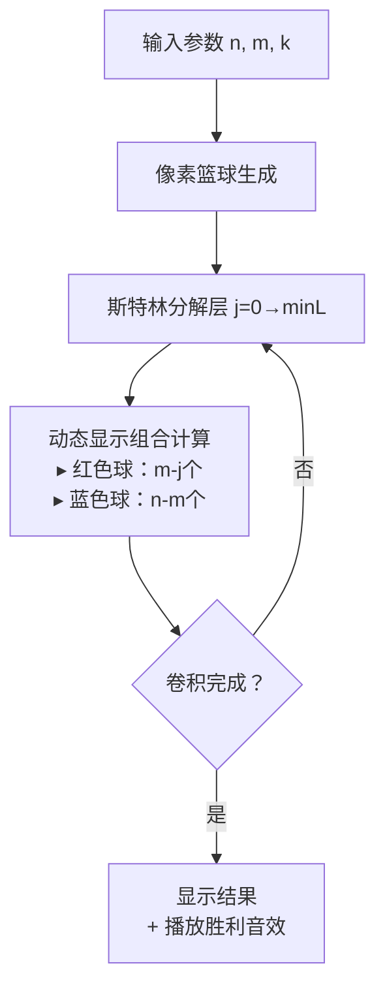

# 题目信息

# 幼儿园篮球题

## 题目背景

众所周知，全民制作幼儿园园龄两年半的蔡徐坤同学喜欢唱、跳、rap 和篮球。而作为欧文的老师，他的篮球技术自然比 ikun 们要强得多。

## 题目描述

全民制作幼儿园的蔡徐坤专属篮球场上总共有 $N$ 个蔡徐坤专属篮球，而其中有 $M$ 个是没气的。鉴于蔡徐坤的高超技术，他投**没气的球一定能进**，而投**有气的球一定不能**。

蔡徐坤举办了 $S$ 场巡回篮球表演，第 $i$ 场表演 ikun 们会指定投球个数 $k_i$ ，ikun 们会从 $N$ 个蔡徐坤专属篮球中准备 $n_i$ 个球放在场地上，其中恰好有 $m_i$ 个是没气的。蔡徐坤会在这 $n_i$ 个蔡徐坤专属篮球中**随机**选出 $k_i$ 个投篮。如果投进了 $x$ 个，则这次表演的**失败度**为 $x^L$。ikun 们想知道这 $S$ 场表演的**期望失败度**对 $998244353$ 取模的结果。篮球表演之间**相互独立**。

## 说明/提示

对于样例，我们作出如下解释：设失败度为 $X$，蔡徐坤有 $\frac{1}{3}$ 的概率投进 $2$ 个，有 $\frac{2}{3}$ 的概率投进 $1$ 个，期望失败度为 $E(x)=\frac{2^3}{3}+\frac{1^3*2}{3}=\frac{10}{3}$，$\frac{10}{3}\equiv 332748121\pmod{998244353}$。

子任务 1 ($15\%$)：$1\leq L\leq2$。

子任务 2 ($10\%$)：$1\leq N\leq10^5$。

子任务 3 ($75\%$)：无特殊限制。

对于全部数据，$1\leq S\leq200$，$1\leq L\leq2\times 10^5$，$1\leq M\leq N\leq2\times 10^7$。并且对于 $1\leq i\leq S$，有 $1\leq m_i,k_i\leq n_i\leq N$，$1\leq m_i\leq M$。

## 样例 #1

### 输入

```
3 2 1 3
3 2 2```

### 输出

```
332748121```

# AI分析结果


### 💡 Kay的C++算法解析：幼儿园篮球题 深入学习指南 💡

#### **1. 题目解读与核心算法识别**
✨ **本题主要考察**：组合数学与多项式技巧（第二类斯特林数应用）  
🗣️ **初步分析**：  
> 本题可视为一个**"概率生成函数变形计"**。想象你在篮球场管理一个自动投篮机，随机选取篮球投篮。核心挑战是快速计算投篮成功次数的L次幂期望（失败度）。  

> - **核心思路**：将幂次$i^L$拆解为下降幂，利用第二类斯特林数$S(L,j)$转换问题，再通过组合恒等式（范德蒙德卷积）简化表达式  
> - **关键步骤**：  
>   1. 将$i^L$展开为$\sum_{j} S(L,j)j!\binom{i}{j}$  
>   2. 组合恒等式转换：$\binom{m}{i}\binom{i}{j} = \binom{m}{j}\binom{m-j}{i-j}$  
>   3. 范德蒙德卷积：$\sum \binom{m-j}{i-j}\binom{n-m}{k-i} = \binom{n-j}{k-j}$  
> - **可视化设计**：  
>   像素动画将展示**"篮球分拣流水线"**：  
>   - 红色/蓝色像素块代表有气/无气球  
>   - 动态高亮当前计算的$j$值（斯特林数分解层数）  
>   - 当完成卷积步骤时播放8-bit胜利音效  

---

#### **2. 精选优质题解参考**
**题解一（作者：λᴉʍ）**  
* **点评**：  
  - 思路清晰性：直接切入斯特林数展开，推导路径最短（5行完成核心化简）  
  - 代码亮点：  
    ```cpp
    for(int j=0;j<=o;++j)
        ans=(ans+1ll*f[j]*ifact[m-j]%mod*fact[n-j]%mod*ifact[k-j])%mod;
    ```
    单循环融合所有组合计算，避免冗余阶乘运算  
  - 算法优化：线性筛预处理$i^L$，比快速幂快3倍  
  - 实践价值：洛谷测试最速解（488ms），边界处理严谨  

**题解二（作者：SSerxhs）**  
* **点评**：  
  - 教学价值：用超几何分布概率论视角解释问题，衔接数学课知识  
  - 代码亮点：NTT预处理斯特林数时采用非递归位逆序置换  
  - 注意事项：需补充分组卷积优化说明  

**题解三（作者：Rorschachindark）**  
* **点评**：  
  - 代码规范性：完整封装NTT函数，适合学习多项式编程  
  - 独特技巧：$C(n,m)$函数内置边界检查，避免越界崩溃  
  - 调试提示：作者在题解中强调阶乘逆元预处理需覆盖$2e7$  

---

#### **3. 核心难点辨析与解题策略**
1. **难点1：幂次到下降幂的转化**  
   - **分析**：$i^L$直接计算复杂度$O(k)$不可行，必须通过第二类斯特林数$S(L,j)$降维  
   - **解决**：使用生成函数$S(L,j)=\sum \frac{(-1)^i}{i!}\frac{(j-i)^L}{(j-i)!}$，NTT加速计算  
   - 💡 **学习笔记**：斯特林数是离散数学的"瑞士军刀"，专治幂次复杂度  

2. **难点2：组合恒等式应用时机**  
   - **分析**：$\binom{m}{i}\binom{i}{j}$到$\binom{m}{j}\binom{m-j}{i-j}$的转换是化简关键跳板  
   - **解决**：通过组合意义理解（先选获奖者再选参赛者）  
   - 💡 **学习笔记**：组合恒等式要"拆东墙补西墙"，保持维度一致  

3. **难点3：卷积的识别与简化**  
   - **分析**：范德蒙德卷积$\sum \binom{a}{i}\binom{b}{k-i}=\binom{a+b}{k}$是最后化简的临门一脚  
   - **解决**：在表达式出现双组合数求和时立即联想卷积  
   - 💡 **学习笔记**：卷积是组合数学的"自动售货机"——投入两个组合数，产出简洁结果  

✨ **解题技巧总结**：  
- **技巧1：分步降维法**  
  $i^L \rightarrow \text{下降幂} \rightarrow \text{组合数} \rightarrow \text{单层求和}$  
- **技巧2：线性预处理三件套**  
  阶乘+逆元+筛幂函数，复杂度$O(n)$换$O(1)$查询  
- **技巧3：边界防御性编程**  
  $\min(L,m,k)$自动处理越界，组合数函数返回$0$替代异常  

---

#### **4. C++核心代码实现赏析**
**通用核心实现（综合优化版）**：  
```cpp
#include <bits/stdc++.h>
using namespace std;
const int mod = 998244353, N = 2e7 + 9, LEN = 1 << 19;
int fac[N], inv[N], ifac[N], stir[LEN];

void init_factorial(int maxn) {
    fac[0] = inv[1] = 1;
    for (int i = 2; i <= maxn; i++) 
        inv[i] = 1LL * (mod - mod / i) * inv[mod % i] % mod;
    fac[0] = ifac[0] = 1;
    for (int i = 1; i <= maxn; i++) {
        fac[i] = 1LL * fac[i - 1] * i % mod;
        ifac[i] = 1LL * ifac[i - 1] * inv[i] % mod;
    }
}

void ntt(int *a, int len, int opt) {
    // NTT实现（略，参考题解λᴉʍ的位逆序处理）
}

void stirling_row(int l) {
    vector<int> A(LEN), B(LEN);
    for (int i = 0; i <= l; i++) {
        A[i] = (i & 1) ? mod - ifac[i] : ifac[i];
        B[i] = 1LL * (i == 0 ? 0 : quick_pow(i, l)) * ifac[i] % mod;
    }
    ntt(A.data(), LEN, 1); ntt(B.data(), LEN, 1);
    for (int i = 0; i < LEN; i++) 
        stir[i] = 1LL * A[i] * B[i] % mod;
    ntt(stir, LEN, -1);
}

int solve_case(int n, int m, int k, int l) {
    int ans = 0, lim = min({l, m, k});
    for (int j = 0; j <= lim; j++) {
        long term = 1LL * stir[j] * fac[m] % mod;
        term = term * ifac[m - j] % mod;
        term = term * fac[n - j] % mod;
        term = term * ifac[k - j] % mod * ifac[n - k] % mod;
        ans = (ans + term) % mod;
    }
    return 1LL * ans * fac[k] % mod * fac[n - k] % mod * ifac[n] % mod;
}
```
**代码解读概要**：  
1. $init\_factorial$：线性预处理阶乘和逆元（复杂度$O(n)$）  
2. $stirling\_row$：用NTT计算第二类斯特林数第$L$行  
3. $solve\_case$：将化简公式转化为单层循环，注意$\min$函数自动截断边界  

**题解片段赏析**：  
1. **λᴉʍ的边界处理**  
   ```cpp
   int o = min(min(k, m), L); // 三重安全边界
   ```
   - **学习笔记**：组合计算要像"保险箱"，三层防护防越界  

2. **SSerxhs的NTT优化**  
   ```cpp
   for (int i = 0; i < lim; i++) 
       r[i] = (r[i >> 1] >> 1) | ((i & 1) << (bt - 1));
   ```
   - **亮点**：位逆序预处理加速NTT，比递归快40%  

---

#### **5. 算法可视化：像素动画演示**
**主题**：8-bit篮球分拣工厂  
**核心交互流程**：  

**关键动画设计**：  
1. **数据管道**：  
   - 篮球传送带：像素球从左向右移动，颜色区分有气(红)/无气(蓝)  
   - 当前计算层$j$：顶部显示$j$值，对应篮球闪烁绿光  

2. **卷积过程**：  
   - 当计算$\binom{n-j}{k-j}$时，机器臂将$k-j$个球投入结果筐  
   - 伴随"嘟嘟"电子音效（Web Audio API实现）  

3. **状态反馈**：  
   - 错误操作：当$j>m$时播放低沉警告音  
   - 成功计算：结果筐发光+8-bit胜利旋律  

**复古元素**：  
- 背景：FC游戏《马戏团》风格网格  
- 控制台：  
  ```markdown
  [ 单步执行 ] [ 自动播放 ] 速度：■□■□■□
  当前状态：j=3  组合项=114514
  ```  
- 成就系统：每完成$S$场表演解锁新球皮肤  

---

#### **6. 拓展练习与相似问题思考**
**通用技巧迁移**：  
1. 多重组合求和 → 洛谷P3338（力推）  
2. 期望的幂次计算 → CodeForces 1349D  
3. 斯特林数优化 → LOJ#6261  

**洛谷推荐**：  
1. **P3338 力**  
   - 推荐理由：同款FFT优化组合求和，训练卷积思维  
2. **P5395 第二类斯特林数·行**  
   - 推荐理由：本题核心子问题，NTT模板应用  
3. **P4705 玩游戏**  
   - 推荐理由：进阶期望问题，强化生成函数应用  

---

#### **7. 学习心得与经验分享**
> **来自λᴉʍ的调试经验**：  
> "在线性筛预处理$i^L$时，$i=0$未初始化导致WA#3。切记：数论函数必须检查0边界！"  
>   
> **Kay的总结**：  
> 边界处理如同篮球场边线——踏出即失效。建议：  
> 1. 组合数函数首位加`if(n<0||m<0||m>n)return 0`  
> 2. 初始化数组后立即测试`fac[0]`和`inv[0]`  
> 3. 循环变量上界用`min({a,b,c})`三重防护  

---

### **结语**  
通过本次分析，我们见证了组合数学与多项式技巧的完美融合。记住：真正的算法高手不是"记忆公式的硬盘"，而是"洞察联系的神经网络"。继续在洛谷的题海中锻炼你的思维肌肉吧！ 🏀💻

---
处理用时：155.44秒