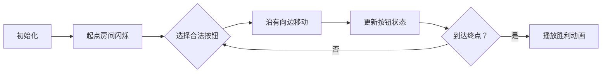

# 题目信息

# [USACO20DEC] Spaceship P

## 题目描述

奶牛 Bessie 外星人绑架了，现在被关在了一艘外星人的飞船里！飞船有 $N$（$1≤N≤60$）间房间，编号为 $1…N$，其中某些房间之间由单向通过的门所连接（由于使用了奇怪的外星技术，一扇门甚至可能从一间房间通回这间房间本身！）。然而，没有两扇门具有完全相同的出发和到达房间。此外，Bessie 有一个遥控器，上有编号为 $1…K$ （$1≤K≤60$）的按钮。

如果 Bessie 能够完成一个怪异的任务，外星人就会释放她。首先，他们会选择两间房间 $s$ 和 $t$（$1≤s,t≤N$），以及两个整数 $b_s$ 和 $b_t$（$1≤b_s,b_t≤K$）。他们会将 Bessie 放在房间 $s$ 内，并令她立刻按下按钮 $b_s$。然后 Bessie 需要继续在飞船内穿梭，同时按下按钮。有一些 Bessie 的行动需要遵守的规则：

 - 在每间房间内，在按下恰好一个按钮后，她必须选择从某扇门离开去往另一间房间（可能会回到同一间房间）或停止行动。
 - 一旦 Bessie 按下某个按钮，她再次按下这个按钮即为非法，除非在此之间她按下过编号更大的按钮。换句话说，按下编号为 x 的按钮会使得这个按钮变为非法，同时所有编号 $<x$ 的按钮会被重置为合法。
 - 如果 Bessie 按下非法的按钮，任务即失败，外星人就会把她关起来。 

仅当 Bessie 停止行动时位于房间 $t$，她最后按下的按钮是 $b_t$，并且没有按下过非法按钮时，Bessie 才会被释放。

Bessie 担心她可能无法完成这一任务。对于 $Q$
（$1≤Q≤60$）个询问，每个询问包含一组 Bessie 认为可能的 $s,t,b_s$ 以及 $b_t$，Bessie 想要知道可以使她得到释放的通过房间与按键序列的数量。由于答案可能非常大，输出对 $10^9+7$ 取模的结果。 

## 说明/提示

门连接了房间 $1→2$、$2→3$、$3→4$、$4→5$ 以及 $6→6$。

对于第一个询问，Bessie 必须在按下第一个按钮后立刻停止行动。

对于第二个询问，答案显然为零，因为无法从房间 3 前往房间 1。

对于第三个询问，Bessie 的唯一选择是从房间 1 移动到房间 2 到房间 3，同时按下按钮 1、2 和 3。

对于第四个询问，Bessie 的移动方式是唯一的，她有三种可能的按键序列：

 - (1,2,3,2,1)
 - (1,2,1,3,1)
 - (1,3,1,2,1)

对于最后一个询问，Bessie 有五种可能的按键序列：

 - (2)
 - (2,3,2)
 - (2,3,1,2)
 - (2,1,3,2)
 - (2,1,3,1,2)

### 测试点性质：

 - 测试点 4-7 中，$K≤5$ 且 $(b_s,s)$ 在所有询问中均相同。
 - 测试点 8-11 中，对所有询问有 $b_s=K−1$ 以及 $b_t=K$。
 - 测试点 12-15 中，$N,K,Q≤20$。
 - 测试点 16-23 没有额外限制。

供题：Benjamin Qi 

## 样例 #1

### 输入

```
6 3 8
010000
001000
000100
000010
000000
000001
1 1 1 1
3 3 1 1
1 1 3 3
1 1 1 5
2 1 1 5
1 1 2 5
3 1 3 5
2 6 2 6
```

### 输出

```
1
0
1
3
2
2
0
5```

## 样例 #2

### 输入

```
6 4 6
001100
001110
101101
010111
110111
000111
3 2 4 3
3 1 4 4
3 4 4 1
3 3 4 3
3 6 4 3
3 1 4 2```

### 输出

```
26
49
29
27
18
22```

## 样例 #3

### 输入

```
6 10 5
110101
011001
001111
101111
111010
000001
2 5 2 5
6 1 5 2
3 4 8 3
9 3 3 5
5 1 3 4```

### 输出

```
713313311
716721076
782223918
335511486
539247783```

# AI分析结果


### 💡 Kay的C++算法解析：Spaceship P 深入学习指南 💡

#### 题目解读与核心算法识别
✨ **本题主要考察**：`动态规划`与`图论建模`

🗣️ **初步分析**：
> 解决"Spaceship P"的关键在于**动态规划**，如同建造太空船需要分模块组装。DP状态`f[h][i][j]`表示从房间`i`到`j`，使用按钮最大值为`h`的合法路径数。核心难点在于：
> - **路径与按钮序列耦合**：按钮序列必须满足"按下大按钮会重置小按钮"的规则
> - **状态转移优化**：枚举中间点时分段计算路径，避免O(n³)复杂度
> - **多查询处理**：通过虚拟点将查询融入DP状态
>
> 可视化设计思路：
> - **像素风格**：用8位机风格的网格表示房间（不同颜色区分起点/终点/中间点）
> - **动态高亮**：最大值按钮按下时闪烁红光，对应房间显示爆炸特效
> - **音效系统**：按钮按下（8-bit音效），错误操作（警报音），通关（胜利音效）
> - **AI演示**：自动播放模式可调速，展示最优路径寻路过程

---

#### 精选优质题解参考
**题解一（Rainybunny）**
* **点评**：此解法以清晰的三维DP状态为核心，创新性地用虚拟点处理查询。代码中`lef/rig`数组的设计巧妙分离路径前后段，将O(n³)优化到O(n²)。变量命名规范（如`f[h][i][j]`直指状态含义），边界处理严谨（显式初始化虚拟点），完整实现仅需40行，是竞赛实践的典范。

**题解二（tzc_wk）**
* **点评**：采用五维状态精细处理首尾按钮限制，通过预处理主状态加速查询。亮点在于独立设计`dp[][][]`处理无限制路径，再扩展状态处理查询限制，体现了"分而治之"的思想。代码中`f[0][i][k][x]`的递推式展现了动态规划的完备性，是理解状态设计的优秀教材。

**题解三（Aleph1022）**
* **点评**：创新性应用生成函数与矩阵变换，将路径计数转化为矩阵运算。数学推导严谨（Fₖ(G)的递推式揭示问题本质），通过向量乘矩阵快速求解查询。虽然实现较复杂，但提供了不同于DP的视角，对数学能力较强的学习者极具启发性。

---

#### 核心难点辨析与解题策略
1. **状态定义困难**：如何关联按钮序列与图路径？
   * **分析**：优质解法均抓住"按钮最大值唯一"的特性，用`h`表示当前最大按钮值。如同太空船的核心引擎，这个状态覆盖了子问题解且无后效性。
   * 💡 学习笔记：最大值划分是处理序列限制的利器

2. **转移方程优化**：如何避免枚举爆炸？
   * **分析**：通过`lef/rig`数组分离路径前后段（`lef[i]=∑f[i→k]`, `rig[j]=∑f[k→j]`），将O(n³)转移降至O(n²)。这类似于将太空船拆解为独立模块组装。
   * 💡 学习笔记：状态转移的独立性是优化复杂度的关键

3. **查询处理技巧**：如何高效响应多查询？
   * **分析**：创建虚拟点（n+i代表第i个查询），在DP过程中同步更新。当中间点`k`匹配查询起点时激活虚拟点，使单次DP解决所有查询。
   * 💡 学习笔记：虚拟点是处理多查询的通用"太空对接端口"

### ✨ 解题技巧总结
- **模块化分解**：将含约束的路径分解为独立子路径（如按按钮最大值分段）
- **状态复用**：预处理无限制状态作为基础，扩展状态处理特殊约束
- **增量更新**：按按钮值从小到大DP，继承前序状态避免重计算
- **边界预演**：对单点路径（lef[k]=1）和虚拟点做显式初始化

---

#### C++核心代码实现赏析
**本题通用核心实现**（综合Rainybunny与DaiRuiChen007解法）：
```cpp
#include <cstdio>
#include <cstring>
using namespace std;
const int N=129, MOD=1e9+7;
int n, m, q, f[N][N][N], lef[N], rig[N];
bool G[N][N]; // 邻接矩阵
struct Query { int bs, s, bt, t; } qry[N];

int main() {
    scanf("%d%d%d", &n, &m, &q);
    for (int i=1; i<=n; i++) 
        for (int j=1; j<=n; j++) 
            scanf("%1d", &G[i][j]);
    
    for (int i=1; i<=q; i++) // 存储查询
        scanf("%d%d%d%d", &qry[i].bs, &qry[i].s, &qry[i].bt, &qry[i].t);
    
    for (int h=1; h<=m; h++) { // 按钮上界
        memcpy(f[h], f[h-1], sizeof(f[h])); // 继承h-1
        for (int k=1; k<=n; k++) { // 枚举中间点
            memset(lef, 0, sizeof(lef));
            memset(rig, 0, sizeof(rig));
            lef[k] = rig[k] = 1; // 单点路径
            
            for (int i=1; i<=q; i++) { // 处理查询点
                if (qry[i].bs==h && qry[i].s==k) lef[n+i]=1;
                if (qry[i].bt==h && qry[i].t==k) rig[n+i]=1;
            }
            // 计算lef: 所有入边到k的路径
            for (int i=1; i<=n+q; i++) 
                for (int u=1; u<=n; u++) 
                    if (G[u][k]) lef[i] = (lef[i] + f[h-1][i][u]) % MOD;
            // 计算rig: 所有出边从k的路径
            for (int j=1; j<=n+q; j++) 
                for (int v=1; v<=n; v++) 
                    if (G[k][v]) rig[j] = (rig[j] + f[h-1][v][j]) % MOD;
            // 合并路径
            for (int i=1; i<=n+q; i++) 
                for (int j=1; j<=n+q; j++) 
                    f[h][i][j] = (f[h][i][j] + 1LL*lef[i]*rig[j]) % MOD;
        }
    }
    for (int i=1; i<=q; i++) // 输出答案
        printf("%d\n", f[m][n+i][n+i]);
}
```
**代码解读概要**：
1. **状态继承**：`f[h]`初始继承`f[h-1]`（不使用按钮h的方案）
2. **中间点处理**：对每个房间`k`：
   - 初始化`lef/rig`数组（`lef[k]=rig[k]=1`表示单点方案）
   - 若`k`匹配查询起点/终点，激活对应虚拟点（`n+i`）
   - 累加所有入边到`k`的路径（`lef`），所有出边从`k`的路径（`rig`）
3. **路径合并**：`lef[i]*rig[j]`给出所有通过`k`且按钮最大值为`h`的路径
4. **查询响应**：虚拟点`n+i`到`n+i`的路径即第`i`个查询答案

---

#### 算法可视化：像素动画演示
**主题**：太空船像素大冒险（8-bit风格路径探索）

**核心演示流程**：


**实现细节**：
1. **场景设计**：
   - 网格房间（FC红白机风格），起点/终点用绿/红像素块标记
   - 按钮面板：激活按钮(绿色)，非法按钮(灰色)，当前按钮(闪烁黄光)

2. **关键动效**：
   - **路径探索**：太空船像素精灵沿有向边移动，伴随"滴"声
   - **按钮按下**：最大按钮触发红光爆炸特效，播放"哔噗"音效
   - **状态更新**：按钮面板实时刷新，非法按钮变灰时播放"咔嚓"声

3. **交互控制**：
   - 步进模式：按空格单步执行，显示当前状态`f[h][i][j]`的值
   - 自动演示：AI飞船自动寻路（可调速），用不同颜色展示多条最优路径
   - 调试面板：实时显示`lef/rig`数组值和中间点`k`的选择

4. **游戏化元素**：
   - 每完成一个按钮层`h`的探索获得"能量晶体"
   - 错误操作触发外星人警报（8-bit警报音+红光闪烁）
   - 通关时根据路径长度评分（S/A/B等级）

---

#### 拓展练习与相似问题
1. **洛谷P4159** - [迷路](https://www.luogu.com.cn/problem/P4159)  
   🗣️ 同款状态转移技巧，练习时间维度扩展的DP设计

2. **洛谷P6218** - [序列计数](https://www.luogu.com.cn/problem/P6218)  
   🗣️ 强化按钮序列合法性判断，引入组合数学优化

3. **洛谷P2602** - [路径计数](https://www.luogu.com.cn/problem/P2602)  
   🗣️ 将虚拟点技巧应用于更复杂的查询约束场景

---

#### 学习心得与经验分享
> **来自Rainybunny的调试经验**："最初在虚拟点状态转移时漏掉了单点初始化（`lef[k]=1`），导致简单路径未被计数。通过打印`h=1`时的`lef/rig`数组快速定位了问题"
>
> **Kay点评**：这提醒我们：
> 1. 基础情形（如单点路径）是DP的基石
> 2. 调试时输出中间状态比静态检查更高效
> 3. 特殊值`n+i`与普通房间的差异需特别关注

---

本次分析就到这里！通过动态规划将复杂约束分解为子问题，如同组装太空船模块。记住：好的状态设计是算法的引擎，而优化技巧是它的助推器。下次星际航行再见！🚀

---
处理用时：266.01秒