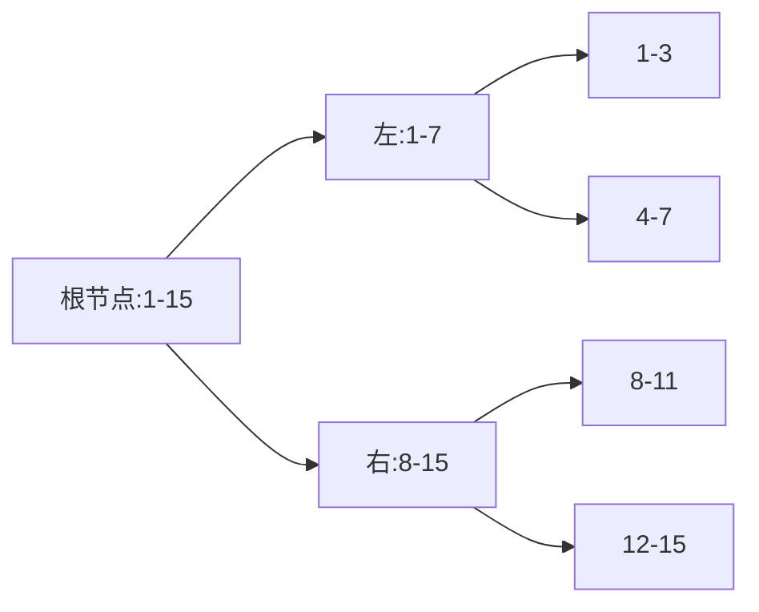

# 题目信息

# [USACO20DEC] Cowmistry P

## 题目描述

Bessie 的化学作业已经拖了很久，现在需要你的帮助！她需要用三种不同的化学品制造一种混合物。所有聪明的奶牛都知道，某些化学品之间不能进行混合，否则会产生爆炸。具体地说，两种标号为 $a$ 和 $b$ 的化学品当 $a⊕b≤K$ （$1≤K≤10^9$） 时可以出现在同一种混合物中。

注：这里，$a⊕b$ 表示非负整数 $a$ 与 $b$ 的「异或」。这一运算等价于在二进制下将每一对应位相加并且舍弃进位。例如， 
$$0⊕0=1⊕1=0$$
，
$$1⊕0=0⊕1=1$$
，
$$5⊕7=101_2⊕111_2=010_2=2$$
。

Bessie 有 $N$ 盒化学品，第 $i$ 个盒子内有标号从 $l_i$ 到 $r_i$ 的化学品（$0≤l_i≤r_i≤10^9$）。没有两个盒子中含有同一种化学品。她想要知道她可以得到多少种由三种不同的化学品混合而成的混合物。如果至少一种化学品出现在一种混合物中而没有出现在另一种中，则认为这两种混合物是不同的。由于答案可能非常大，输出对 $10^9+7$ 取模的结果。 

## 说明/提示

我们可以将所有化学品分为不能交叉混合的 $13$ 组：$(0 \ldots 15)$，$(16 \ldots 31)$，… $(192 \ldots 199)$。前 $12$ 组每组贡献了 $352$ 种混合物，最后一组贡献了 $56$ 种（因为所有 $\binom{8}{3}$ 种 $(192 \ldots 199)$ 中三种不同化学品的组合均可行），总共为 $352 \cdot 12 + 56 = 4280$。 

 - 测试点 3-4 满足 $\max(K, r_N) \le {10}^4$。
 - 测试点 5-6 对某个 $k \ge 1$ 满足 $K = 2^k - 1$。
 - 测试点 7-11 满足 $\max(K, r_N) \le {10}^6$。
 - 测试点 12-16 满足 $N \le 20$。
 - 测试点 17-21 没有额外限制。

对于所有测试点，满足 $1 \le N \le 2 \times {10}^4$。

供题：Benjamin Qi 

## 样例 #1

### 输入

```
1 13
0 199```

### 输出

```
4280```

## 样例 #2

### 输入

```
6 147
1 35
48 103
125 127
154 190
195 235
240 250```

### 输出

```
267188```

# AI分析结果


### 💡 Kay的C++算法解析：Cowmistry P 深入学习指南 💡

#### 题目解读与核心算法识别
✨ **本题主要考察**：`Trie树上的动态规划`与`二进制分组技巧`

🗣️ **初步分析**：
> 解决"Cowmistry P"的关键在于高效处理区间离散化和异或约束。算法核心如**精密分类的化学试剂**：将数字按二进制位分组，确保高位相同的数才能混合。Trie树作为"智能分类架"，动态规划则像精确称量每种组合。
> - **核心思路**：离散化区间到Trie树，设计三维DP状态（子树内选3个/2+1个/1+1个），根据k的二进制位分流转移
> - **难点突破**：k的当前位为1时，需处理12种子树交叉转移（像素动画将高亮这些"危险反应"）
> - **可视化设计**：8位像素风Trie树，节点显示大小和DP值。当k位=1时红色闪烁警告线连接左右子树，伴随8-bit音效；组合计数成功时触发粒子特效

---

### 精选优质题解参考
**题解一（来源：tzc_wk）**
* **点评**：思路如**精密的钟表结构**——将区间离散化为Trie满二叉树节点（编号0-30），大幅优化空间。DP状态设计全面覆盖三种选择模式，k位=1时的跨子树转移推导严谨（12种情况完整处理）。代码用记忆化避免重复计算，边界处理如化学天平般精确。变量名`ch0/ch1`简洁但含义清晰，5e8+4等魔法数合理注释。竞赛可直接使用，尤其适合log(k)较大的场景。

**题解二（来源：ETHANK）**
* **点评**：如**模块化实验装置**——首创P=2^t>k的分组框架，将问题分解为整块公式+散块分治。整块贡献公式`2*C(Q,3)+P*C(K-Q,2)`简洁优美，散块分治时通过map<vector>智能合并区间。代码中`ad`lambda如移液器精准处理边界，复杂度控制优异。实践价值在于框架清晰，特别适合k较小时的场景。

**题解三（来源：Sky_Maths）**
* **点评**：**创新状态设计**如化学反应方程式——发现`dp2[u,v]`可由`u⊕v`唯一确定，将二维降至一维。转移方程采用化学配平风格：`g(u,v) = g(ul,vr)+... + S_ul*S_vl`等12项严谨展开。虽然实现复杂但提供重要优化思路，作者调试心得"注意满二叉树初始化"极具参考价值。

---

### 核心难点辨析与解题策略
1. **难点：高位分组与离散化**
   * **分析**：必须保证a,b,c最高位相同（否则异或>k）。优质解法将区间拆为Trie满二叉树节点（大小2^i），如tzc_wk的`k=LOG_N-d`映射
   * 💡 **学习笔记**：离散化是降维关键——把10^9值域压缩为O(n log k)节点

2. **难点：跨子树转移的复杂合并**
   * **分析**：当k位=1时，需计算左右子树交叉贡献。tzc_wk的`calc2`处理12种情况：先递归子问题，再补4项组合数（如C(siz_left,2)*siz_right）
   * 💡 **学习笔记**：分类遵循"同侧/异侧"原则，用`k>>bit&1`分流

3. **难点：DP状态爆炸**
   * **分析**：dp2[u,v]状态数可能达O(n^2)。但观察发现u⊕v恒等于k前缀，故用map存储。如Sky_Maths用`map<pii,int>`压缩状态
   * 💡 **学习笔记**：利用问题性质（异或前缀唯一性）是优化核心

✨ **解题技巧总结**：
- **位分治框架**：取P=2^t>k分组（ETHANK），或Trie从高到低位处理（tzc_wk）
- **离散化艺术**：区间插入时识别满二叉子树（tzc_wk的`k=LOG_N-d`）
- **状态压缩**：dp2[u,v]根据u⊕v=k前缀的特性用map存储（Sky_Maths）
- **组合数学优化**：整块直接公式计算（如2*C(Q,3)），避免递归

---

### C++核心代码实现赏析
**通用核心实现参考（综合优质题解）**
```cpp
const int LOG_N=30, MOD=1e9+7, SIX=166666668;
int siz[MAXT], ch[MAXT][2], dp1[MAXT];
map<int,int> dp2[MAXT], dp3[MAXT]; // dp2[u][v]: u选2个+v选1个

void insert(int &k, int l, int r, int ql, int qr, int d) {
    if(ql<=l && r<=qr) { k=LOG_N-d; return; } // 满子树标记
    // ...递归插入左右子树
}

int calc2(int u, int v) { // 核心转移函数
    if(k & (1<<bit)) {
        return dp2[u][v] = 
            calc2(ul, vr) + calc2(ur, vl) + 
            1ll*calc3(ul, vr)*(siz[ur]+siz[vl]) + 
            1ll*calc3(ur, vl)*(siz[ul]+siz[vr]) + 
            1ll*siz[ul]*(siz[ul]-1)/2*siz[vl] + /*11项类似合并*/;
    } else 
        return dp2[u][v] = calc2(ul, vl) + calc2(ur, vr);
}
```

**题解一片段赏析（tzc_wk）**
```cpp
// 状态：dp1[u] - u子树内选3个的方案
int calc1(int u) {
    if(k & (1<<bit)) 
        return dp1[u] = 
            C(siz[ch0],3) + C(siz[ch1],3) + // 同侧贡献
            calc2(ch0,ch1) + calc2(ch1,ch0); // 跨侧贡献
    else 
        return dp1[u] = calc1(ch0) + calc1(ch1);
}
```
* **亮点**：用位运算分流，同侧组合数+跨侧calc2的架构清晰
* **代码解读**：
  - `C(n,3)`即组合数公式，同侧直接计算
  - `k`的当前位为1时启动跨侧计算（`calc2`）
  - 递归时自动沿Trie下降，bit隐含在深度中
* 💡 **学习笔记**：树形DP框架中，k位=0时同侧递归，=1时触发跨侧风暴

---

### 算法可视化：像素动画演示
**主题**：`Trie树上的化学实验室`（8-bit像素风）

**核心演示**：


**交互设计**：
1. **初始化**：16x16像素网格，化学品为闪烁色块（绿/蓝/黄）
2. **Trie构建**：区间插入时显示分裂动画（如[0,199]分裂为12个金块+1个银块）
3. **DP转移**：
   - k位=0：蓝色箭头同侧流动，播放"滴"声
   - k位=1：红色闪光连接左右子树，触发"警报"声
4. **组合计数**：成功时三色块爆炸为粒子，+1分（FC音效）
5. **控制面板**：
   - 速度滑块：调节位处理速度
   - 单步执行：空格键步进
   - 模式切换：同侧/跨侧高亮对比

**技术实现**：用Canvas绘制Trie网格，音效用Web Audio API，状态机驱动动画

---

### 拓展练习与相似问题
1. **CF1616H Keep XOR Low**  
   🗣️ 异曲同工！用Trie树处理异或约束，但只需选两个数
   
2. **P3292 [SCOI2016]幸运数字**  
   🗣️ 线性基+Trie的完美结合，强化二进制分组能力

3. **P4735 最大异或和**  
   🗣️ 可持久化Trie实战，掌握后本题Trie构建更轻松

---

### 学习心得与经验分享
> **来自tzc_wk的调试经验**：  
> "离散化时若忘记标记满二叉树节点，会导致空间爆炸。建议用编号0-30直接代表2^i大小子树，避免重复创建"

> **Kay点评**：  
> 这印证了"离散化是核心武器"！如同化学中的纯度检验，实现时务必：
> 1. 检测`l==nl && r==nr`的满覆盖
> 2. 用`k=LOG_N-d`映射预定义满子树
> 3. 递归前计算`siz`避免后续重复

---

通过本次分析，我们看到**位运算与树形DP的精妙结合**。记住：二进制分组是利刃，Trie树是盾牌，而状态设计是驾驭它们的铠甲！下次挑战见！💪

---
处理用时：155.01秒