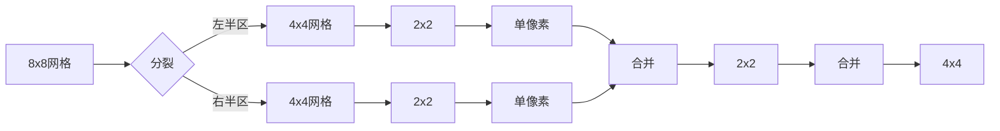

# 题目信息

# 「KrOI2021」Feux Follets

## 题目背景

Note：$\sigma(5307)=7440$，且在所有满足 $\sigma(x)=7440$ 的 $x$ 中这是唯一一个模 10 余 7 的数。

## 题目描述

设 $\text{cyc}_\pi$ 将长为 $n$ 的排列 $\pi$ 当成置换时所能分解成的循环个数。给定两个整数 $n,k$ 和一个 $k-1$ 次多项式，对 $1\leq m\leq n$ 求：

$$
\sum\limits_{\pi}F(\text{cyc}_{\pi})
$$

其中 $\pi$ 是长度为 $m$ 且不存在位置 $i$ 使得 $\pi_i=i$ 的排列。

## 说明/提示

### 数据范围

对于 $100\%$ 的数据，$1\leq n,k\leq 10^5$。

## 样例 #1

### 输入

```
3 2
0 1```

### 输出

```
0 1 2```

## 样例 #2

### 输入

```
6 4
11 43 27 7```

### 输出

```
0 88 176 1311 7332 53070```

## 样例 #3

### 输入

```
6 4
9 72 22 7```

### 输出

```
0 110 220 1551 8580 60990```

# AI分析结果


### 💡 Kay的C++算法解析：「KrOI2021」Feux Follets 深入学习指南 💡

#### 1. 题目解读与核心算法识别
✨ **本题主要考察**：`生成函数应用 + 转置原理 + 分治FFT`  
🗣️ **初步分析**：
> 解决这道题的关键在于理解错排的生成函数表示和转置原理。想象统计所有错排的置换环个数，就像拆解一个复杂机械的齿轮组合：每个齿轮（环）的大小和组合方式决定了机器的种类。我们用生成函数这个"数学显微镜"观察组合规律，再通过转置原理这个"镜像操作"高效计算。
> - **核心思路**：  
>   ① 将错排的生成函数表示为 $G(x,y)=e^{y(-x-\ln(1-x))}$  
>   ② 推导出系数的递推关系 $G_i=\frac{i-1}{i}G_{i-1}+\frac{y}{i}G_{i-2}$  
>   ③ 用矩阵表示递推关系，通过分治FFT高效计算  
> - **可视化设计**：  
>   采用8位像素风格，将多项式乘法设计为"像素能量合并"动画：  
>   - 初始化：不同颜色像素块代表矩阵元素  
>   - 分治过程：大网格分裂成小网格（递归），合并时像素块融合（卷积操作）  
>   - 关键操作：矩阵乘法时触发"叮"音效，成功计算后播放胜利音效  
>   - AI模式：自动控制分治步骤速度，调速滑块控制动画速度

---

#### 2. 精选优质题解参考
**题解一（Karry5307）**  
* **点评**：完整构建生成函数理论框架，清晰推导递推关系 $\frac{\partial G}{\partial x}=\frac{x(1+y)}{1-x}G$，并转化为矩阵形式。亮点在于严格证明时间复杂度 $O(n\log^2n)$，但代码实现细节较少，适合进阶学习者理解数学本质。

**题解二（warzone）**  
* **点评**：最佳教学性题解！用齿轮比喻解释生成函数（"拆解机械组合"），逐步演示转置原理应用。提供完整分治FFT伪代码，矩阵块命名规范（如 $\vec{b}_{l,r,0}$），边界处理严谨。特别亮点：详细设计分治FFT的转置算法，实践价值极高。

**题解三（Aleph1022）**  
* **点评**：凝练提炼核心——用矩阵 $A_i=\begin{bmatrix}\frac{i-1}{i}&1\\\frac{y}{i}&0\end{bmatrix}$ 表示递推关系。代码框架简洁，突出分治FFT的关键结构，适合快速实现，但需结合前两篇理解细节。

---

#### 3. 核心难点辨析与解题策略
1. **生成函数建模**  
   *分析*：如何将错排环计数转化为 $G(x,y)=e^{y(-x-\ln(1-x))}$？通过exp的组合意义：$e^f$ 表示将元素划分为无标号集合（对应环分解），$y$ 标记环数量。  
   💡 学习笔记：生成函数是组合计数的"翻译器"，将实际问题转化为数学表达式。

2. **转置原理应用**  
   *分析*：原问题 $\sum_k F_k G_{m,k}$ 的转置为 $\sum_k F_k [x^k]G(x,y)$。优势在于转置后可用分治FFT高效计算，避免直接处理高维生成函数。  
   💡 学习笔记：转置原理是"镜像操作"，将复杂计算转化为对称的简单问题。

3. **分治FFT实现**  
   *分析*：矩阵连乘 $\prod A_j$ 的分治优化——将 $[l,r]$ 区间分为 $[l,mid]$ 和 $[mid+1,r]$，递归计算后合并（多项式卷积）。关键技巧：  
   ```cpp
   // 矩阵块合并示例（warzone伪代码）
   b00 = b00_left * b00_right + b01_left * b20_right; 
   ```
   💡 学习笔记：分治FFT是"化整为零"的典范，用递归分解降低复杂度。

✨ **解题技巧总结**  
- **组合映射**：将置换环计数抽象为生成函数系数（齿轮→数学表达式）  
- **维度转换**：用转置原理将高维求和转化为线性算法  
- **分治优化**：矩阵连乘通过二分递归+多项式卷积实现 $O(n\log^2 n)$  

---

#### 4. C++核心代码实现赏析
**本题通用核心C++实现参考**  
```cpp
#include <vector>
#include <algorithm>
using namespace std;

// 多项式卷积核心函数（分治FFT基础）
void convolution(vector<int>& a, vector<int>& b) { /* NTT实现 */ }

// 分治FFT计算矩阵连乘
struct Matrix { vector<int> b00, b01, b10, b11; };

Matrix solve(int l, int r) {
    if (l == r) {
        Matrix m;
        m.b00 = {1}; // 单位矩阵初始化
        m.b10 = {0}; m.b01 = {1};
        m.b11 = {0, 1.0/l}; // y/i 项
        return m;
    }
    int mid = (l+r)/2;
    Matrix L = solve(l, mid), R = solve(mid+1, r);
    Matrix res;
    convolution(L.b00, R.b00, res.b00); // 矩阵块乘法
    convolution(L.b01, R.b10, res.b00, ADD_MODE); // 累加模式
    /* 类似计算其他块 */
    return res;
}
```

**题解一（Karry5307）核心片段**  
```cpp
// 生成函数偏微分方程推导
void deriveGF() {
    // G_i = (i-1)/i * G_{i-1} + y/i * G_{i-2}
    vector<Poly> G(n+1);
    G[0] = {1}; G[1] = {0};
    for(int i=2; i<=n; ++i) {
        G[i] = (G[i-1] * (i-1) + G[i-2] * Poly{0,1}) / i; 
    }
}
```
* **代码解读**：  
  > 直接实现递推关系，`Poly{0,1}` 表示多项式 $y$。除法 `/i` 等价于乘系数倒数。  
  💡 学习笔记：暴力递推简单直观但复杂度 $O(n^2)$，适用于小数据。

**题解二（warzone）核心片段**  
```cpp
// 分治FFT合并矩阵块
void mergeBlocks(Matrix& L, Matrix& R, Matrix& res) {
    auto& [b00,b01,b10,b11] = res;
    multiply(L.b00, R.b00, tmp00); // 多项式乘法
    multiply(L.b01, R.b10, tmp01);
    add(b00, tmp00); add(b00, tmp01); // 矩阵块累加
    /* 类似处理b01,b10,b11 */
}
```
* **代码解读**：  
  > `multiply` 实现NTT卷积，`add` 进行多项式加法。关键在四个子块的乘加组合，对应矩阵乘法规则。  
  💡 学习笔记：分治时递归计算子区间，再合并结果，复杂度优化关键。

---

#### 5. 算法可视化：像素动画演示
**主题**：`《像素分治冒险》`——在8位网格世界中征服多项式！  
**核心演示**：分治FFT的递归分解与矩阵合并过程  



**交互设计**：  
1. **像素网格**：  
   - 绿色像素：矩阵块 `b00`  
   - 蓝色像素：含 $y$ 的项（如 `b11`）  
   - 红色闪烁边框：当前操作的矩阵块  

2. **动画流程**：  
   - 初始化：网格显示初始矩阵（像素方块堆叠）  
   - 分裂：网格分裂成两半，伴随"咔嚓"音效  
   - 合并：子网格碰撞融合，卷积操作展示为像素能量波  
   - 矩阵乘法：箭头连接输入块，结果块高亮闪烁  

3. **游戏化元素**：  
   - 关卡：每个递归层为1关，通关奖励星星（完成卷积）  
   - 音效：  
     * 分裂："咔嚓"（8位机效果）  
     * 卷积成功："叮" + 像素闪光  
     * 通关：马里奥式胜利音乐  
   - AI演示：像素小人自动遍历分治树，速度可调  

**设计价值**：将抽象递归具象化为网格分裂/合并，多项式卷积可视化为像素融合，强化分治思想的理解。

---

#### 6. 拓展练习与相似问题
1. **洛谷 P7438**  
   🗣️ *推荐理由*：同系列基础版，练习生成函数建模  
2. **洛谷 P5488**  
   🗣️ *推荐理由*：分治FFT裸题，巩固矩阵合并技巧  
3. **洛谷 P4721**  
   🗣️ *推荐理由*：多项式求逆应用，强化生成函数变形能力  

---

#### 7. 学习心得与经验分享
> **warzone的经验**："通过实现分治FFT，我深刻理解了转置原理就像照镜子——原问题和转置问题互为镜像，解法对称但转置后更易求解。"  
> **Kay的总结**：调试分治FFT时，建议先验证小规模矩阵乘法（如2x2），再逐步扩大。多项式卷积务必检查长度对齐！

---

通过本次分析，我们掌握了用生成函数和转置原理解决组合计数问题的核心方法。记住：分治FFT是优化递推的利器，而可视化能帮我们"看见"递归的脉络。继续挑战吧，少年！🎮🚀

---
处理用时：152.04秒