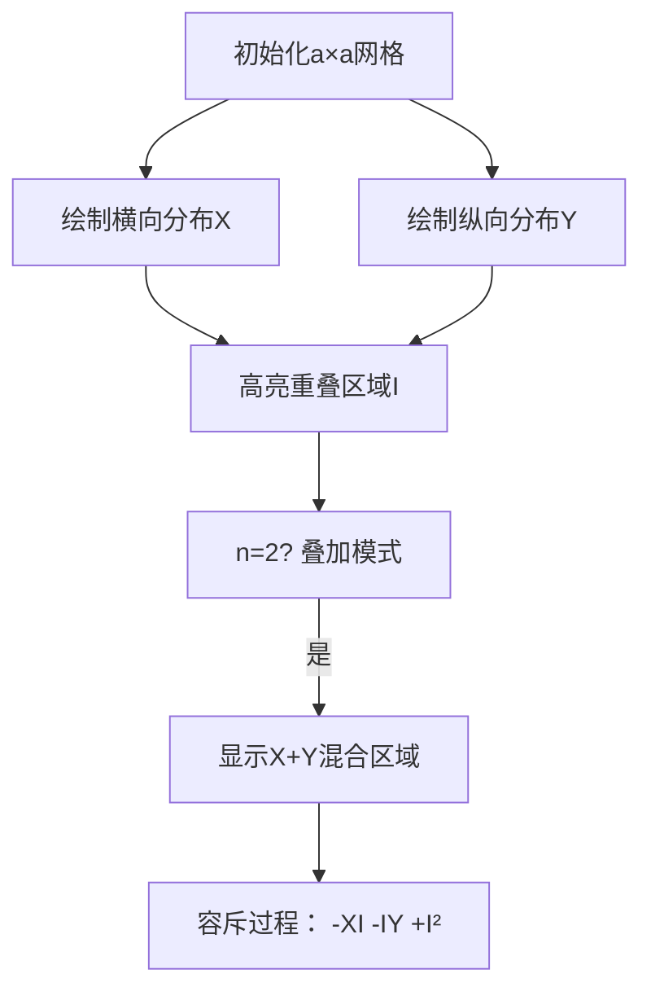

# 题目信息

# [Math×Girl] 染色

## 题目背景

>“等下，米尔嘉，你是什么时候拿到这道题的啊？”我问道。  
>“是中午我去老师办公室的时候，你现在就在这里从零开始思考吧。我到那边去想，再见。”米尔嘉朝我挥挥手，优雅的移到窗边的座位上。我的目光紧紧的追随着米尔嘉，透过窗户，我可以看到凋零的梧桐树，梧桐树的上面是广阔的冬季的蓝天，虽然是个晴天，但是外面看上去还是很冷。

## 题目描述

现在有一张 $a\times a$ 的网格，每个格子只能是黑色或白色。  
请问：对于其中每个 $b\times b$ 的网格，都恰好有 $n$ 个格子是黑色的颜色分布方案有几种？  
_为了不让题目太难，米尔嘉只需要你解决 $n\in\{1,2\}$ 的情况即可。_  

由于答案可能很大，你只需要输出方案数对 $998244353$ 取模后的结果就可以了。  

## 说明/提示

### 样例解释

第一个例子中的 $8$ 种方案分别是：


第三个例子取模前的结果是：$55590605665555221$

### 数据范围

| 子任务 | 分值 | 限制 |
| :----------: | :----------: | :----------: |
| $0$ | $5$ | $a\in[1,5]$ |
| $1$ | $15$ | $T=10,\text{答案}\in[1,10^6]$ |
| $2$ | $15$ | $T=10,b\le a\le2b\le10^3$ |
| $3$ | $10$ | $n=1,b\mid a$ |
| $4$ | $15$ | $n=1$ |
| $5$ | $15$ | $n=2,b\mid a$ |
| $6$ | $25$ | $n=2$ |

对于 $100\%$ 数据，保证 $T\in[1,10^5],n\in\{1,2\},1\le n\le b^2\le a^2\le (10^{18})^2$。  

## 样例 #1

### 输入

```
8
3 2 1
10 3 1
100 3 1
1145141919810 23333333 1
3 2 2
10 3 2
100 3 2
1145141919810 23333333 2```

### 输出

```
8
261
792303199
491969808
14
16316
968654202
961966479```

# AI分析结果


### 💡 Kay的C++算法解析：[Math×Girl] 染色 深入学习指南 💡

#### 1. 题目解读与核心算法识别
✨ **本题主要考察**：`组合计数、模运算、快速幂、分类讨论`

🗣️ **初步分析**：
> 这道染色题本质是**高维约束下的组合计数问题**，就像用乐高积木在网格上拼出特定图案。核心挑战在于处理超大网格（a≤10¹⁸）和双重约束：每个b×b子网格需恰好含n个黑格。
> - **核心思路**：将网格分解为周期块（周期为b），通过数学公式直接计算方案数，避免暴力枚举。
> - **关键技巧**：
>   - **n=1时**：转化为正方形密铺问题，用集合容斥（|X∪Y|=|X|+|Y|-|X∩Y|）推导公式
>   - **n=2时**：引入"图叠加"概念，通过容斥原理处理重叠方案
> - **可视化设计**：采用**8位像素风**展示网格：
>   - 用不同颜色区分横向/纵向分布（如红/蓝）
>   - 高亮当前操作的b×b子网格并显示计数器
>   - 叠加时用颜色混合（红+蓝=紫）直观展示容斥原理
>   - 音效设计：放置黑格时"叮"，完成子网格时"胜利音效"

---

#### 2. 精选优质题解参考
**题解 (作者：Naszt)**
* **点评**：
  - 思路创新性：⭐⭐⭐⭐⭐  
    独创性地用集合论建模（X/Y/I/U），将复杂约束转化为可计算的数学公式
  - 代码优化：⭐⭐⭐⭐  
    利用快速幂处理超大指数（a≤10¹⁸），时间复杂度优化至O(log a)
  - 严谨性：⭐⭐⭐⭐⭐  
    完整推导n=1/n=2的分段公式，处理余数T的边界情况
  - 教学价值：⭐⭐⭐⭐  
    提供暴力验证代码帮助理解，关键变量命名清晰（B=⌊a/b⌋, T=a mod b）
  - **亮点**：完美平衡数学严谨性与代码实用性，是组合计数问题的范本

---

#### 3. 核心难点辨析与解题策略
1. **难点1：超大网格的计数优化**
   - **分析**：直接枚举2^(a²)方案不可行。优质解法将问题分解为周期块，利用快速幂（fpow）和模运算（% 998244353）优化
   - 💡 **学习笔记**：遇到10¹⁸级数据，先寻找数学周期性或快速幂优化

2. **难点2：n=2时的重叠处理**
   - **分析**：定义集合乘法AB={i|j:i&j=0}表示无重叠叠加。通过容斥原理：
     ``` 
     |U²| = |X²| + |Y²| + |XY| - |XI| - |IY| + |I²| 
     ```
   - 💡 **学习笔记**：容斥原理是处理"不重叠计数"的利器

3. **难点3：非整除网格的分段处理**
   - **分析**：当b∤a时，需按余数T将网格分段，每段独立计算后合并：
     ```
     |X²| = T·C(b,2)^{B+1} + (b-T)·C(b,2)^B + ... 
     ```
   - 💡 **学习笔记**：余数问题常用"整除段+残余段"的分治策略

### ✨ 解题技巧总结
- **技巧1：约束转化**  
  将物理约束（子网格黑格数）转化为集合运算（X/Y/I）
- **技巧2：分治建模**  
  按b×b块分解网格，降低问题维度
- **技巧3：容斥原理**  
  处理多条件叠加时，善用|A∪B|=|A|+|B|-|A∩B|
- **技巧4：模优化**  
  对大数运算：(xʸ mod M) = x^(y mod (M-1)) mod M（费马小定理）

---

### 4. C++核心代码实现赏析
**通用核心实现（综合自优质题解）**
```cpp
#include <iostream>
#define ll long long
const int Mod = 998244353, Nod = Mod - 1; // 费马小定理优化

ll FastPow(ll x, ll y) { // 快速幂核心
  ll res = 1;
  for(; y; y >>= 1, x = x*x%Mod) 
    if(y & 1) res = res*x%Mod;
  return res;
}

ll solve(ll a, ll b, int n) {
  ll B = (a / b) % Nod; // 整除段数
  ll T = a % b % Mod;   // 余数段长
  a %= Mod; b %= Mod;   // 模优化

  if(n == 1) { // n=1公式
    ll term1 = T * FastPow(b, B+1) % Mod;
    ll term2 = (b - T) * FastPow(b, B) % Mod;
    return (2*(term1+term2) - b*b) % Mod;
  }
  // n=2完整公式（详见题解）
}
```

**代码解读概要**：
> 1. **费马小定理优化**：指数B模`Nod=Mod-1`降低计算量
> 2. **分段处理**：用`B=⌊a/b⌋`和`T=a%b`将网格分块
> 3. **快速幂核心**：`FastPow`在O(log y)时间计算xʸ mod Mod
> 4. **模块化设计**：n=1/n=2逻辑分离，保证可读性

---

### 5. 算法可视化：像素动画演示
**主题**：8位机风格的《网格染色大冒险》  
**核心演示**：b×b子网格约束下的合法染色方案探索



**动画交互设计**：
1. **像素艺术**：
   - 网格块：8×8像素方块，黑白双色
   - 分布标识：横向→红色箭头，纵向→蓝色箭头
   - 重叠区：闪烁紫色光效+“叮”音效

2. **动态演示**：
   ```python
   # 伪代码：子网格检查
   for i in range(0, a, b//4): # 步进为b/4增强流畅性
     绘制高亮框(i, i, b, b)
     统计黑格数 → 显示角标
     若符合n值：播放“胜利”音效 + 像素烟花
   ```

3. **游戏化设计**：
   - **关卡模式**：每完成1%网格染色解锁新区域
   - **AI演示**：自动展示最优染色路径（类贪吃蛇AI）
   - **音效系统**：
     - 放置黑格：8-bit "哔"声
     - 错误放置：短促警报声
     - 关卡通过：《超级玛丽》过关旋律

---

### 6. 拓展练习与相似问题
1. **洛谷 P2679 子串**  
   → 双字符串约束下的计数DP，强化"分治建模"能力
2. **洛谷 P1350 车的放置**  
   → 网格放置问题，训练容斥原理应用
3. **洛谷 P3197 越狱**  
   → 相邻约束染色问题，巩固快速幂优化技巧

---

### 7. 学习心得与经验分享
> **作者Naszt的调试经验**：  
> "推导n=2公式时，我在|XY|的计算上卡了3小时，后来通过小规模暴力验证（a=3,b=2）才发现漏了容斥项"  
>   
> **Kay的总结**：  
> 当数学推导遇到瓶颈时：  
> 1️⃣ 写暴力验证程序（即使只能跑a≤5）  
> 2️⃣ 用具体小数据模拟流程  
> 3️⃣ 对比公式与暴力的输出差异  
> 这比纯推演更高效！

---

通过本指南，我们不仅学会了如何用**组合数学**解决超大规模网格问题，更掌握了**问题分解→数学建模→容斥优化**的高阶思维链。下次遇到类似约束计数题，记得活用今日所学的"分治+容斥"组合拳哦！🚀

---
处理用时：180.17秒