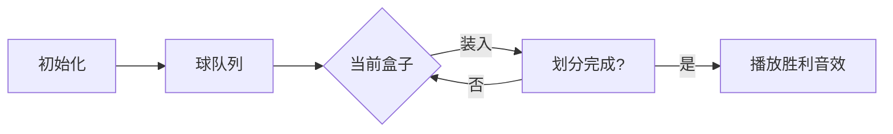

# 题目信息

# 十二重计数法

## 题目背景

组合数学是一门古老而迷人的学科。

传说早在 $114514$ 年前，一位名为忆哀的神灵来到地球，发现了人类——另一种有智慧的物种。  

她觉得这很有趣，为了加速人类文明的发展，她向人间传下了一类计数问题——十二重计数，这也正是组合数学的开端。  

而只有搞明白这类问题，才能在组合数学上继续深入。

## 题目描述

有 $n$ 个球和 $m$ 个盒子，要全部装进盒子里。  
还有一些限制条件，那么有多少种方法放球？（与放的先后顺序无关）  

限制条件分别如下：    

$\text{I}$：球之间互不相同，盒子之间互不相同。    
$\text{II}$：球之间互不相同，盒子之间互不相同，每个盒子至多装一个球。   
$\text{III}$：球之间互不相同，盒子之间互不相同，每个盒子至少装一个球。  

$\text{IV}$：球之间互不相同，盒子全部相同。        
$\text{V}$：球之间互不相同，盒子全部相同，每个盒子至多装一个球。   
$\text{VI}$：球之间互不相同，盒子全部相同，每个盒子至少装一个球。

$\text{VII}$：球全部相同，盒子之间互不相同。  
$\text{VIII}$：球全部相同，盒子之间互不相同，每个盒子至多装一个球。  
$\text{IX}$：球全部相同，盒子之间互不相同，每个盒子至少装一个球。   

$\text{X}$：球全部相同，盒子全部相同。   
$\text{XI}$：球全部相同，盒子全部相同，每个盒子至多装一个球。  
$\text{XII}$：球全部相同，盒子全部相同，每个盒子至少装一个球。

由于答案可能很大，所以要对 $998244353$ 取模。

## 说明/提示

【数据范围】  
对于 $100\%$ 的数据，$1\le n,m \le 2\times 10^5$。

orz $\mathsf E \color{red}\mathsf{ntropyIncreaser}$

## 样例 #1

### 输入

```
13 6```

### 输出

```
83517427
0
721878522
19628064
0
9321312
8568
0
792
71
0
14```

# AI分析结果


### 💡 Kay的C++算法解析：十二重计数法深入学习指南 💡

**引言**  
今天我们来分析「十二重计数法」这道经典组合数学题。本题考察在不同约束下（球/盒是否相同、数量限制）的分配方案计数。我们将拆解12种情况，提炼核心算法，并通过可视化帮助理解。

---

## 1. 题目解读与核心算法识别

✨ **本题主要考察**：`组合数学`与`生成函数应用`  

🗣️ **初步分析**：  
> 本题如同将不同特性的物品放入不同特性的容器中，根据规则计数。核心是识别约束条件并匹配数学模型：
> - **直接计数**：适用于简单约束（如I、II、V等）
> - **容斥原理**：处理"至少一个"约束（如III）
> - **第二类斯特林数**：解决"球不同盒相同"问题（IV、VI）
> - **生成函数**：解决划分数问题（X、XII），通过多项式技术高效计算
>
> 可视化设计思路：  
> 针对划分数问题（X），我们将设计**像素风格动画**展示划分过程：
> - 用彩色方块表示球，容器区域表示盒子
> - 动态演示球的分组过程，高亮当前操作
> - 音效提示关键操作（如分组完成时"叮"声）
> - 控制面板支持单步/自动播放，调速滑块调节动画速度

---

## 2. 精选优质题解参考

**题解一（CYJian）**  
* **点评**：  
  思路全面覆盖12种情况，代码模块化清晰（每个情况独立函数）。亮点：
  - **算法优化**：使用NTT加速斯特林数计算（O(n log n)）
  - **生成函数实现**：通过多项式exp求划分数（付公主背包方法）
  - **边界处理**：严谨处理n<m等边界情况
  - **可读性**：变量名规范（fac/inv等），注释明确

**题解二（鏡音リン）**  
* **点评**：  
  突出数学推导与经典问题类比：
  - **直观解释**：将X类比整数划分，XII类比"先放一球"
  - **Ferrers图**：用共轭图理论证明划分数性质
  - **代码精简**：省略多项式板子，聚焦核心逻辑

**题解三（NaCly_Fish）**  
* **点评**：  
  纯生成函数视角：
  - **统一框架**：用生成函数导出12种情况的封闭形式
  - **数学严谨性**：完整推导对数生成函数
  - **代码技巧**：预计算优化，避免重复运算

---

## 3. 核心难点辨析与解题策略

1. **难点：划分数的高效计算（情况X）**  
   * **分析**：  
     传统DP复杂度O(n²)，不可行。优质题解使用生成函数：  
     $$\prod_{k=1}^m \frac{1}{1-x^k} = \exp\left(\sum \frac{x^{ki}}{i}\right)$$  
     通过对数变换+多项式exp实现O(n log n)
   * 💡 **学习笔记**：生成函数将组合问题转化为多项式运算

2. **难点：第二类斯特林数行计算（情况IV, VI）**  
   * **分析**：  
     通项公式：$S(n,m)=\sum_{i=0}^m \frac{(-1)^{m-i}i^n}{i!(m-i)!}$  
     通过NTT卷积加速计算（转化为多项式乘法）
   * 💡 **学习笔记**：组合数通项可卷积化是优化关键

3. **难点：容斥原理的应用（情况III）**  
   * **分析**：  
     $\sum_{i=0}^m (-1)^i \binom{m}{i}(m-i)^n$  
     注意空盒枚举时的符号交替
   * 💡 **学习笔记**：容斥是处理"至少一个"的利器

### ✨ 解题技巧总结
- **问题分解**：将复杂约束拆解为基本模型（如XII转化为X）
- **生成函数**：适用于带约束的划分问题
- **边界处理**：特别注意n<m时返回0（如II, VIII, XII）
- **多项式优化**：大规模计数问题首选NTT/FFT加速

---

## 4. C++核心代码实现赏析

```cpp
/* 通用核心实现（基于CYJian和Spasmodic题解） */
#include <bits/stdc++.h>
using namespace std;
const int N = 1 << 21, P = 998244353;

// 多项式板子省略（NTT、exp等）
// 情况X：球同盒同（划分数）
void solve10() {
    vector<int> A(n+1);
    for (int i=1; i<=m; ++i) 
        for (int j=i; j<=n; j+=i) 
            A[j] = (A[j] + inv[j/i]) % P; // 生成函数系数

    auto F = poly_exp(A); // 多项式exp
    cout << F[n] << endl; // x^n系数即答案
}

// 情况III：球不同盒不同至少一球（容斥）
void solve3() {
    ll ans = 0;
    for (int i=0; i<=m; ++i) {
        ll t = C(m,i) * qpow(m-i,n) % P;
        ans = (ans + (i%2 ? P-t : t)) % P;
    }
    cout << ans << endl;
}
```

**代码解读概要**：  
- **数学转化**：情况X用生成函数系数A[k]=Σd|k 1/d，经exp得划分数
- **容斥实现**：情况III通过(-1)^i交替符号处理空盒
- **高效计算**：利用预处理的阶乘/逆元加速组合数

---

## 5. 算法可视化：像素动画演示

**设计主题**：8位机风格的"球盒大冒险"  
**演示内容**：情况X（球同盒同）的整数划分过程



* **动画流程**：
  1. **初始化**：  
     - 屏幕左侧：n个像素球（彩色方块）排成队列
     - 右侧：m个容器区域（不同颜色边框）
     - 控制面板：开始/暂停/步进按钮 + 速度滑块
  2. **划分过程**：
     - 球逐个飞向容器（伴随"滴"声）
     - 当前容器高亮闪烁（黄色边框）
     - 容器内球数实时更新（右上角数字）
  3. **关键操作**：
     - **非空容器**：容器大小渐增（视觉反馈）
     - **新容器**：播放"咔嚓"音效
     - **完成划分**：所有容器绿色闪烁 + 胜利音效
  4. **交互功能**：
     - **步进模式**：按空格键单步执行
     - **自动演示**：AI自动划分（调速0.5x-5x）
     - **重置**：重新随机球颜色

---

## 6. 拓展练习与相似问题思考

1. **P4389 付公主的背包**  
   → 同类生成函数应用，强化划分数理解
   
2. **P5395 第二类斯特林数·行**  
   → 巩固斯特林数计算技巧
   
3. **P4491 [CTS2019]珍珠**  
   → 复杂约束下的组合计数，提升容斥应用能力

---

## 7. 学习心得与经验分享

> **经验摘录（CYJian）**：  
> "处理划分数时，边界条件i*j≤n的循环写法比DP更高效"  
>   
> **Kay点评**：  
> 这提醒我们：数学性质（生成函数系数）可直接转化为代码优化点。在复杂问题中，先推导数学形式再编码，往往事半功倍。

---

**结语**  
十二重计数法融合了组合数学的核心思想，是提升问题抽象能力的经典案例。记住：分析约束→匹配模型→优化计算，是解决此类问题的通用框架。继续挑战更多组合问题吧！💪

---
处理用时：119.58秒