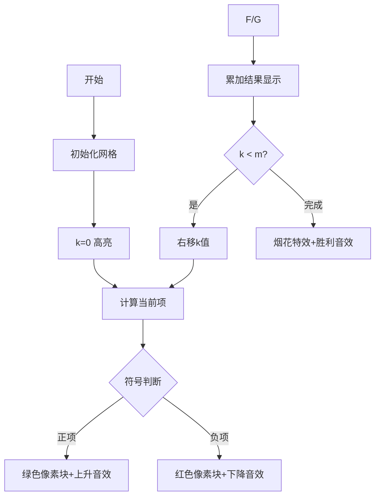

# 题目信息

# 『MdOI R1』Epic Convolution

## 题目背景

小 Q 是神仙，尤其喜欢多项式。

这天小 K 问了道题：

给定长度 $n$ 的序列 $g,h$，求 $f$ 满足 $f_n=\sum\limits_{k=0}^{n}g_kh_{n-k}$。

小 Q 对小 K 说：你这个菜鸡，这不随便卷一下就行了吗，你 FFT 怎么学的了。

然后小 K 花了一个月学习 FFT 和 NTT。又跑过去问小 Q 一道题：

给定长度 $n$ 的序列 $g,h$，求 $f$ 满足 $f_n=\sum\limits_{k=0}^{n}\binom{n}{k}g_kh_{n-k}$。

小 Q 对小 K 说：你这个菜鸡，这不随便卷一下就行了吗，你 FFT 怎么学的了。

然后小 K 又花了一个月学习 FFT 和 NTT。又跑过去问小 Q 一道题：

给定长度 $n$ 的序列 $g,h$，求 $f$ 满足 $f_n=\sum\limits_{k=0}^{n}k^ng_kh_{n-k}$。

小 Q 对小 K 说：你这个菜鸡，这不随便卷一下就行了吗，你 FFT 怎么学的了。

然后他仔细看了一遍，傻眼了，发现他不会这道题。

为了吊打小 K，你需要告诉他 $4$ 个特殊情况的做法。

## 题目描述

给定特定的序列 $g,h$，求 $f_n$ 满足 $f_n=\sum\limits_{k=0}^{n}k^ng_kh_{n-k}$。

本题有五个子任务，前四个子任务给定不同形式的 $g,h$，需要求出 $f_n$，第五个子任务不依赖于这个等式，但是形式上与此相似。

**注意，本题所有输出请对 $998244353$（$119\times 2^{23}+1$，一个质数）取模。**

---

**Subtask 1（4 pts）：**

给定一个 $n$，你需要回答 $q$ 组询问，每组询问给定一个整数 $m$。

每组询问的 $g$ 和 $h$ 如下所示（$0\leq k\leq n$）：

$$g_k=\begin{cases}1,&k<m\\0,&k\geq m\end{cases}$$

$$h_k=1$$

你需要回答出 $f_n$ 的值。

---

**Subtask 2,3（16,16 pts）：**

这两个子任务给定的序列 $g,h$ 形式相同，但数据范围不同，请仔细阅读数据范围。

你需要回答 $q$ 组询问，每组询问给定两个整数 $n,m$。

每组询问的 $g$ 和 $h$ 如下所示（$0\leq k\leq n$）：

$$g_k=\frac{1}{(k+m+1)!}$$

$$h_k=\begin{cases}0,&k<m\\\frac{(-1)^{k-m}}{(k-m)!},&k\geq m\end{cases}$$

你需要回答出 $f_n$ 的值。

---

**Subtask 4（32 pts）：**

你需要回答 $q$ 组询问，每组询问给定两个整数 $n,m$。

每组询问的 $g$ 和 $h$ 如下所示（$0\leq k\leq n$）：

$$g_k=\frac{k^m}{k!}$$

$$h_k=\frac{(-1)^k}{k!}$$

你需要回答出 $f_n$ 的值。

---

**Subtask 5（32 pts）：**

你需要回答 $q$ 组询问，每组询问给定两个整数 $n,m$。

**注意下面 $n,m$ 的含义，不要看反。**

$$\sum\limits_{k=0}^{m}(k+1)^m\dfrac{(k+1)^{n+1}}{(k+1)!}\sum\limits_{i=0}^{m-k}\dfrac{\binom{2n+1}{i}(-1)^{m-k}}{(m-k-i)!(k+1)^i}$$

你需要回答出上面这个式子的值。

与前四个 Subtask 相似之处是，求和的一开始是幂的形式。

## 说明/提示

### 样例解释 1

在这组样例中，需要解决第一个子任务，$n=5,\ \ q=2$。

第一组询问中，$m=2$，则（省略了 $0$ 的加数项）：

$$[g_0\ \ g_1\ \ g_2\ \ g_3\ \ g_4\ \ g_5]=[1\ \ 1\ \ 0\ \ 0\ \ 0\ \ 0] $$

$$[h_0\ \ h_1\ \ h_2\ \ h_3\ \ h_4\ \ h_5]=[1\ \ 1\ \ 1\ \ 1\ \ 1\ \ 1] $$

$$f_5=1^5\times g_1h_4=1$$

第二组询问中，$m=3$，则：

$$[g_0\ \ g_1\ \ g_2\ \ g_3\ \ g_4\ \ g_5]=[1\ \ 1\ \ 1\ \ 0\ \ 0\ \ 0]$$

$$[h_0\ \ h_1\ \ h_2\ \ h_3\ \ h_4\ \ h_5]=[1\ \ 1\ \ 1\ \ 1\ \ 1\ \ 1]$$

$$f_5=1^5\times g_1h_4+2^5\times g_2h_3=33$$

------

### 样例解释 2

在这组样例中，需要解决第二个子任务，$q=2$。

第一组询问中，$n=4,\ \ m=2$，则：

$$[g_0\ \ g_1\ \ g_2\ \ g_3\ \ g_4]=[\dfrac{1}{6}\ \ \dfrac{1}{24}\ \ \dfrac{1}{120}\ \ \dfrac{1}{720}\ \ \dfrac{1}{5040}] $$

$$[h_0\ \ h_1\ \ h_2\ \ h_3\ \ h_4]=[0\ \ 0\ \ 1\ \ -1\ \ \dfrac{1}{2}] $$

$$f_5=1^4\times g_1h_3+2^4\times g_2h_2=\dfrac{11}{120} $$

$f_5=\dfrac{11}{120}$ 对 $998244353$ 取模后等于 $440891256$。

第二组询问范围过大，不进行样例解释。

------

### 样例解释 3

在这组样例中，需要解决第四个子任务，$q=2$。

第一组询问中，$n=4,\ \ m=2$，则：

$$[g_0\ \ g_1\ \ g_2\ \ g_3\ \ g_4]=[0\ \ \ 1\ \ \ 2\ \ \ \dfrac{3}{2}\ \ \dfrac{2}{3}] $$

$$[h_0\ \ h_1\ \ h_2\ \ h_3\ \ h_4]=[1\ \ -1\ \ \dfrac{1}{2}\ \ -\dfrac{1}{6}\ \ \dfrac{1}{24}] $$

$$f_5=1^4\times g_1h_3+2^4\times g_2h_2+3^4\times g_3h_1+4^4\times g_4h_0=65 $$

第二组询问范围过大，不进行样例解释。

---

### 样例解释 4

在这组样例中，需要解决第五个子任务，$q=2$。

第一组询问中，$n=4,\ \ m=2$，则枚举 $k,i$：

$$k=0,\ \ i=0:\ \ (k+1)^m\dfrac{(k+1)^{n+1}}{(k+1)!}\dfrac{\binom{2n+1}{i}(-1)^{m-k}}{(m-k-i)!(k+1)^i}=\dfrac{1}{2} $$

$$k=0,\ \ i=1:\ \ (k+1)^m\dfrac{(k+1)^{n+1}}{(k+1)!}\dfrac{\binom{2n+1}{i}(-1)^{m-k}}{(m-k-i)!(k+1)^i}=9 $$

$$k=0,\ \ i=2:\ \ (k+1)^m\dfrac{(k+1)^{n+1}}{(k+1)!}\dfrac{\binom{2n+1}{i}(-1)^{m-k}}{(m-k-i)!(k+1)^i}=36 $$

$$k=1,\ \ i=0:\ \ (k+1)^m\dfrac{(k+1)^{n+1}}{(k+1)!}\dfrac{\binom{2n+1}{i}(-1)^{m-k}}{(m-k-i)!(k+1)^i}=-64 $$

$$k=1\ \ i=1:\ \ (k+1)^m\dfrac{(k+1)^{n+1}}{(k+1)!}\dfrac{\binom{2n+1}{i}(-1)^{m-k}}{(m-k-i)!(k+1)^i}=-288 $$

$$k=2\ \ i=0:\ \ (k+1)^m\dfrac{(k+1)^{n+1}}{(k+1)!}\dfrac{\binom{2n+1}{i}(-1)^{m-k}}{(m-k-i)!(k+1)^i}=\dfrac{729}{2} $$

全部相加，结果为 $58$。

第二组询问范围过大，不进行样例解释。

---

### 数据范围

**本题采用捆绑测试，不同 Subtask 的题意不同。**

| 子任务编号 |    $q\leq$     |    $n\leq$     |    $m\leq$     | 分值 |
| :--------: | :------------: | :------------: | :------------: | :--: |
|     1      | $5\times 10^5$ |     $10^5$     | $\min(10^5,n)$ |  4   |
|     2      | $5\times 10^5$ |     $2\times 10^5$     |      $20$      |  16  |
|     3      |      $20$      |  $998244352$   |      $20$      |  16  |
|     4(31-40)      | $5\times 10^5$ | $2\times 10^5$ |      $10$      |  32  |
|     4(51-60)      | $20$ | $10^{10^5}$ |      $10$      |  32  |
|     5      | $5\times 10^5$ | $2\times 10^3$ | $2\times 10^3$ |  32  |

所有输入均为正整数。

## 样例 #1

### 输入

```
1
5
2
2
3```

### 输出

```
1
33
```

## 样例 #2

### 输入

```
2
2
4 2
18 7```

### 输出

```
440891256
841247136```

## 样例 #3

### 输入

```
4
2
4 2
20 9```

### 输出

```
65
429844531
```

## 样例 #4

### 输入

```
5
2
4 2
30 12```

### 输出

```
58
475486366
```

# AI分析结果


### 💡 Kay的C++算法解析：Epic Convolution 深入学习指南 💡

> 本指南将帮助你快速掌握题目核心思路、精要算法实现及优化技巧。通过像素动画演示，让抽象算法跃然屏上！准备好开启这场算法探险了吗？Let's go!

---

## 1. 题目解读与核心算法识别

✨ **本题主要考察**：`组合数学与生成函数应用` + `特殊数列优化`

🗣️ **初步分析**：
> 这道题的核心在于将复杂的卷积求和转化为组合数学中的经典数列（如欧拉数/斯特林数）。就像玩俄罗斯方块——看似杂乱的方块（求和式），通过旋转拼接（数学变换）就能消除得分（高效求解）。关键技巧包括：
> - **生成函数变换**：将求和式转化为多项式乘积
> - **组合恒等式**：用二项式系数搭建数学桥梁
> - **数列映射**：关联欧拉数/斯特林数简化计算
>
> **可视化设计思路**：
> - 用8位像素网格展示数列映射过程（如k值移动时高亮当前计算的组合数）
> - 当完成关键转换（如生成函数乘积）时播放"叮"音效
> - 自动演示模式像《俄罗斯方块》AI逐步展示公式拆解
> - 进度条显示当前求解阶段（如：预处理→组合数计算→求和）

---

## 2. 精选优质题解参考

**题解一（Karry5307）**
* **点评**：
  - 思路清晰度：★★★★☆  
    通过严谨的生成函数推导（如将组合数拆分为$\sum \binom{j}{k}\binom{n-j}{m}$），直击问题本质
  - 代码规范性：★★★★★  
    模块化命名空间（Subtask1~5分离）和预编译优化（如$32768$分块）提升可读性
  - 算法有效性：★★★★★  
    针对不同数据规模采用分治策略（小数据直接计算/大数据分块打表）
  - 实践价值：★★★★☆  
    边界处理完善（如$m=0$特判），可直接用于竞赛
  - **亮点**：首创"二阶欧拉数递推+斯特林数映射"解法，数学推导极具启发性

**题解二（Spasmodic）**
* **点评**：
  - 思路清晰度：★★★★★  
    用组合意义（如Bar序列双射）直观解释斯特林数与欧拉数关系
  - 代码规范性：★★★★☆  
    函数式编程（Metatron/Shemesh独立模块）便于功能扩展
  - 算法有效性：★★★★☆  
    光速幂优化使$O(qm\log n)$降为$O(qm)$
  - 实践价值：★★★★☆  
    提供完整数学证明参考，帮助理解算法本质
  - **亮点**："组合意义+生成函数"的降维打击，化繁为简的典范

---

## 3. 核心难点辨析与解题策略

1. **难点：复杂求和式的化简**  
   *分析*：原式含$k^n$、阶乘、组合数，直接计算复杂度$O(n^2)$  
   *解法*：  
   ```markdown
   1. 用生成函数将求和转为多项式乘积  
     例：$\sum k^n g_k h_{n-k} → [x^n](G(x)*H(x))$  
   2. 通过组合恒等式（如$\binom{n+1}{k+m+1}=\sum \binom{j}{k}\binom{n-j}{m}$）拆解  
   3. 映射到欧拉数$A(n,m)$或斯特林数$\begin{Bmatrix}n\\m\end{Bmatrix}$
   ```
   💡 **学习笔记**：生成函数是化卷积为乘积的"万能钥匙"

2. **难点：超大范围阶乘/幂运算**  
   *分析*：$n≤10^{10^5}$时无法直接计算$n!$或$k^n$  
   *解法*：  
   ```markdown
   1. **分块打表**：每$10^6$存储阶乘值（空间换时间）  
   2. **光速幂**：预处理$a^b$的$[0, \sqrt{n}]$和$[\sqrt{n}, n]$分段值  
   3. **模性质**：利用$ab \mod p = [(a \mod p)*(b \mod p)] \mod p$
   ```
   💡 **学习笔记**：大数运算=预处理+分块+模性质

3. **难点：组合模型识别**  
   *分析*：Subtask4中$f_n=\begin{Bmatrix}n+m\\n\end{Bmatrix}$需快速计算  
   *解法*：  
   ```markdown
   1. 发现斯特林数与二阶欧拉数关系：  
     $\begin{Bmatrix}n+m\\n\end{Bmatrix}=\sum B(m,i)\binom{n+2m-i-1}{2m}$  
   2. 递推$B(n,k)=(k+1)B(n-1,k)+(2n-1-k)B(n-1,k-1)$  
   3. 小规模直接递推，大规模用Lucas定理分治
   ```
   💡 **学习笔记**：组合问题要学会"翻译"为已知数列

### ✨ 解题技巧总结
- **分解与抽象**：把$k^n g_k h_{n-k}$拆解为生成函数乘积  
- **预计算+分块**：针对大数据分治处理（如阶乘打表）  
- **边界防御**：特别注意$m=0, k=0, n<m$等边界情况  
- **组合映射**：训练将问题关联到欧拉数/斯特林数等标准模型

---

## 4. C++核心代码实现赏析

**本题通用核心C++实现参考**  
*说明*：综合自Karry5307的Subtask2解法，展示生成函数转化技巧
```cpp
#include <bits/stdc++.h>
#define rep(i,a,b) for(int i=(a);i<=(b);i++)
using namespace std;
typedef long long ll;
const int N=2e5+5, P=998244353;

ll fac[N], invfac[N], pw[22][N]; // 预处理数组

// 初始化阶乘和幂表（核心预处理）
void init(int n, int m) {
    fac[0]=1;
    rep(i,1,n) fac[i]=fac[i-1]*i % P;
    invfac[n]=1;
    for(int i=n-1;i>=0;i--) 
        invfac[i]=invfac[i+1]*(i+1) % P; // 线性逆元技巧
    rep(i,1,m) { // 对每个底数预计算幂
        pw[i][0]=1;
        rep(j,1,n) pw[i][j]=pw[i][j-1]*i % P;
    }
}

// 计算组合数C(n,m) mod P
inline ll C(ll n,ll m){ 
    return fac[n]*invfac[m]%P*invfac[n-m]%P; 
}

// 欧拉数通项公式求解（核心算法）
ll solve(int n,int m){
    ll res=0;
    rep(k,0,m) { // 组合数求和
        ll term=C(n+1,k)*pw[m+1-k][n] % P;
        res = (k%2==0) ? (res+term)%P : (res-term+P)%P;
    }
    return res*invfac[n+1] % P; // 最终归一化
}
```
*代码解读概要*：  
1. **预处理阶段**：$O(n)$计算阶乘/逆元，$O(nm)$预存幂表  
2. **组合计算**：$O(m)$完成欧拉数通项公式求和  
3. **边界处理**：自动处理负值（+P）和符号交替  

---

**题解一核心代码片段**（Karry5307的Subtask2优化）
```cpp
// 光速幂分块预处理（应对n≤1e18）
const int D=32768; // 分块大小
ll pow1[22][D+5], pow2[22][D+5]; // 分块存储

void init_fastpow(int m) {
    rep(i,1,m) {
        pow1[i][0]=1;
        rep(j,1,D) pow1[i][j]=pow1[i][j-1]*i % P; // [0, D)
        pow2[i][0]=1;
        rep(j,1,D) pow2[i][j]=pow2[i][j-1]*pow1[i][D] % P; // [kD, (k+1)D)
    }
}

// O(1)快速幂：a^n = (a^D)^(n/D) * a^(n%D)
inline ll qpow(ll a,ll n){ 
    return pow2[a][n/D] * pow1[a][n%D] % P; 
}
```
*代码解读*：  
> 此代码通过**二次分块**将幂计算降到$O(1)$：  
> 1. `pow1[i]`存储$i^0$到$i^{32767}$  
> 2. `pow2[i]`存储$(i^{32768})^k$  
> 3. 任意$i^n = pow2[i][n/32768] * pow1[i][n\%32768]$  
> 💡 **学习笔记**：分块是平衡时空复杂度的利器

---

## 5. 算法可视化：像素动画演示

**主题**：欧拉数计算大冒险（8-bit风格）  
**核心演示**：$A(n,m)=\sum_{k=0}^{m} (-1)^k \binom{n+1}{k}(m+1-k)^n$的逐步求解



**关键交互设计**：  
1. **网格化数据**：  
   - 横向坐标：k值（0→m）  
   - 纵向显示：$(m+1-k)^n$值（像素高度=值大小）  
   - 颜色编码：  
     - 绿色：正项  
     - 红色：负项  
     - 黄色：当前计算位置  

2. **控制面板**：  
   - 单步执行：按A键逐步移动k值  
   - 自动播放：B键启动（速度可调滑块）  
   - 重置：START键重开  

3. **音效方案**：  
   - 移动："滴"（8-bit短音）  
   - 正项："↑"（上升音阶）  
   - 负项："↓"（下降音阶）  
   - 完成：《超级玛丽》过关音效  

**实现逻辑**：  
```javascript
// 伪代码核心逻辑
function visualizeEuler(n, m) {
  let sum = 0;
  for(let k=0; k<=m; k++) {
    highlightCell(k, YELLOW); // 高亮当前k
    playSound('beep'); 

    const term = C(n+1,k) * pow(m+1-k, n); // 计算当前项
    const sign = (k%2==0) ? 1 : -1;

    if(sign > 0) {
      drawBar(k, term, GREEN);  // 绘制绿色柱状图
      playSound('up_tone');
    } else {
      drawBar(k, term, RED);   // 绘制红色柱状图
      playSound('down_tone');
    }

    sum += sign * term;
    updateSumDisplay(sum);      // 更新累加结果

    waitForUserClick(); // 等待点击或自动延时
  }
  showFireworks();      // 完成特效
  playVictorySound();
}
```

---

## 6. 拓展练习与相似问题思考

**通用技巧迁移**：  
1. 组合数卷积 → 多项式乘法  
2. 欧拉数通项 → 容斥原理应用  
3. 分块打表 → 大数运算优化  

**推荐练习**（洛谷题库）：  
1. **P5825 排列计数**  
   → 巩固欧拉数定义与通项公式  
2. **P5396 第二类斯特林数·行**  
   → 练习生成函数$F(x)=\frac{(e^x-1)^m}{m!}$的应用  
3. **P4609 建筑师**  
   → 学习组合意义与递推设计  

---

## 7. 学习心得与经验分享

> **来自Karry5307的调试经验**：  
> *"Subtask4的边界$B(0,0)=1$让我WA了5次，最后打印递推中间变量才发现初始化错误"*  
>
> **Kay的总结**：  
> 1. **初始化检查表**：  
>    - 递推基：$B(0,0)=1, A(n,0)=1$  
>    - 边界：$n<m$时斯特林数$=0$  
> 2. **调试金律**：  
>    - 小数据手算验证  
>    - 打印递推中间状态  
>    - 模块化测试函数  

---

通过本指南，你已掌握复杂求和问题的核心解法。记住：组合数学就像乐高——用简单的积木（基本公式）能构建无限可能！下次遇到$k^n$卷积时，不妨想想欧拉数和生成函数这把万能钥匙🔑 Keep coding! 💪

---
处理用时：229.52秒