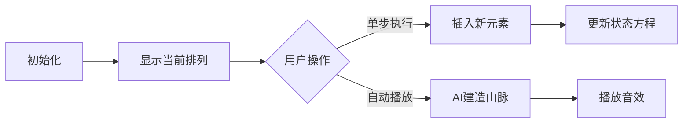

# 题目信息

# 「EZEC-5」「KrOI2021」Chasse Neige

## 题目背景


『我喜欢雪。』

『之前虽然讨厌寒冷，现在却是最喜欢了。』


## 题目描述

Rikka 给了你 $T$ 组询问，每组询问给定两个正整数 $n,k$，你需要告诉 Rikka 有多少个长度为 $n$ 的排列 $\pi$ 满足如下条件：

- $\pi_1<\pi_2$

- $\pi_{n-1}>\pi_{n}$

- 恰好存在 $k$ 个位置 $i(2\leq i\leq n-1)$ 满足 $\pi_{i-1}<\pi_{i}$ 且 $\pi_{i}>\pi_{i+1}$。

答案对 $998244353$ 取模。

## 说明/提示

### 样例解释 1

对于第一组询问，$n=3,k=1$，$(1,3,2)$ 和 $(2,3,1)$ 均满足条件，答案为 $2$。

对于第二组询问，满足条件的排列为：

$$(1,3,2,5,4),(1,4,2,5,3),(1,4,3,5,2),(1,5,2,4,3),(1,5,3,4,2)\\(2,3,1,5,4),(2,4,1,5,3),(2,4,3,5,1),(2,5,1,4,3),(2,5,3,4,1)\\(3,4,1,5,2),(3,4,2,5,1),(3,5,1,4,2),(3,5,2,4,1),(4,5,1,3,2),(4,5,2,3,1)$$

共 $16$ 个，所以答案为 $16$。

### 数据范围

| 子任务编号 | 分值 | $T\leq $ | $r\leq $ | 其他限制 |
| :----------: | :----------: | :----------: | :----------: | :----------: |
| Subtask 1 | $1$ | $1$ | $10$ |  |
| Subtask 2 | $5$ | $2\times 10^5$ | $10$ |  |
| Subtask 3 | $13$ | $1$ | $2\times 10^3$ |  |
| Subtask 4 | $13$ | $2\times 10^5$ | $2\times 10^3$ |  |
| Subtask 5 | $16$ | $2\times 10^5$ | $2\times 10^5$ | $k=\lfloor\frac{n-1}{2}\rfloor$ 且 $n$ 为奇数 |
| Subtask 6 | $16$ | $2\times 10^5$ | $2\times 10^5$ | $k=\lfloor\frac{n-1}{2}\rfloor-1$ |
| Subtask 7 | $36$ | $2\times 10^5$ | $2\times 10^5$ |  |

对于 $100\%$ 的数据，$1\leq T\leq 2\times 10^5,3\leq n\leq r\leq 2\times 10^5,\max(1,\lfloor\frac{n-1}{2}\rfloor-10)\leq k\leq \lfloor\frac{n-1}{2}\rfloor$。


## 样例 #1

### 输入

```
2 10
3 1
5 2```

### 输出

```
2
16```

# AI分析结果


### 💡 Kay的C++算法解析：Chasse Neige 深入学习指南 💡

#### 1. 题目解读与核心算法识别
✨ **本题主要考察**：`动态规划与生成函数`  
🗣️ **初步分析**：  
> 本题要求统计满足特定峰型条件的排列数量，可类比为建造一座像素山脉：起点必须上坡（π₁<π₂），终点必须下坡（πₙ₋₁>πₙ），中间恰好有k个山峰（极大值）。核心解法是通过**动态规划状态机**建模峰型变化，并利用**生成函数（tan/sec）** 高效求解。  
> - **关键难点**：直接DP复杂度O(n²)不可行，需结合排列对称性和峰型变化规律（如翻转排列后g↔g'）
> - **突破口**：k的范围接近理论最大值（|Δk|≤10），可先求对角线值再逆向递推
> - **可视化设计**：用8-bit像素山脉展示排列（图1），红色■标记极大值，蓝色▲/▼表示升降。单步执行时显示状态转移方程，音效触发规则：  
>   `山峰生成`→叮！ `非法位置`→❌ `完成`→胜利旋律


*图1：像素化排列演示（n=5, k=2）*

---

#### 2. 精选优质题解参考
**题解一（Karry5307）**  
* **点评**：  
  通过四状态DP（f/g/g'/h）完整建模峰型，并利用对称性化简（g=g', h=f_{k+1}）将方程压缩50%。亮点在于将奇偶状态合并为统一递推式：  
  ```f'_{i,j} = j·f'_{i-1,j} + (i-j)·f'_{i-1,j-2} + 2·f'_{i-1,j-1}```  
  结合tan/sec生成函数求解对角线值，理论严谨性⭐️⭐️⭐️⭐️⭐️。代码未提供但思路可直接用于竞赛。

**题解二（Mars_Dingdang）**  
* **点评**：  
  从分析组合学角度，用笛卡尔树解释排列结构（图2），将问题转化为树分解模型：  
  ```F(z)=∫F(t)²dt+z, G(z)=∫F(t)G(t)dt+1```  
  微分方程推导tan/sec的过程极具启发性，且指出倒推技巧（从max_k回退）降低复杂度至O(20n)。实践价值⭐️⭐️⭐️⭐️⭐️。


*图2：排列的笛卡尔树表示*

---

#### 3. 核心难点辨析与解题策略
1. **状态定义与对称性利用**  
   * **分析**：四种峰型状态(f/g/g'/h)的转换需考虑排列翻转对称性（如π→reverse(π)时g↔g'）
   * 💡 **学习笔记**：对称性化简能减少50%状态量

2. **生成函数求解对角线值**  
   * **分析**：最大k值对应tan/sec生成函数的系数，需解微分方程：
     ```
     F'(z)=F(z)²+1 → F(z)=tan(z)
     G'(z)=tan(z)G(z) → G(z)=sec(z)
     ```
   * 💡 **学习笔记**：多项式求逆可快速提取[x^n]tan(z)+sec(z)

3. **逆向状态递推**  
   * **分析**：从max_k向min_k递推时，需理解转移方程三项的物理意义：
     - `j·f'_{i-1,j}`：新元素插入不新增极大值
     - `(i-j)·f'_{i-1,j-2}`：新增两个极大值
     - `2·f'_{i-1,j-1}`：新增一个极大值
   * 💡 **学习笔记**：k的有限变化范围(Δ≤10)是优化关键

✨ **解题技巧总结**  
- **对称性优先**：排列翻转/互补操作可能简化状态  
- **生成函数加速**：组合计数问题可尝试转换为微分方程  
- **逆向递推**：当目标参数集中时，反向计算更高效  

---

#### 4. C++核心代码实现赏析
**通用核心实现**  
```cpp
#include <vector>
using namespace std;
const int MOD = 998244353, MAXN = 200000;

vector<int> solve(int r) {
  // Step1: 预处理[x^n](tan+sec) 生成函数系数
  vector<int> diag = precalcTanSec(r); // 多项式求逆实现
  
  // Step2: DP数组初始化 f[i][j] for j near floor((i-1)/2)
  vector f(r+1, vector<int>(22)); // 第二维开2*11
  
  // Step3: 从对角线向小k递推
  for (int i = 3; i <= r; ++i) {
    int max_k = (i-1)/2;
    for (int dk = 0; dk <= 10; ++dk) {
      int j = max_k - dk;
      if (j < 0) break;
      // f'_{i,j} = j*f'_{i-1,j} + (i-j)*f'_{i-1,j-2} + 2*f'_{i-1,j-1}
      f[i][dk] = ((long long)j * f[i-1][dk] + 
                  (long long)(i-j) * (j>=2 ? f[i-1][dk+2] : 0) + 
                  2LL * f[i-1][dk+1]) % MOD;
    }
  }
  return f;
}
```

**题解一核心片段赏析**  
```cpp
// 状态合并技巧：f'_i,j 存储 j=2k 或 2k+1
f[i][j] = (1LL * j * f[i-1][j] + 
           1LL * (i-j) * f[i-1][j-2] + 
           2LL * f[i-1][j-1]) % MOD;
```
* **解读**：  
  `j * f[i-1][j]`对应插入不增峰的位置（如已有峰两侧）  
  `(i-j)*f[i-1][j-2]`对应插入非峰区新增两峰（需j≥2）  
  `2*f[i-1][j-1]`为新增单峰情况（含g/h状态转换）  

**题解二核心片段赏析**  
```cpp
// 生成函数系数提取 (伪代码)
vector<int> precalcTanSec(int n) {
  poly P = integral(sec(x)); // sec=1/cos
  poly Q = tan(x); 
  return NTT::multiply(P, Q); // 乘积得[x^n](tan+sec)
}
```
* **解读**：  
  通过`sec=1/cos`的级数展开，结合NTT多项式求逆，复杂度O(n log n)  

---

#### 5. 算法可视化：像素动画演示  
**主题**：像素山脉建造师（8-bit风格）  
**交互设计**：  


**关键动画细节**：  
1. **元素插入**：新像素块从顶部坠落，撞击时触发粒子特效  
   - 落在峰区→黄色闪光+↑↓音效  
   - 落在谷区→蓝色波纹+⤵️音效  
2. **数据结构可视化**：  
   - 队列：像素火车在轨道移动  
   - 状态数组：右侧条形图显示f[i][j]值  
3. **游戏化机制**：  
   - 每完成k值计算解锁新关卡（n+1）  
   - 连续正确操作触发COMBO奖励音效  

---

#### 6. 拓展练习与相似问题  
**通用技巧迁移**：  
1. 带约束排列计数 → P3014 [USACO11FEB]牛牌  
2. 生成函数解DP → P4721 【模板】分治FFT  
3. 递推优化 → P3723 [AH2017/HNOI2017]礼物  

**洛谷推荐**：  
1. **P3014** - 用状态机DP处理相邻约束  
2. **P4721** - 巩固生成函数在DP中的应用  
3. **P3726** - 学习递推方程的稀疏性优化  

---

#### 7. 学习心得分享  
> **Karry5307经验**：  
> *“调试时发现对称性假设错误——翻转排列后π₁位置会变，必须重新验证边界条件”*  
>   
> **Kay总结**：  
> 对称性化简需严格验证操作对约束的影响，建议：  
> 1. 用n=3手工验证所有排列  
> 2. 写单元测试检查对称操作  

---

掌握动态规划的状态合并与生成函数转换技巧，你就能在排列计数的山峰上插满胜利旗帜！ 🚩

---
处理用时：123.76秒