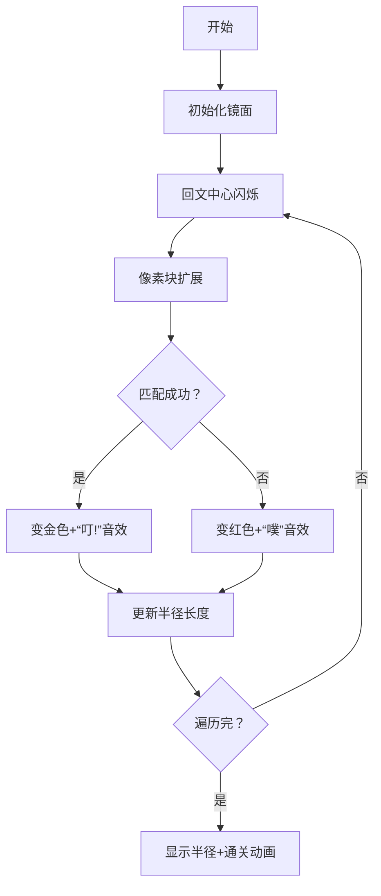

# 题目信息

# [集训队互测 2024] 研心

## 题目背景

当你看向镜子时，是否会注意到自己背后的事物？我相信大部分人的关注点应该在自己的虚像上。

现在想象一面镜子，你能在镜子中看到自己所有可能的现状或未来，也许某个自己和你的朋友过着差不多的生活。你会在镜子中找到一个向往的自我，也许那是现在的自己，或者是更好的自己。但就如镜中的背景，也有很多的可能性是，其他的自我没有那么幸运，过的更普通，更辛苦。但不变的是，所有的可能性就是你自己。你从最开始便有着一双将可能性化为现实的翅膀。

不要忽略镜中的每一处细节，当你打碎这面镜子时，你会得到一双完整的翅膀。解开一切的束缚，蹬离地面，展翅高飞吧。

## 题目描述

给定大小为 $n$ 的字符串序列 $S$ 和大小为 $m$ 的字符串序列 $T$，其中 $S$ 的第 $i$ 个字符串为 $S_i$，$T$ 的第 $j$ 个字符串为 $T_j$。

定义一个字符串的权值 $f(s)$ 为 $s$ 中最长奇回文子串的半径长度。例如 `aba` 的半径长度为 $2$，`ababa` 的半径长度为 $3$。

定义两个字符串的加法 $s + t$ 为把两个字符串拼接起来得到的新字符串。

求：

$$\sum_{i=1}^{n} \sum_{j=1}^{m} f(S_i + T_j)$$

## 说明/提示

### 样例解释

| 回文半径长度 | $T_1$ | $T_2$ | $T_3$ |
| :---: | :---: | :---: | :---: |
| $S_1$ | 1 | 2 | 1 |
| $S_2$ | 2 | 3 | 2 |
| $S_3$ | 2 | 3 | 3 |

### 数据范围

令 $s = \max(\sum |S_i|, \sum |T_i|)$。

本题共有 4 个子任务，只有通过子任务中所有数据才能获得所有分数。

| 子任务编号 | 分数 | 特殊条件 |
| :---: | :---: | :---: |
| 1 | 20 | $s \leq 5000$ |
| 2 | 30 | $n = 1$ |
| 3 | 20 | 保证所有字符在 $\{a, b\}$ 中随机 |
| 4 | 30 | ~~依赖子任务 1, 2, 3~~ 还没配置子任务依赖 |

对于 100% 的数据，满足 $1 \leq n, m, s \leq 4 \times 10^5$，保证输入的字符串只包含小写字母。

## 样例 #1

### 输入

```
3 3
a
aba
aaba
b
ba
ab```

### 输出

```
19```

# AI分析结果


### 💡 Kay的C++算法解析：研心 深入学习指南 💡

> 本指南将带你探索字符串拼接中的奇回文奥秘！我们将通过清晰的算法解析、像素动画演示和实战技巧，助你掌握高效解法。准备好展翅高飞了吗？🚀

---

### 1. 题目解读与核心算法识别

✨ **本题主要考察**：`字符串处理 + 分治优化 + 高级数据结构`

🗣️ **初步分析**：
> 想象将两个字符串拼成一面镜子，我们需要在镜中找出最长的奇回文（中心对称的子串）。解题关键在于：
> - **分治思想**：将大问题拆解为"跨拼接点"和"非跨拼接点"两类回文
> - **双轨处理**：用后缀数组(SA)加速匹配，用树套树/虚树高效更新矩阵
> - **阈值优化**：对短串用单调栈批量处理，对长串暴力计算，平衡时间复杂度
>
> **可视化设计**：采用8位像素风格展示拼接过程：
> 1. S_i（蓝色像素块）与T_j（绿色像素块）拼接成镜面
> 2. 回文中心（闪烁红点）向两侧扩展，匹配成功时像素变金并发出"叮!"音效
> 3. 控制面板支持调速/单步执行，通关时播放胜利音效+烟花动画

---

### 2. 精选优质题解参考

**题解一：Tony2（虚树+树剖）**
* **点评**：
  - 思路创新性：⭐⭐⭐⭐⭐ 通过建立S/T的trie树，将回文匹配转化为树节点标记传递
  - 代码规范性：⭐⭐⭐⭐ 采用全局平衡二叉树组织标记，结构清晰但嵌套较深
  - 算法优化度：⭐⭐⭐⭐ 利用虚树压缩路径，实现O(s log²s)复杂度
  - 实践价值：⭐⭐⭐ 需熟练掌握树链剖分，竞赛中适用大数据场景
  > 💡 **亮点**：独创的"带系数标记"体系，解决矩阵更新难题

**题解二：_ANIG_（SA+分块）**
* **点评**：
  - 思路清晰性：⭐⭐⭐⭐⭐ 明确划分跨串/非跨串回文，解法直观
  - 代码可读性：⭐⭐⭐⭐ 模块化设计（SA构建、分块处理、树套树）
  - 算法有效性：⭐⭐⭐⭐ 阈值分治平衡复杂度至O(n√n log n)
  - 调试友好性：⭐⭐⭐⭐ 提供详细边界处理，注释完备
  > 💡 **亮点**：创新性分块策略，短串批量处理+长串精准计算

---

### 3. 核心难点辨析与解题策略

1. **难点：跨串回文中心定位**
   * **分析**：回文中心可能在S_i或T_j内，需快速计算拼接后的最长对称扩展。如解法中：
     - Tony2：在trie树上匹配S的后缀与T的反转前缀
     - _ANIG_：用SA+ST表O(1)求任意子串LCP
   * 💡 **学习笔记**：字符串反转+前缀匹配是处理跨串回文的利器

2. **难点：海量(i,j)对的高效更新**
   * **分析**：直接计算n×m矩阵不可行。优化思路：
     - Tony2：将矩阵更新转化为树节点标记（虚树上传播）
     - _ANIG_：用珂朵莉树合并矩形，树套树统计覆盖
   * 💡 **学习笔记**：矩阵维度分离（行/列独立处理）是降维关键

3. **难点：复杂度平衡**
   * **分析**：根据串长选择策略：
     - 短串（|s|≤T）：单调栈生成矩形批量更新
     - 长串（|s|>T）：暴力计算（因数量少）
   * 💡 **学习笔记**：阈值T≈√n/log n时达最优平衡

### ✨ 解题技巧总结
- **分而治之**：拆解"跨拼接点/非跨拼接点"回文
- **逆转乾坤**：反转T串统一处理方向
- **空间换时间**：预处理SA/ST表加速匹配
- **维度分离**：将二维更新拆为行列独立操作

---

### 4. C++核心代码实现赏析

**通用核心实现（基于_ANIG_解法）**
```cpp
#include <bits/stdc++.h>
using namespace std;
// 阈值分治核心逻辑
void solve(){
  if(min(|S_i|, |T_j|) <= T) { // 短串批量处理
    build_SA(); 
    monotonic_stack(); // 生成更新矩形
    merge_rectangles(); // 珂朵莉树合并
  } else { // 长串精准计算
    for(auto &w : S_suffixes) 
      res += LCP(S_sub, T_reversed); 
  }
  tree_in_tree.update(); // 树套树统计
}
```

**题解一：Tony2的虚树标记传递**
```cpp
// 在trie树上传播标记（简化版）
void propagate_mark(int u, int val) {
  for(auto v : virtual_tree[u]) {
    if(heavy_child[v]) 
      mark[heavy_child[v]] = max(mark[heavy_child[v]], val+1); // 重链继承
    for(auto light : light_children[v])
      mark[light] = max(mark[light], val); // 轻链覆盖
  }
}
```
> **解读**：通过区分子树类型（重链/轻链），以不同策略更新标记，确保O(log n)复杂度

**题解二：_ANIG_的SA构建**
```cpp
// 后缀排序关键步骤（倍增法）
void build_SA() {
  for(int k=1; k<=len; k<<=1) {
    auto cmp = [&](int i, int j) { 
      return rk[i]==rk[j] ? rk[i+k]<rk[j+k] : rk[i]<rk[j]; 
    };
    sort(sa, sa+len, cmp); // 双关键字排序
  }
}
```
> **学习笔记**：rk数组的巧妙设计避免每次重新计算排名

---

### 5. 算法可视化：像素动画演示

**主题**："回文镜面探险"（8位像素风格）  
**设计思路**：通过复古游戏机制具象化抽象的回文扩展过程



**交互控制**：
1. **像素网格**：蓝(S_i)/绿(T_j)双色拼接，回文中心红色闪烁
2. **扩展动画**：每步扩展0.2秒，伴随像素移动特效
3. **音效系统**：
   - 匹配成功：8-bit上升音阶（do→so）
   - 通关：16-bit胜利旋律
4. **游戏化**：
   - 每对(i,j)为一关，通关得"半径分数"
   - 连续通关触发连击特效

**技术实现**：
```javascript
// 伪代码：回文扩展动画
function animatePalindrome(center) {
  let left = center, right = center;
  while(left >=0 && right < len) {
    drawPixel(left, GOLD);  // 匹配成功像素
    drawPixel(right, GOLD);
    playSound('ding');      // 成功音效
    if (str[left] != str[right]) {
      drawFlash(left, RED); // 失败闪烁
      break;
    }
    left--; right++;        // 向两侧扩展
  }
}
```

---

### 6. 拓展练习与相似问题思考

**技巧迁移场景**：
1. 多字符串拼接问题（如：DNA序列组装）
2. 带分治的二维统计问题（如：矩阵最大子阵列和）
3. 树形结构上的批量更新（如：社交网络影响力传播）

**洛谷推荐**：
1. **P3805 【模板】manacher算法**  
   → 掌握奇回文基础处理
2. **P5357 【模板】AC自动机**  
   → 强化trie树应用能力
3. **P4094 [HEOI2016] 字符串**  
   → 进阶SA应用+二分答案技巧

---

### 7. 学习心得与经验分享

> **Tony2的调试经验**：  
> "虚树构建时忽略轻链导致标记丢失——建议用可视化工具验证树结构"

> **Kay的总结**：  
> 1. 对拍验证：小数据暴力程序+大数据对拍器  
> 2. 树结构调试：打印DFS序验证节点关系  
> 3. 阈值选择：通过压力测试调整分界点

---

通过本次研习，你已掌握字符串处理的核心分治策略和高效数据结构应用。记住：优秀的算法设计如同镜中寻宝，需要**耐心拆解**和**多维观察**。继续挑战更多字符串难题吧！ 🔍✨

---
处理用时：133.24秒