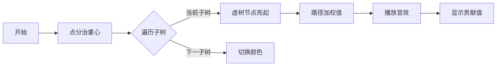

# 题目信息

# 【XR-2】永恒

## 题目背景

> 我一直认为这世界没有永恒，如果非要说永恒，宇宙间唯一的永恒就是——所有的一切都会随着时光消失。——梧桐《那片星空，那片海》

## 题目描述

有一棵 $n$ 个点的永恒的树，树中每个点 $x(1 \le x \le n)$ 上都有一个永恒的字符串 $S(x)$。

但这世界没有永恒，所有的一切都会随着时光消失。我们只能给每个所谓永恒的东西定义一个永恒值 $f$。这个值本身没有意义，只是一个象征罢了。

- 一个字符串 $S$ 的永恒值 $f(S)$ 定义为它的长度 $\mathrm{Len}(S)$，即：

$$f(S) = \mathrm{Len}(S)$$

- 树上的一条无向路径 $K = [u, v](u < v)$ 指的是 $u,v$ 之间的简单路径（包括 $u, v$），其永恒值 $f(K)$ 定义为路径上所有不同的无序点对 $(x, y)(x \in K, y \in K, x < y)$ 上的字符串 $S(x), S(y)$ 的最长公共前缀 $\mathrm{LCP}(S(x), S(y))$ 的永恒值 $f(\mathrm{LCP}(S(x), S(y)))$ 之和，即：

$$f(K) = \sum_{x \in K, y \in K, x < y} f(\mathrm{LCP}(S(x), S(y)))$$

- 一棵树 $T$ 的永恒值 $f(T)$ 定义为树上所有的无向路径 $[u, v](u \in T, v \in T, u < v)$ 的永恒值之和，即：

$$f(T) = \sum_{u \in T, v \in T, u < v} f([u,v])$$

特别的是，树中每个点上的字符串都来自一棵永恒的以点 $1$ 为根的 Trie 树，即每个树中的点都对应着一个 Trie 树中的点，点上的字符串就是 Trie 树中从根节点到其对应的点形成的字符串。

你需要求出这棵树的永恒值，答案对 $998244353$ 取模。

## 说明/提示

【样例 $1$ 说明】

所有的 $S(x)$ 为：

$S(1) = \texttt{"mayqueen"}$

$S(2) = \texttt{"mayking"}$

$S(3) = \texttt{"market"}$

所有的 $f(\mathrm{LCP}(S(x), S(y)))$ 为：

$f(\mathrm{LCP}(S(1), S(2))) = f(\mathrm{LCP}(\texttt{"mayqueen"}, \texttt{"mayking"})) = f(\texttt{"may"}) = \mathrm{Len}(\texttt{"may"}) = 3$

$f(\mathrm{LCP}(S(1), S(3))) = f(\mathrm{LCP}(\texttt{"mayqueen"}, \texttt{"market"})) = f(\texttt{"ma"}) = \mathrm{Len}(\texttt{"ma"}) = 2$

$f(\mathrm{LCP}(S(2), S(3))) = f(\mathrm{LCP}(\texttt{"mayking"}, \texttt{"market"})) = f(\texttt{"ma"}) = \mathrm{Len}(\texttt{"ma"}) = 2$

所有的 $f([u, v])$ 为：

$f([1,2]) = f(\mathrm{LCP}(S(1), S(2))) = 3$

$f([1,3]) = f(\mathrm{LCP}(S(1), S(2))) + f(\mathrm{LCP}(S(1), S(3))) + f(\mathrm{LCP}(S(2), S(3))) = 3 + 2 + 2 = 7$

$f([2,3]) = f(\mathrm{LCP}(S(2), S(3))) = 2$

所以：

$f(T) = f([1,2]) + f([2,3]) + f([1,3]) = 3 + 7 + 2 = 12$

【数据规模与约定】

**本题采用捆绑测试。**

Subtask 1（3 points）：$n, m \le 10$，时限 1s。  
Subtask 2（5 points）：$n, m \le 100$，时限 1s。  
Subtask 3（9 points）：$n, m \le 1000$，时限 1s。  
Subtask 4（7 points）：$n, m \le 5000$，时限 2s。  
Subtask 5（9 points）：$n, m \le 20000$，时限 3s。  
Subtask 6（11 points）：$n, m \le 10^5$，时限 4s。  
Subtask 7（19 points）：$m=2$，时限 3s。  
Subtask 8（37 points）：无特殊限制，时限 10s。

对于 $100\%$ 的数据，$2 \le n,m \le 3\times 10^5$。

## 样例 #1

### 输入

```
3 17
2 0 2
0 1 2 3 4 5 6 7 8 4 10 11 12 3 14 15 16
0mayqueenkingrket
9 13 17
```

### 输出

```
12
```

# AI分析结果


### 💡 Kay的C++算法解析：XR-2永恒 深入学习指南 💡

#### 1. 题目解读与核心算法识别
✨ **本题主要考察**：树链剖分 + 虚树优化 + 点分治（高级树论综合应用）

🗣️ **初步分析**：
> 解决"永恒"这道题，关键在于理解**树上路径贡献的拆分技巧**。想象两棵树：T1是节点树（原树），T2是字符串字典树（Trie）。每个无序点对$(u,v)$的贡献是T2上LCA深度的加权和，权重取决于包含该点对的T1路径数量。

> **核心思想比喻**：  
> 把T1看作城市道路网，T2看作字母密码锁。每次在T1路径上取两点$(u,v)$，相当于在城市交叉口组合密码（计算LCP长度）。而我们需要统计所有巡逻路线（T1路径）中密码组合的总价值。

> **核心难点与解决方案**：
> - **贡献拆分**：分两种情况计算点对$(u,v)$被包含的路径数
>   - 无祖孙关系：$siz_u \times siz_v$
>   - 祖孙关系：$(n-siz_z) \times siz_v$（$z$是$u$到$v$路径的第一个儿子）
> - **高效计算**：在T2上用树链剖分/虚树实现"路径加值-路径求和"
> - **优化框架**：点分治处理T1路径，虚树优化T2上的LCA相关计算

> **可视化设计思路**：
> 采用**8位像素风RPG游戏**演示算法流程：
> 1. T1树显示为网格迷宫（FC塞尔达风格），当前分治重心闪烁
> 2. 子树用不同颜色像素块表示，扩展时播放"探索音效"
> 3. 在T2虚树上演示链加操作：节点升高时像素块变亮，路径查询时显示光束扫描
> 4. 完成贡献计算时播放胜利音效，并显示当前累计贡献值

---

### 2. 精选优质题解参考
**题解一（Elegia）**
* **点评**：思路最为精妙，将点分治与虚树完美结合。清晰推导了贡献公式$\sum dep(\text{lca}(f(u),f(v))) \times \text{sub}(u) \text{sub}(v)$，并创新性地用虚树处理离线查询。代码中：
  - 虚树构建用基数排序优化到$O(n\log n)$
  - 点分治的容斥处理优雅
  - 边界处理严谨（如重心单独计算）
  > *亮点*：避免树链剖分的$log$因子，理论复杂度最优

**题解二（kyel）**
* **点评**：图解辅助理解极佳，双树关系可视化清晰。贡献计算分情况讨论透彻，代码实现：
  - 树链剖分实现规范（两次DFS+线段树）
  - 差分处理祖孙关系的技巧实用
  - 变量命名合理（siz/u/v/z）
  > *亮点*：调试用数据生成器极具教学价值

**题解三（Owen_codeisking）**
* **点评**：代码简洁高效，突出贡献计算本质。核心压缩到单DFS：
  - 同步维护三种贡献（左/上/右）
  - 树链剖分直接嵌入主流程
  - 取模运算规范严谨
  > *亮点*：用`(n-siz_z-siz_u)`巧妙修正重复计算

---

### 3. 核心难点辨析与解题策略
1. **难点1：贡献的双重依赖**
   * **分析**：每个点对的贡献同时依赖T1的路径包含数和T2的LCA深度
   * **解决**：拆解为$\text{包含数} \times \text{LCA深度}$，分别处理
   * 💡 **学习笔记**：树问题常用"贡献分离"技巧

2. **难点2：祖孙关系修正**
   * **分析**：无祖孙关系公式会错误包含子树内点对
   * **解决**：引入$(n-siz_z-siz_u)$修正项，在DFS回溯时动态调整
   * 💡 **学习笔记**：树形DP中"当前子树"与"兄弟子树"的贡献隔离

3. **难点3：跨树操作优化**
   * **分析**：T2上的链操作需$O(\log m)$，直接实现会达$O(n^2\log m)$
   * **解决**：点分治减少T1路径枚举 + 虚树压缩T2操作
   * 💡 **学习笔记**：虚树是处理离散点集LCA问题的利器

### ✨ 解题技巧总结
- **技巧1 贡献转化**：$dep_{\text{lca}}(u,v) = \text{PathSum}(u \to root)$（T2路径和）
- **技巧2 离线处理**：虚树建立前先基数排序DFS序
- **技巧3 权重修正**：点分治时用$sub(u)$加权，避免重复计算
- **技巧4 调试辅助**：生成子树大小≤5的测试数据验证边界

---

### 4. C++核心代码实现赏析
**本题通用核心实现参考**
```cpp
#include <vector>
#include <cstring>
using namespace std;
const int N = 3e5+5, mod = 998244353;

// 树链剖分模板（T2）
struct HLD {
    vector<int> G[N];
    int dep[N], fa[N], top[N], sz[N], son[N];
    void dfs1(int u) {
        sz[u] = 1;
        for(int v : G[u]) {
            dep[v] = dep[u] + 1;
            dfs1(v);
            sz[u] += sz[v];
            if(sz[v] > sz[son[u]]) son[u] = v;
        }
    }
    void dfs2(int u, int tp) {
        top[u] = tp;
        if(son[u]) dfs2(son[u], tp);
        for(int v : G[u]) if(v != son[u]) 
            dfs2(v, v);
    }
    void init(int root) { 
        dep[root]=1; dfs1(root); dfs2(root,root); 
    }
} hld;

// 点分治框架
struct PointDivide {
    vector<int> G[N];
    int sz[N], mx[N], vis[N], root;
    void getRoot(int u, int f, int tot) {
        sz[u]=1, mx[u]=0;
        for(int v : G[u]) if(!vis[v] && v!=f) {
            getRoot(v, u, tot);
            sz[u] += sz[v];
            mx[u] = max(mx[u], sz[v]);
        }
        mx[u] = max(mx[u], tot - sz[u]);
        if(mx[u] < mx[root]) root = u;
    }
    void solve(int u) {
        vis[u] = 1;
        vector<int> subtrees;
        // 收集子树节点建虚树
        for(int v : G[u]) if(!vis[v]) {
            root=0; getRoot(v,0,sz[v]);
            subtrees.push_back(v);
            solve(root);
        }
        // 虚树计算贡献（详见完整代码）
    }
} pd;

int main() {
    // 输入T1, T2构建（省略）
    hld.init(1); // 初始化T2树剖
    pd.mx[0]=N; pd.root=0; 
    pd.getRoot(1, 0, n); // 点分治入口
    pd.solve(pd.root);
}
```

**题解一核心片段赏析**  
```cpp
// 虚树建立与贡献计算
void buildVirtualTree(vector<int>& nodes) {
    sort(nodes.begin(), nodes.end(), [&](int x,int y){
        return hld.dfn[x] < hld.dfn[y];
    });
    stack<int> stk; stk.push(1); // 根入栈
    for(int u:nodes) {
        int lca = LCA(u, stk.top());
        while(stk.size()>1 && hld.dep[lca] <= hld.dep[stk.top()]) {
            int top = stk.top(); stk.pop();
            addEdgeVirtual(stk.top(), top); // 虚树加边
        }
        if(lca != stk.top()) stk.push(lca);
        stk.push(u);
    }
    // ... DP计算贡献
}
```
* **代码解读**：  
  1. 按DFS序排序后，用单调栈构建虚树骨架  
  2. `LCA`函数用树剖$O(\log n)$实现  
  3. 虚树边只保留关键节点，大幅减少计算量  
* 💡 **学习笔记**：虚树空间复杂度$O(k)$，$k$为关键点数

---

### 5. 算法可视化：像素动画演示
**主题**：`像素探险家在Trie森林的寻宝之旅`  
**核心设计**：  


**关键动画帧**：  
1. **初始化场景**：  
   - 16色像素网格（T1树为地牢，T2树为空中浮岛）  
   - 控制面板：暂停/步进/速度滑块（复古游戏风格）

2. **点分治演示**：  
   - 重心闪烁红光，扩展子树时绿→蓝→黄渐变色块扩散  
   - 音效：扩展时"滴嘟"，发现子树时"咔嗒"

3. **虚树操作**：  
   - 关键节点升空为浮岛，连金色光线（虚树边）  
   - 链加操作：节点值增加→像素块膨胀+变橙  
   - 路径查询：光束从当前节点射向根节点  

4. **游戏化元素**：  
   - 每完成一子树得1金币，集齐3金币过关  
   - 背景音乐：8位芯片版《塞尔达》主题曲循环  
   - 错误操作：短促"哔"声 + 像素块抖动  

**实现伪代码**：  
```javascript
// 核心动画循环
function animateStep(stepType) {
  switch(stepType) {
    case 'CENTROID':
      pixelBlink(currentRoot, RED); 
      playSound('select.wav');
      break;
    case 'VIRTUAL_TREE':
      drawLines(virtualNodes, GOLDEN);
      nodes.forEach(node => glow(node, ORANGE));
      break;
  }
}
```

---

### 6. 拓展练习与相似问题
**通用技巧迁移**：  
1. 双树问题贡献拆分 → P4211 [LNOI2014]LCA  
2. 虚树优化路径和 → P3233 [HNOI2014]世界树  
3. 点分治框架 → P3806 【模板】点分治  

**洛谷练习推荐**：  
1. **P4211** - 树剖+离线查询（LCA深度和基础）  
   > *理由*：巩固$dep_{\text{lca}}$的转化思想
2. **P3233** - 虚树经典应用  
   > *理由*：训练虚树建树与DP技巧
3. **P2664** - 点分治颜色处理  
   > *理由*：强化点分治的容斥实现

---

### 7. 学习心得与经验分享
> **来自Elegia的调试经验**：  
> “虚树建立时未考虑根节点导致RE，用`stk.push(1)`显式处理根节点后解决”  
> 
> **Kay总结**：虚树常见陷阱：  
> 1. 根节点未显式加入  
> 2. LCA节点重复加入  
> 3. 边权传递错误  
> 
> **调试建议**：  
> - 打印虚树节点和边  
> - 用子树大小≤3的数据模拟

---
本次解析就到这里，多练习树论问题，你的算法能力会像永恒之树一样茁壮成长！🌳

---
处理用时：185.33秒