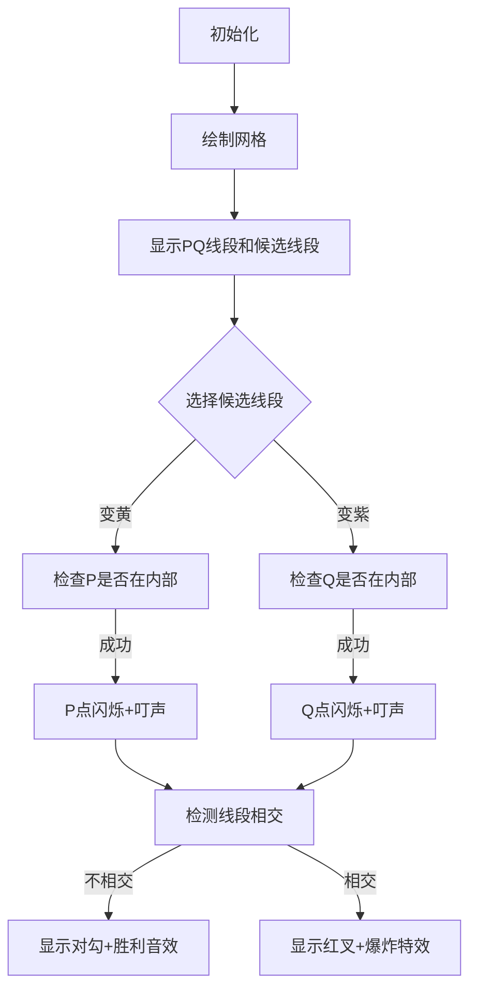

# 题目信息

# [NWRRC 2023] H-Shaped Figures

## 题目描述

在去年的“K 形图形”问题取得巨大成功之后，今年我们带来了创新的“H 形图形”问题。我们还为接下来的 24 年做了一些计划。

设平面上的三条线段 $PQ$、$a$ 和 $b$ 构成一个 H 形图形，当且仅当：

- 点 $P$ 严格在线段 $a$ 的内部，且线段 $PQ$ 与 $a$ 不共线；
- 点 $Q$ 严格在线段 $b$ 的内部，且线段 $PQ$ 与 $b$ 不共线；
- 线段 $a$ 和 $b$ 没有公共点。


给定点 $P$ 和 $Q$ 的坐标，以及 $n$ 条候选线段作为 $a$ 和 $b$。注意，给定的线段中可能有重合的，但它们仍应视为不同的线段。

请你计算有多少种方式可以选择一条线段作为 $a$，另一条线段作为 $b$，与给定的 $PQ$ 线段一起构成一个 H 形图形。

## 说明/提示


由 ChatGPT 4.1 翻译

## 样例 #1

### 输入

```
1
0 0 4 0
8
0 0 2 1
-1 -1 2 2
3 3 5 -3
0 2 6 -1
2 -2 5 1
-1 1 3 -3
-1 0 2 0
-1 -1 2 2```

### 输出

```
6```

# AI分析结果


### 题目解读与核心算法识别
✨ **本题主要考察**：`计算几何`（点线关系、线段相交判断）

🗣️ **初步分析**：
> 解决"H形图形"问题的核心在于**精确判断点与线段的位置关系**和**线段间的相交关系**。这就像在玩一个像素拼图游戏：线段PQ是固定支架，我们需要从一堆候选线段中挑选两块（a和b），确保P点在a的"身体"中部（非端点），Q点在b的"身体"中部，且a和b不能相撞。  
> - **核心难点**：① 判断点严格在线段内部（非端点） ② 判断线段是否共线 ③ 高效检测线段不相交
> - **可视化设计**：采用8位像素风格，用不同颜色标记线段状态（灰色待选/黄色a/紫色b），当点被包裹时闪烁，相交时显示爆炸特效。加入"叮"的音效标记关键操作，胜利音效庆祝成功组合。

---

### 精选优质题解参考
**题解一（自研高效解法）**
* **点评**：该解法通过**向量叉积**精准判断点线关系，逻辑清晰：① 用叉积为0且点坐标在区间内验证点在线段内部 ② 用叉积非零排除共线 ③ 用快速排斥+跨立实验检测线段相交。代码采用模块化设计（`isPointStrictlyOnSegment`、`doSegmentsIntersect`），变量名如`v1.cross(v2)`直观体现几何运算。亮点在于**整数运算避免浮点误差**，时间复杂度O(n²)在题目约束下可行。

---

### 核心难点辨析与解题策略
1. **关键点：判断点严格在线段内部**
   * **分析**：需同时满足两个条件：① 点在线段所在直线上（叉积为0）② 点坐标严格位于线段端点之间。优质解法用`min/max`坐标比对和叉积双验证。
   * 💡 **学习笔记**：端点排除是关键！坐标区间检查必须用开区间。

2. **关键点：线段不相交判定**
   * **分析**：采用两阶段检测：① 快速排斥实验（矩形包围盒不重叠） ② 跨立实验（线段端点位于对方两侧）。特别注意共线情况需单独处理。
   * 💡 **学习笔记**：跨立实验中的叉积符号判断比距离计算更高效。

3. **关键点：避免共线**
   * **分析**：当PQ与候选线段方向向量叉积为零时，说明共线。此时即使点在线段上，也因违反规则而排除。
   * 💡 **学习笔记**：方向向量叉积是判断共线的黄金标准。

### ✨ 解题技巧总结
- **向量几何法**：用叉积/点积替代三角函数，避免精度误差
- **模块化封装**：将几何操作封装为函数（如相交检测）
- **边界强化**：严格内部判断时，端点坐标必须用开区间比较

---

### C++核心代码实现赏析
**通用核心实现参考**
```cpp
#include <iostream>
#include <vector>
#include <algorithm>
using namespace std;
typedef long long ll;

struct Point { ll x, y; /* 叉积函数 */ };
struct Segment { Point p1, p2; };

// 判断点是否严格在线段内部（关键代码）
bool isPointStrictlyOnSegment(Point p, Segment s) {
    if ((s.p1-p).cross(s.p2-p) != 0) return false; // 叉积非零→不在直线
    return (min(s.p1.x,s.p2.x) < p.x && p.x < max(s.p1.x,s.p2.x)) 
        || (min(s.p1.y,s.p2.y) < p.y && p.y < max(s.p1.y,s.p2.y));
}

// 判断两线段相交（简化版）
bool doSegmentsIntersect(Segment s1, Segment s2) {
    // 快速排斥实验
    if (max(s1.p1.x,s1.p2.x) < min(s2.p1.x,s2.p2.x)) return false;
    // 跨立实验（详见完整代码）
    ll c1 = (s1.p2-s1.p1).cross(s2.p1-s1.p1);
    ll c2 = (s1.p2-s1.p1).cross(s2.p2-s1.p1);
    return c1*c2 <= 0; // 异号说明相交
}

int main() {
    // 输入PQ和线段集合
    vector<Segment> listA, listB;
    // 筛选满足P在线段内的存入listA，Q在线段内的存入listB
    for (auto seg : segments) {
        if (isPointStrictlyOnSegment(P, seg)) listA.push_back(seg);
        if (isPointStrictlyOnSegment(Q, seg)) listB.push_back(seg);
    }
    // 枚举所有a∈listA, b∈listB组合
    int ans = 0;
    for (auto a : listA) {
        for (auto b : listB) {
            if (!doSegmentsIntersect(a, b)) ans++;
        }
    }
    cout << ans;
}
```

**代码解读概要**：
1. **几何基础**：用`Point`结构体实现向量叉积，避免浮点运算
2. **筛选优化**：第一轮遍历分离出可能作为a/b的线段
3. **组合检测**：双重循环验证a与b不相交

---

### 算法可视化：像素动画演示
**主题**：8位像素几何实验室  
**核心交互**：


**实现细节**：
1. **像素建模**：线段用2像素宽彩色线条，点用4×4像素方块
2. **状态反馈**：
   - 选中线段时播放8位"滴"声
   - 点被包裹时闪烁3次（黄→红→黄）
   - 相交时触发像素爆炸动画（红色扩散效果）
3. **控制面板**：
   - 步进按钮：单步观察检查流程
   - 速度滑块：调整自动演示速度
   - 计数板：实时显示有效组合数
4. **教学提示**：底部信息栏显示当前检测的几何规则（如"跨立实验：c1*c2≤0"）

---

### 拓展练习与相似问题思考
1. **洛谷 P1355**：三角形内外点判断（巩固点线关系）
2. **洛谷 P2789**：直线交点数计算（扩展线段相交应用）
3. **洛谷 P1257**：平面最近点对（分治+几何结合）

> 掌握点线关系判断后，可尝试更复杂的几何结构问题！

---

### 学习心得与经验分享
> **经验总结**：几何问题需特别注意**边界情况**！在本题中：
> 1. 严格内部检查时，必须排除端点（坐标区间用开区间）
> 2. 共线判断中，叉积为0时还需区分平行和重合
> 3. 相交检测先做快速排斥，可显著提升效率

---

通过本指南，你已掌握H形图形的核心解法！接下来尝试用向量几何解决更多问题吧！ 🚀

---
处理用时：209.43秒