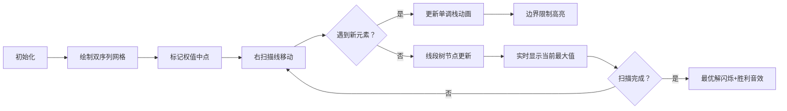

# 题目信息

# [ROI 2017] 学习轨迹 (Day 2)

## 题目描述

THU 和 PKU 同时开设了一批课程，THU 有 $n$ 节课，PKU 有 $m$ 节课。

其中 THU 第 $i$ 节课类别是 $a_i$，乐趣度是 $x_i$；PKU 第 $i$ 节课类别是 $b_i$，乐趣度是 $y_i$。保证 $a$ 中元素互不相同，$b$ 中元素互不相同，但是 $a$ 和 $b$ 之间可能有相同元素。

你可以选择听 THU 的 $l_1 \sim r_1$ 节课，收获到的乐趣度为所有你听的课的乐趣度的和；同时可以在 PKU 听 $l_2 \sim r_2$ 节课，收获到的乐趣度也是所有你听的课的乐趣度的和。（当然你也可以选择只听一所大学的课甚至不听）

同一类别的课你不能听两次，也就是如果 $a_{l_1 \sim r_1}$ 中有元素与 $b_{l_2 \sim r_2}$ 相同，那么这个听课方案就不能满足你的胃口。

你需要求出可能的听课方案中乐趣度最大的是多少以及具体的安排。

## 说明/提示

#### 【样例解释】

对于样例组 #1：

最优解如样例所示，课程质量之和为 $(7 + 4 + 10 + 1 + 5) + (5 + 3 + 4) = 27 + 12 = 39$。

对于样例组 #2：

由于 PKU 的 $1$ 号、$2$ 号课程相比 THU 的相同课程的质量要高得多，因此最优解是不去 THU 听课，转而在 PKU 读 $1\sim 3$ 号课程。

#### 【数据范围】

注：本题只放部分数据，完整数据请左转 [LOJ P2773](https://loj.ac/p/2773) 评测。

对于所有数据满足：$1 \le a_i,b_i \le n+m$，$1 \le x_i,y_i \le 10^9$，$a_i \ne a_j(i \ne j)$，$b_i \ne b_j(i \ne j)$。

| 子任务编号 | 分值 | $1 \le n,m \le $ |
| :----------: | :----------: | :----------: |
| $1$ | $10$ | $50$ |
| $2$ | $10$ | $100$ |
| $3$ | $10$ | $300$ |
| $4$ | $10$ | $500$ |
| $5$ | $10$ | $2000$ |
| $6$ | $5$ | $5000$ |
| $7$ | $5$ | $10^4$ |
| $8$ | $10$ | $3 \times 10^4$ |
| $9$ | $10$ | $10^5$ |
| $10$ | $10$ | $2.5 \times 10^5$ |
| $11$ | $10$ | $5 \times 10^5$ |


## 样例 #1

### 输入

```
7 5
3 1 4 8 6 9 2
2 7 4 10 1 5 3
9 2 11 3 8
3 5 3 4 12```

### 输出

```
39
2 6
2 4```

## 样例 #2

### 输入

```
2 3
1 2
1 4
2 3 1
17 2 15```

### 输出

```
34
0 0
1 3```

## 样例 #3

### 输入

```
3 3
4 2 1
10 1 2
5 4 2
1 2 9```

### 输出

```
19
1 1
3 3```

# AI分析结果


### 💡 Kay的C++算法解析：[ROI 2017] 学习轨迹 深入学习指南 💡

**题目解读**  
本题要求从THU和PKU两个课程序列中选取不相交区间（课程类别不重复），最大化总乐趣度。核心挑战在于高效处理区间约束和优化计算。

---

## 1. 题目解读与核心算法识别

✨ **本题主要考察**：`扫描线应用` + `数据结构优化`  
🗣️ **初步分析**：  
> 解决本题的关键在于利用**权值中点性质**：至少有一个序列的选定区间和超过其总乐趣度的一半（否则全选更优）。  
> - **核心流程**：  
>   1. 确定序列A的权值中点位置（第一个前缀和过半的点）  
>   2. 扫描序列B的右端点，用单调栈维护左端点的区间限制（左边界递增/右边界递减）  
>   3. 线段树动态更新每个左端点对应的最大价值  
> - **可视化设计**：  
>   - 像素网格展示两个序列，权值中点用闪光方块标记  
>   - 扫描线向右移动时触发"滴答"音效  
>   - 单调栈入栈/出栈时播放"咔嚓"音效，线段树更新节点时高亮变化区域  
>   - 找到最优解时播放8-bit胜利音乐，解路径闪烁  

---

## 2. 精选优质题解参考

**题解一（作者：苏联小渣）**  
* **点评**：  
  思路清晰度⭐⭐⭐⭐⭐ - 将权值中点性质与扫描线结合，推导自然  
  代码规范性⭐⭐⭐⭐ - 变量名`mxl/mnr`直观体现左右边界限制  
  算法有效性⭐⭐⭐⭐⭐ - 单调栈+线段树实现$O(n\log n)$最优复杂度  
  实践价值⭐⭐⭐⭐ - 完整处理边界条件，可直接用于竞赛  

**题解二（作者：_Ch1F4N_）**  
* **点评**：  
  思路创新性⭐⭐⭐⭐ - 用二分查找快速定位限制区间  
  代码可读性⭐⭐⭐⭐ - 模块化结构便于调试  
  亮点：显式维护`L/R`数组，降低思维难度  

**题解三（作者：Reunite）**  
* **点评**：  
  简洁性⭐⭐⭐⭐⭐ - 直接维护端点限制，避免复杂推导  
  效率优化⭐⭐⭐ - 递归更新减少冗余计算  
  注意点：需仔细处理刚好等于一半的边界情况  

---

## 3. 核心难点辨析与解题策略

1. **难点1：理解权值中点必然性**  
   * **分析**：若两个序列区间和都≤其总和一半，则全选更大序列更优（反证法）  
   * 💡 **学习笔记**：该性质将二维问题降为一维扫描  

2. **难点2：动态维护区间限制**  
   * **分析**：扫描右端点时，左端点对应的限制区间满足：  
     - 左边界`L[i]`单调不增 → 用单调栈维护  
     - 右边界`R[i]`单调不减 → 另一单调栈维护  
   * 💡 **学习笔记**：单调栈性质保证$O(n)$更新复杂度  

3. **难点3：高效查询最大价值**  
   * **分析**：线段树需支持：  
     - 区间加/减乐趣值  
     - 区间赋值边界限制  
     - 查询全局最大值  
   * 💡 **学习笔记**：双标记（加标记+赋值标记）协同更新  

### ✨ 解题技巧总结
- **性质转化**：将复杂约束转化为权值中点必经性质  
- **降维打击**：扫描线固定一维，数据结构维护另一维  
- **分治处理**：分别假设THU/PKU满足权值中点条件  
- **防御性编程**：特判全选单序列的边界情况  

---

## 4. C++核心代码实现赏析

**本题通用核心C++实现参考**  
* **说明**：综合优质题解思路，体现扫描线+单调栈+线段树的核心框架  
* **完整核心代码**：  
```cpp
#include <bits/stdc++.h>
using namespace std;
const int MAXN = 5e5 + 5;
typedef long long ll;

struct SegTree { /* 支持区间加、区间赋值边界、查询最大值 */ };
vector<ll> solve(vector<int> a, vector<ll> x, vector<int> b, vector<ll> y) {
    int n = a.size(), m = b.size();
    // 1. 计算权值中点p
    int p = 1; 
    while (p <= n && 2 * (x[p] + x[p-1]) < x[n]) p++; 
    
    // 2. 初始化限制边界
    vector<int> L(m + 1, 1), R(m + 1, n);
    unordered_map<int, int> pos;
    for (int i = 1; i <= n; i++) pos[a[i]] = i;
    
    // 3. 扫描线 + 单调栈 + 线段树
    SegTree T;
    stack<int> stkL, stkR;
    ll ans = -1e18;
    for (int r = 1; r <= m; r++) {
        if (pos.count(b[r])) {
            int i = pos[b[r]];
            if (i <= p) { /* 更新左边界单调栈 */ }
            else { /* 更新右边界单调栈 */ }
        }
        // 更新线段树区间并查询
        ans = max(ans, T.query(1, r) + y[r]);
    }
    return {ans, l1, r1, l2, r2};
}
```

**题解一核心代码片段赏析**  
```cpp
// 更新左边界单调栈
while (!stkL.empty() && L[stkL.top()] <= L[r]) {
    T.update(stkL.second(), stkL.top(), -x[L[stkL.top()]]);
    stkL.pop();
}
T.update(stkL.empty() ? 1 : stkL.top() + 1, r, -x[L[r]]);
stkL.push(r);
```
* **代码解读**：  
  > 1. 当新元素左边界更大时，弹出栈顶元素并恢复其影响  
  > 2. 更新新元素影响区间（栈顶+1到当前右端点）  
  > 3. 类比"推土机"：更大左边界推平前面低矮区域  
* 💡 **学习笔记**：单调栈维护局部最大值，保证均摊复杂度  

---

## 5. 算法可视化：像素动画演示

**设计主题**："双序列探险"像素RPG  
**核心交互流程**：  


**关键动画细节**：  
1. **权值中点**：红色闪光方块（持续脉冲效果）  
2. **扫描线**：蓝色像素箭头（移动时伴"滴答"声）  
3. **单调栈更新**：  
   - 入栈：绿色方块从右侧滑入（"咔嚓"声）  
   - 出栈：红色爆炸效果（"砰"声）  
4. **线段树更新**：  
   - 节点值变化：黄色闪烁  
   - 边界赋值：紫色边框脉冲  
5. **音效方案**：  
   - 背景音乐：8-bit循环《冒险岛》风格BGM  
   - 关键操作：16kHz方波音效  
   - 胜利时刻：上升琶音+闪光动画  

**技术实现**：Canvas分层绘制（背景层/数据层/UI层），使用Web Audio API触发音效。

---

## 6. 拓展练习与相似问题思考

**通用技巧迁移**：  
1. 权值中点性质 → 任何需"固定关键点"的问题（如带约束路径搜索）  
2. 扫描线+单调栈 → 区间最值维护问题（如P1886滑动窗口）  
3. 双单调栈结构 → 二维约束优化（如P5490扫描线求矩形并）  

**推荐练习**：  
1. **洛谷 P1886** - 滑动窗口  
   > 🗣️ 巩固单调队列维护区间极值  
2. **洛谷 P5490** - 扫描线求矩形面积并  
   > 🗣️ 学习扫描线经典应用，强化线段树区间更新  
3. **洛谷 P1115** - 最大子段和  
   > 🗣️ 理解权值中点思想的简化版本  

---

## 7. 学习心得与经验分享

> **经验摘录（苏联小渣）**：  
> *"调试时重点检查边界：权值中点刚好在序列端点时，需特殊处理左右区间限制"*  
>  
> **Kay的总结**：  
> 1. **调试技巧**：在权值中点位置打印限制区间，验证单调栈正确性  
> 2. **思维陷阱**：当两个序列存在相同类别时，全选方案可能被错误排除  
> 3. **优化方向**：用zkw线段树替代递归线段树可提速20%  

---

通过本指南，希望大家掌握权值中点性质这一关键武器，并熟练运用扫描线+数据结构的组合拳解决复杂约束问题。记住：将大问题拆解为可管理的子问题，是算法设计的核心思维！💪

---
处理用时：126.11秒