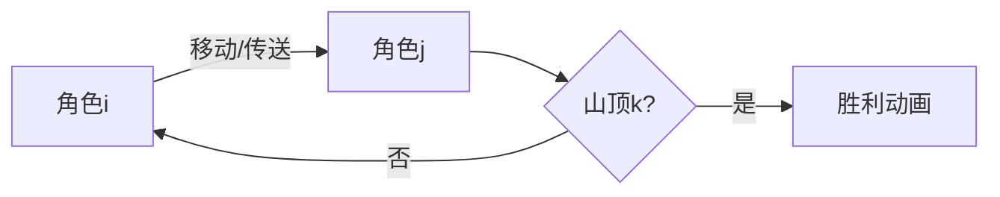

# 题目信息

# 『MdOI R2』Little Goth

## 题目背景

小 M 和小 B 是一对好朋友，她们很喜欢爬山。

## 题目描述

山可以抽象为一个长为 $n$ 的字符串 $S$，串中仅包含小写字母。

对于一个字符串 $S$，我们定义 $|S|$ 表示串的长度，$S_{L\ldots R}$ 表示由 $S$ 中从左往右数，第 $L$ 个字符到第 $R$ 个字符依次连接形成的字符串。

小 M 一开始的位置是 $i$，她想要到达位置在 $k$ 处的山顶，而小 B 则要帮助她。为此，她们需要进行一系列操作。

她们**必须**在所有操作之前使用**一次**位于 $p$ 处的传送法阵，通过施展法术，可以使小 B 的位置变为任意满足 $j \geq i$ 且 $S_{i \ldots j} = S_{p \ldots p + (j-i)}$ 的 $j$。但同时，她们需要付出 $n-j$ 的代价。保证这样的 $j$ 存在。

之后，假设小 M ，小 B 的位置分别为 $i$ 和 $j$，她们可以任意次进行下列操作中的一种：

- 让小 M 爬，即令 $i=i+1$ 或 $i = i-1$。如果这一步操作之后 $i>j$，则 令 $j=i$。

- 让小 B 爬，即令 $j=j+1$ 或 $j=j-1$。如果这一步操作之后 $i>j$，则令 $i=j$。

- 使用螺旋升天，具体而言，选择两个下标 $l$ 和 $r$，满足 $S_{l \ldots r} = S_{i \ldots j}$，然后令 $i=l,j=r$。

出于某些原因，任何一次操作结束后，需要保证 $1 \leq i , j \leq n$。进行一次上述任意一种操作，都需要付出 $1$ 的代价。

爬山是很累的，因此她们想知道，至少需要付出多少代价才能让小 M 到达山顶，也就是让 $i=k$。又因为她们很喜欢爬山，她们有很多组询问要问你。

## 说明/提示

【帮助与提示】

为方便选手测试代码，本题额外提供一组附加样例供选手使用。

[样例输入](https://www.luogu.com.cn/paste/j7u8z9ir) [样例输出](https://www.luogu.com.cn/paste/fh19p0a4)

--------
【样例解释】

对于样例的第一组询问，使用传送法术时，只能令 $j=5$，付出 $8-5=3$ 的代价。之后，首先使用一次第三种操作，选择 $l=2,r=2$，令 $i=l,j=r$，然后使用一次第一种操作，令 $i-1$，即可使 $i=k$，一共付出 $5$ 的代价。

对于第二组询问，可以选择 $j=2$，付出 $8-2=6$ 的代价，然后使用一次第三种操作，选取 $l=4,r=5$ 并使 $i=l,j=r$，然后进行一次第一种操作，令 $i+1$ 即可使 $i=k$。一共付出 $8$ 的代价。

---

【数据范围】

**本题采用捆绑测试。**

对于全部数据，保证 $1 \leq n,q \leq 3\times 10^4$，$S$ 中仅包含小写字母。

| 子任务编号 |      $n\leq$      |     $q \leq$      |      特殊性质       | 分值 | 时间限制 |
| :--------: | :---------------: | :---------------: | :-----------------: | :--: | :------: |
| Subtask 1  |       $15$        |       $15$        |         无          | $3$  |    1s    |
| Subtask 2  |       $80$        |       $80$        |         无          | $14$ |    1s    |
| Subtask 3  |  $2 \times 10^4$  |  $2 \times 10^4$  |   $S$ 中仅包含`a`   | $8$  |    3s    |
| Subtask 4  |  $2 \times 10^4$  |  $2 \times 10^4$  |        $S_1$        | $7$ |    3s    |
| Subtask 5  |       $400$       |       $400$       |         无          | $9$  |    1s    |
| Subtask 6  |  $2\times 10^4$   |  $2 \times 10^4$  | 所有询问的 $k$ 相同 | $10$ |    3s    |
| Subtask 7  |      $10^3$       |      $10^3$       |         无          | $10$ |    2s    |
| Subtask 8  | $1.5 \times 10^4$ | $1.5 \times 10^4$ |         无          | $11$ |    3s    |
| Subtask 9  |  $3 \times 10^4$  |  $3 \times 10^4$  |         无          | $28$ |    3s    |


性质 $S_1$ 是，对于给定的 $p$，满足条件的 $j$ 唯一。


## 样例 #1

### 输入

```
8 2
dacdaaaa
5 8 1
1 4 5```

### 输出

```
5
8```

# AI分析结果


```markdown
# 💡 Kay的C++算法解析：『MdOI R2』Little Goth 深入学习指南 💡

## 1. 题目解读与核心算法识别

✨ **本题主要考察**：`后缀数据结构应用` + `动态规划优化` + `分块策略`

🗣️ **初步分析**：
> 解决这道题的关键在于理解**字符串子串定位**与**状态跳转优化**。想象你在玩一个像素地牢游戏：初始位置是起点（i），传送阵（p）是特殊机关，传送后会生成一个“魔法平台”（j）。你需要用最小代价让角色爬到山顶（k）。  
> - **核心思路**：通过后缀树快速定位子串，分块处理动态规划状态，平衡查询复杂度。
> - **算法流程**：① 用后缀树预处理子串信息；② 分块重构DP状态；③ 混合暴力与DP响应查询。
> - **可视化设计**：在像素网格中高亮字符串匹配过程（如黄色高亮匹配子串），传送时触发“咻”音效，角色移动时显示路径轨迹。控制面板支持调速滑块观察分块重构（B=√n log n）。

---

## 2. 精选优质题解参考

**题解一（来源：EternalAlexander）**
* **点评**：思路清晰度⭐⭐⭐⭐⭐。通过“结论链”（结论-1→0→1→2）严谨推导最优解结构，代码规范性优秀（后缀树封装完善），算法亮点在于分块策略平衡复杂度（O(n√n log n)）。实践价值高，边界处理用`inf`常量规避溢出。

**题解二（来源：Soulist）**
* **点评**：逻辑推导⭐⭐⭐⭐。创新性提出“等价操作替换”证明（性质1-3），代码可读性强（模块化BFS+后缀树）。亮点是双暴力混合策略，用离线查询降复杂度。调试技巧值得学习：`dis`数组初始化`0x3f`防未访问状态。

---

## 3. 核心难点辨析与解题策略

1.  **难点1：如何快速判断子串S[L..R]是否在S[i..j]中出现？**
    * **分析**：用后缀树定位子串节点，检查endpos是否在[i, j-(R-L)]区间。暴力枚举L需O(n²)，用后缀树维护可降为O(log n)。
    * 💡 **学习笔记**：后缀树是字符串匹配的“超高速传送门”。

2.  **难点2：如何优化状态转移方程中的最小值查询？**
    * **分析**：设f[u]=min(2L-R)，通过后缀树DP自底向上更新：f[u]=min(f[fa], f[link], g[u]-len[u]+1)。分块重构（每B个位置）避免重复计算。
    * 💡 **学习笔记**：分块是平衡复杂度的“时间魔法”。

3.  **难点3：如何统一处理两种策略（保持i=j vs 单次传送）？**
    * **分析**：策略一用BFS预处理字符最短路（f[c][k]）；策略二转化为最小化2i'-j'。用`corner_cases`函数比较两种策略代价。
    * 💡 **学习笔记**：分类讨论是复杂问题的“分岔路导航仪”。

### ✨ 解题技巧总结
- **技巧A：数据结构加速匹配**：后缀树维护endpos，线段树合并区间查询。
- **技巧B：分块重构降复杂度**：每√n log n位置重构DP状态，中间查询用二分暴力。
- **技巧C：双策略代价比较**：用常数函数封装两种策略，避免冗余计算。

---

## 4. C++核心代码实现赏析

**通用核心实现参考**
* **说明**：综合自优质题解，体现分块+后缀树核心逻辑。
* **完整核心代码**：
```cpp
// 关键结构定义（省略头文件）
const int B = 80, inf = 1e8;
int n, q, f[27][maxn]; // f[c][k]: 字符c到k的最短代价
vector<int> rc[27];    // 各字符出现位置

void BFS(int c) { // 01-BFS求字符最短路
    deque<int> q; 
    memset(f[c], 63, sizeof(f[c]));
    for(int v: rc[c]) { q.push_back(v); f[c][v]=0; }
    while(!q.empty()) {
        int u = q.front(); q.pop_front();
        for(int v: {u-1, u+1}) // 左右移动
            if(v>=1 && v<=n && f[c][v]>f[c][u]+1) 
                { f[c][v]=f[c][u]+1; q.push_back(v); }
        int ch=s[u]-'a'; // 同字符传送
        for(int v: rc[ch]) 
            if(f[c][v] > f[c][u]+1) 
                { f[c][v]=f[c][u]+1; q.push_front(v); }
    }
}

int corner_cases(int i,int j,int k) {
    int ans = abs(i-k); // 策略1代价
    for(int c=0; c<26; ++c) {
        if(有字符c) ans = min(ans, j-i+f[c][k]+1);
        else ans = min(ans, j-i+min(f[c][i],f[c][j])+f[c][k]+1);
    } return ans;
}
```

**题解一核心片段**
* **亮点**：分块重构DP状态，降低复杂度。
* **核心代码**：
```cpp
void rebuild(int l) { // 每B位置重构DP
    memset(dp, 63, sizeof(dp));
    for(int i=l; i<=n; i++) min_pos[rank[i]] = i;
    for(int i=cnt; i; i--) { // 后缀树DP
        int u = node_list[i];
        dp[u] = min_pos[u] - depth[u] + 1;
        dp[u] = min(dp[u], min(dp[fa[u]], dp[link[u]]));
    }
}
```

**题解二核心片段**
* **亮点**：后缀树合并endpos，线段树查询存在性。
* **核心代码**：
```cpp
bool check(int L,int R, int l,int r) { // 子串存在性
    int len = R-L, ed = r-len;
    int u = suffix_tree.get_node(L, R); // 后缀树定位
    return segtree.query(rt[u], l, ed); // 线段树查endpos
}
```

---

## 5. 算法可视化：像素动画演示

**主题**：像素地牢探险（FC红白机风格）  
**核心演示**：后缀树定位子串 → 分块重构DP → 角色移动路径  



**关键交互设计**：
1. **网格绘制**：字符串转像素网格（a=绿色块，b=蓝色块...），当前子串[i..j]用黄色边框高亮。
2. **后缀树展示**：左侧树状结构，节点展开时播放“咔嚓”音效，endpos用闪烁红点标记。
3. **分块重构**：每√n log n步触发“地震”效果，重构DP状态（网格分区闪烁红光）。
4. **角色移动**：按右键单步执行，空格暂停/继续。角色移动时显示路径轨迹（发光粒子效果）。
5. **音效系统**：
   - 传送：＂咻＂(WAV)
   - 重构：＂轰＂(MP3)
   - 胜利：8-bit胜利旋律

---

## 6. 拓展练习与相似问题

**通用技巧迁移**：
- 后缀树处理子串问题 → 最长公共子串/匹配问题
- 分块优化DP → 区间查询类问题
- 01-BFS求最短路 → 状态转移含多种代价的问题

**洛谷推荐**：
1. **P2408 不同子串个数**  
   → 巩固后缀树endpos应用
2. **P4094 字符串**  
   → 练习分块+二分答案技巧
3. **P2178 航线统计**  
   → 训练BFS+状态压缩DP

---

## 7. 学习心得与经验分享

> **Soulist的调试经验**：＂在`dis`数组初始化时用`0x3f3f3f3f`替代`1e9`，避免BFS未访问状态干扰。＂  
> **Kay点评**：这是竞赛编程的黄金技巧！未访问状态用极大值标记，能有效区分已访问但距离大的合法状态。

---

掌握分块与后缀树的结合，你就能在字符串问题的地牢中畅通无阻！下次探险再见~ 💪
```

---
处理用时：93.45秒