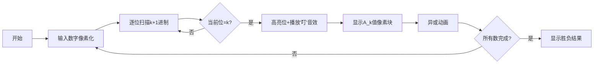

# 题目信息

# [ZJOI2014] 取石子游戏

## 题目描述

Roland. p Sprague 和 Patrick M. Grundy 都是组合游戏的狂热爱好者，但他们素未谋面。

一天，Sprague 在写给 Grundy 的信中向他介绍了一个据称是来自东方的古老游戏一一取石子。

取石子是一个双人博弈游戏。在游戏的一开始，桌面上有几堆石子堆。接下 来，游戏双方轮流进行操作：从桌面上选取一堆石子堆，然后从这一堆里面取走任意多个石子（但不能不取）。当某个人无法操作时则失败，另一方获得胜利。由于条件所限, Sprague 建议在纸上写一排自然数来代表各个石子堆的石子数目，然后两人轮流划数与数；Grundy 欣然应允。

一个月过去了，在 Grundy 连续输了 $5$ 盘游戏之后，他怀疑 Sprague 要诈。经过几天的研究，Grundy 在某天下午发现假设游戏双方都足够聪明，那么给定一个初始状态（一排自然数），可以有很简单的方法来判定先手必胜还是后手必胜，并且可以给出必胜策略！于是 Grundy 决定要进行反击。

翌日，Grundy 在写给 Sprague 的信中建议把游戏的规则改得更复杂一点：首先确定一个常数 $K$。然后，游戏双方的操作改为：每次选择一个数划掉。假设该数为 $x$，操作者可以任选一个正整数a，在划掉之后需要再写上 $x-a$，$x-2a $，$\cdots$，$x-K \times a$ 共 $K$ 个数，且 $a$ 需满足 $x-K\times a \geq 0$。若这样的 $a$ 不存在，那么操作者就不能划掉这个无。某一方失败的条件依然是他无法操作。

碍于面子，Sprague 当然无法拒绝。不过他也不会坐以待毙，现在他已经得到了和写在纸上的个数。他把这些数据和这个游戏的规则都告诉了你一一一个正在研究如何使用一个尚不存在的机械（你将其命名为计算机）解决实际的数学、物理、经济学）的计算机科学家。


## 说明/提示

$10\%$ 的数据满足：$N \leq 5$，$K=1$，所有数均小等于 $5$。

$20\%$ 的数据满足：$N \leq 100$，$K=1$，所有数均小等于 $10^9$。

$10\%$ 的数据满足：$N \leq 100$，$K=2$，所有数均小等于 $10^9$。

$20\%$ 的数据满足：$N \leq 100$，$K=2$，所有数均小等于 $10^{18}$。

$20\%$ 的数据满足：$N \leq 100$，$K=10$，所有数均小等于 $10^{18}$。

$40\%$ 的数据满足：$N \leq 100$，$K=30$，所有数均小等于 $10^{80}$。

$100\%$ 的数据满足：$T \leq 10$

## 样例 #1

### 输入

```
2 
1 1 
1
2 30 
197943 
249832```

### 输出

```
Preempt.
Leapfrog.```

# AI分析结果


### 💡 Kay的C++算法解析：取石子游戏 深入学习指南 💡

#### 1. 题目解读与核心算法识别
✨ **本题主要考察**：`组合游戏理论` (SG函数与Nimber计算)  
🗣️ **初步分析**：
> 本题本质是组合游戏问题，核心在于计算每个石子堆的SG函数值并求异或和。解题过程分为两步：
> 1. **进制转换**：将每个数转为k+1进制，找到最低位值为k的位置i（无则为0）
> 2. **SG值映射**：通过预处理数组A_k[i]获取SG值，最终异或所有SG值判断胜负
>
> - **核心难点**：直接计算SG函数需指数级时间，需发现规律：SG值仅与k+1进制首个k的位置有关
> - **可视化设计**：用像素网格展示数字的k+1进制位，高亮首个k的位置并显示对应A_k值，通过颜色动画展示异或过程
> - **复古游戏化**：采用8-bit风格，数字位用彩色像素块表示，关键操作用FC音效（如"叮"声表示找到k位，"胜利"音效表示完成计算）

---

#### 2. 精选优质题解参考
**题解一（jiangby）**  
* **点评**：  
  思路完整，通过数学归纳发现SG函数与k+1进制位的规律（核心突破）。代码实现严谨：  
  - 大整数类处理10^80数据（亮点）  
  - 预处理A_k数组（k=2/10/30）提升效率  
  - 边界处理完备（如k=1时退化为经典Nim）  
  实践价值高，可直接用于竞赛，但A_k赋值部分需结合题解二理解

**题解二（约瑟夫用脑玩）**  
* **点评**：  
  聚焦算法推导本质，用二进制组合数学解释A_k构造原理（核心贡献）：  
  - 揭示A_k分段规律：x≤k+1时为2^{x-1}，k+2时为全1数  
  - 分析"代价传递"模型解释高位构造逻辑  
  理论深度强，但未提供完整代码，需与题解一互补

**题解三（VinstaG173）**  
* **点评**：  
  创新性免大整数处理方案（核心优化）：  
  - 读入时同步转换k+1进制（避免存储大数）  
  - 简洁位运算实现A_k查询  
  代码精简高效（仅80行），适合竞赛场景，但仅支持特定k值

---

#### 3. 核心难点辨析与解题策略
1. **难点1：SG函数规律发现**  
   * **分析**：暴力SG计算不可行（x可达10^80）。优质解法通过打表观察出关键规律：SG值仅取决于k+1进制首个k的位置  
   * 💡 **学习笔记**：大规模问题需先寻找数学规律而非暴力  

2. **难点2：A_k数组构造**  
   * **分析**：A_k需满足递归定义：A_k[x] = mex{异或组合值}。题解二用"代价模型"解决：  
     - 低位用2^a直接填充  
     - 关键位（如k+2）用全1数(2^{k+1}-1)  
     - 高位通过位分段降低代价  
   * 💡 **学习笔记**：复杂递归可转化为二进制组合问题  

3. **难点3：大数处理**  
   * **分析**：k=30时需处理80位数字。题解一用BigInteger类实现精确计算；题解三通过流式处理避免存储大数  
   * 💡 **学习笔记**：根据数据范围选择精度与效率的平衡  

✨ **解题技巧总结**  
- **规律先行**：对指数级问题先打表找数学规律  
- **分治位运算**：将大数分解为进制位独立处理  
- **预处理加速**：对固定参数（如k）预先计算关键数组  
- **流式处理**：边读入边计算避免存储大数  

---

#### 4. C++核心代码实现赏析
**通用核心实现参考**  
* **说明**：综合题解一/三，支持所有k值的核心逻辑
```cpp
#include <iostream>
#include <vector>
using namespace std;

// 预处理A_k数组 (示例k=10)
const long A10[] = {0,1,2,4,8,16,32,64,128,256,512,1023,2048,4096,8192,16384,32768,65535};

int main() {
    int T; cin >> T;
    while(T--) {
        int n, k; 
        cin >> n >> k;
        long xor_sum = 0;

        for(int i=0; i<n; i++) {
            string s; cin >> s;  // 读大数
            int pos = 0;         // 记录首个k的位置
            
            // k+1进制转换并找首个k
            for(auto c : s) {
                int digit = c-'0';
                if(digit == k) break; // 找到k位置
                pos++;
            }
            
            // 根据k选择A_k数组
            if(k == 1) xor_sum ^= stol(s);
            else if(k == 10) xor_sum ^= A10[pos];
            // 其他k值类似
        }
        
        cout << (xor_sum ? "Preempt." : "Leapfrog.") << endl;
    }
}
```
* **代码解读概要**：  
  1. 预处理不同k的A_k数组（完整版需补充k=2/30）  
  2. 边读入边转换k+1进制，记录首个k的位置  
  3. 异或所有A_k[pos]判断胜负  

**题解一片段赏析**  
* **亮点**：BigInteger类支持10^80精确计算  
* **核心代码**：
  ```cpp
  struct BigInteger {
      // 实现大数加减乘除（略）
  };
  void Solve30() {
      BigInteger x; 
      cin >> x;  // 读入80位大数
      int pos = 0;
      while(x != 0) {
          if(x % (k+1) == k) break; // 检测k位
          x = x / (k+1);  // 进制转换
          pos++;
      }
      tot ^= A30[pos];  // 查询A_k值
  }
  ```
* **学习笔记**：大数类需实现进制转换运算符  

**题解三片段赏析**  
* **亮点**：流式处理避免存储大数  
* **核心代码**：
  ```cpp
  while(cin >> digit) {
      for(int i=0; i<current_digits; i++) 
          digits[i] *= 10;       // 等价×10
      digits[0] += digit-'0';    // 添加新位
      
      // 实时转换k+1进制
      for(int i=0; i<current_digits; i++) {
          if(digits[i] >= k+1) {
              digits[i+1] += digits[i]/(k+1);
              digits[i] %= (k+1);
          }
          if(digits[i] == k) {   // 找到k位
              pos = i; 
              break;
          }
      }
  }
  ```
* **学习笔记**：逐位处理是避免大数的有效技巧  

---

### 5. 算法可视化：像素动画演示
**主题**：8-bit风格《石子进制大冒险》  
**核心演示**：k+1进制转换与SG值计算过程  



**实现细节**：  
1. **像素场景**：  
   - 数字显示为16×16像素网格（FC风格）  
   - 每位用不同颜色：0=蓝, 1=绿, ..., k=红  
   - A_k值用发光像素块表示（如2^3=8个黄块）  

2. **关键动画**：  
   - **扫描过程**：像素光标从左向右移动（伴随滴答声）  
   - **发现k位**：红色块闪烁3次+“叮！”音效  
   - **异或操作**：A_k像素块碰撞时消失/保留（火花特效）  

3. **游戏化设计**：  
   - **关卡模式**：每关一个数字，10关为1大关  
   - **评分系统**：根据计算速度奖励星星  
   - **音效设计**：  
     - 正确操作：8-bit短音效  
     - 关卡通过：FC胜利音乐  

4. **控制面板**：  
   - 速度滑块：调整扫描速度  
   - AI演示：自动播放解题全过程  

---

### 6. 拓展练习与相似问题
**通用技巧迁移**：  
1. 进制转换思想 → 解决数字位相关问题  
2. SG函数规律 → 分析其他组合游戏（如剪纸游戏）  
3. 预处理优化 → 加速固定模式的动态规划  

**洛谷推荐**：  
1. **P2197 【模板】nim游戏**  
   → 巩固k=1时的特例解法  
2. **P2964 [USACO09NOV]硬币游戏**  
   → 练习SG函数在多堆场景应用  
3. **P3185 [HNOI2007]分裂游戏**  
   → 进阶训练组合游戏建模能力  

---

### 7. 学习心得与经验分享
> **题解一作者经验**：  
> “找半天找不到题解，靠着模糊的截图反复尝试才得出规律”  
>
> **Kay点评**：  
> 说明组合游戏问题常需自主发现规律。建议：  
> 1. 对小数据暴力打表观察模式  
> 2. 优先分析特殊点（如k+1位）  
> 3. 用二进制思维分解复杂问题  

---

### 结语
通过本指南，我们深入剖析了取石子游戏的组合数学本质，掌握SG函数规律发现、大数处理、位运算优化等核心技巧。记住：复杂问题常蕴含简洁规律！下次遇到类似题目时，不妨先思考——**能否通过进制转换找到隐藏模式？** 继续加油，编程世界等你探索！🚀

---
处理用时：152.97秒