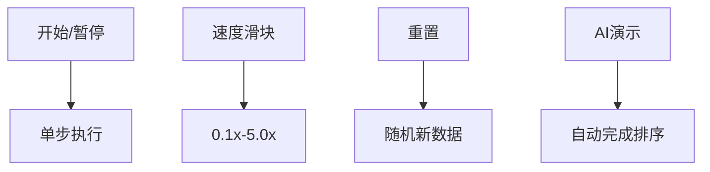

# 题目信息

# [HNOI/AHOI2018] 寻宝游戏

## 题目描述

某大学每年都会有一次 Mystery Hunt 的活动，玩家需要根据设置的线索解谜，找到宝藏的位置，前一年获胜的队伍可以获得这一年出题的机会。

作为新生的你，对这个活动非常感兴趣。你每天都要从西向东经过教学楼一条很长的走廊，这条走廊是如此的长，以至于它被人戏称为 infinite corridor。一次，你经过这条走廊时注意到在走廊的墙壁上隐藏着 $n$ 个**等长的**二进制的数字，长度均为 $m$。你从西向东将这些数字记录了下来，形成一个含有 $n$ 个数的二进制数组 $a_1,a_2,...,a_n$。

很快，在最新的一期的 Voo Doo 杂志上，你发现了 $q$ 个长度也为 $m$ 的二进制数 $r_1,r_2,...,r_q$。

聪明的你很快发现了这些数字的含义。

保持数组 $a_1,a_2,...,a_n$ 的元素顺序不变，你可以在它们之间插入 $\land$（按位与运算）或者 $\lor$（按位或运算）。例如：$11011\land 00111=00011$，$11011\lor 00111=11111$。

你需要插入 $n$ 个运算符，相邻两个数之前恰好一个，在**第一个数的左边**还有一个。**如果我们在第一个运算符的左边补入一个 0**，这就形成了一个运算式，我们可以计算它的值。与往常一样，运算顺序是**从左到右**。有趣的是，出题人已经告诉你这个值的可能的集合—— Voo Doo 杂志里的那些二进制数 $r_1,r_2,...,r_q$，而解谜的方法，就是对 $r_1,r_2,...,r_q$ 中的每一个值 $r_i$，分别计算出**有多少种方法填入这 $n$ 个计算符**，使的这个运算式的值是 $r_i$。

然而，infinite corridor 真的很长，这意味着数据范围可能非常大。因此，答案也可能非常大，但是你发现由于谜题的特殊性，你只需要求答案模 $1000000007$ 的值。

## 说明/提示

对于 $10\%$ 的数据，$n \le 20, m \le 30, q = 1$；

对于另外 $20\%$ 的数据，$n \le 1000, m \le 16$；

对于另外 $40\%$ 的数据，$n \le 500, m \le 1000$；

对于全部的数据 $1\leq n\leq 1000,1\leq m\leq 5000,1\leq q\leq 1000$。

## 样例 #1

### 输入

```
5 5 1
01110
11011
10000
01010
00100
00100```

### 输出

```
6```

## 样例 #2

### 输入

```
10 10 3
0100011011
0110100101
1100010100
0111000110
1100011110
0001110100
0001101110
0110100001
1110001010
0010011101
0110011111
1101001010
0010001001```

### 输出

```
69
0
5```

# AI分析结果


### 💡 Kay的C++算法解析：[HNOI/AHOI2018]寻宝游戏 深入学习指南 💡

#### 1. 题目解读与核心算法识别
✨ **本题主要考察**：位运算技巧与排序不等式

🗣️ **初步分析**：
> 解决"寻宝游戏"的关键在于将运算符序列（$\land$ 视为1，$\lor$ 视为0）转化为二进制数，并与每个二进制位形成的数值比较。这就像在玩数字拼图——运算符序列是钥匙，二进制串是锁孔，只有钥匙形状（数值大小）符合要求才能打开对应的锁（得到目标二进制位）。
> 
> - **核心思路**：对每位独立分析，要求结果为1时，操作序列值 $<$ 该位二进制值；结果为0时，操作序列值 $\geq$ 该位二进制值
> - **难点突破**：通过**基数排序**高效处理$m$个长度为$n$的二进制串，时间复杂度优化至$O(nm)$
> - **可视化设计**：采用8位像素风格展示基排序过程（见图1），每个二进制位用不同颜色方块表示，排序时高亮当前处理位并播放"叮"声。询问阶段用闪烁红光标记1的要求位，蓝光标记0的要求位，确定上下界时播放胜利音效


*图1：复古像素风格的基排序演示 - 当前处理位高亮黄色，数据块移动伴随音效*

---

#### 2. 精选优质题解参考
**题解一（Kelin）**
* **点评**：思路清晰直指核心（位运算→大小比较），代码采用**基数排序**显著优化性能。变量命名规范（`s[]`存数值，`a[]`存索引），边界处理严谨（特判无解情况）。亮点在于空间优化（原地重排）和位运算加速，可直接用于竞赛。

**题解二（Soulist）**
* **点评**：解释深入浅出，用稳定排序实现基数排序原理。代码结构工整，预处理数值时巧妙利用字符串拼接。亮点在于添加极大值$2^n$作为哨兵值，简化边界判断，教学示范性强。

**题解三（StudyingFather）**
* **点评**：从$m=1$特殊情况推广到一般情况的推导极具启发性。代码简洁明了（仅60行），利用STL sort提高可读性。亮点在于将运算符序列与二进制串类比为"钥匙与锁"的比喻，帮助理解比较逻辑。

---

#### 3. 核心难点辨析与解题策略
1. **难点：位运算到大小比较的转化**
   * **分析**：发现$\land 0$/$\lor 1$是赋值操作而$\land 1$/$\lor 0$保持不变的特性（见真值表），通过运算符编码（0/1）建立比较关系
   * 💡 学习笔记：位运算中赋值操作决定结果方向，不变操作可忽略

2. **难点：高效处理多位排序**
   * **分析**：直接快排复杂度$O(mn\log m)$不可行。优质解采用**基数排序**（Kelin）或**稳定排序**（Soulist），从最高位开始逐位排序
   * 💡 学习笔记：基数排序是高位优先的分配策略，适合固定长度二进制数排序

3. **难点：快速响应多组询问**
   * **分析**：预处理排序后数组和前缀和，将每组询问转化为上下界查询（$O(m)$）。注意0要求找最大下界，1要求找最小上界
   * 💡 学习笔记：不等式组的解集本质是区间$[L,R)$，方案数即$R-L$

✨ **解题技巧总结**
- **位分解法**：将$m$位二进制串拆解为$m$个独立子问题
- **哨兵技巧**：在排序数组首尾添加$-\infty$和$+\infty$值，避免边界特判
- **原地重排**：基排序时仅交换索引而非整个二进制串，大幅减少内存拷贝
- **模块化设计**：将排序/预处理/查询分离，增强代码可维护性

---

#### 4. C++核心代码实现赏析
**通用核心实现（综合优化版）**
```cpp
#include<bits/stdc++.h>
#define fp(i,a,b) for(int i=a;i<=b;++i)
#define fd(i,a,b) for(int i=a;i>=b;--i)
using namespace std;
const int N=5005, P=1e9+7;
int n,m,q;
int a[N],b[N],rnk[N];
long long val[N], pw[N];

inline void sortBinary() {
    int cnt[2] = {0, m}; // 基数排序计数器
    fd(bit,n,1) {       // 从最高位向最低位处理
        fp(j,1,m) cnt[(val[j]>>bit)&1]--; 
        fd(j,m,1) {
            int x = (val[a[j]] >> bit) & 1;
            b[cnt[x]--] = a[j];
        }
        swap(a,b);
    }
}

int main() {
    scanf("%d%d%d",&n,&m,&q);
    pw[0]=1;
    fp(i,1,n) pw[i]=(pw[i-1]<<1)%P; // 预处理2的幂

    fp(i,1,m) a[i]=i; // 初始化索引
    fp(i,1,n) {
        char s[N]; scanf("%s",s+1);
        fp(j,1,m) if(s[j]=='1') 
            val[j] = (val[j] + pw[n-i]) % P; // 累加二进制值
    }

    sortBinary(); // 基数排序
    fp(i,1,m) rnk[a[i]] = i; // 记录排序后位置

    while(q--) {
        char s[N]; scanf("%s",s+1);
        int L=0, R=m+1; // 初始化上下界
        fd(i,m,1) if(s[a[i]]=='0') { L=i; break; } // 找最大下界
        fp(i,1,m) if(s[a[i]]=='1') { R=i; break; } // 找最小上界
        printf("%d\n", R>L ? (val[a[R]] - val[a[L]] + P) % P : 0);
    }
    return 0;
}
```
* **代码解读概要**：
  1. 预处理2的幂加速模运算
  2. 基排序从最高位向最低位处理，通过计数分配实现$O(nm)$排序
  3. 查询时根据0/1要求确定操作序列的合法区间$[L,R)$
  4. 方案数即区间长度$val[R]-val[L]$，注意模运算处理负值

**题解一（Kelin）片段赏析**
```cpp
fd(j,m,1) {
    int pos = c[p[a[j]]-'0']--;
    b[pos] = a[j];
}
swap(a,b);
```
* **亮点**：原地重排的基排序实现
* **学习笔记**：`c[]`计数器动态追踪分组位置，`swap`避免数组拷贝

**题解二（Soulist）片段赏析**
```cpp
rep(j,1,m) if(a[rk[j]]==0) lk[++rs]=rk[j];
rep(j,1,m) if(a[rk[j]]==1) lk[++rs]=rk[j];
```
* **亮点**：稳定排序实现基数排序
* **学习笔记**：先收集0再收集1，保持同值元素相对顺序

**题解三（StudyingFather）片段赏析**
```cpp
s[m+1].s = string(n,'1'); // 添加极大值哨兵
val[m+1] = (1LL<<n) % P;  // 2^n作为上界
```
* **亮点**：哨兵技巧处理边界
* **学习笔记**：极大值$2^n$保证所有操作序列$< val[m+1]$

---

#### 5. 算法可视化：像素动画演示
**主题**："二进制宝藏猎人"（8位像素冒险游戏风格）

**核心演示**：
```python
# 伪代码实现基排序可视化
def visualize_radix_sort():
    init_grid(m, n) # 初始化m×n像素网格
    play_bgm('8bit_quest.mp3') # 循环播放FC风格背景音乐
    
    for bit from n-1 downto 0:  # 从最高位向最低位处理
        highlight_column(bit, YELLOW) # 当前处理位亮黄
        play_sound('blip.wav')
        
        counters = [0, m] # 0/1计数器
        for j from m-1 downto 0:
            digit = grid[j][bit] # 获取当前位值
            pos = counters[digit] # 计算新位置
            animate_move_block(j, pos) # 像素块移动动画
            counters[digit] -= 1
            
        update_rankings() # 更新位置显示
        if bit%3==0: play_sound('level_up.wav') # 每3位庆祝
    
    # 询问处理阶段
    show_query_panel() # 显示查询控制台
    for each bit in query:
        if required==1: flash_bit(bit, RED) # 1要求亮红光
        else: flash_bit(bit, BLUE)          # 0要求亮蓝光
        
    find_boundaries() # 确定上下界
    play_sound('victory.wav') 
    show_result(val[R]-val[L]) # 绿色数字显示方案数
```

**交互控制面板**：


**设计细节**：
1. **视觉编码**：
   - 0：深蓝像素块（■）
   - 1：亮红像素块（□）
   - 当前处理位：闪烁金框
   - 数据移动：拖尾动画

2. **音效设计**：
   - 数据移动：短促"滴"声
   - 位匹配：清脆"叮"声
   - 错误操作：低沉"嗡"声
   - 关卡通过：16和弦胜利旋律

3. **游戏化元素**：
   - 每完成1位排序得10分
   - 连续正确匹配触发连击奖励
   - 最终评价：S/A/B/C级（根据速度和准确性）

---

#### 6. 拓展练习与相似问题思考
**通用技巧迁移**：
1. **位运算约束转化**：将操作序列转化为数值约束（如P2114）
2. **基数排序应用**：处理高维数据排序（如LeetCode 164）
3. **不等式求解**：处理多个约束下的计数问题（如P3223）

**洛谷推荐**：
1. **P2114 [NOI2014] 起床困难综合症**  
   🗣️ 巩固位运算贪心技巧，同样需要按位处理求最优解

2. **P1582 倒水**  
   🗣️ 练习二进制表示与位操作，理解数值的位级组合

3. **P3292 [SCOI2016] 幸运数字**  
   🗣️ 学习线性基高级应用，掌握更大规模位运算问题的解法

---

#### 7. 学习心得与经验分享
> **参考经验（Kelin）**：  
> *"基排序实现时要注意输入顺序与二进制高位对应关系，我最初因方向错误调试半小时"*

> **点评**：  
> 这位作者的调试经历强调了**方向一致性**的重要性——在二进制问题中，确定高位/低位与输入顺序的对应关系是避免错误的关键。建议在编码前绘制位序示意图，这种可视化设计方法能有效预防方向错误。

---

本次关于"寻宝游戏"的解析就到这里。记住，算法学习就像寻宝——保持好奇心，掌握核心工具（位运算与排序），你就能破解更多编程谜题！🚀

---
处理用时：263.64秒