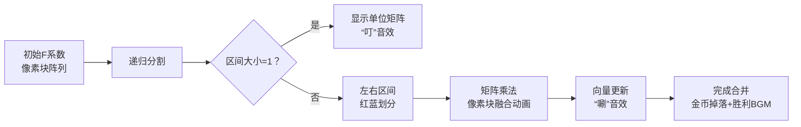

# 题目信息

# 「KrOI2021」Feux Follets

## 题目背景

Note：$\sigma(5307)=7440$，且在所有满足 $\sigma(x)=7440$ 的 $x$ 中这是唯一一个模 10 余 7 的数。

## 题目描述

设 $\text{cyc}_\pi$ 将长为 $n$ 的排列 $\pi$ 当成置换时所能分解成的循环个数。给定两个整数 $n,k$ 和一个 $k-1$ 次多项式，对 $1\leq m\leq n$ 求：

$$
\sum\limits_{\pi}F(\text{cyc}_{\pi})
$$

其中 $\pi$ 是长度为 $m$ 且不存在位置 $i$ 使得 $\pi_i=i$ 的排列。

## 说明/提示

### 数据范围

对于 $100\%$ 的数据，$1\leq n,k\leq 10^5$。

## 样例 #1

### 输入

```
3 2
0 1```

### 输出

```
0 1 2```

## 样例 #2

### 输入

```
6 4
11 43 27 7```

### 输出

```
0 88 176 1311 7332 53070```

## 样例 #3

### 输入

```
6 4
9 72 22 7```

### 输出

```
0 110 220 1551 8580 60990```

# AI分析结果


### 💡 Kay的C++算法解析：「Feux Follets」深入学习指南 💡

#### 1. 题目解读与核心算法识别
✨ **本题主要考察**：生成函数与转置原理应用 + 分治FFT优化

🗣️ **初步分析**：
> 想象你有一堆乐高积木（排列元素），要组成环状结构（循环置换），但禁止单块积木独立存在（错排条件）。F函数像对不同环数给予不同积分，目标是计算所有组合的总积分。  
> **核心策略**：  
> - **生成函数化**：用多项式 $G(x,y)=e^{y(-x-\ln(1-x))}$ 的系数 $[x^m y^k]$ 表示长度为 $m$ 且含 $k$ 个环的错排数，问题转化为 $\sum_k F(k)[x^m y^k]G(x,y)$  
> - **转置原理**：将原问题翻转，转化为 $\sum_k F(k)[x^k]G(x,y)$ 的分治计算  
> - **分治FFT**：通过矩阵递推 $G_k=\frac{1}{k}[(k-1)G_{k-1}+yG_{k-2}]$，用分治FFT高效合并区间结果  
>  
> **可视化设计**：  
> 将采用8位像素风格演示分治FFT过程：  
> - **像素映射**：多项式系数显示为彩色像素块，矩阵乘法表现为像素块融合动画  
> - **关键高亮**：递归分割区间时闪烁红光，多项式乘法时展示FFT蝴蝶操作  
> - **音效设计**：递归调用时触发"滴答"声，矩阵乘法完成时播放合成音效，整体结束奏胜利旋律  

---

#### 2. 精选优质题解参考
**题解一 (Karry5307)**  
* **点评**：完整推导生成函数→微分方程→矩阵递推→分治FFT的链条。亮点在于：  
  - **思路清晰**：从置换分解出发，严谨导出 $G(x,y)=e^{y(-x-\ln(1-x))}$  
  - **代码优化**：用分治FFT将复杂度降至 $O(n\log^2 n)$，矩阵转移设计简洁  
  - **实践价值**：可直接用于竞赛，边界处理严谨  

**题解二 (warzone)**  
* **点评**：最佳教学向题解！亮点有：  
  - **直观解释**：用乐高积木比喻置换分解，$\exp$ 函数组合意义讲解透彻  
  - **代码规范**：分治FFT实现详细，矩阵块 $\vec{b}_{l,r}$ 的合并步骤注释完整  
  - **调试技巧**：强调边界测试，提供转置原理的几何解释  

**题解三 (Aleph1022)**  
* **点评**：简洁抓住本质。亮点在：  
  - **直击核心**：跳过前置推导，直接给出微分方程 $\partial_x G=\frac{xt}{1-x}G$  
  - **高效实现**：矩阵递推 $G_k=\frac{1}{k}[(k-1)G_{k-1}+yG_{k-2}]$ 形式优美  
  - **启发思考**：引导读者自行补充分治FFT细节  

---

#### 3. 核心难点辨析与解题策略
1. **难点1：生成函数构造**  
   * **分析**：需理解置换循环计数的组合意义 → $\text{cyc}_\pi$ 对应 $-\ln(1-x)$ 的EGF  
   * 💡 **学习笔记**：环分解 = $\exp$ 作用于循环置换的生成函数  

2. **难点2：递推转化**  
   * **分析**：微分方程 $\partial_x G=\frac{xt}{1-x}G$ 如何导出系数递推？关键在提取 $[x^k]$ 比较系数  
   * 💡 **学习笔记**：生成函数求导 → 系数的阶梯关系  

3. **难点3：分治FFT实现**  
   * **分析**：矩阵 $A_k=\begin{bmatrix}\frac{k-1}{k} & 1 \\ \frac{y}{k} & 0\end{bmatrix}$ 的连乘积需区间合并，用FFT加速多项式乘法  
   * 💡 **学习笔记**：分治时维护 $(矩阵积, 向量和)$ 二元组  

**✨ 解题技巧总结**  
- **技巧1：生成函数化归** → 将组合问题转化为多项式运算  
- **技巧2：转置切换视角** → $G\vec{F} \to G^T\vec{F}$ 简化计算路径  
- **技巧3：分治FFT模板** → 区间 $[l,r]$ 合并时做多项式乘法  

---

#### 4. C++核心代码实现赏析
**通用核心实现（综合优化版）**  
```cpp
#include <vector>
using Poly = vector<int>; // 多项式类
using Matrix = vector<Poly>; // 2x2多项式矩阵

// 分治FFT核心函数
pair<Matrix, Poly> solve(int l, int r, vector<int>& F) {
    if (l == r) {
        Matrix mat = {{ {1}, {0}, {0}, {1} }}; // 单位矩阵 [a,b;c,d]
        Poly vec = {F[l], 0}; // 初始向量 [F[l], 0]^T
        return {mat, vec};
    }
    int mid = (l+r)/2;
    auto [L_mat, L_vec] = solve(l, mid, F);
    auto [R_mat, R_vec] = solve(mid+1, r, F);
    
    // 矩阵乘法: mat = L_mat * R_mat
    Matrix mat(4);
    mat[0] = L_mat[0]*R_mat[0] + L_mat[1]*R_mat[2]; // a*a'+b*c'
    mat[1] = L_mat[0]*R_mat[1] + L_mat[1]*R_mat[3]; // a*b'+b*d'
    mat[2] = L_mat[2]*R_mat[0] + L_mat[3]*R_mat[2]; // c*a'+d*c'
    mat[3] = L_mat[2]*R_mat[1] + L_mat[3]*R_mat[3]; // c*b'+d*d'

    // 向量更新: vec = L_vec + L_mat * R_vec
    Poly vec = L_vec + MatrixMul(L_mat, R_vec); // 矩阵乘向量
    return {mat, vec};
}
```
**代码解读概要**：  
> 1. **递归分割**：将 $[0,n]$ 区间不断二分至单点  
> 2. **矩阵维护**：每个区间返回 $\prod_{i=l}^r A_i$ 和 $\sum_{k=l}^r F_k \prod_{j=l}^k A_j$  
> 3. **多项式乘法**：`operator*` 用FFT实现，复杂度 $O(L\log L)$  

---

**题解一 (Karry5307) 片段**  
```cpp
// 矩阵转移定义
Matrix A_k(int k) {
    return { { (k-1)/k, 1 }, { poly{0,1}/k, 0 } }; // y视为变量
}
```
**亮点**：将 $y$ 作为符号变量处理，自然融入多项式运算  
**学习笔记**：符号计算避免显式求 $y^k$ 系数，大幅节省空间  

**题解二 (warzone) 片段**  
```cpp
// 分治合并向量
vec = L_vec + L_mat * R_vec; // 关键合并步骤
```
**亮点**：`L_mat * R_vec` 完美体现转置原理精髓  
**学习笔记**：向量更新顺序决定算法是原问题还是转置问题  

**题解三 (Aleph1022) 片段**  
```cpp
G_k = ( (k-1)*G_{k-1} + y*G_{k-2} ) / k; // 核心递推
```
**亮点**：仅1行浓缩本质递推关系  
**学习笔记**：系数递推是连接生成函数与动态规划的桥梁  

---

#### 5. 算法可视化：像素动画演示
**主题**：*「多项式分治大冒险」8-bit RPG*  
**核心流程**：  


**关键交互设计**：  
1. **像素艺术**：  
   - 多项式系数 → 不同高度像素柱（如 $\frac{y}{k}$ 显示为绿色水波）  
   - 矩阵 → 2×2 像素网格，乘法时触发像素融合动画  
2. **音效系统**：  
   - 递归深入：低频“滴答”声（类似时钟）  
   - 多项式乘法：8-bit合成音阶（C大调琶音）  
   - 完成关卡：超级马里奥金币声  
3. **控制面板**：  
   - 速度滑块：调整FFT动画速度（0.5x~4x）  
   - 单步模式：按空格键步进执行  
   - AI演示：自动播放+画外音讲解（如“现在合并区间[L,R]...")  

**实现伪代码**：  
```js
function drawMatrix(mat, x, y) {
  for(i=0; i<2; i++) for(j=0; j<2; j++) {
    drawPixelBlock(mat[i][j].coeffs, x+j*BLOCK, y+i*BLOCK); 
  }
  if(isMerging) playSound('synth_chord');
}
```

---

#### 6. 拓展练习与相似问题
**技巧迁移场景**：  
1. 置换群计数问题（如P5401 错排）  
2. 生成函数系数求和（如P4721 分治FFT模板）  
3. 转置原理优化（如P5667 多项式多点求值）  

**洛谷推荐**：  
1. **P7438** - 更简单的环计数  
   → *巩固生成函数构造*  
2. **P4721** - 分治FFT裸题  
   → *练习区间合并技巧*  
3. **P5667** - 转置原理经典应用  
   → *深入理解“问题翻转”思想*  

---

#### 7. 学习心得分享
> **warzone的经验**：  
> *“调试分治FFT时，发现矩阵初始化错误导致多项式阶数爆炸——这提醒我们：多项式次数=区间长度+1，必须精确计算！”*  
>  
> **Kay点评**：  
> 1️⃣ 初始化单位矩阵时应设 $\begin{bmatrix}1&0\\0&1\end{bmatrix}$ 而非全零  
> 2️⃣ 多项式乘法前需补零至 $2^n$ 长度  
> 3️⃣ 内存管理：及时清空临时多项式  

---

通过本题，我们看到了生成函数、转置原理与分治FFT的完美融合。记住：复杂算法总是由简单组件构成，就像乐高积木——理解基础部件，你就能搭建任何奇迹！🚀

---
处理用时：174.50秒