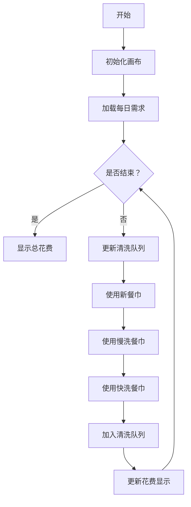

# 题目信息

# [BJWC2018] 餐巾计划问题

## 题目背景

**本题和网络流24题中的餐巾计划不为重题**

## 题目描述

一个餐厅在相继的 $n$ 天里，每天需用的餐巾数不尽相同。假设第 $i$ 天 $(i=1, 2, ..., n)$ 需要 $r_i$ 块餐巾。餐厅可以在任意时刻购买新的餐巾，每块餐巾的费用为 $p$ 。使用过的旧餐巾，则需要经过清洗才能重新使用。把一块旧餐巾送到清洗店A，需要等待 $m_1$ 天后才能拿到新餐巾，其费用为 $c_1$ ；把一块旧餐巾送到清洗店B，需要等待 $m_2$ 天后才能拿到新餐巾，其费用为 $c_2$ 。例如，将一块第 $k$ 天使用过的餐巾送到清洗店A清洗，则可以在第 $k+m_1$ 天使用。

请为餐厅合理地安排好 $n$ 天中餐巾使用计划，使总的花费最小。

## 说明/提示

**【样例说明】**

第 1 天：买8块餐巾，花费24。送2块餐巾去清洗店A，6块餐巾去清洗店B。

第 2 天：取回2块清洗店A的餐巾，花费4。送1块餐巾去清洗店B。

第 3 天：取回6块清洗店B的餐巾，花费6。

第 4 天：取回1块清洗店B的餐巾，花费1。这样就用了最少的钱。


**【数据规模和约定】**

对于30%的数据，$1 \leq n \leq 5$ ，$1 \leq c_1, c_2, p \leq 5$ ， $1 \leq r_i \leq 5$ 。

对于50%的数据，$1 \leq n \leq 100$ ，$1 \leq r_i \leq 50$ 。

对于70%的数据，$1 \leq n \leq 5000$ 。

对于100%的数据，$1 \leq n \leq 200000$ ， $1 \leq m_1, m_2 \leq n$ ， $1 \leq c_1, c_2, p \leq 100$ ， $1 \leq r_i \leq 100$ 。

## 样例 #1

### 输入

```
4 1 2 2 1 3
8
2
1
6```

### 输出

```
35```

# AI分析结果


# 💡 Kay的C++算法解析：餐巾计划问题 深入学习指南 💡

> 今天我们来分析「餐巾计划问题」这道经典算法题。本指南将帮助你理解贪心+三分的解题思路，掌握双端队列优化技巧，并通过像素动画直观理解算法执行过程。

## 1. 题目解读与核心算法识别

✨ **本题主要考察**：`贪心策略`、`三分搜索`、`队列优化`

🗣️ **初步分析**：
> 解决餐巾计划问题的关键在于**资源分配优化**。就像管理一个餐厅的物资供应，我们需要平衡购买新餐巾的成本和清洗旧餐巾的开销。贪心策略告诉我们：优先使用最经济的资源（新餐巾 > 慢洗餐巾 > 快洗餐巾），而三分搜索帮助我们找到最优的采购量。

- **核心思路**：通过三分法确定最优购买量，利用双端队列模拟清洗流程
- **算法流程**：
  1. 三分搜索确定购买量范围
  2. 对每个购买量模拟使用过程：
     - 优先使用新餐巾
     - 次选慢洗餐巾（更便宜）
     - 最后用快洗餐巾
  3. 用双端队列管理不同清洗进度的餐巾
- **可视化设计**：像素动画将展示每天餐巾使用情况，高亮显示队列变化和决策点：
  - 队列状态用不同颜色像素块表示（新餐巾/慢洗/快洗）
  - 决策时播放音效（购买"叮当"，清洗"水流"，完成"胜利"）
  - 步进控制可观察每天状态变化

---

## 2. 精选优质题解参考

**题解一（George1123）**
* **点评**：思路清晰完整，完整解释了三分的适用性证明和贪心策略。代码使用三个双端队列分别管理不同状态的餐巾，逻辑严谨。变量命名规范（如`qx,qm,qk`），边界处理完整。亮点在于提供了四倍经验（解决多个相似题目），实践价值高。

**题解二（HenryHuang）**
* **点评**：在George1123基础上优化了队列操作，用数组`res`累加旧餐巾减少双端队列操作。核心优化点在于`now`指针管理慢洗餐巾，显著降低常数复杂度。代码结构工整，边界处理严谨，变量名含义明确（如`use_new`），是竞赛实现的优秀参考。

**题解三（木xx木大）**
* **点评**：提供网络流和贪心+三分双解法对比，突出算法演进过程。贪心部分实现规范，虽未做特别优化但代码可读性强。亮点在于详细比较了两种解法的适用场景，帮助理解问题本质。

---

## 3. 核心难点辨析与解题策略

1.  **如何证明花费函数是单峰？**
    * **分析**：购买量过少导致清洗成本激增，过多则购买成本过高。通过数学归纳可证存在唯一最小值点
    * 💡 **学习笔记**：资源分配问题中，成本函数常呈U型

2.  **如何高效管理清洗队列？**
    * **分析**：使用三个双端队列分别存放新购买、快洗中和慢洗中的餐巾。关键技巧：优先使用时间最近的慢洗餐巾，为早期餐巾争取慢洗机会
    * 💡 **学习笔记**：双端队列的`push_back/pop_back`操作保证"后进先出"特性

3.  **常数优化怎么做？**
    * **分析**：HenryHuang的`res`数组累加技巧避免频繁队列操作，将慢洗餐巾管理复杂度从O(n)降至O(1)
    * 💡 **学习笔记**：减少STL操作是优化竞赛代码的关键技巧

### ✨ 解题技巧总结
- **问题转化**：将时序决策问题转化为资源分配优化
- **数据结构**：双端队列是管理时间序列的理想结构
- **边界处理**：严格检查清洗完成时间是否超过总天数
- **调试技巧**：构造小数据验证队列状态变化

---

## 4. C++核心代码实现赏析

**本题通用核心C++实现**
```cpp
#include <bits/stdc++.h>
using namespace std;
typedef long long ll;
const ll maxn = 5e5+5;
const ll inf = 1ll<<50;

ll r[maxn], res[maxn]; // 每天需求&待清洗餐巾
ll n, m1, m2, c1, c2, p;

ll f(ll x) { // 计算购买x条新餐巾的总花费
    ll ans = x * p; // 购买费用
    ll now = 0;     // 慢洗餐巾指针
    
    memset(res, 0, sizeof(res));
    for(int i = 1; i <= n; ++i) {
        // 累加超过慢洗时间的旧餐巾
        for(int j = now; j < i - m2; ++j) {
            res[j+1] += res[j];
            res[j] = 0;
        }
        now = max(now, i - m2); // 更新指针
        
        ll need = r[i];
        // 1. 优先使用新餐巾
        ll use_new = min(need, x);
        need -= use_new;
        x -= use_new;
        
        // 2. 使用慢洗餐巾
        if(need && now < i && res[now]) {
            ll use_slow = min(need, res[now]);
            need -= use_slow;
            res[now] -= use_slow;
            ans += use_slow * c2;
        }
        
        // 3. 使用快洗餐巾(倒序扫描)
        if(need) {
            for(int j = i - m1; j > i - m2; --j) {
                if(!res[j]) continue;
                ll use_fast = min(need, res[j]);
                need -= use_fast;
                res[j] -= use_fast;
                ans += use_fast * c1;
                if(!need) break;
            }
        }
        
        if(need) return inf;  // 无法满足需求
        res[i] = r[i];  // 当天用过的加入待清洗
    }
    return ans;
}

int main() {
    // 输入处理及参数调整
    // 三分搜索最优购买量
    // 输出答案
}
```

**代码解读概要**：通过`f(x)`函数计算给定购买量的最小花费。核心优化点：
1. `res`数组累加旧餐巾减少队列操作
2. 三重优先级使用餐巾（新购→慢洗→快洗）
3. 倒序扫描快洗餐巾保证"最近优先"原则

---

## 5. 算法可视化：像素动画演示

> 通过8位像素风格动画，直观展示餐巾使用策略的执行过程

**动画设计**：


**关键交互**：
1. **像素风格**：FC红白机复古界面
2. **动态演示**：
   - 每天分为三个区域：新餐巾（绿）、慢洗（蓝）、快洗（黄）
   - 餐巾用8×8像素块表示，带移动动画
3. **音效系统**：
   - 购买："硬币"声
   - 清洗："水流"声
   - 完成："胜利"音效
4. **控制面板**：
   - 步进/暂停/重置按钮
   - 速度滑块(1x-5x)
   - 花费实时显示

**实现伪代码**：
```javascript
// 初始化画布和音效
const canvas = initCanvas(800, 600, 'pixelated'); 
const sounds = { buy: loadSound('coin.wav'), wash: loadSound('water.wav') };

// 主循环
function simulateDay(day) {
    highlightCurrentDay(day); // 高亮当天列
    
    // 队列更新动画
    animateQueueTransfer(q_new, q_fast, 'green→yellow');
    animateQueueTransfer(q_fast, q_slow, 'yellow→blue');
    
    // 使用餐巾动画
    const steps = [
        { type: 'new', count: min(need, x) },
        { type: 'slow', count: min(remaining, slowAvailable) },
        { type: 'fast', count: remaining }
    ];
    
    steps.forEach(step => {
        if(step.count > 0) {
            animateNapkinUse(step.type, step.count);
            playSound(step.type === 'new' ? sounds.buy : sounds.wash);
        }
    });
    
    // 加入清洗队列
    animateAddToQueue(q_new, r[day]);
}
```

---

## 6. 拓展练习与相似问题思考

**通用技巧迁移**：
1. **时间序列资源分配**：类似库存管理、能源调度问题
2. **单峰函数优化**：三分法适用于峰值检测问题
3. **队列管理时序事件**：如网络数据包调度、生产线管理

**洛谷练习推荐**：
1. **P1251 餐巾计划问题**  
   → 巩固基础贪心策略
2. **P2917 [USACO08NOV]Toys G**  
   → 练习相同解法的变种应用
3. **P2223 [HNOI2001]软件开发**  
   → 强化时序资源分配能力

---

## 7. 学习心得与经验分享

> 来自George1123的调试经验：  
> "最初在队列状态更新上卡了很久，后来通过打印每日队列状态表格才定位到边界错误。这提醒我们：  
> 1. 对时序问题，制作状态跟踪表至关重要  
> 2. 当n较大时，小数据测试反而更有效"

**Kay总结**：本题融合了算法优化（三分）和数据结构应用（双端队列）。关键是通过可视化手段理解状态转移过程，建议用纸笔模拟小数据后再写代码。

---

通过本指南，相信你已经掌握餐巾计划问题的核心解法。记住：好算法=正确策略+合适数据结构+充分优化。下次遇到时序规划问题时，不妨想想这些跳动的餐巾！🚀

---
处理用时：231.60秒