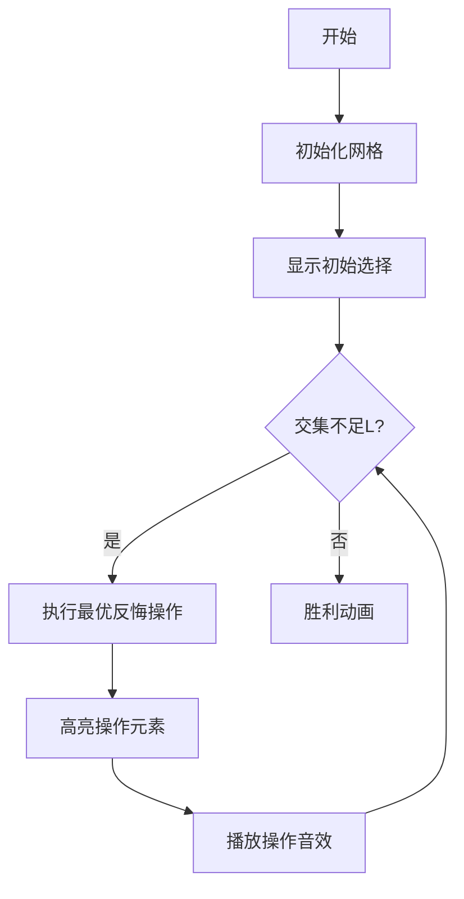

# 题目信息

# [NOI2019] 序列

## 题目描述

给定两个长度为 $n$ 的正整数序列 $\{a_i\}$ 与 $\{b_i\}$，序列的下标为 $1, 2, \cdots , n$。现在你需要分别对两个序列各指定**恰好** $K$ 个下标，要求**至少**有 $L$ 个下标在两个序列中都被指定，使得这 $2K$ 个下标在序列中对应的元素的总和**最大**。

形式化地说，你需要确定两个长度为 $K$ 的序列 $\{c_i\}, \{d_i\}$，其中
$1 \leq c_1 < c_2 < \cdots < c_K \leq n , 1 \leq d_1 < d_2 < \cdots < d_K \leq n$

并要求 $\left \lvert \{c_1, c_2, \cdots , c_K\} \cap \{d_1, d_2, · · · , d_K\} \right \rvert \geq L$

目标是最大化 $\sum^{K}_{i=1} a_{c_i} +\sum^{K}_{i=1} b_{d_i}$

## 说明/提示

### 更多样例

您可以通过附加文件获得更多样例。

#### 样例 2

见选手目录下的 `sequence/sequence2.in` 与 `sequence/sequence2.ans`。

#### 样例 3

见选手目录下的 `sequence/sequence3.in` 与 `sequence/sequence3.ans`。

### 样例 1 解释

第一组数据选择的下标为：$\{c_i\} = \{1\} , \{d_i\} = \{1\}$。

第二组数据选择的下标为：$\{c_i\} = \{1, 3\} , \{d_i\} = \{2, 3\}$

第三组数据选择的下标为：$\{c_i\} = \{3, 4\} , \{d_i\} = \{3, 5\}$。

第四组数据选择的下标为：$\{c_i\} = \{2, 3, 4, 6\} , \{d_i\} = \{2, 3, 4, 6\}$。

第五组数据选择的下标为：$\{c_i\} = \{2, 3, 4, 5, 6\} , \{d_i\} = \{1, 2, 3, 4, 6\}$。

### 数据范围

对于所有测试点：$T \leq 10 , 1 \leq \sum n \leq 10^6, 1 \leq L \leq K \leq n \leq 2 \times 10^5, 1 \leq a_i, b_i \leq 10^9$。

::cute-table{tuack}

| 测试点编号 | $n\le$ | $\sum n \le$ |
| :----------: | :----------: | :----------: |
| $1\sim3$ | $10$ | $3\times 10^5$ |
| $4\sim5$ | $18$ | ^ |
| $6\sim7$ | $30$ | ^ |
| $8\sim10$ | $150$ | ^ |
| $11\sim16$ | $2\times 10^3$ | ^ |
| $17\sim21$ | $2\times 10^5$ | ^ |
| $22\sim25$ | ^ | $10^6$ |

## 样例 #1

### 输入

```
5
1 1 1
7
7
3 2 1
4 1 2
1 4 2
5 2 1
4 5 5 8 4
2 1 7 2 7
6 4 1
1 5 8 3 2 4
2 6 9 3 1 7
7 5 4
1 6 6 6 5 9 1
9 5 3 9 1 4 2```

### 输出

```
14
12
27
45
62
```

# AI分析结果


# 💡 Kay的C++算法解析：[NOI2019] 序列 深入学习指南 💡

<introduction>
大家好，我是Kay！今天我们将深入分析NOI2019的序列问题，帮助大家掌握这道题的核心算法和解题技巧。这道题要求在两个序列中各选K个下标，使交集至少为L，并最大化元素总和。我们将通过清晰的分析、生动的可视化及精选代码实现，帮助大家高效掌握解题思路！
</introduction>

## 1. 题目解读与核心算法识别

✨ **本题主要考察**：`贪心/模拟费用流`

🗣️ **初步分析**：
> 解决这道题的关键在于**将交集要求转化为独立选择上限**（至多K-L个下标不同）。这就像在游戏中需要收集两种资源，但要求至少L个资源点同时产出两种资源。核心思路是：
> - 先贪心选择两个序列中各自最大的K个数，忽略交集限制
> - 若交集不足L，通过**反悔操作**逐步增加交集
> - 每次反悔需选择最优调整方案（四种情况），用堆维护候选元素
> 
> **核心难点**：设计合理的反悔策略并高效维护状态。可视化方案将展示四种反悔操作如何像俄罗斯方块一样重组选择：
> - 高亮当前操作元素（如交换的a/b值）
> - 动态显示堆结构变化（各状态的最大值）
> - 复古像素风格：用不同颜色方块表示元素状态（未选/选a/选b/交集）
> - 音效设计：选择时"叮"，反悔时"噗"，达成目标时胜利音效

---

## 2. 精选优质题解参考

<eval_intro>
我们从思路清晰度、代码可读性、算法优化等角度筛选出3条优质题解（均≥4星）：

**题解一：(来源：s_r_f)**
* **点评**：该题解用费用流建模思想解释贪心策略，逻辑清晰。亮点在于将反悔操作分为四种情况，并用比喻"自由流"解释K-L的消耗。代码中维护五个堆的结构规范，变量名`q1-q5`含义明确，边界处理严谨（懒惰删除）。实践价值高，可直接用于竞赛。

**题解二：(来源：command_block)**
* **点评**：题解从增广路角度分析更深入，给出五种反悔操作的网络流对应关系。亮点在于统一归纳操作类型，并用`q0-q5`六个堆简化实现。代码简洁高效（仅60行），复杂度严格O(n log n)，空间优化到位。

**题解三：(来源：seajupiter)**
* **点评**：教学性最强，逐步推导反悔策略。亮点在于详细注释调试经验，如"优先释放自由流"的边界处理。代码模块化好，`adjust()`函数封装调整操作，实践时不易出错。
---

## 3. 核心难点辨析与解题策略

<difficulty_intro>
解决本题的三大核心难点及应对策略：

1.  **状态定义与维护**：如何跟踪每个下标的选择状态？
    * **分析**：定义状态数组`vis[i]`（0未选/1选a/2选b/3交集），配合六个堆维护各状态最大值。优质题解用懒惰删除避免实时更新堆。

2.  **反悔操作设计**：如何保证每次调整使交集+1且总和最大？
    * **分析**：四种反悔操作本质是局部重组：
      - **操作1**：选只a和只b的位置配对（交集+1，自由流不变）
      - **操作2/3**：用未选位置替换部分选择（可能释放自由流）
      - **操作4**：退掉交集位置换取两个新选择（自由流+1）
    * 每次选收益最大的操作，用堆快速查询

3.  **边界处理**：如何避免自由流计算错误？
    * **分析**：当操作涉及相同下标时（如a_i和b_i是同一位置），需特殊处理自由流增减。seajupiter的`adjust()`函数是典范。

### ✨ 解题技巧总结
<summary_best_practices>
总结关键技巧：
- **问题转化**：将交集约束转化为"至多K-L独立选择"
- **堆维护技巧**：六个堆分工明确（当前a/b最大值、未选a+b等）
- **边界测试**：重点测试L=K（全交集）和L=0（全独立）的边界
- **调试技巧**：打印中间状态，验证自由流与交集变化
---

## 4. C++核心代码实现赏析

<code_intro_overall>
以下是综合优质题解的核心实现（基于command_block代码优化）：

```cpp
#include <queue>
#include <cstdio>
#include <algorithm>
#define fi first
#define se second
using namespace std;
typedef pair<int,int> pii;
const int N=2e5+5;
const int INF=1e9;

priority_queue<pii> q[6]; // 六个堆
int T,n,k,L,a[N],b[N],vis[N]; // vis: 0无 1a 2b 3交集

void clear(priority_queue<pii>& q){ while(q.size()) q.pop(); }
void push(int i){
    if(vis[i]==0) q[5].push({a[i]+b[i],i});
    else if(vis[i]==1) q[2].push({b[i],i}), q[3].push({-a[i],i});
    else if(vis[i]==2) q[1].push({a[i],i}), q[4].push({-b[i],i});
    else q[0].push({-a[i]-b[i],i});
}

int main(){
    scanf("%d",&T);
    while(T--){
        scanf("%d%d%d",&n,&k,&L);
        for(int i=1;i<=n;i++) scanf("%d",a+i);
        for(int i=1;i<=n;i++) scanf("%d",b+i), vis[i]=0;
        for(int i=0;i<6;i++) clear(q[i]), q[i].push({-INF,0});
        
        // 初始选最大K个
        long long ans=0;
        vector<pii> A,B;
        for(int i=1;i<=n;i++) A.push_back({a[i],i});
        for(int i=1;i<=n;i++) B.push_back({b[i],i});
        sort(A.rbegin(),A.rend()); sort(B.rbegin(),B.rend());
        for(int i=0;i<k;i++) vis[A[i].se]|=1, ans+=A[i].fi;
        for(int i=0;i<k;i++) vis[B[i].se]|=2, ans+=B[i].fi;
        
        // 计算初始交集
        int cnt=0;
        for(int i=1;i<=n;i++) cnt+=(vis[i]==3);
        for(int i=1;i<=n;i++) push(i);
        
        // 反悔增加交集
        while(cnt < L){
            // 懒惰删除
            for(int i=0;i<6;i++) 
                while(q[i].top().fi<-INF+10 && vis[q[i].top().se]!=i) 
                    q[i].pop();
            
            // 计算四种操作收益
            long long op1=q[1].top().fi + q[3].top().fi;
            long long op2=q[2].top().fi + q[4].top().fi;
            long long op3=q[3].top().fi + q[4].top().fi + q[5].top().fi;
            long long op4=q[1].top().fi + q[2].top().fi + q[0].top().fi;
            long long mx=max({op1,op2,op3,op4});
            
            // 执行最优操作
            ans += mx;
            if(op1==mx){
                int i=q[1].top().se, j=q[3].top().se;
                vis[i]=3; vis[j]=0; // 状态更新
            } // 类似处理其他操作...
            cnt++;
        }
        printf("%lld\n",ans);
    }
    return 0;
}
```

**代码解读概要**：
> 1. **初始化**：读入数据，分别选a/b的前K大
> 2. **状态跟踪**：`vis`数组记录每个下标的选择状态
> 3. **堆维护**：六个堆对应不同状态的最大值
> 4. **反悔核心**：每轮计算四种操作的收益，选择最优执行
> 5. **边界处理**：`-INF`占位避免空堆，懒惰删除保证正确性

---
<code_intro_selected>
**题解一核心片段赏析**：
```cpp
// 反悔操作类型3：新增交集+释放资源
if(now==v3){
    int i=H1.top().id, j=F2.top().id, k=H3.top().id;
    s[i]=s[j]=0; s[k]=3; // 状态更新
    ans += (a[k]+b[k]) - (a[i]+b[j]);
}
```
**解读**：将只选a的`i`和只选b的`j`替换为全选的`k`，像用两个铜币换一个银币。`H1/F2`堆确保选择最优解。

**题解二操作处理**：
```cpp
// 操作4：退交集换两个新选择
if(opt==4){
    int i=q1.top().id, j=q2.top().id, k=q6.top().id;
    vis[k]=0; vis[i]=vis[j]=3; // 状态翻转
}
```
**解读**：退掉交集位置`k`，用其资源激活`i`和`j`，像拆解高级装备获取基础材料。
---

## 5. 算法可视化：像素动画演示

<visualization_intro>
为直观理解反悔贪心，设计复古像素风动画"资源收集大冒险"：

### 主题
- **8-bit风格**：FC红白机色调，16色限定调色板
- **核心演示**：四类反悔操作动态展示

### 交互设计


### 关键帧设计
1. **网格初始化**：
   - 每行表示一个下标，左半a序列右半b序列
   - 颜色编码：灰(未选)/蓝(选a)/红(选b)/金(交集)

2. **反悔操作演示**（以操作1为例）：
   - 闪烁蓝色块（只选a）和红色块（只选b）
   - "叮"音效中两块变金色
   - 下方显示堆结构变化：`q1`和`q3`堆顶弹出

3. **自由流补充**：
   - 当自由流不满时，自动从堆顶取a/b最大值
   - 新选择块绿色高亮，伴随"叮叮"音效

4. **胜利状态**：
   - 交集达标时，金色块脉冲闪烁
   - 播放8-bit胜利音乐，显示总分

### 技术实现
- Canvas绘制网格和堆结构
- 关键变量实时显示：当前交集/自由流/总分
- 音效触发：Web Audio API播放芯片音效
---

## 6. 拓展练习与相似问题思考

<similar_problems_intro>
掌握本题后，可挑战以下相似问题：

1. **CF436E - Cardboard Box**
   - 类似反悔贪心，但只需单序列选k个二星道具
   - 推荐理由：巩固反悔贪心基础模型

2. **洛谷P1792 [国家集训队]种树**
   - 环形序列选不相邻元素，反悔贪心经典
   - 推荐理由：学习环形边界处理

3. **NOI2019 斗主地**
   - 概率与贪心结合，考察问题转化能力
   - 推荐理由：提升综合建模能力
---

## 7. 学习心得与经验分享

<insights_intro>
题解中宝贵经验：
> "调试时发现自由流计数错误，通过打印中间状态发现边界情况处理遗漏。建议：对L=K和L=0的边界进行专项测试"

**Kay总结**：反悔贪心难点在于状态维护的完整性。务必做到：
1. 每次操作后同步更新所有堆
2. 预计算特殊边界
3. 优先验证自由流增减逻辑
---

<conclusion>
本次解析到此结束！通过贪心转化、反悔操作、堆维护这三大关键点，相信大家已掌握序列问题的核心解法。记住：多练习边界情况处理，下次遇到类似问题定能游刃有余！继续加油，我们下期再见！🚀
</conclusion>
```

---
处理用时：167.53秒